# AppFlowy 架构设计深度分析

> AppFlowy 是一个开源的 Notion 替代品，采用 Flutter + Rust 混合架构，实现了跨平台、高性能、本地优先的协作工作空间。

## 目录

1. [项目概述](#1-项目概述)
2. [整体架构设计](#2-整体架构设计)
3. [技术栈选型](#3-技术栈选型)
4. [核心模块详解](#4-核心模块详解)
5. [Flutter-Rust FFI 通信机制](#5-flutter-rust-ffi-通信机制)
6. [事件分发系统](#6-事件分发系统)
7. [数据流与状态管理](#7-数据流与状态管理)
8. [协作与同步机制](#8-协作与同步机制)
9. [AI 功能集成](#9-ai-功能集成)
10. [性能优化策略](#10-性能优化策略)
11. [总结](#11-总结)

---

## 1. 项目概述

### 1.1 核心定位

AppFlowy 定位为 **"AI 驱动的协作工作空间"**，核心特点：

- **本地优先 (Local-First)**：数据优先存储在本地，支持完全离线使用
- **隐私安全**：用户完全掌控自己的数据
- **跨平台**：单一代码库支持 macOS、Windows、Linux、iOS、Android
- **可扩展**：插件化架构支持功能扩展
- **AI 原生**：深度集成 AI 能力

### 1.2 主要功能模块

| 功能 | 描述 |
|------|------|
| **文档编辑** | 富文本编辑器，支持 Markdown、块级编辑 |
| **数据库** | 表格、看板、日历等多视图 |
| **AI 助手** | 智能对话、文档 RAG、内容生成 |
| **协作同步** | CRDT 实时协作、云端同步 |
| **全文搜索** | Tantivy 引擎驱动的高性能搜索 |

---

## 2. 整体架构设计

### 2.1 分层架构图

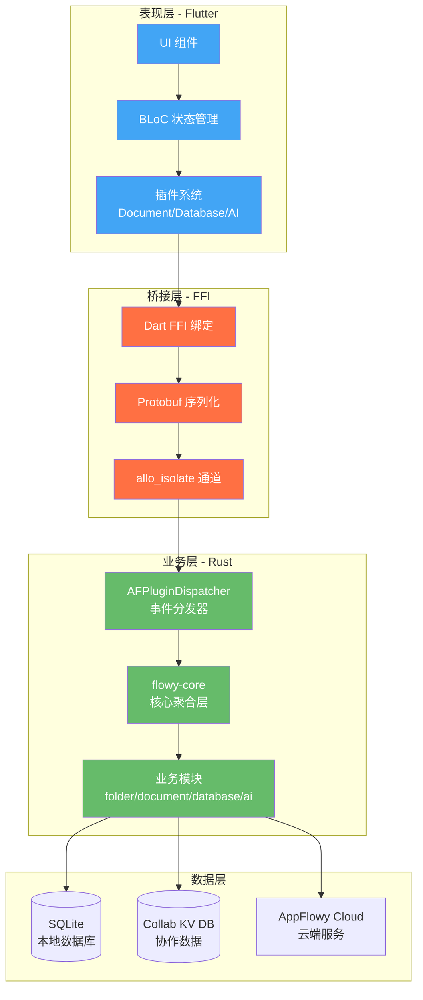

### 2.2 模块依赖关系

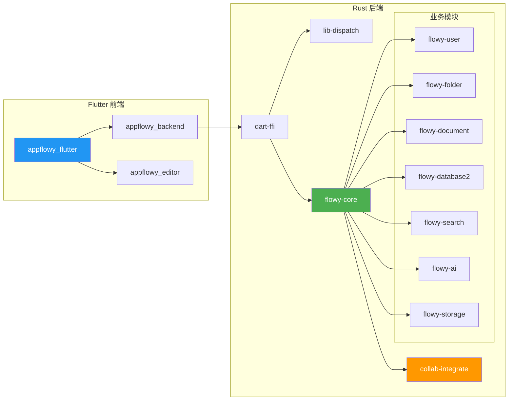

### 2.3 目录结构

```
AppFlowy/
├── frontend/
│   ├── appflowy_flutter/          # Flutter 前端应用
│   │   ├── lib/
│   │   │   ├── plugins/           # 功能插件
│   │   │   │   ├── document/      # 文档编辑
│   │   │   │   ├── database/      # 数据库视图
│   │   │   │   └── ai_chat/       # AI 对话
│   │   │   ├── workspace/         # 工作空间管理
│   │   │   ├── user/              # 用户模块
│   │   │   └── core/              # 核心配置
│   │   └── packages/
│   │       └── appflowy_backend/  # Rust FFI 包装
│   │
│   └── rust-lib/                  # Rust 后端库
│       ├── dart-ffi/              # FFI 导出层
│       ├── lib-dispatch/          # 事件分发框架
│       ├── flowy-core/            # 核心聚合层
│       ├── flowy-user/            # 用户认证
│       ├── flowy-folder/          # 文件夹管理
│       ├── flowy-document/        # 文档管理
│       ├── flowy-database2/       # 数据库管理
│       ├── flowy-search/          # 搜索服务
│       ├── flowy-ai/              # AI 集成
│       ├── flowy-storage/         # 存储管理
│       └── collab-integrate/      # CRDT 协作
```

---

## 3. 技术栈选型

### 3.1 前端技术栈

| 技术 | 用途 | 选型理由 |
|------|------|----------|
| **Flutter 3.27+** | 跨平台 UI | 单代码库多平台，高性能渲染 |
| **flutter_bloc** | 状态管理 | 响应式、可测试、业务逻辑分离 |
| **freezed** | 数据类生成 | 不可变数据、模式匹配支持 |
| **AppFlowy Editor** | 富文本编辑 | 自研编辑器，高度可定制 |
| **go_router** | 路由管理 | 声明式路由、深度链接支持 |
| **get_it** | 依赖注入 | 轻量级服务定位器 |

### 3.2 后端技术栈

| 技术 | 用途 | 选型理由 |
|------|------|----------|
| **Rust** | 后端核心 | 内存安全、高性能、跨平台编译 |
| **Tokio** | 异步运行时 | 成熟的异步生态、高并发支持 |
| **SQLite** | 本地数据库 | 轻量嵌入式、ACID 事务 |
| **Tantivy** | 全文搜索 | Rust 原生、Lucene 级性能 |
| **Protobuf** | 序列化 | 高效二进制格式、跨语言支持 |
| **yrs (Y.js Rust)** | CRDT 实现 | 工业级协作算法 |

### 3.3 通信技术栈

| 技术 | 用途 |
|------|------|
| **Dart FFI** | Dart-Rust 原生调用 |
| **allo_isolate** | Dart Isolate 端口通信 |
| **Protobuf** | 跨语言数据序列化 |

---

## 4. 核心模块详解

### 4.1 AppFlowyCore - 核心聚合层

`flowy-core` 是整个 Rust 后端的入口和聚合点，负责初始化和协调所有子模块。

```rust
// frontend/rust-lib/flowy-core/src/lib.rs:61-77
pub struct AppFlowyCore {
  pub config: AppFlowyCoreConfig,
  pub user_manager: Arc<UserManager>,           // 用户管理
  pub document_manager: Arc<DocumentManager>,   // 文档管理
  pub folder_manager: Arc<FolderManager>,       // 文件夹管理
  pub database_manager: Arc<DatabaseManager>,   // 数据库管理
  pub event_dispatcher: Arc<AFPluginDispatcher>,// 事件分发器
  pub server_provider: Arc<ServerProvider>,     // 云端服务
  pub search_manager: Arc<SearchManager>,       // 搜索管理
  pub ai_manager: Arc<AIManager>,               // AI 管理
  pub storage_manager: Arc<StorageManager>,     // 存储管理
  pub collab_builder: Arc<AppFlowyCollabBuilder>, // CRDT 构建器
}
```

**初始化流程：**

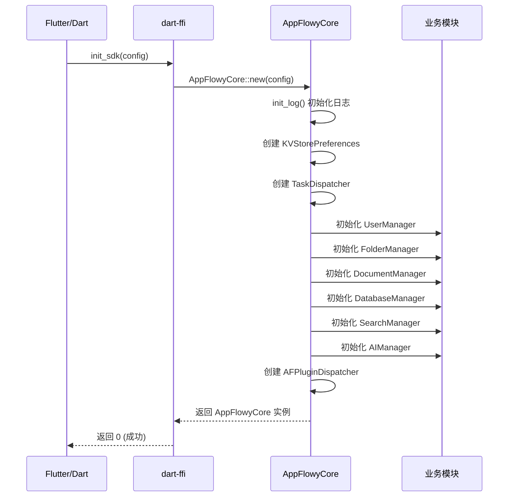

### 4.2 业务模块职责

#### flowy-user - 用户管理

- 用户认证（本地/云端）
- 会话管理
- 用户配置存储
- 工作空间切换

#### flowy-folder - 文件夹管理

- 工作空间和空间管理
- View 层级结构（文档、数据库容器）
- 收藏夹和最近访问
- 导入/导出

#### flowy-document - 文档管理

- 文档 CRUD 操作
- 与 AppFlowy Editor 协作
- 块级操作处理
- 文档导出（Markdown、HTML）

#### flowy-database2 - 数据库管理

- 表格数据管理
- 多视图支持（Grid、Kanban、Calendar、Gallery）
- 字段类型系统
- 排序、筛选、分组

#### flowy-search - 搜索服务

- 全文索引构建
- Tantivy 查询执行
- 搜索结果排序

#### flowy-ai - AI 集成

- AI 对话管理
- 文档 RAG
- 本地 LLM 支持 (Ollama)
- 流式响应处理

#### flowy-storage - 存储管理

- 文件上传/下载
- 云端存储集成
- 本地缓存管理

### 4.3 模块依赖图

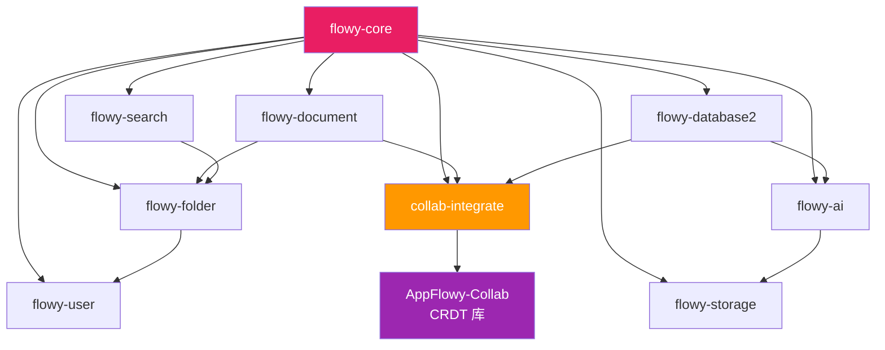

---

## 5. Flutter-Rust FFI 通信机制

### 5.1 架构概览

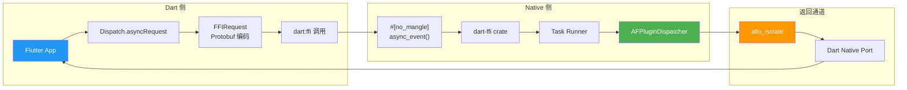

### 5.2 FFI 导出函数

Rust 端导出的 C FFI 函数定义在 `frontend/rust-lib/dart-ffi/src/lib.rs`：

```rust
// 初始化 SDK
#[no_mangle]
pub extern "C" fn init_sdk(_port: i64, data: *mut c_char) -> i64

// 异步事件处理（主要通信接口）
#[no_mangle]
pub extern "C" fn async_event(port: i64, input: *const u8, len: usize)

// 同步事件处理（未实现）
#[no_mangle]
pub extern "C" fn sync_event(_input: *const u8, _len: usize) -> *const u8

// 设置通知流端口
#[no_mangle]
pub extern "C" fn set_stream_port(notification_port: i64) -> i32

// 设置日志流端口
#[no_mangle]
pub extern "C" fn set_log_stream_port(port: i64) -> i32

// Rust 日志记录
#[no_mangle]
pub extern "C" fn rust_log(level: i64, data: *const c_char)
```

### 5.3 请求处理流程

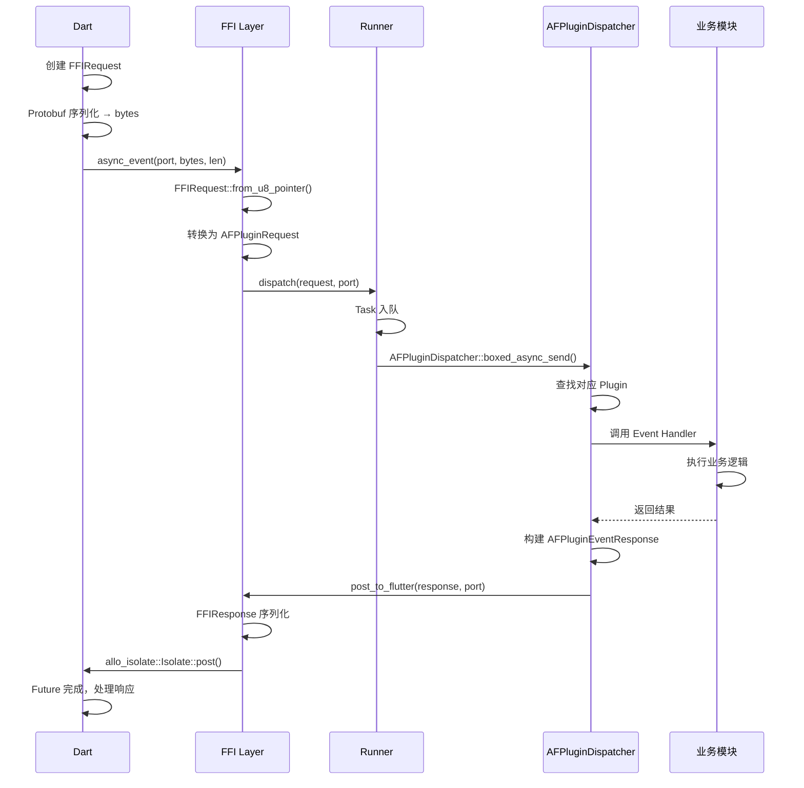

### 5.4 数据序列化

**FFIRequest 结构：**

```rust
// 请求结构
pub struct FFIRequest {
    event: String,      // 事件名称
    payload: Vec<u8>,   // Protobuf 编码的数据
}

// 响应结构
pub struct FFIResponse {
    code: i64,          // 状态码
    payload: Vec<u8>,   // Protobuf 编码的响应数据
}
```

**内存布局：**

```
┌────────────────────────────────────────┐
│  4 bytes (BigEndian) │    N bytes      │
│   Length Marker      │   Payload       │
└────────────────────────────────────────┘
```

---

## 6. 事件分发系统

### 6.1 lib-dispatch 设计

事件分发系统是 AppFlowy 的核心通信框架，位于 `frontend/rust-lib/lib-dispatch/`。

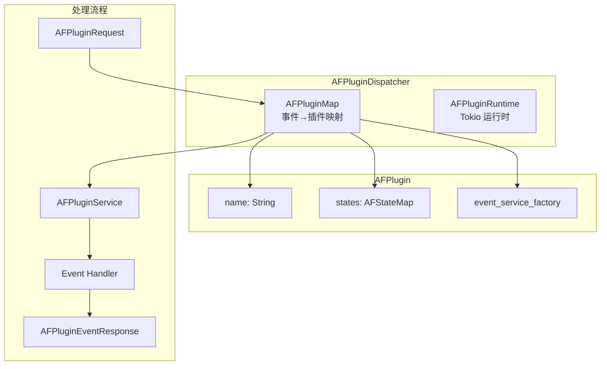

### 6.2 Plugin 注册机制

```rust
// frontend/rust-lib/lib-dispatch/src/module/module.rs:64-134
pub struct AFPlugin {
  pub name: String,
  states: AFStateMap,
  event_service_factory: Arc<HashMap<AFPluginEvent, BoxServiceFactory<...>>>,
}

impl AFPlugin {
  // 注册插件状态
  pub fn state<D: Send + Sync + 'static>(mut self, data: D) -> Self

  // 注册事件处理器
  pub fn event<E, H, T, R>(mut self, event: E, handler: H) -> Self
  where
    H: AFPluginHandler<T, R>,
    T: FromAFPluginRequest + 'static,
    R: Future + 'static,
    R::Output: AFPluginResponder + 'static,
}
```

### 6.3 事件定义示例

```rust
// flowy-folder 事件定义
pub enum FolderEvent {
  CreateWorkspace,
  ReadWorkspace,
  CreateView,
  ReadView,
  UpdateView,
  DeleteView,
  // ...
}

// 插件注册
AFPlugin::new()
  .name("Folder")
  .state(folder_manager)
  .event(FolderEvent::CreateView, create_view_handler)
  .event(FolderEvent::ReadView, read_view_handler)
  .event(FolderEvent::UpdateView, update_view_handler)
```

### 6.4 异步处理流程

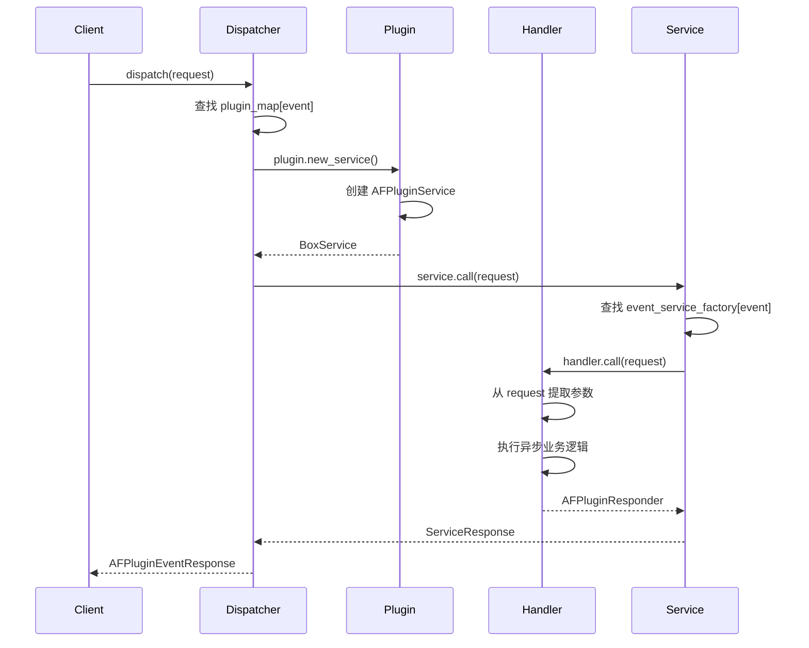

---

## 7. 数据流与状态管理

### 7.1 Flutter 端 BLoC 模式

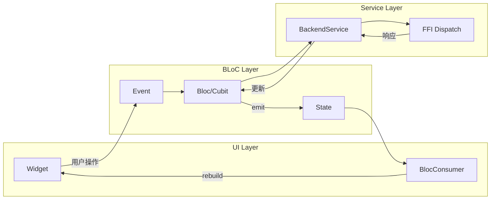

### 7.2 典型数据流示例

以创建文档为例：

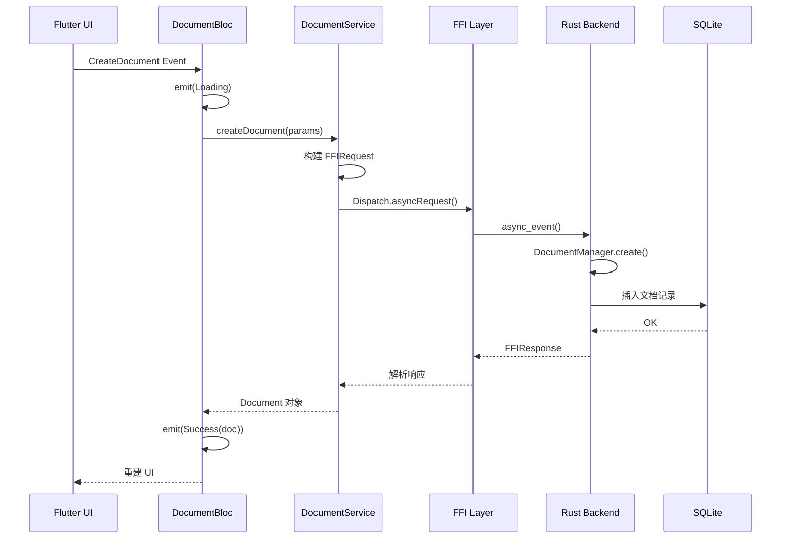

### 7.3 通知机制（Rust → Dart）

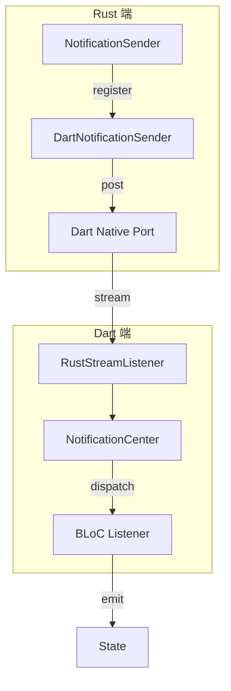

**通知使用场景：**
- 云端同步状态变更
- 文档协作更新
- AI 流式响应
- 后台任务完成

---

## 8. 协作与同步机制

### 8.1 CRDT 架构

AppFlowy 使用 **yrs (Y.js Rust 实现)** 作为 CRDT 基础，通过 `collab-integrate` 模块集成。

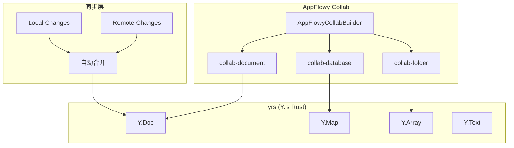

### 8.2 同步流程

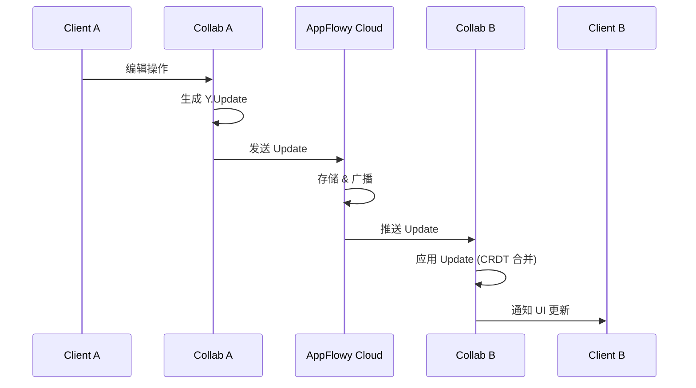

### 8.3 冲突解决

CRDT 的核心优势是 **无冲突自动合并**：

```
时间线：
Client A: [Insert "Hello"] ─────────────────────→
Client B: ─────────────── [Insert "World"] ────→

合并结果（确定性）：
- 所有客户端得到相同结果
- 无需人工解决冲突
- 支持离线编辑后同步
```

### 8.4 数据持久化

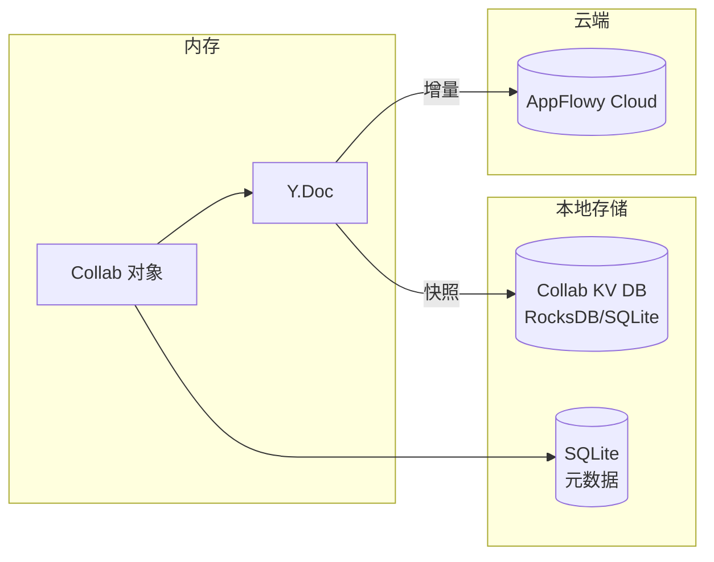

---

## 9. AI 功能集成

### 9.1 AI 架构

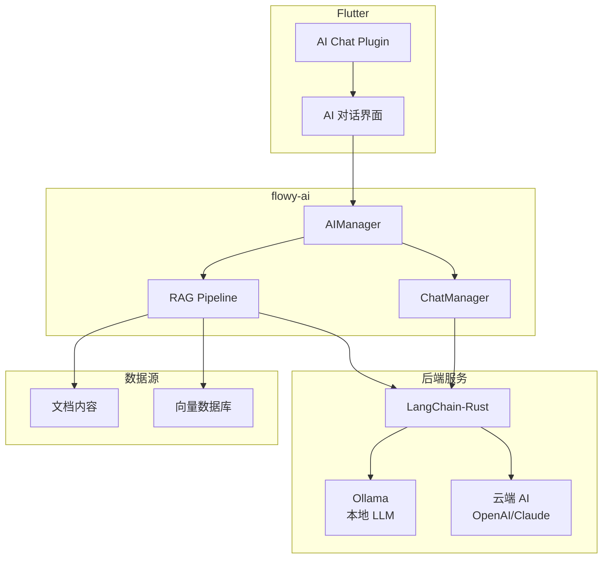

### 9.2 RAG 流程

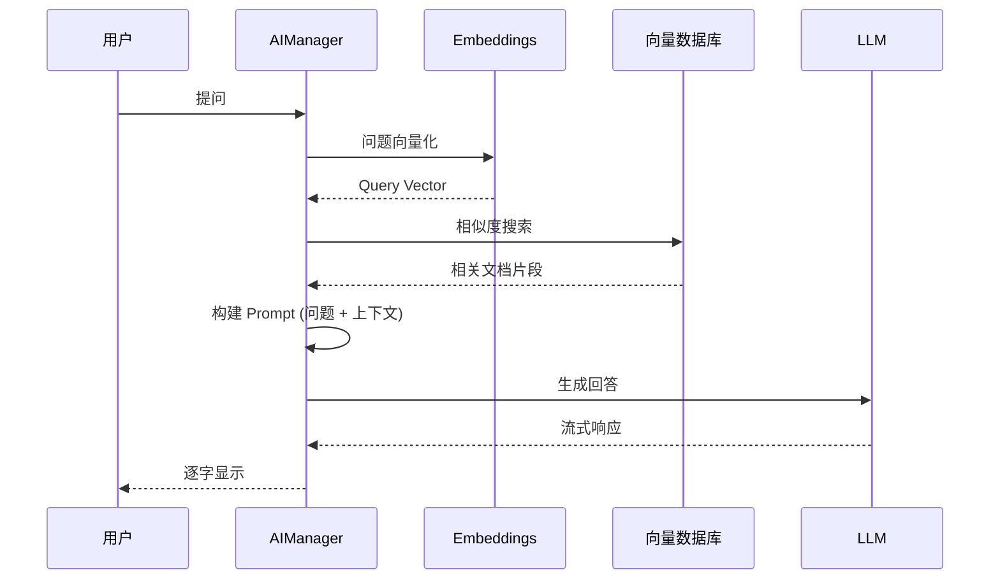

### 9.3 本地 AI 支持

```rust
// flowy-ai 支持的 AI 后端
pub enum AIBackend {
  AppFlowyCloud,     // 云端 AI 服务
  LocalOllama,       // 本地 Ollama
}

// 流式响应处理
pub trait StreamHandler {
  async fn on_chunk(&self, chunk: &str);
  async fn on_complete(&self);
  async fn on_error(&self, error: AIError);
}
```

---

## 10. 性能优化策略

### 10.1 架构层面

| 策略 | 实现方式 |
|------|----------|
| **异步 I/O** | Tokio 异步运行时，非阻塞 I/O |
| **本地优先** | 优先读写本地 SQLite，降低网络延迟 |
| **增量同步** | CRDT Update 而非全量同步 |
| **懒加载** | 视图按需加载，减少启动时间 |

### 10.2 内存管理

```rust
// Rust 端内存共享
Arc<Manager>           // 跨线程共享
Weak<Manager>          // 避免循环引用
RwLock<T>              // 读写锁，支持并发读
DashMap<K, V>          // 无锁并发 HashMap
```

### 10.3 数据库优化

- **SQLite WAL 模式**：提高并发性能
- **索引优化**：关键查询字段建立索引
- **批量操作**：减少事务开销

### 10.4 渲染优化

- **Flutter BLoC**：精确控制重建范围
- **ListView.builder**：大列表虚拟化
- **Image Caching**：图片缓存策略

---

## 11. 总结

### 11.1 架构亮点

1. **Flutter + Rust 混合架构**
   - Flutter 提供统一的跨平台 UI
   - Rust 提供高性能、内存安全的业务逻辑

2. **事件驱动的插件系统**
   - 松耦合的模块设计
   - 易于扩展新功能

3. **CRDT 实时协作**
   - 无冲突自动合并
   - 支持离线编辑

4. **本地优先 + 云端同步**
   - 数据隐私保护
   - 离线可用

5. **AI 原生集成**
   - 支持本地和云端 LLM
   - 文档 RAG 能力

### 11.2 架构权衡

| 优势 | 挑战 |
|------|------|
| 跨平台一致性 | Flutter-Rust FFI 复杂性 |
| 高性能 | 调试难度增加 |
| 内存安全 | 学习曲线陡峭 |
| 可扩展性 | 代码生成维护成本 |

### 11.3 关键设计决策

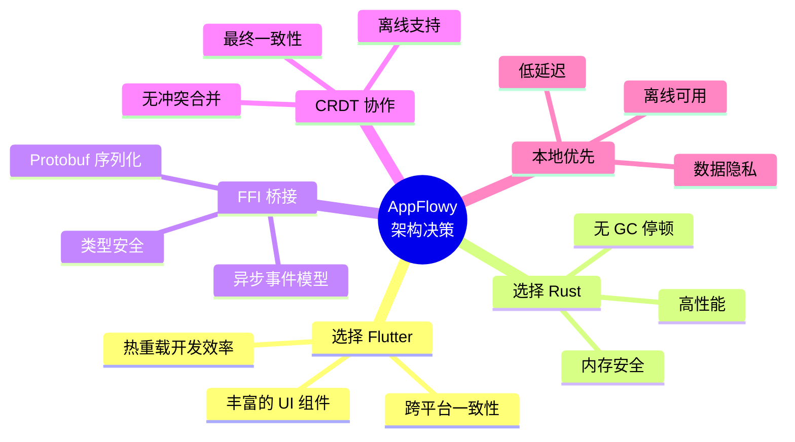

### 11.4 参考文件

| 模块 | 关键文件路径 |
|------|-------------|
| 核心聚合 | `frontend/rust-lib/flowy-core/src/lib.rs` |
| 事件分发 | `frontend/rust-lib/lib-dispatch/src/module/module.rs` |
| FFI 导出 | `frontend/rust-lib/dart-ffi/src/lib.rs` |
| Dart FFI | `frontend/appflowy_flutter/packages/appflowy_backend/lib/` |
| 文档插件 | `frontend/appflowy_flutter/lib/plugins/document/` |
| 数据库插件 | `frontend/appflowy_flutter/lib/plugins/database/` |

---

*文档生成时间：2025-12-31*

*基于 AppFlowy 源码分析*
