# WasmEdge 架构设计分析

## 1. 项目概述

WasmEdge 是一个高性能、轻量级、可扩展的 WebAssembly 运行时，专为云原生、边缘计算和去中心化应用设计。它是 CNCF（云原生计算基金会）的沙箱项目，支持多种编程语言和应用场景。

### 核心特性

- **多执行模式**: 解释器、JIT 编译、AOT 预编译
- **WASI 支持**: 完整的 WebAssembly 系统接口实现
- **插件系统**: 可扩展的模块化架构
- **跨平台**: 支持 Linux、macOS、Windows
- **高性能**: 基于 LLVM 的优化编译

## 2. 整体架构

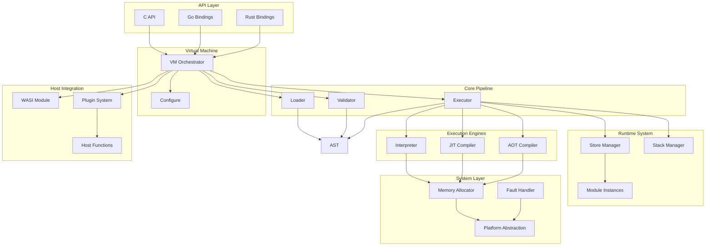

## 3. 目录结构

```
WasmEdge/
├── include/                 # 头文件
│   ├── api/                # C API 头文件
│   ├── aot/                # AOT 编译器头文件
│   ├── ast/                # AST 定义
│   ├── common/             # 公共类型和工具
│   ├── driver/             # CLI 工具头文件
│   ├── executor/           # 执行器头文件
│   ├── host/               # 宿主函数定义
│   ├── llvm/               # LLVM 相关头文件
│   ├── loader/             # 加载器头文件
│   ├── plugin/             # 插件系统头文件
│   ├── runtime/            # 运行时实例定义
│   ├── system/             # 系统层头文件
│   ├── validator/          # 验证器头文件
│   └── vm/                 # 虚拟机头文件
├── lib/                    # 实现文件
│   ├── api/                # C API 实现
│   ├── aot/                # AOT 编译器实现
│   ├── driver/             # CLI 工具实现
│   ├── executor/           # 执行器实现
│   ├── host/               # WASI 和宿主函数实现
│   ├── llvm/               # LLVM 编译系统
│   ├── loader/             # 加载器实现
│   ├── plugin/             # 插件系统实现
│   ├── system/             # 系统层实现
│   ├── validator/          # 验证器实现
│   └── vm/                 # 虚拟机实现
├── plugins/                # 内置插件
├── tools/                  # 命令行工具
├── bindings/               # 语言绑定
└── cmake/                  # CMake 构建配置
```

## 4. 核心组件详解

### 4.1 加载器 (Loader)

加载器负责解析 WASM 二进制格式并构建 AST。

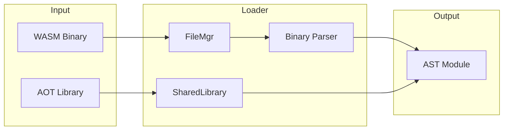

**核心职责:**
- 读取 WASM 字节码（文件或内存缓冲区）
- 检测文件类型（标准 WASM vs AOT 编译的共享库）
- 解析所有 WASM Section（Type、Import、Function、Table、Memory、Global、Export、Start、Element、Code、Data）
- 支持序列化/反序列化

**关键类:**
- `Loader`: 主加载器协调器
- `FileMgr`: 文件和二进制流管理
- `SharedLibrary`: 加载 AOT 编译的共享库（ELF、MachO、DLL）

### 4.2 验证器 (Validator)

验证器确保 WASM 模块符合 WebAssembly 规范。

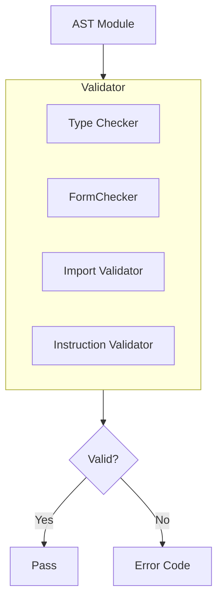

**验证内容:**
- 类型签名和一致性
- 导入/导出匹配
- 指令序列和控制流
- 内存、表、全局变量定义
- 组件模型结构（如启用）

### 4.3 执行器 (Executor)

执行器是 WASM 指令执行和模块实例化的核心。

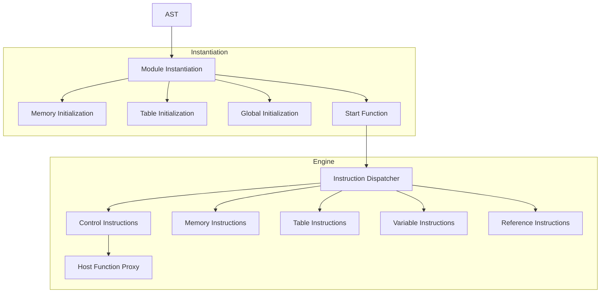

**指令分类:**
| 文件 | 指令类型 |
|------|----------|
| `controlInstr.cpp` | 控制流指令（br、call、return 等） |
| `memoryInstr.cpp` | 内存访问指令（load、store） |
| `tableInstr.cpp` | 表操作指令 |
| `variableInstr.cpp` | 局部/全局变量操作 |
| `refInstr.cpp` | 引用类型操作 |
| `proxy.cpp` | 宿主函数调用代理 |

### 4.4 运行时系统 (Runtime)

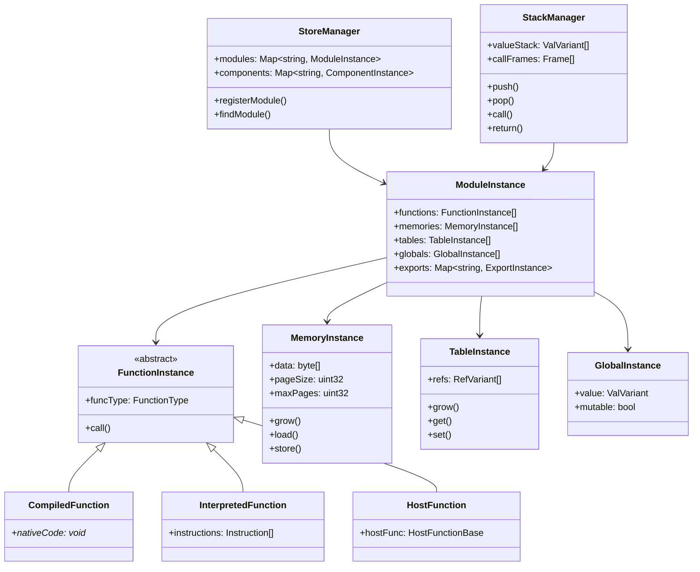

**核心实例类型:**
- `ModuleInstance`: 已实例化的 WASM 模块
- `FunctionInstance`: 函数实例（WASM 函数、编译函数或宿主函数）
- `MemoryInstance`: 线性内存管理（64KB 页，最大 4GB）
- `TableInstance`: 函数引用表（用于间接调用）
- `GlobalInstance`: 全局变量
- `ElementInstance`: 元素段
- `DataInstance`: 数据段
- `TagInstance`: 异常处理标签

### 4.5 LLVM 编译系统

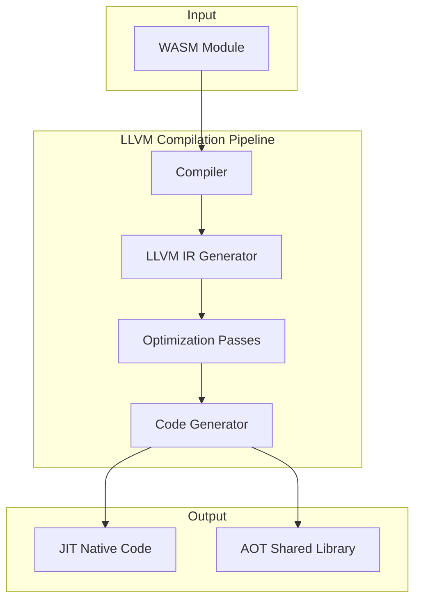

**编译模式:**

| 模式 | 特点 | 适用场景 |
|------|------|----------|
| 解释器 | 安全、可移植、启动快 | 短生命周期函数、调试 |
| JIT | 运行时编译、平衡启动和执行速度 | 中等执行时间函数 |
| AOT | 预编译、最快执行速度 | 生产环境、长时间运行 |

**优化级别:**
- O0: 无优化
- O1: 基础优化
- O2: 标准优化
- O3: 激进优化
- Os: 大小优化
- Oz: 极致大小优化

**AOT 输出格式:**
- 原生共享库（.so、.dylib、.dll）
- 带嵌入式 AOT Section 的 WASM

## 5. 执行流程

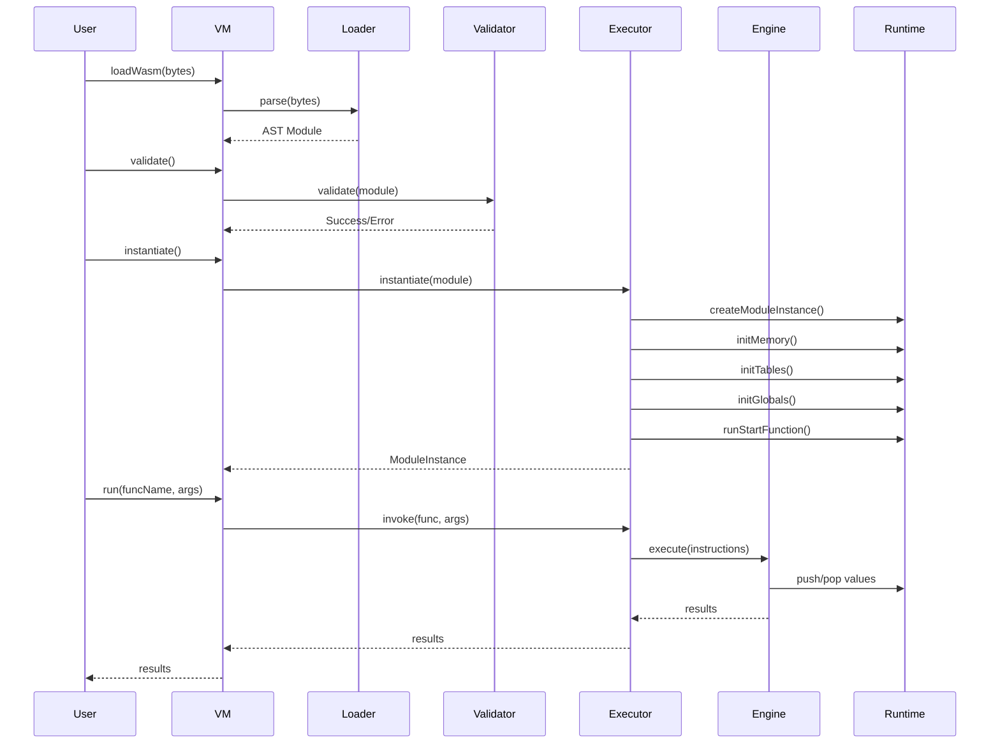

## 6. 插件系统

### 6.1 插件架构

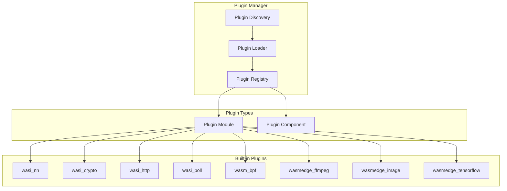

### 6.2 插件描述符

```cpp
// 插件导出的描述符结构
struct PluginDescriptor {
    const char *Name;           // 插件名称
    const char *Description;    // 插件描述
    uint32_t APIVersion;        // API 版本

    // 模块描述符数组
    ModuleDescriptor *Modules;
    uint32_t ModuleCount;

    // 组件描述符数组（Component Model）
    ComponentDescriptor *Components;
    uint32_t ComponentCount;
};

// 每个插件共享库导出此函数
extern "C" PluginDescriptor* GetDescriptor();
```

### 6.3 内置插件列表

| 插件名 | 功能描述 |
|--------|----------|
| `wasi_nn` | 神经网络推理（支持 GGML 后端） |
| `wasi_crypto` | 密码学操作 |
| `wasi_http` | HTTP 客户端功能 |
| `wasi_poll` | 事件轮询 |
| `wasm_bpf` | eBPF 集成 |
| `wasmedge_ffmpeg` | 视频/音频处理 |
| `wasmedge_image` | 图像处理 |
| `wasmedge_tensorflow` | TensorFlow 推理 |
| `wasmedge_stablediffusion` | Stable Diffusion 图像生成 |
| `wasmedge_llmc` | LLM 推理 |
| `wasmedge_ocr` | OCR 文字识别 |

## 7. WASI 实现

### 7.1 WASI 模块结构

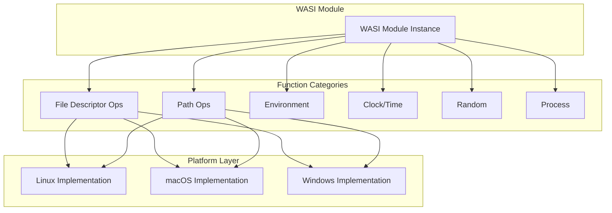

### 7.2 WASI 函数分类

| 类别 | 函数示例 | 实现文件 |
|------|----------|----------|
| 文件描述符 | `fd_read`, `fd_write`, `fd_close` | `inode-*.cpp` |
| 路径操作 | `path_open`, `path_create_directory` | `inode-*.cpp` |
| 环境变量 | `environ_get`, `args_get` | `environ-*.cpp` |
| 时钟 | `clock_time_get`, `clock_res_get` | `clock-*.cpp` |
| 随机数 | `random_get` | `random.cpp` |
| 进程 | `proc_exit` | `proc.cpp` |

### 7.3 虚拟文件系统

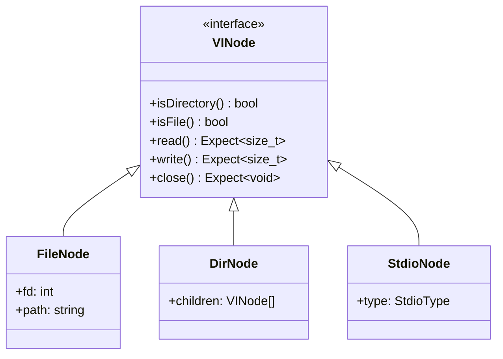

## 8. 内存管理

### 8.1 内存实例架构

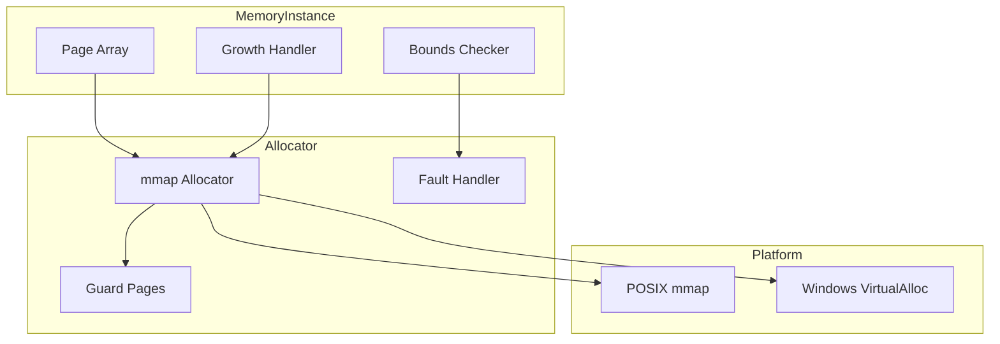

### 8.2 内存规格

| 参数 | 值 |
|------|-----|
| 页大小 | 65536 字节 (64KB) |
| 最大页数 | 65536 页 |
| 最大内存 | 4GB |
| 对齐要求 | 页边界对齐 |

### 8.3 内存安全

- **边界检查**: 每次内存访问都进行边界检查
- **守护页**: 在内存区域前后设置不可访问的守护页
- **故障处理**: 捕获 SIGSEGV/SIGBUS 信号并转换为 WASM 陷阱
- **共享内存**: 支持多线程共享内存（原子操作）

## 9. 宿主函数接口

### 9.1 宿主函数基类

```cpp
class HostFunctionBase {
public:
    virtual Expect<void> run(
        const CallingFrame &Frame,
        Span<const ValVariant> Args,
        Span<ValVariant> Rets
    ) = 0;

    // 函数类型
    const FunctionType &getFuncType() const;

    // 函数成本（用于 Gas 计量）
    uint64_t getCost() const;
};

// 类型安全的宿主函数模板
template<typename T>
class HostFunction : public HostFunctionBase {
    // 自动参数/返回值编组
};
```

### 9.2 宿主函数注册

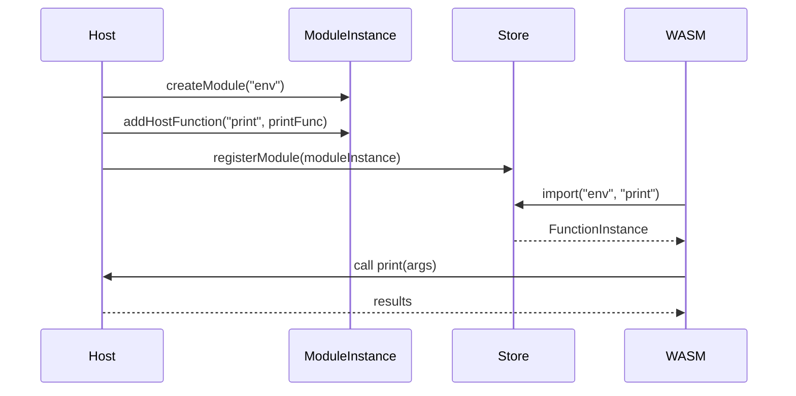

## 10. 错误处理

### 10.1 Expected 类型

WasmEdge 使用 `Expected<T, ErrCode>` 类型进行错误处理：

```cpp
template<typename T>
class Expected {
    union {
        T Value;
        ErrCode Error;
    };
    bool HasValue;

public:
    bool has_value() const { return HasValue; }
    T& value() { return Value; }
    ErrCode error() const { return Error; }
};
```

### 10.2 错误码分类

| 类别 | 前缀 | 示例 |
|------|------|------|
| 验证错误 | `Validation::` | `InvalidMagic`, `InvalidVersion` |
| 实例化错误 | `Instantiation::` | `ImportNotFound`, `TypeMismatch` |
| 执行错误 | `Execution::` | `Unreachable`, `DivideByZero` |
| 内存错误 | `Memory::` | `OutOfBounds`, `GrowFailed` |

## 11. 设计模式

### 11.1 使用的设计模式

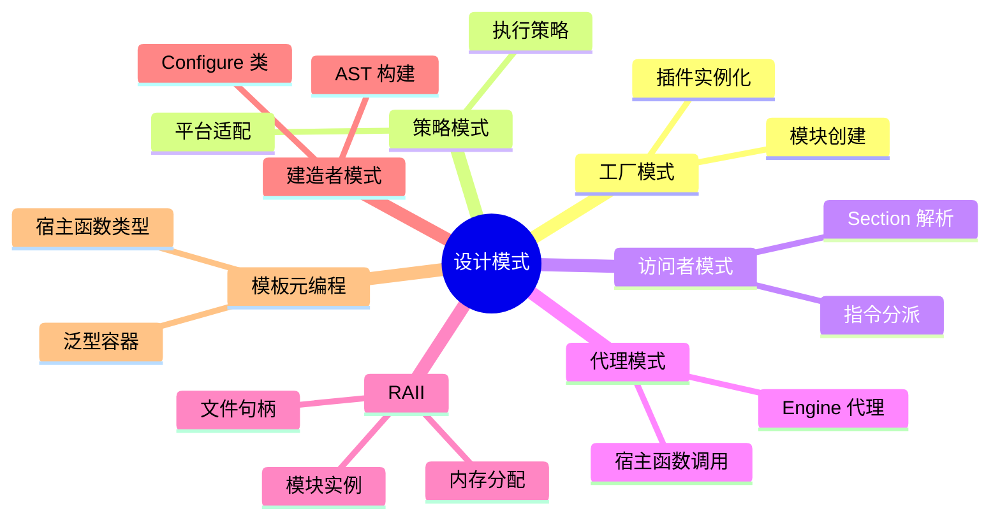

### 11.2 模式应用示例

**策略模式 - 执行引擎:**
```cpp
class ExecutionEngine {
    virtual void execute(Instructions) = 0;
};

class Interpreter : public ExecutionEngine { ... };
class JITEngine : public ExecutionEngine { ... };
class AOTEngine : public ExecutionEngine { ... };
```

**工厂模式 - 插件创建:**
```cpp
struct PluginDescriptor {
    ModuleInstance* (*Create)(const Configure&);
};
```

## 12. 构建系统

### 12.1 CMake 配置

```cmake
# 主要构建选项
option(WASMEDGE_BUILD_SHARED_LIB "Build shared library" ON)
option(WASMEDGE_BUILD_STATIC_LIB "Build static library" ON)
option(WASMEDGE_BUILD_TOOLS "Build CLI tools" ON)
option(WASMEDGE_BUILD_PLUGINS "Build plugins" ON)

# LLVM 支持
option(WASMEDGE_USE_LLVM "Use LLVM for JIT/AOT" ON)

# 插件选项
option(WASMEDGE_PLUGIN_WASI_NN "Build WASI-NN plugin" OFF)
option(WASMEDGE_PLUGIN_WASI_CRYPTO "Build WASI-Crypto plugin" OFF)
option(WASMEDGE_PLUGIN_WASI_HTTP "Build WASI-HTTP plugin" OFF)
```

### 12.2 依赖关系

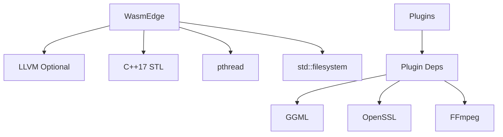

## 13. 性能考量

### 13.1 优化策略

| 层面 | 优化措施 |
|------|----------|
| 编译 | LLVM O3 优化、向量化、内联 |
| 内存 | mmap 分配、页对齐、预分配 |
| 执行 | 直接分派、内联缓存、尾调用优化 |
| 缓存 | AOT 代码缓存、模块缓存 |

### 13.2 执行模式对比

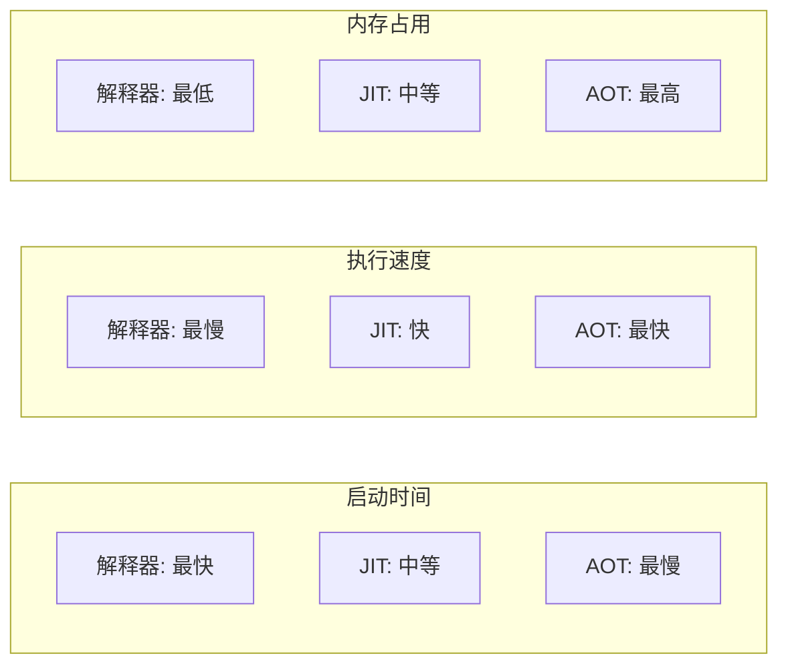

## 14. 应用场景

### 14.1 适用领域

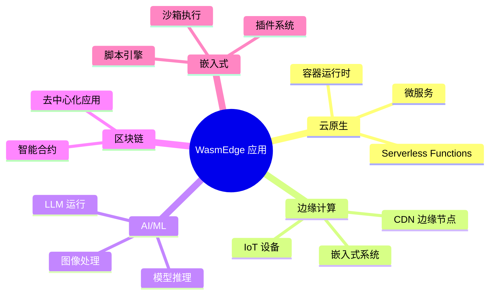

### 14.2 集成方式

- **独立运行**: 使用 `wasmedge` CLI 工具
- **库嵌入**: 通过 C API 嵌入到应用程序
- **语言绑定**: Go、Rust、Python 等语言绑定
- **容器运行时**: 作为 containerd/CRI-O 的运行时

## 15. 总结

WasmEdge 采用**模块化、分层架构**设计：

1. **API 层**: 提供 C 绑定和上下文管理
2. **VM 协调层**: 协调加载、验证、执行流程
3. **加载管道**: 将二进制解析为 AST
4. **验证管道**: 类型检查和指令验证
5. **执行引擎**: 解释器、JIT（LLVM）、AOT 支持
6. **运行时系统**: 实例管理、栈/存储管理
7. **宿主集成**: WASI、插件、宿主函数
8. **系统层**: 内存分配、故障处理、平台抽象

这种设计优先考虑**性能**（可选的 LLVM 编译）、**可移植性**（解释器在任何地方都能工作）、**可扩展性**（插件系统）和**安全性**（验证、边界检查、错误处理），使 WasmEdge 适用于多种场景：无服务器计算、边缘计算、AI 模型推理、区块链、微服务和嵌入式应用。
