# Appwrite 架构分析

## 概述

Appwrite 是一个开源的后端即服务（BaaS）平台，为 Web、移动和服务器端应用提供完整的后端解决方案。它使用 PHP 8.3+ 和 Swoole 异步运行时构建，采用事件驱动的微服务架构，支持多租户隔离。

## 系统架构总览

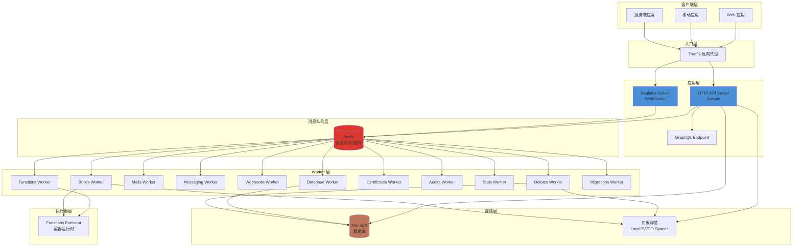

## 目录结构

```
appwrite/
├── app/                          # 应用入口和控制器
│   ├── http.php                  # HTTP 服务器入口
│   ├── worker.php                # Worker 入口
│   ├── realtime.php              # WebSocket 服务器入口
│   ├── controllers/              # API 控制器
│   │   ├── api/                  # REST API 端点
│   │   │   ├── account.php       # 用户账户管理
│   │   │   ├── databases.php     # 数据库操作
│   │   │   ├── storage.php       # 文件存储
│   │   │   ├── functions.php     # 云函数
│   │   │   ├── messaging.php     # 消息推送
│   │   │   └── ...
│   │   └── console/              # 控制台 API
│   └── init/                     # 初始化配置
│       ├── constants.php         # 常量定义
│       ├── resources.php         # 依赖注入
│       ├── configs.php           # 配置加载
│       └── locales.php           # 国际化
├── src/Appwrite/                 # 核心业务逻辑
│   ├── Platform/                 # 平台模块
│   │   ├── Modules/              # 功能模块
│   │   ├── Workers/              # Worker 实现
│   │   └── Action.php            # 基础 Action 类
│   ├── Auth/                     # 认证授权
│   │   ├── OAuth2/               # OAuth2 提供商
│   │   └── MFA/                  # 多因素认证
│   ├── Event/                    # 事件系统
│   ├── Messaging/                # 消息传递
│   ├── GraphQL/                  # GraphQL 实现
│   └── Databases/                # 数据库层
├── public/                       # 静态资源
├── tests/                        # 测试套件
├── docs/                         # 文档
└── docker-compose.yml            # Docker 编排
```

## 核心组件详解

### 1. HTTP 服务器

HTTP 服务器基于 Swoole 异步运行时，提供高性能的请求处理能力。

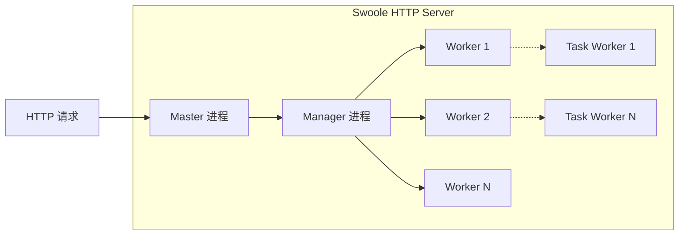

**关键配置** (`app/http.php:42-100`):
- Worker 数量 = CPU 核心数 × `_APP_WORKER_PER_CORE` (默认 6)
- 智能调度算法将"高风险"请求路由到专用 Worker
- 支持协程并发处理

### 2. 事件驱动系统

Appwrite 采用事件驱动架构，API 操作触发异步事件，由专门的 Worker 处理。

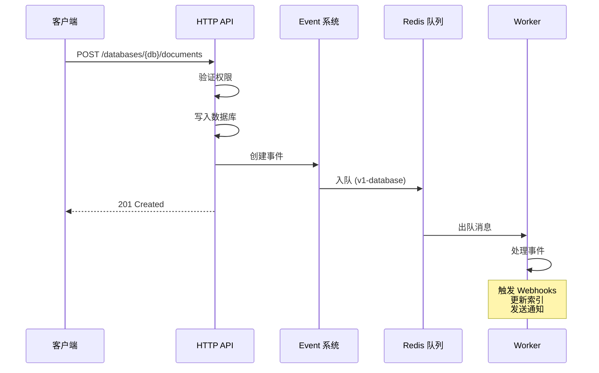

**事件队列类型** (`src/Appwrite/Event/Event.php:12-46`):

| 队列名称 | Worker | 职责 |
|---------|--------|------|
| v1-database | DatabaseV1 | 数据库变更处理 |
| v1-deletes | DeletesV1 | 级联删除操作 |
| v1-audits | AuditsV1 | 审计日志记录 |
| v1-mails | MailsV1 | 邮件发送 |
| v1-functions | FunctionsV1 | 云函数执行 |
| v1-webhooks | WebhooksV1 | Webhook 回调 |
| v1-messaging | MessagingV1 | 消息推送 |
| v1-certificates | CertificatesV1 | SSL 证书管理 |
| v1-builds | BuildsV1 | 函数构建 |
| v1-stats-usage | StatsUsageV1 | 用量统计 |
| v1-migrations | MigrationsV1 | 数据迁移 |

### 3. 平台模块架构

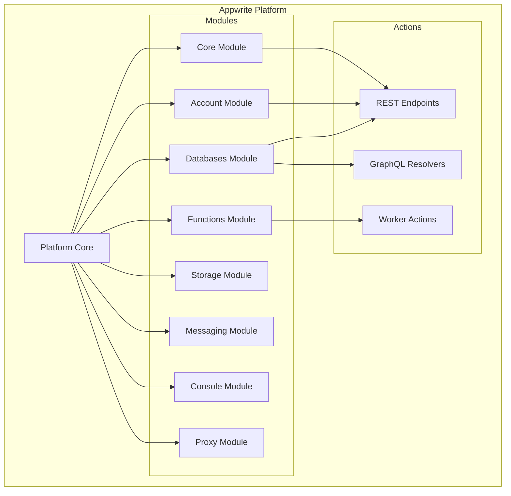

**模块职责**:
- **Core Module**: 基础路由和 API 框架
- **Account Module**: 用户认证、会话管理
- **Databases Module**: 数据库 CRUD 操作
- **Functions Module**: 云函数生命周期管理
- **Storage Module**: 文件上传、下载、管理
- **Messaging Module**: 推送通知、邮件、SMS
- **Console Module**: 管理控制台后端
- **Proxy Module**: 请求路由和代理

### 4. 多租户数据库架构

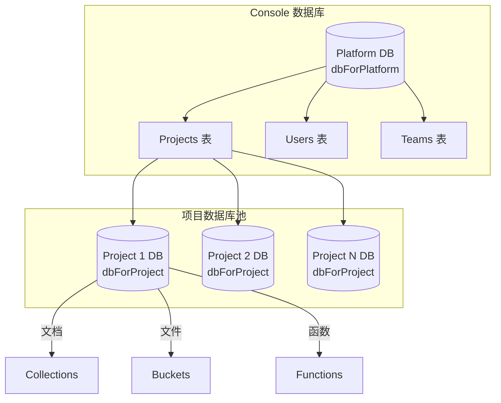

**关键特性**:
- **dbForPlatform**: 系统级数据库，存储项目、用户、团队信息
- **dbForProject**: 每个项目独立的数据库，实现租户隔离
- **连接池**: 使用 `Utopia\Database\Adapter\Pool` 管理连接
- **事务支持**: `TransactionState` 类跟踪事务状态

**事务管理** (`src/Appwrite/Databases/TransactionState.php`):
- 支持 ACID 事务
- 操作类型: `create`, `update`, `upsert`, `delete`, `bulk`
- 限制: 每事务最多 100 操作，TTL 1-3600 秒
- 重放机制确保跨操作的事务可见性

### 5. 认证与授权

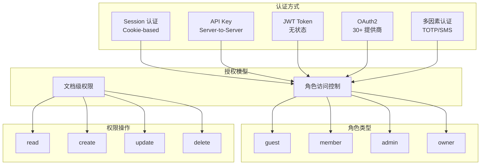

**OAuth2 提供商** (`src/Appwrite/Auth/OAuth2/`):
- Google, GitHub, Discord, Twitter, Facebook
- LinkedIn, Twitch, Notion, Stripe, PayPal
- Apple, Microsoft, Spotify, Slack 等 30+ 个

**安全机制**:
- 密码哈希: Argon2, SHA
- 会话存储与验证
- CORS 验证: `src/Appwrite/Network/Cors.php`
- 来源验证: `src/Appwrite/Network/Validator/Origin.php`

### 6. 存储系统

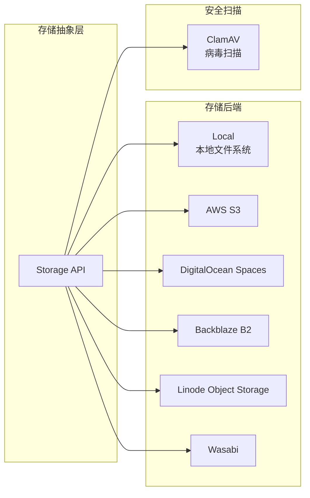

**存储路径** (`app/init/constants.php:69-76`):
```
/storage/uploads      - 用户上传文件
/storage/sites        - 静态站点
/storage/functions    - 云函数代码
/storage/builds       - 构建产物
/storage/cache        - 缓存数据
/storage/imports      - 导入数据
/storage/certificates - SSL 证书
```

### 7. 实时系统

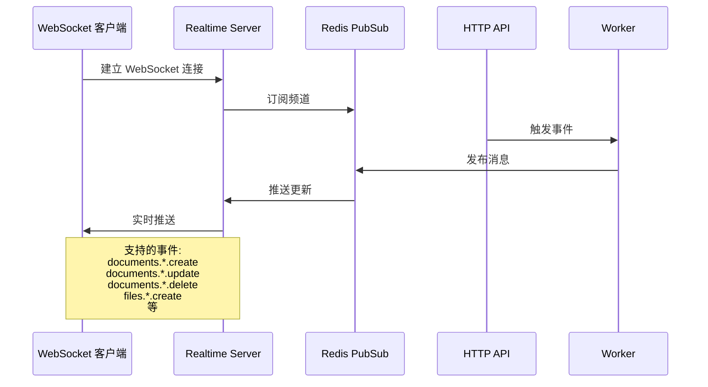

**组件**:
- Realtime Server: `app/realtime.php`
- Redis PubSub 适配器: `src/Appwrite/PubSub/Adapter/Redis.php`
- 消息适配器: `src/Appwrite/Messaging/Adapter/Realtime.php`

### 8. 云函数执行

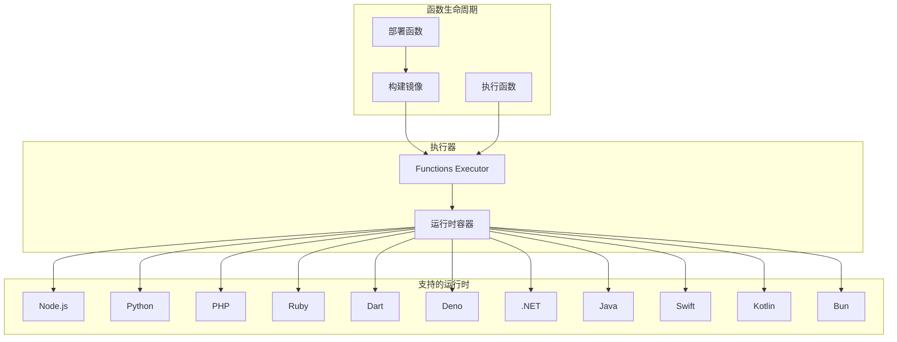

**配置参数**:
- `_APP_EXECUTOR_HOST`: 执行器地址
- `_APP_FUNCTIONS_TIMEOUT`: 执行超时 (默认 900 秒)
- `_APP_COMPUTE_CPUS`: 可用 CPU 核心
- `_APP_COMPUTE_MEMORY`: 可用内存 (MB)

### 9. GraphQL 实现

```mermaid
graph LR
    subgraph "GraphQL 层"
        ENDPOINT[/graphql Endpoint]
        SCHEMA[Schema Generator]
        RESOLVER[Resolvers]
        VALIDATOR[Complexity Validator]
    end

    subgraph "数据源"
        REST[REST API Controllers]
        DB[Database]
    end

    ENDPOINT --> SCHEMA
    SCHEMA --> RESOLVER
    RESOLVER --> VALIDATOR
    RESOLVER --> REST
    REST --> DB
```

**特性** (`src/Appwrite/GraphQL/Schema.php`):
- 动态 Schema 生成
- 查询批处理
- 复杂度限制
- 与 REST API 共享业务逻辑

## 技术栈

### 核心框架

| 组件 | 技术 |
|-----|------|
| 语言 | PHP 8.3+ (严格类型) |
| 运行时 | Swoole 异步扩展 |
| Web 框架 | Utopia Framework |
| 数据库 | MariaDB / MySQL |
| 缓存/队列 | Redis |
| 反向代理 | Traefik |
| DNS | CoreDNS |

### Utopia 库生态

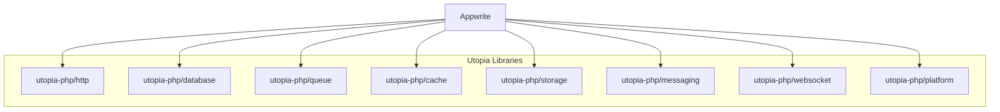

### 第三方依赖

- `webonyx/graphql-php` - GraphQL 实现
- `phpmailer/phpmailer` - 邮件发送
- `adhocore/jwt` - JWT 令牌
- `chillerlan/php-qrcode` - 二维码生成

## Docker 部署架构

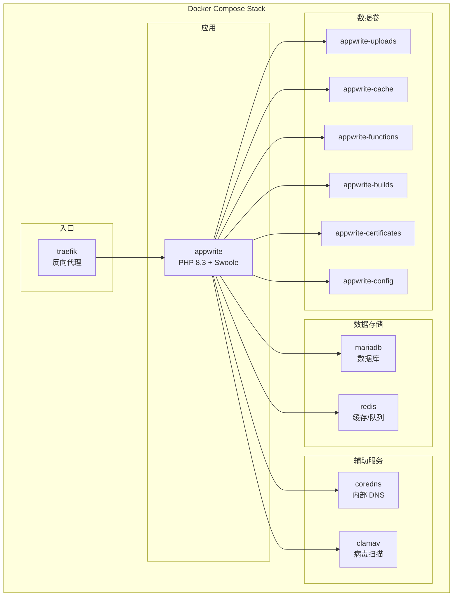

**Dockerfile 多阶段构建**:
1. **Composer 阶段**: 依赖安装
2. **Base 阶段**: PHP 环境配置
3. **Production 阶段**: 生产优化镜像
4. **Development 阶段**: 开发调试工具

## 环境配置

### 核心配置项

```bash
# 应用配置
_APP_ENV=development
_APP_EDITION=self-hosted
_APP_VERSION=1.8.0
_APP_WORKER_PER_CORE=6

# 数据库
_APP_DB_HOST=mariadb
_APP_DB_PORT=3306
_APP_DB_USER=user
_APP_DB_PASS=password
_APP_DB_SCHEMA=appwrite

# Redis
_APP_REDIS_HOST=redis
_APP_REDIS_PORT=6379

# 存储
_APP_STORAGE_DEVICE=Local
_APP_STORAGE_S3_*=s3-credentials

# 函数执行
_APP_EXECUTOR_HOST=http://exc1/v1
_APP_FUNCTIONS_TIMEOUT=900
_APP_COMPUTE_CPUS=8
_APP_COMPUTE_MEMORY=8192

# 维护
_APP_MAINTENANCE_INTERVAL=86400
_APP_MAINTENANCE_RETENTION_EXECUTION=1209600
```

## 设计模式

### 1. 事件驱动架构
- API 操作触发异步事件
- 事件入队到 Redis
- Worker 异步处理

### 2. 依赖注入 / 服务定位器
- Utopia 框架提供全局资源注册
- 资源注入到控制器和 Worker
- 位置: `app/init/resources.php`

### 3. 模块化组织
- 每个功能区域是独立模块
- 模块通过 Utopia Platform 框架实现
- 位置: `src/Appwrite/Platform/Modules/`

### 4. Action 模式
- Worker 继承 Action 基类
- 单一 `action()` 方法处理队列消息
- 位置: `src/Appwrite/Platform/Action.php`

### 5. 文档模型
- 所有数据表示为 Document 对象
- 支持元数据、属性、权限
- 来自 Utopia Database 库

## 关键文件索引

| 组件 | 文件路径 |
|-----|---------|
| 平台架构 | `src/Appwrite/Platform/Appwrite.php` |
| HTTP 服务器 | `app/http.php` |
| Worker 系统 | `app/worker.php` |
| 实时服务器 | `app/realtime.php` |
| 事件基础系统 | `src/Appwrite/Event/Event.php` |
| 数据库事务 | `src/Appwrite/Databases/TransactionState.php` |
| 用户认证 | `app/controllers/api/account.php` |
| 平台 Action 基类 | `src/Appwrite/Platform/Action.php` |
| 资源注入 | `app/init/resources.php` |
| 常量定义 | `app/init/constants.php` |
| 函数 Worker | `src/Appwrite/Platform/Workers/Functions.php` |
| PubSub 系统 | `src/Appwrite/PubSub/Adapter.php` |
| GraphQL Schema | `src/Appwrite/GraphQL/Schema.php` |

## 总结

Appwrite 是一个设计精良的后端即服务平台，其架构具有以下特点：

1. **高性能**: 基于 Swoole 异步运行时，支持高并发请求处理
2. **可扩展**: 模块化设计，易于添加新功能
3. **多租户**: 每个项目独立数据库，实现完全隔离
4. **事件驱动**: 异步处理提高响应速度和系统吞吐量
5. **安全性**: 完善的认证授权机制，支持多种认证方式
6. **可观测**: 完整的审计日志和统计系统
7. **云原生**: 容器化部署，易于扩展和运维

这种架构使 Appwrite 能够作为一个完整的后端解决方案，支持从小型项目到企业级应用的各种场景。
