# Bun Architecture Analysis

> Bun is an all-in-one JavaScript runtime, bundler, package manager, and test runner built for speed. This document provides a comprehensive architectural analysis of the Bun codebase.

## Table of Contents

1. [Overview](#overview)
2. [Technology Stack](#technology-stack)
3. [High-Level Architecture](#high-level-architecture)
4. [Core Runtime](#core-runtime)
5. [JavaScriptCore Integration](#javascriptcore-integration)
6. [Bundler System](#bundler-system)
7. [Package Manager](#package-manager)
8. [HTTP Server & Networking](#http-server--networking)
9. [Directory Structure](#directory-structure)
10. [Key Design Patterns](#key-design-patterns)

---

## Overview

Bun is a modern JavaScript/TypeScript runtime designed as a drop-in replacement for Node.js, with built-in:

- **JavaScript Runtime** powered by WebKit's JavaScriptCore
- **TypeScript/JSX Transpiler** with native speed
- **Module Bundler** inspired by esbuild
- **Package Manager** compatible with npm/yarn/pnpm
- **HTTP Server** built on µWebSockets
- **Test Runner** with Jest compatibility

**Codebase Scale:**

- ~78,739 lines of Zig code in `src/`
- ~449 C++ binding files
- ~200+ TypeScript/JavaScript module implementations

---

## Technology Stack

| Component | Technology |
|-----------|------------|
| Primary Language | Zig |
| Bindings | C++ |
| Module Code | TypeScript/JavaScript |
| Build System | CMake + Zig Build |
| JavaScript Engine | WebKit's JavaScriptCore |
| TLS/SSL | BoringSSL |
| Async I/O | libuv + uSockets |
| HTTP Server | µWebSockets |
| Memory Allocator | mimalloc |
| Compression | Brotli, Zstandard, Deflate |
| Database | SQLite |
| FFI | Tiny C Compiler |

---

## High-Level Architecture

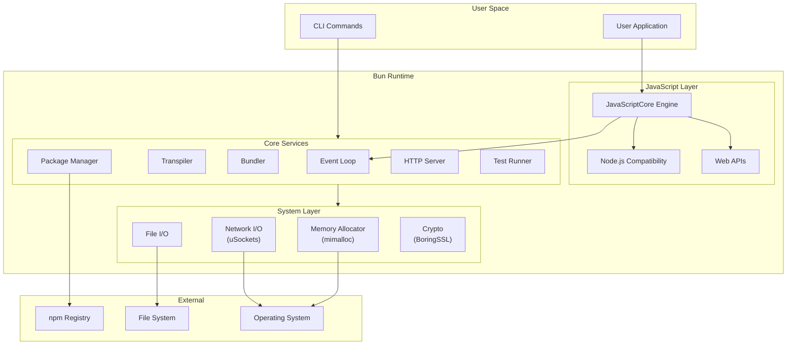
```mermaid
flowchart TB
    subgraph UserSpace["User Space"]
        App["User Application"]
        CLI["CLI Commands"]
    end

    subgraph BunRuntime["Bun Runtime"]
        subgraph JSLayer["JavaScript Layer"]
            JSC["JavaScriptCore Engine"]
            NodeCompat["Node.js Compatibility"]
            WebAPIs["Web APIs"]
        end

        subgraph CoreServices["Core Services"]
            EventLoop["Event Loop"]
            Transpiler["Transpiler"]
            Bundler["Bundler"]
            PackageManager["Package Manager"]
            HTTPServer["HTTP Server"]
            TestRunner["Test Runner"]
        end

        subgraph SystemLayer["System Layer"]
            MemAlloc["Memory Allocator<br/>(mimalloc)"]
            FileIO["File I/O"]
            Network["Network I/O<br/>(uSockets)"]
            Crypto["Crypto<br/>(BoringSSL)"]
        end
    end

    subgraph External["External"]
        NPM["npm Registry"]
        FS["File System"]
        OS["Operating System"]
    end

    App --> JSC
    CLI --> CoreServices
    JSC --> EventLoop
    JSC --> NodeCompat
    JSC --> WebAPIs

    CoreServices --> SystemLayer
    PackageManager --> NPM
    FileIO --> FS
    Network --> OS
    MemAlloc --> OS
```

---

## Core Runtime

### Event Loop Architecture

Bun's event loop is built on **uSockets** and integrates tightly with **JavaScriptCore**. It processes work in a specific order to maintain Node.js compatibility.

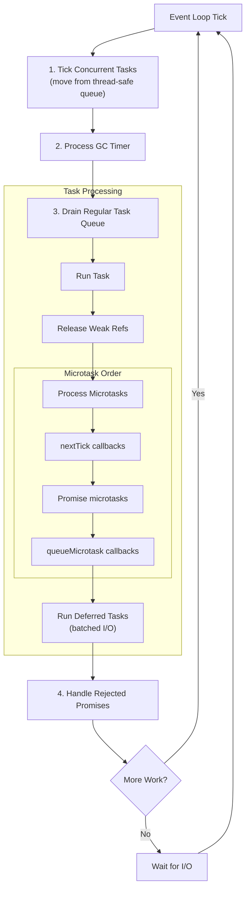
```mermaid
flowchart TD
    Start["Event Loop Tick"] --> TickConcurrent["1. Tick Concurrent Tasks<br/>(move from thread-safe queue)"]
    TickConcurrent --> GCTimer["2. Process GC Timer"]
    GCTimer --> DrainTasks["3. Drain Regular Task Queue"]

    subgraph TaskProcessing["Task Processing"]
        DrainTasks --> RunTask["Run Task"]
        RunTask --> ReleaseRefs["Release Weak Refs"]
        ReleaseRefs --> Microtasks["Process Microtasks"]

        subgraph MicrotaskOrder["Microtask Order"]
            Microtasks --> NextTick["nextTick callbacks"]
            NextTick --> Promises["Promise microtasks"]
            Promises --> QueueMicro["queueMicrotask callbacks"]
        end

        QueueMicro --> DeferredTasks["Run Deferred Tasks<br/>(batched I/O)"]
    end

    DeferredTasks --> HandleRejected["4. Handle Rejected Promises"]
    HandleRejected --> CheckMore{More Work?}
    CheckMore -->|Yes| Start
    CheckMore -->|No| WaitIO["Wait for I/O"]
    WaitIO --> Start
```

### Task System

The event loop manages **95+ task types** through a `TaggedPointerUnion`:

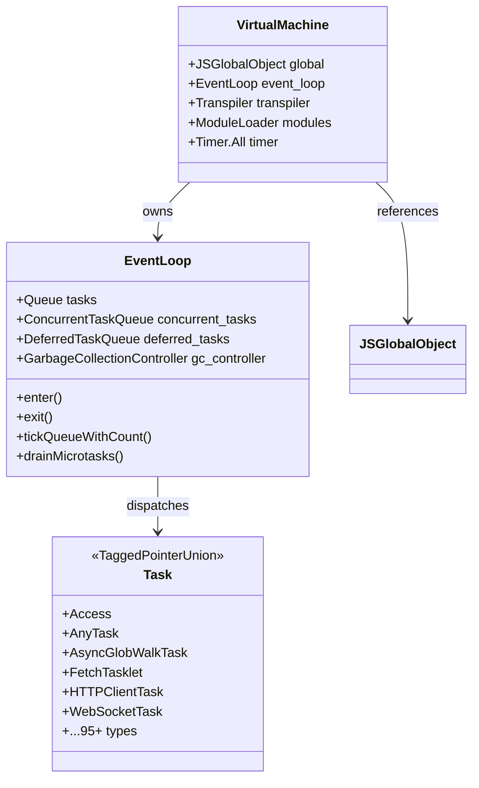
```mermaid
classDiagram
    class EventLoop {
        +Queue tasks
        +ConcurrentTaskQueue concurrent_tasks
        +DeferredTaskQueue deferred_tasks
        +GarbageCollectionController gc_controller
        +enter()
        +exit()
        +tickQueueWithCount()
        +drainMicrotasks()
    }

    class Task {
        <<TaggedPointerUnion>>
        +Access
        +AnyTask
        +AsyncGlobWalkTask
        +FetchTasklet
        +HTTPClientTask
        +WebSocketTask
        +...95+ types
    }

    class VirtualMachine {
        +JSGlobalObject global
        +EventLoop event_loop
        +Transpiler transpiler
        +ModuleLoader modules
        +Timer.All timer
    }

    EventLoop --> Task : dispatches
    VirtualMachine --> EventLoop : owns
    VirtualMachine --> JSGlobalObject : references
```

### Memory Management

Bun uses **mimalloc** with thread-local heaps for high-performance memory allocation:

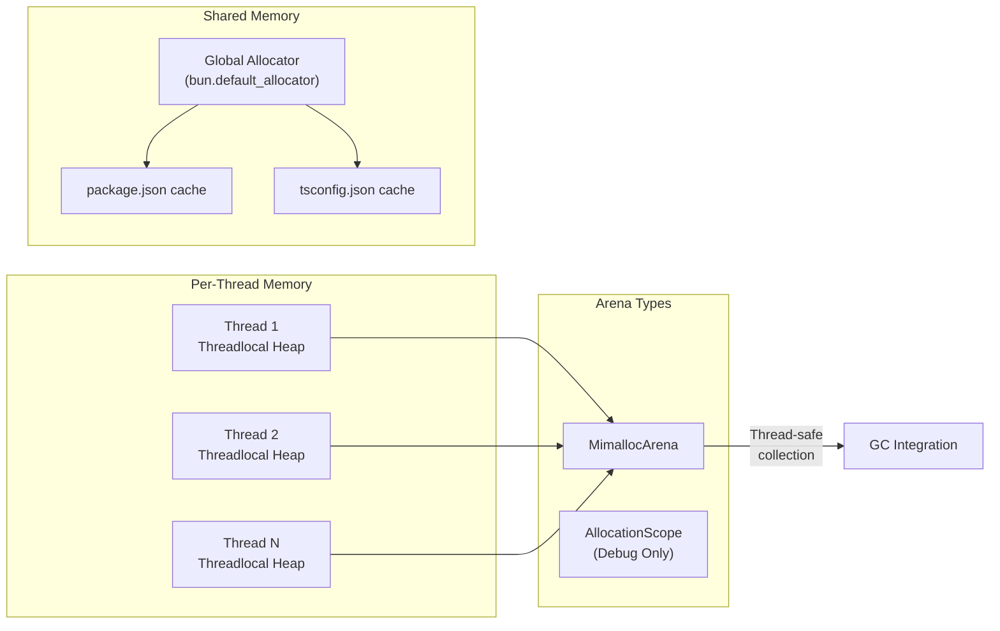
```mermaid
flowchart LR
    subgraph PerThread["Per-Thread Memory"]
        TL1["Thread 1<br/>Threadlocal Heap"]
        TL2["Thread 2<br/>Threadlocal Heap"]
        TL3["Thread N<br/>Threadlocal Heap"]
    end

    subgraph SharedMemory["Shared Memory"]
        Global["Global Allocator<br/>(bun.default_allocator)"]
        PackageJSON["package.json cache"]
        TSConfig["tsconfig.json cache"]
    end

    subgraph ArenaTypes["Arena Types"]
        MimallocArena["MimallocArena"]
        AllocationScope["AllocationScope<br/>(Debug Only)"]
    end

    TL1 --> MimallocArena
    TL2 --> MimallocArena
    TL3 --> MimallocArena
    Global --> PackageJSON
    Global --> TSConfig

    MimallocArena --> |"Thread-safe<br/>collection"| GC["GC Integration"]
```

**Key Memory Features:**

- **Threadlocal heaps**: No synchronization overhead
- **Arena allocators**: Fast bulk deallocation
- **GC Integration**: `mi_heap_collect()` for explicit cleanup
- **Debug mode**: Leak detection with stack traces

---

## JavaScriptCore Integration

### Binding Architecture

Bun bridges Zig and C++ through a sophisticated binding system:

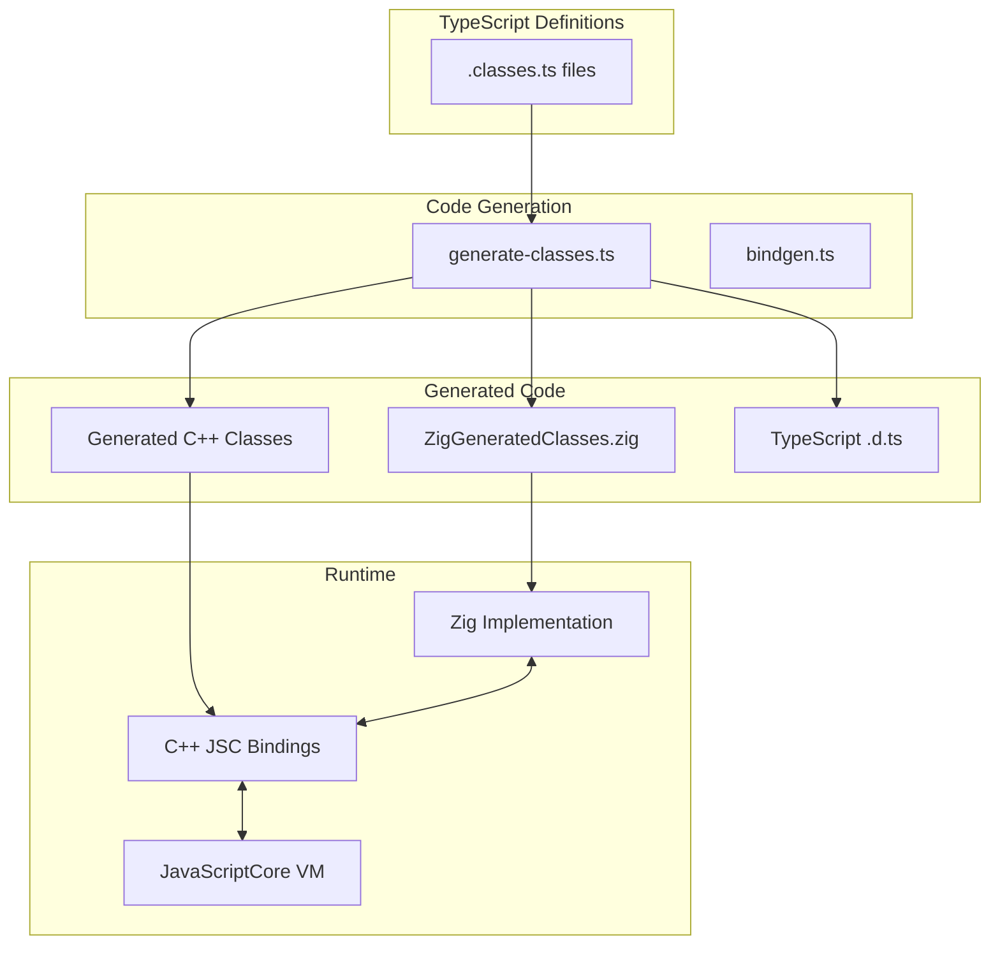
```mermaid
flowchart TB
    subgraph TypeScript["TypeScript Definitions"]
        ClassTS[".classes.ts files"]
    end

    subgraph CodeGen["Code Generation"]
        GenClasses["generate-classes.ts"]
        GenBindings["bindgen.ts"]
    end

    subgraph Generated["Generated Code"]
        ZigGen["ZigGeneratedClasses.zig"]
        CppGen["Generated C++ Classes"]
        TypeDefs["TypeScript .d.ts"]
    end

    subgraph Runtime["Runtime"]
        ZigCode["Zig Implementation"]
        CppCode["C++ JSC Bindings"]
        JSC["JavaScriptCore VM"]
    end

    ClassTS --> GenClasses
    GenClasses --> ZigGen
    GenClasses --> CppGen
    GenClasses --> TypeDefs

    ZigGen --> ZigCode
    CppGen --> CppCode
    ZigCode <--> CppCode
    CppCode <--> JSC
```

### Host Function System

Native functions are exposed to JavaScript through the `JSHostFn` system:

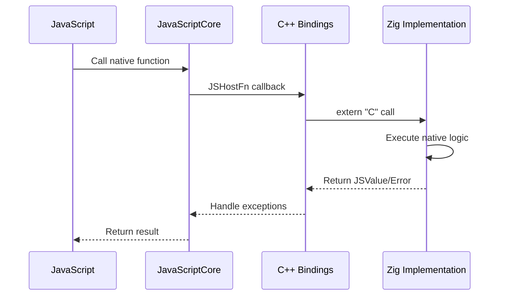
```mermaid
sequenceDiagram
    participant JS as JavaScript
    participant JSC as JavaScriptCore
    participant Cpp as C++ Bindings
    participant Zig as Zig Implementation

    JS->>JSC: Call native function
    JSC->>Cpp: JSHostFn callback
    Cpp->>Zig: extern "C" call
    Zig->>Zig: Execute native logic
    Zig-->>Cpp: Return JSValue/Error
    Cpp-->>JSC: Handle exceptions
    JSC-->>JS: Return result
```

### Class Definition Example

```typescript
// crypto.classes.ts
define({
  name: "CryptoHasher",
  construct: true,
  finalize: true,
  klass: {
    hash: { fn: "hash", length: 2 },
    algorithms: { getter: "getAlgorithms", cache: true }
  },
  proto: {
    digest: { fn: "digest", length: 0 },
    update: { fn: "update", length: 2 },
    byteLength: { getter: "getByteLength" }
  }
})
```

This generates:

- **C++**: `JSCryptoHasher`, `JSCryptoHasherPrototype`, `JSCryptoHasherConstructor`
- **Zig**: Type-safe wrappers with `toJS()` and `fromJS()`
- **TypeScript**: `.d.ts` type definitions

---

## Bundler System

### Bundler Pipeline

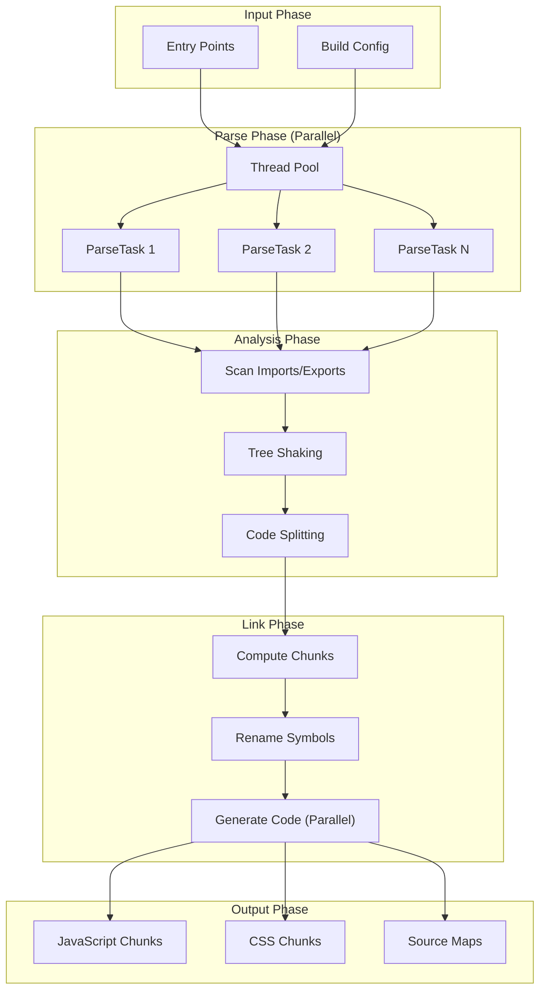
```mermaid
flowchart TD
    subgraph Input["Input Phase"]
        EntryPoints["Entry Points"]
        Config["Build Config"]
    end

    subgraph Parse["Parse Phase (Parallel)"]
        ParseTask1["ParseTask 1"]
        ParseTask2["ParseTask 2"]
        ParseTaskN["ParseTask N"]
        ThreadPool["Thread Pool"]
    end

    subgraph Analyze["Analysis Phase"]
        ImportScan["Scan Imports/Exports"]
        TreeShake["Tree Shaking"]
        CodeSplit["Code Splitting"]
    end

    subgraph Link["Link Phase"]
        ComputeChunks["Compute Chunks"]
        RenameSymbols["Rename Symbols"]
        GenerateCode["Generate Code (Parallel)"]
    end

    subgraph Output["Output Phase"]
        JSChunks["JavaScript Chunks"]
        CSSChunks["CSS Chunks"]
        SourceMaps["Source Maps"]
    end

    EntryPoints --> ThreadPool
    Config --> ThreadPool
    ThreadPool --> ParseTask1
    ThreadPool --> ParseTask2
    ThreadPool --> ParseTaskN

    ParseTask1 --> ImportScan
    ParseTask2 --> ImportScan
    ParseTaskN --> ImportScan

    ImportScan --> TreeShake
    TreeShake --> CodeSplit
    CodeSplit --> ComputeChunks
    ComputeChunks --> RenameSymbols
    RenameSymbols --> GenerateCode

    GenerateCode --> JSChunks
    GenerateCode --> CSSChunks
    GenerateCode --> SourceMaps
```

### Module Resolution

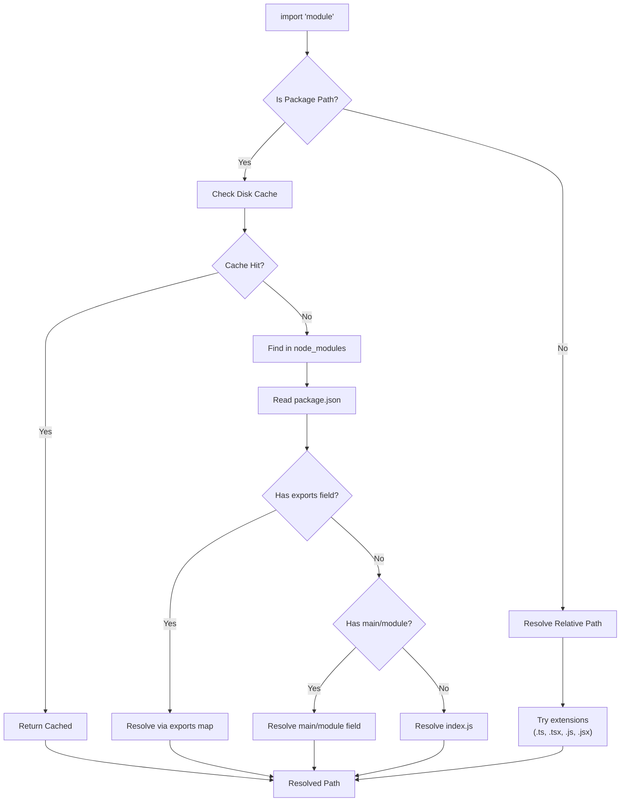
```mermaid
flowchart TD
    Import["import 'module'"] --> IsPackage{Is Package Path?}

    IsPackage -->|Yes| CheckCache["Check Disk Cache"]
    IsPackage -->|No| ResolveRelative["Resolve Relative Path"]

    CheckCache --> CacheHit{Cache Hit?}
    CacheHit -->|Yes| ReturnCached["Return Cached"]
    CacheHit -->|No| FindPackage["Find in node_modules"]

    FindPackage --> ReadPkgJson["Read package.json"]
    ReadPkgJson --> CheckExports{Has exports field?}

    CheckExports -->|Yes| ResolveExports["Resolve via exports map"]
    CheckExports -->|No| CheckMain{Has main/module?}

    CheckMain -->|Yes| ResolveMain["Resolve main/module field"]
    CheckMain -->|No| ResolveIndex["Resolve index.js"]

    ResolveRelative --> CheckExtension["Try extensions<br/>(.ts, .tsx, .js, .jsx)"]

    ResolveExports --> Resolved["Resolved Path"]
    ResolveMain --> Resolved
    ResolveIndex --> Resolved
    CheckExtension --> Resolved
    ReturnCached --> Resolved
```

### Key Bundler Components

| Component | File | Lines | Purpose |
|-----------|------|-------|---------|
| BundleV2 | `bundle_v2.zig` | 3,500+ | Main orchestrator |
| LinkerContext | `LinkerContext.zig` | 2,000+ | Symbol linking & code splitting |
| Parser | `ast/Parser.zig` | 5,000+ | JavaScript/TypeScript parser |
| Resolver | `resolver/resolver.zig` | 4,000+ | Module resolution |
| Graph | `Graph.zig` | 500+ | Dependency graph |
| Chunk | `Chunk.zig` | 800+ | Output chunk management |

---

## Package Manager

### Installation Flow

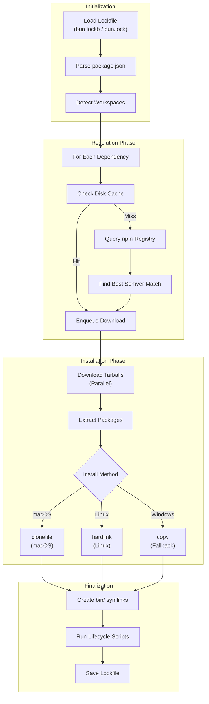
```mermaid
flowchart TD
    subgraph Init["Initialization"]
        LoadLockfile["Load Lockfile<br/>(bun.lockb / bun.lock)"]
        ParsePkgJson["Parse package.json"]
        DetectWorkspaces["Detect Workspaces"]
    end

    subgraph Resolve["Resolution Phase"]
        ForEachDep["For Each Dependency"]
        CheckDiskCache["Check Disk Cache"]
        QueryRegistry["Query npm Registry"]
        SemverMatch["Find Best Semver Match"]
        EnqueueDownload["Enqueue Download"]
    end

    subgraph Install["Installation Phase"]
        DownloadTarballs["Download Tarballs<br/>(Parallel)"]
        ExtractPackages["Extract Packages"]
        InstallMethod{Install Method}
        Clonefile["clonefile<br/>(macOS)"]
        Hardlink["hardlink<br/>(Linux)"]
        Copy["copy<br/>(Fallback)"]
    end

    subgraph Finalize["Finalization"]
        CreateBins["Create bin/ symlinks"]
        RunScripts["Run Lifecycle Scripts"]
        SaveLockfile["Save Lockfile"]
    end

    LoadLockfile --> ParsePkgJson
    ParsePkgJson --> DetectWorkspaces
    DetectWorkspaces --> ForEachDep

    ForEachDep --> CheckDiskCache
    CheckDiskCache -->|Miss| QueryRegistry
    CheckDiskCache -->|Hit| EnqueueDownload
    QueryRegistry --> SemverMatch
    SemverMatch --> EnqueueDownload

    EnqueueDownload --> DownloadTarballs
    DownloadTarballs --> ExtractPackages
    ExtractPackages --> InstallMethod

    InstallMethod -->|macOS| Clonefile
    InstallMethod -->|Linux| Hardlink
    InstallMethod -->|Windows| Copy

    Clonefile --> CreateBins
    Hardlink --> CreateBins
    Copy --> CreateBins

    CreateBins --> RunScripts
    RunScripts --> SaveLockfile
```

### Lockfile Format

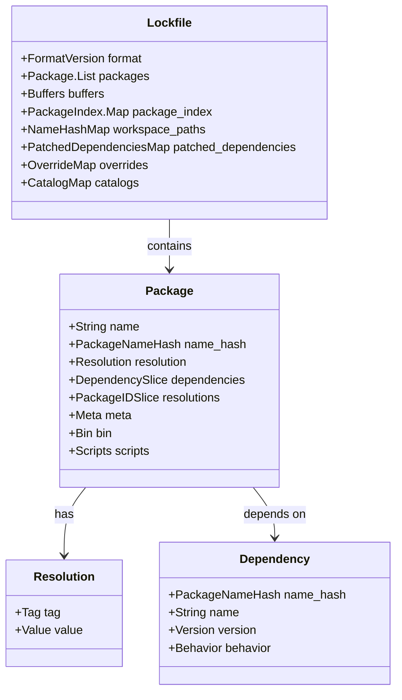
```mermaid
classDiagram
    class Lockfile {
        +FormatVersion format
        +Package.List packages
        +Buffers buffers
        +PackageIndex.Map package_index
        +NameHashMap workspace_paths
        +PatchedDependenciesMap patched_dependencies
        +OverrideMap overrides
        +CatalogMap catalogs
    }

    class Package {
        +String name
        +PackageNameHash name_hash
        +Resolution resolution
        +DependencySlice dependencies
        +PackageIDSlice resolutions
        +Meta meta
        +Bin bin
        +Scripts scripts
    }

    class Resolution {
        +Tag tag
        +Value value
    }

    class Dependency {
        +PackageNameHash name_hash
        +String name
        +Version version
        +Behavior behavior
    }

    Lockfile --> Package : contains
    Package --> Resolution : has
    Package --> Dependency : depends on
```

### Compatibility Matrix

| Feature | npm | yarn | pnpm |
|---------|-----|------|------|
| Lockfile Migration | ✅ | ✅ | ✅ |
| Workspace Support | ✅ | ✅ | ✅ |
| Peer Dependencies | ✅ | ✅ | ✅ |
| Optional Dependencies | ✅ | ✅ | ✅ |
| Scoped Packages | ✅ | ✅ | ✅ |
| Patches | ✅ | ✅ | ✅ |
| Overrides | ✅ | ✅ | ✅ |
| Isolated Install | - | - | ✅ |

---

## HTTP Server & Networking

### Server Architecture

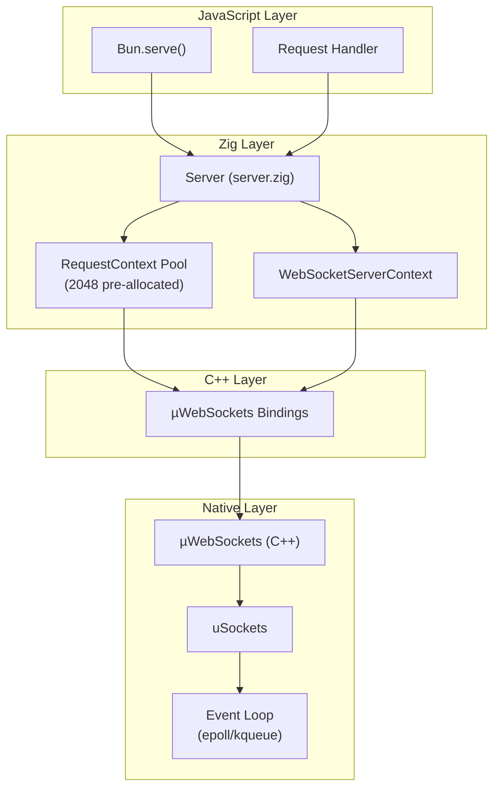
```mermaid
flowchart TB
    subgraph JSLayer["JavaScript Layer"]
        BunServe["Bun.serve()"]
        Handler["Request Handler"]
    end

    subgraph ZigLayer["Zig Layer"]
        Server["Server (server.zig)"]
        ReqCtx["RequestContext Pool<br/>(2048 pre-allocated)"]
        WebSocketCtx["WebSocketServerContext"]
    end

    subgraph CppLayer["C++ Layer"]
        UWSBindings["µWebSockets Bindings"]
    end

    subgraph NativeLayer["Native Layer"]
        UWS["µWebSockets (C++)"]
        USockets["uSockets"]
        EventLoop["Event Loop<br/>(epoll/kqueue)"]
    end

    BunServe --> Server
    Handler --> Server
    Server --> ReqCtx
    Server --> WebSocketCtx
    ReqCtx --> UWSBindings
    WebSocketCtx --> UWSBindings
    UWSBindings --> UWS
    UWS --> USockets
    USockets --> EventLoop
```

### Request Processing Flow

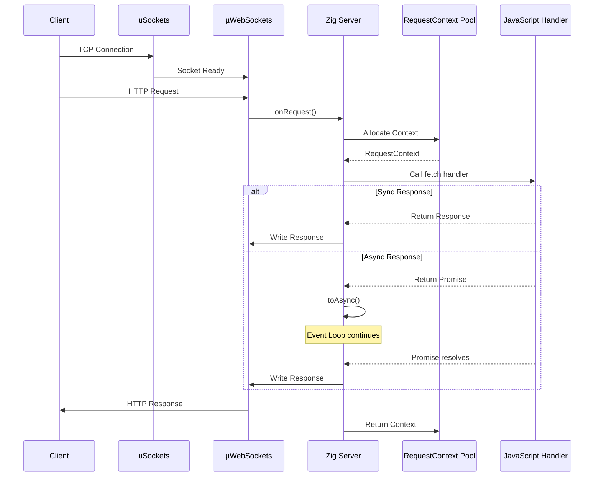
```mermaid
sequenceDiagram
    participant Client
    participant uSockets
    participant µWS as µWebSockets
    participant Zig as Zig Server
    participant Pool as RequestContext Pool
    participant JS as JavaScript Handler

    Client->>uSockets: TCP Connection
    uSockets->>µWS: Socket Ready
    Client->>µWS: HTTP Request
    µWS->>Zig: onRequest()
    Zig->>Pool: Allocate Context
    Pool-->>Zig: RequestContext
    Zig->>JS: Call fetch handler

    alt Sync Response
        JS-->>Zig: Return Response
        Zig->>µWS: Write Response
    else Async Response
        JS-->>Zig: Return Promise
        Zig->>Zig: toAsync()
        Note over Zig: Event Loop continues
        JS-->>Zig: Promise resolves
        Zig->>µWS: Write Response
    end

    µWS->>Client: HTTP Response
    Zig->>Pool: Return Context
```

### WebSocket Flow

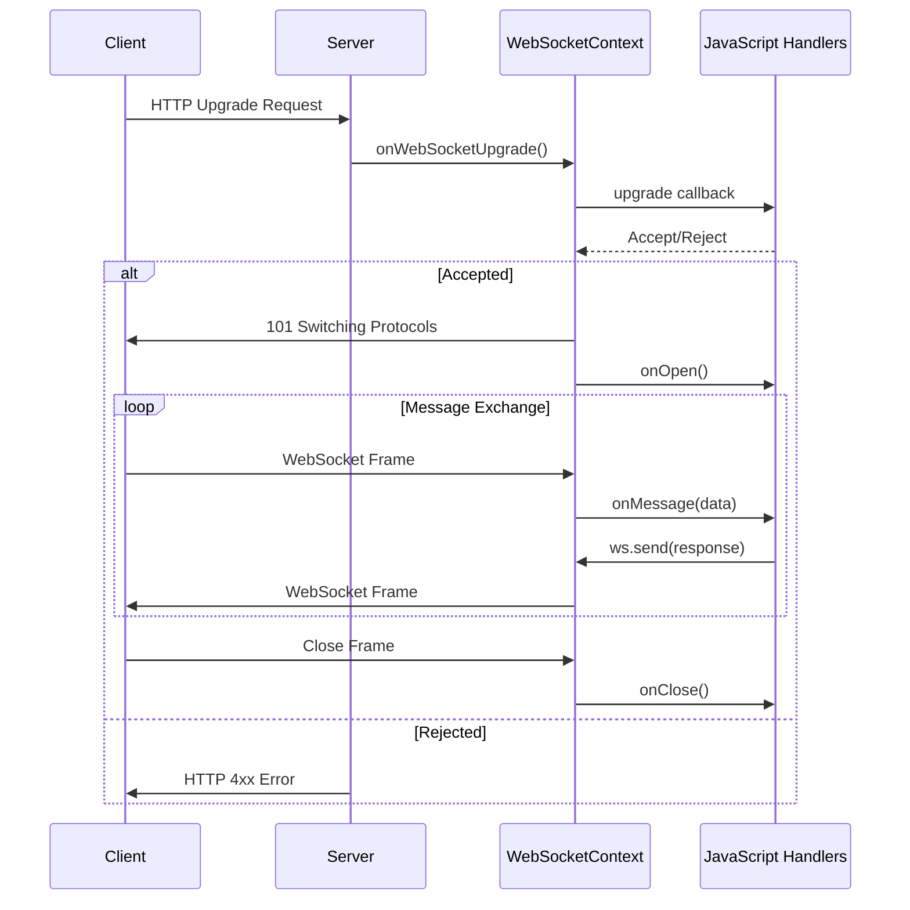
```mermaid
sequenceDiagram
    participant Client
    participant Server
    participant WS as WebSocketContext
    participant JS as JavaScript Handlers

    Client->>Server: HTTP Upgrade Request
    Server->>WS: onWebSocketUpgrade()
    WS->>JS: upgrade callback
    JS-->>WS: Accept/Reject

    alt Accepted
        WS->>Client: 101 Switching Protocols
        WS->>JS: onOpen()

        loop Message Exchange
            Client->>WS: WebSocket Frame
            WS->>JS: onMessage(data)
            JS->>WS: ws.send(response)
            WS->>Client: WebSocket Frame
        end

        Client->>WS: Close Frame
        WS->>JS: onClose()
    else Rejected
        Server->>Client: HTTP 4xx Error
    end
```

### Connection Pooling

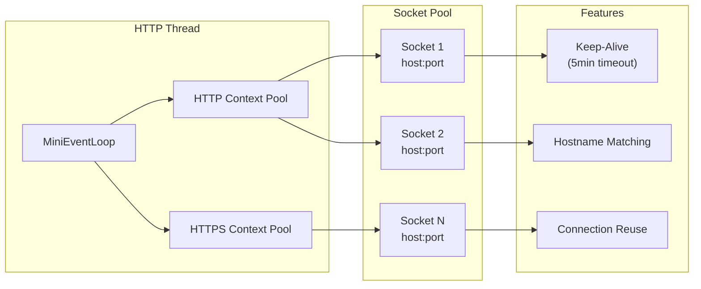
```mermaid
flowchart LR
    subgraph HTTPThread["HTTP Thread"]
        MiniLoop["MiniEventLoop"]
        HTTPCtx["HTTP Context Pool"]
        HTTPSCtx["HTTPS Context Pool"]
    end

    subgraph SocketPool["Socket Pool"]
        Socket1["Socket 1<br/>host:port"]
        Socket2["Socket 2<br/>host:port"]
        SocketN["Socket N<br/>host:port"]
    end

    subgraph Features["Features"]
        KeepAlive["Keep-Alive<br/>(5min timeout)"]
        Hostname["Hostname Matching"]
        Reuse["Connection Reuse"]
    end

    MiniLoop --> HTTPCtx
    MiniLoop --> HTTPSCtx
    HTTPCtx --> Socket1
    HTTPCtx --> Socket2
    HTTPSCtx --> SocketN

    Socket1 --> KeepAlive
    Socket2 --> Hostname
    SocketN --> Reuse
```

---

## Directory Structure

```
bun/
├── src/                          # Main source code
│   ├── bun.zig                   # Root module & allocators
│   ├── main.zig                  # Entry point
│   ├── cli.zig                   # CLI orchestration
│   │
│   ├── bun.js/                   # JavaScript runtime
│   │   ├── api/                  # Bun-specific APIs
│   │   │   ├── server.zig        # HTTP server (150K lines)
│   │   │   ├── FFI.zig           # Foreign Function Interface
│   │   │   └── crypto.zig        # Crypto operations
│   │   ├── bindings/             # C++ JSC bindings
│   │   ├── event_loop/           # Event loop implementation
│   │   ├── jsc/                  # JSC integration
│   │   ├── node/                 # Node.js compatibility
│   │   └── webcore/              # Web APIs
│   │
│   ├── bundler/                  # Module bundler
│   │   ├── bundle_v2.zig         # Main bundler
│   │   ├── LinkerContext.zig     # Linking & symbols
│   │   └── Chunk.zig             # Output chunks
│   │
│   ├── resolver/                 # Module resolution
│   │   ├── resolver.zig          # Main resolver
│   │   └── package_json.zig      # package.json parsing
│   │
│   ├── install/                  # Package manager
│   │   ├── PackageManager.zig    # Main orchestrator
│   │   ├── lockfile.zig          # Lockfile management
│   │   └── npm.zig               # npm registry client
│   │
│   ├── ast/                      # JavaScript AST
│   │   ├── Parser.zig            # Main parser
│   │   ├── Expr.zig              # Expressions
│   │   └── Stmt.zig              # Statements
│   │
│   ├── http/                     # HTTP client
│   │   ├── HTTPThread.zig        # Background HTTP thread
│   │   └── websocket.zig         # WebSocket support
│   │
│   ├── allocators/               # Memory allocation
│   │   ├── mimalloc.zig          # mimalloc bindings
│   │   └── MimallocArena.zig     # Thread-local heaps
│   │
│   ├── js/                       # JavaScript modules
│   │   ├── node/                 # Node.js polyfills
│   │   ├── bun/                  # Bun modules
│   │   └── builtins/             # Built-in globals
│   │
│   ├── codegen/                  # Code generation
│   │   └── generate-classes.ts   # Class binding generator
│   │
│   └── deps/                     # Third-party dependencies
│       ├── uws/                  # µWebSockets bindings
│       ├── boringssl.zig         # TLS/SSL
│       └── mimalloc.zig          # Memory allocator
│
├── packages/                     # NPM packages
│   ├── bun-types/                # TypeScript definitions
│   └── bun-vscode/               # VS Code extension
│
├── test/                         # Test suite
├── bench/                        # Benchmarks
├── docs/                         # Documentation
├── cmake/                        # CMake configuration
└── build.zig                     # Zig build system
```

---

## Key Design Patterns

### 1. Parallel Processing with Threadlocal Heaps

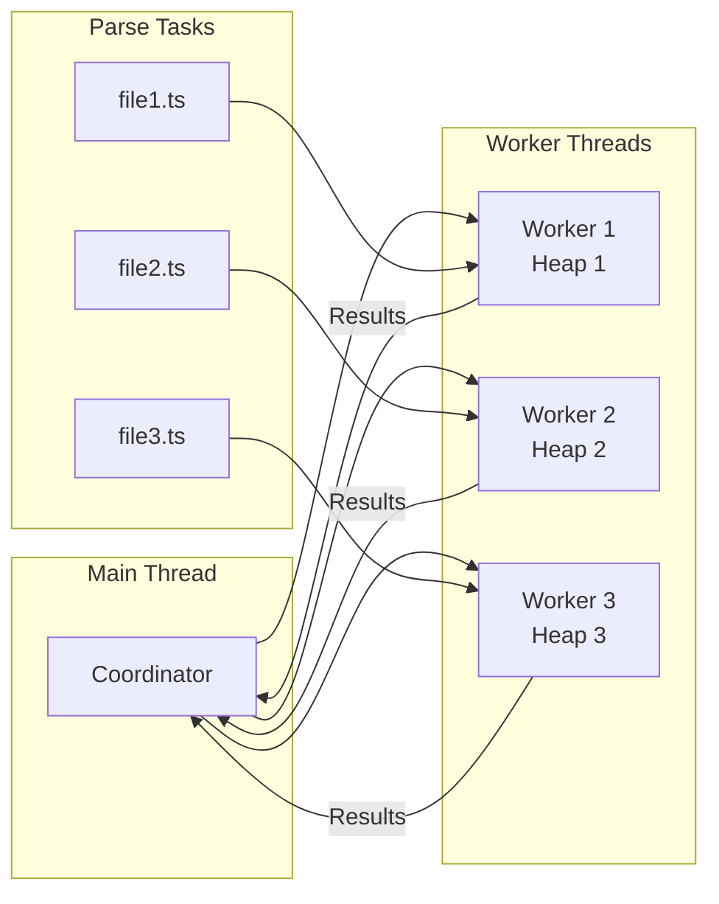
```mermaid
flowchart LR
    subgraph MainThread["Main Thread"]
        MT["Coordinator"]
    end

    subgraph Workers["Worker Threads"]
        W1["Worker 1<br/>Heap 1"]
        W2["Worker 2<br/>Heap 2"]
        W3["Worker 3<br/>Heap 3"]
    end

    subgraph Tasks["Parse Tasks"]
        T1["file1.ts"]
        T2["file2.ts"]
        T3["file3.ts"]
    end

    MT --> W1
    MT --> W2
    MT --> W3

    T1 --> W1
    T2 --> W2
    T3 --> W3

    W1 -->|"Results"| MT
    W2 -->|"Results"| MT
    W3 -->|"Results"| MT
```

### 2. Code Generation Pipeline

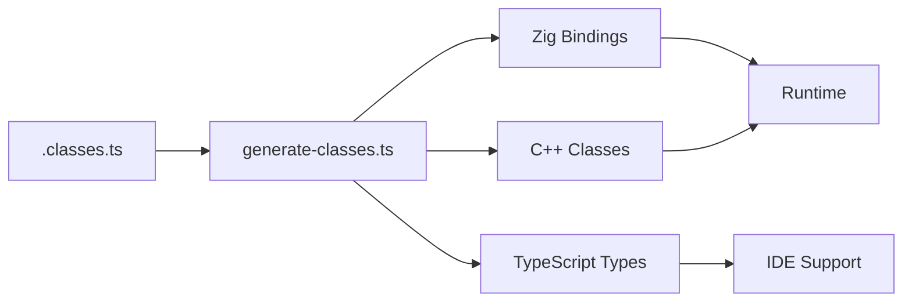
```mermaid
flowchart LR
    A[".classes.ts"] --> B["generate-classes.ts"]
    B --> C["Zig Bindings"]
    B --> D["C++ Classes"]
    B --> E["TypeScript Types"]
    C --> F["Runtime"]
    D --> F
    E --> G["IDE Support"]
```

### 3. Enter/Exit Pattern for Microtask Draining

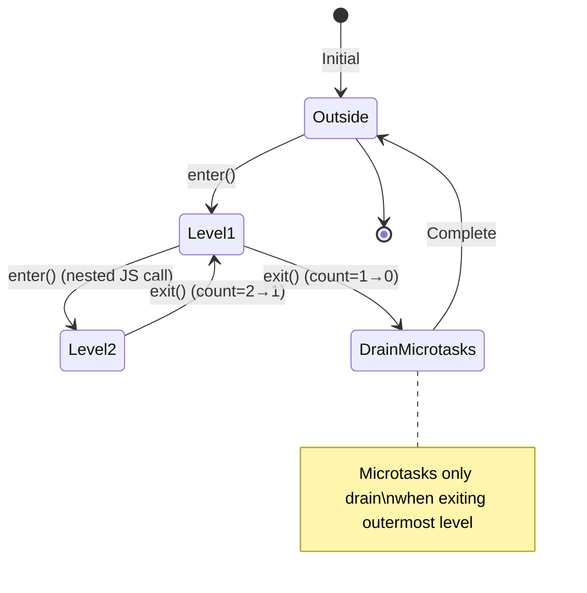
```mermaid
stateDiagram-v2
    [*] --> Outside: Initial
    Outside --> Level1: enter()
    Level1 --> Level2: enter() (nested JS call)
    Level2 --> Level1: exit() (count=2→1)
    Level1 --> DrainMicrotasks: exit() (count=1→0)
    DrainMicrotasks --> Outside: Complete
    Outside --> [*]

    note right of DrainMicrotasks: Microtasks only drain\nwhen exiting outermost level
```

### 4. Reference Counting for Async Safety

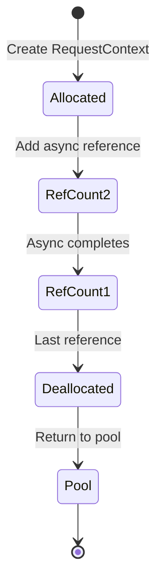
```mermaid
stateDiagram-v2
    [*] --> Allocated: Create RequestContext
    Allocated --> RefCount2: Add async reference
    RefCount2 --> RefCount1: Async completes
    RefCount1 --> Deallocated: Last reference
    Deallocated --> Pool: Return to pool
    Pool --> [*]
```

---

## Performance Optimizations

| Optimization | Impact | Implementation |
|--------------|--------|----------------|
| **Threadlocal Heaps** | No allocation contention | mimalloc per-thread arenas |
| **Pre-allocated Pools** | Zero GC during requests | 2048 RequestContext objects |
| **Copy-on-Write** | Instant package install on macOS | clonefile syscall |
| **Binary Lockfile** | 10x faster than JSON/YAML | Custom bun.lockb format |
| **Compile-time SSL** | Zero runtime overhead | Generic `ssl: bool` parameter |
| **Cork/Flush** | Reduced syscalls | Batched response writes |
| **Symbol Renaming** | Smaller bundles | Two-pass minification |
| **Parallel Parsing** | Utilize all cores | Thread pool with work stealing |

---

## Summary

Bun's architecture achieves exceptional performance through:

1. **Zig for Systems Programming**: Low-level control with safety guarantees
2. **JavaScriptCore Integration**: Production-grade JS engine with native bindings
3. **Parallel-First Design**: Threadlocal memory, parallel parsing, concurrent downloads
4. **Unified Tooling**: Runtime, bundler, package manager, and test runner in one binary
5. **Zero-Copy Patterns**: sendfile, clonefile, slice-based APIs
6. **Smart Caching**: Disk cache, memory pools, connection reuse

The result is a JavaScript runtime that's typically **3-4x faster** than Node.js for common operations, while maintaining high compatibility with the existing JavaScript ecosystem.
