# Candle 架构设计深度分析

> Candle 是 Hugging Face 开发的极简主义 Rust 机器学习框架，专注于高性能、易用性和无服务器部署。

## 1. 项目概览

| 属性 | 值 |
|------|-----|
| 版本 | 0.9.2-alpha.2 |
| 语言 | Rust (Edition 2021) |
| 许可证 | MIT OR Apache-2.0 |
| 源文件数 | 557+ Rust 文件 |
| 仓库 | github.com/huggingface/candle |

### 1.1 设计目标

- **极简主义**: 最小化依赖，核心功能精简
- **高性能**: SIMD 优化、GPU 加速、零拷贝操作
- **易于部署**: 支持 WebAssembly、无服务器环境
- **Rust 安全性**: 利用 Rust 类型系统保证内存安全

## 2. 工作空间结构

```
candle/
├── candle-core/           # 核心张量与计算引擎
├── candle-nn/             # 神经网络构建模块
├── candle-transformers/   # 预构建 Transformer 模型
├── candle-datasets/       # 数据加载工具
├── candle-examples/       # 可执行示例程序
├── candle-pyo3/           # Python 绑定
├── candle-onnx/           # ONNX 模型支持
├── candle-kernels/        # CUDA 内核
├── candle-metal-kernels/  # Metal GPU 内核
├── candle-flash-attn/     # Flash Attention 内核
├── candle-wasm-*/         # WebAssembly 示例
└── tensor-tools/          # 实用工具
```

## 3. 分层架构设计

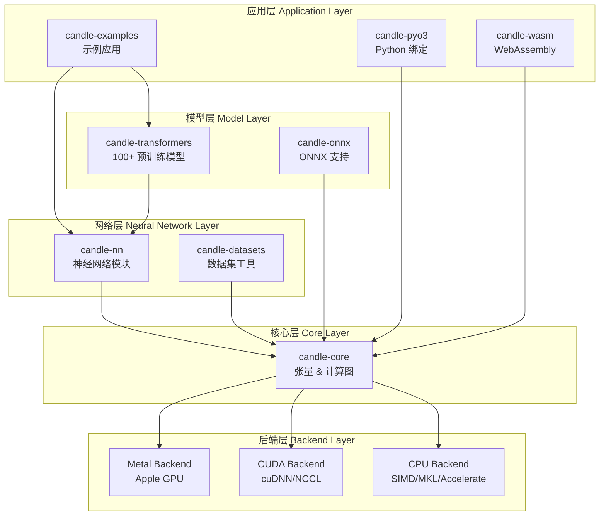

## 4. 核心组件详解

### 4.1 candle-core: 计算引擎

candle-core 是整个框架的基础，包含 63 个 Rust 源文件。

#### 4.1.1 核心数据结构

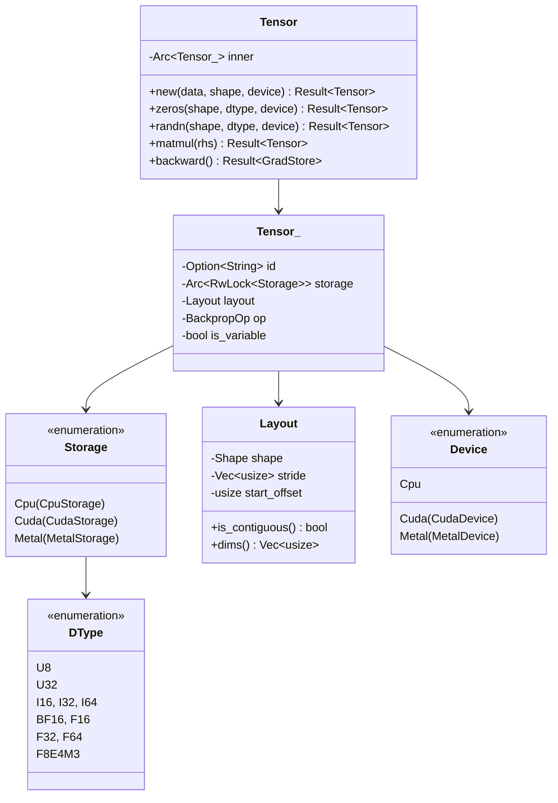

#### 4.1.2 后端抽象体系

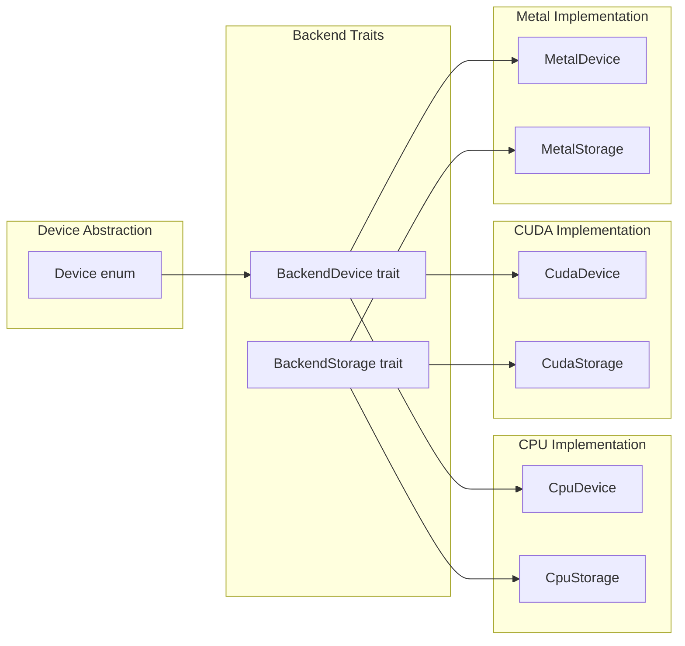

#### 4.1.3 计算图与反向传播

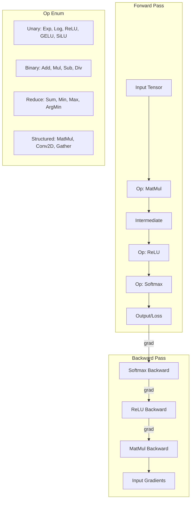

### 4.2 candle-nn: 神经网络模块

包含 23 个专业模块用于构建神经网络。

#### 4.2.1 模块体系

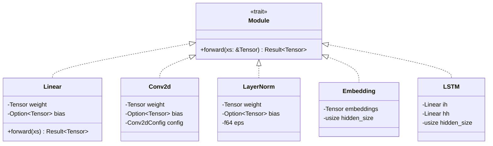

#### 4.2.2 参数管理系统

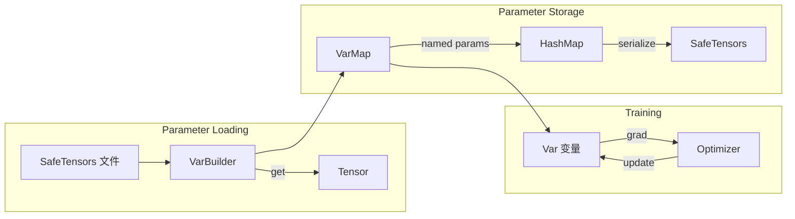

#### 4.2.3 优化器实现

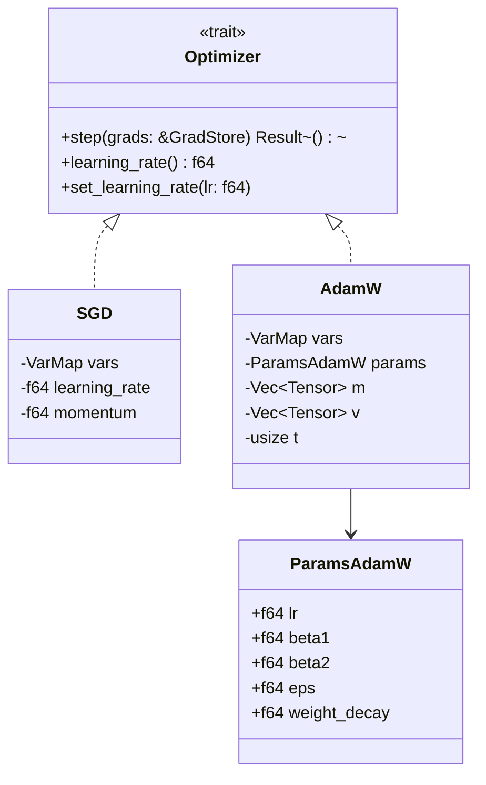

### 4.3 candle-transformers: 模型库

包含 100+ 预构建 Transformer 模型实现。

#### 4.3.1 模型分类

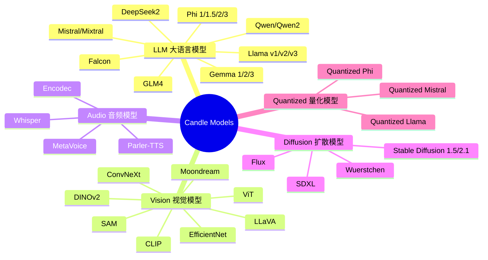

#### 4.3.2 典型模型架构 (Llama)

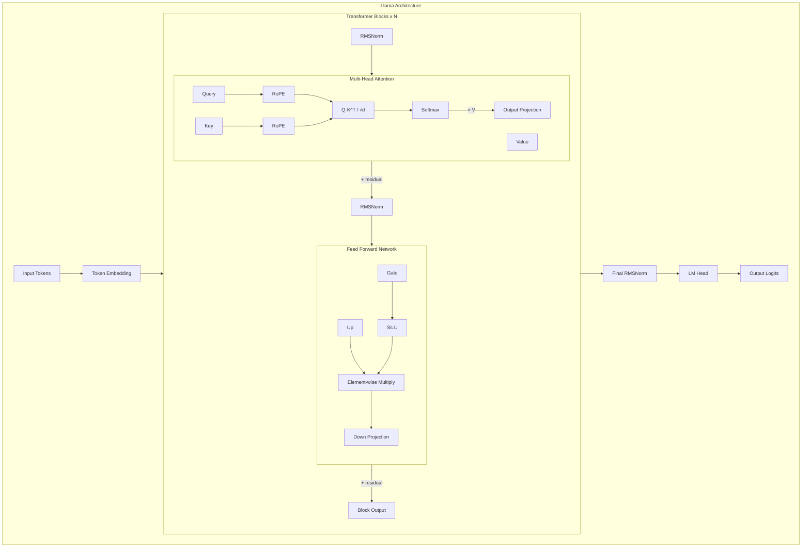

## 5. 后端系统深度分析

### 5.1 CPU 后端

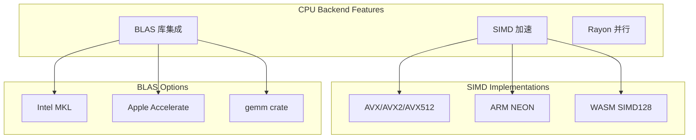

### 5.2 CUDA 后端

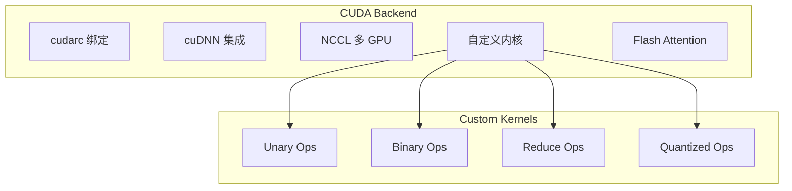

### 5.3 Metal 后端

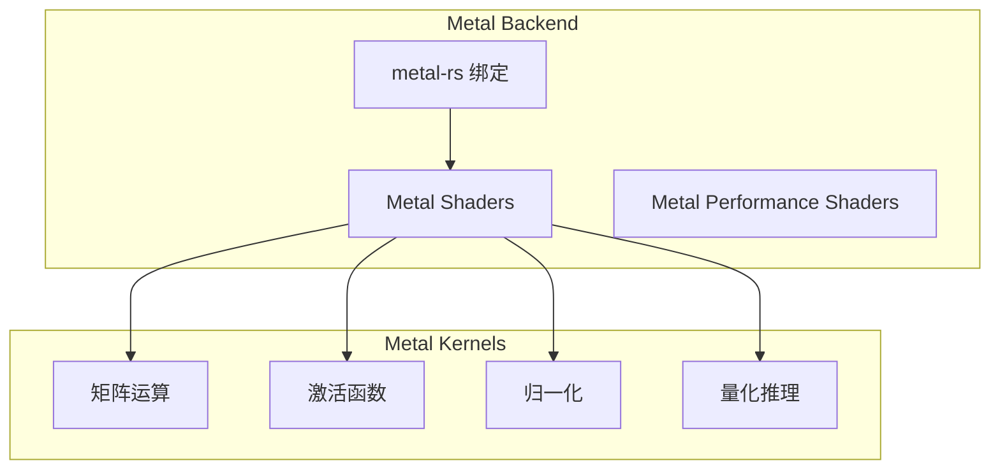

## 6. 量化系统

### 6.1 支持的量化格式

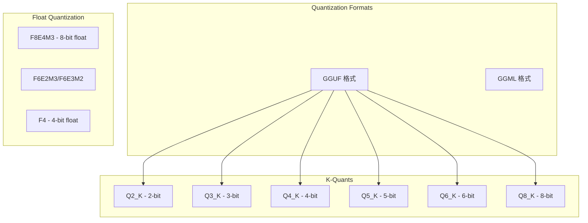

### 6.2 量化推理流程

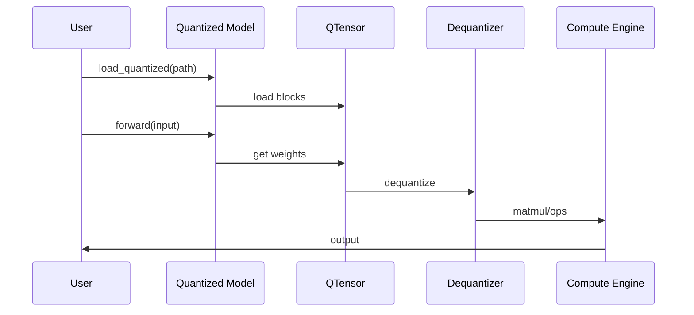

## 7. 数据流与执行模型

### 7.1 张量操作流水线

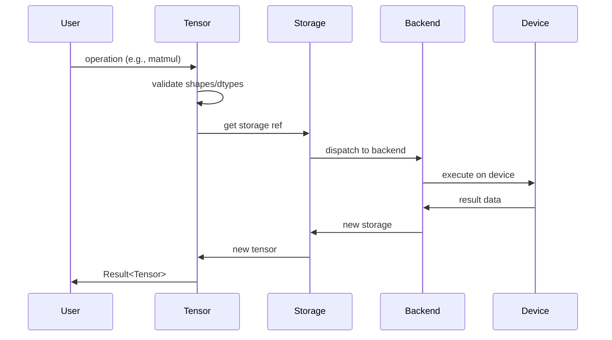

### 7.2 训练循环

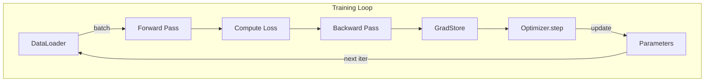

## 8. 内存管理策略

### 8.1 引用计数与共享

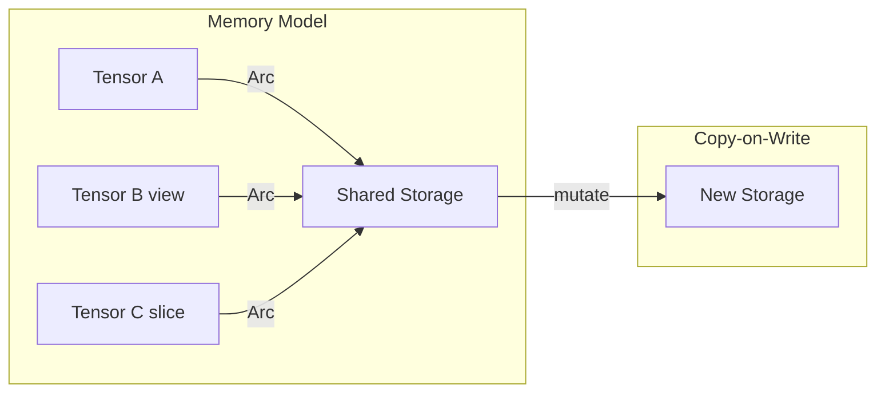

### 8.2 设备内存管理

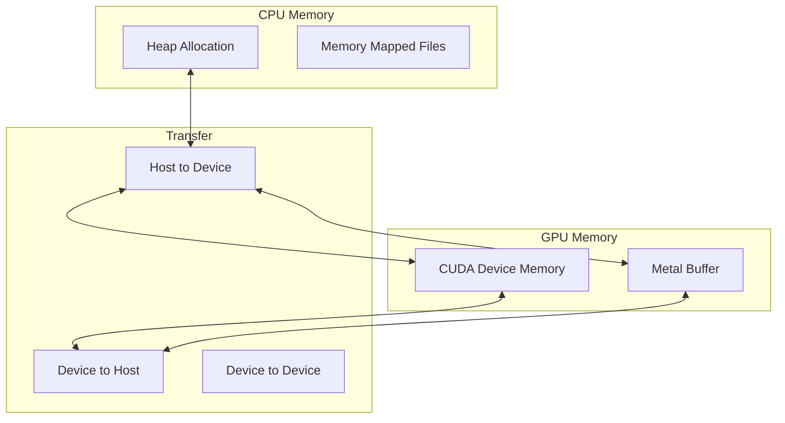

## 9. 错误处理体系

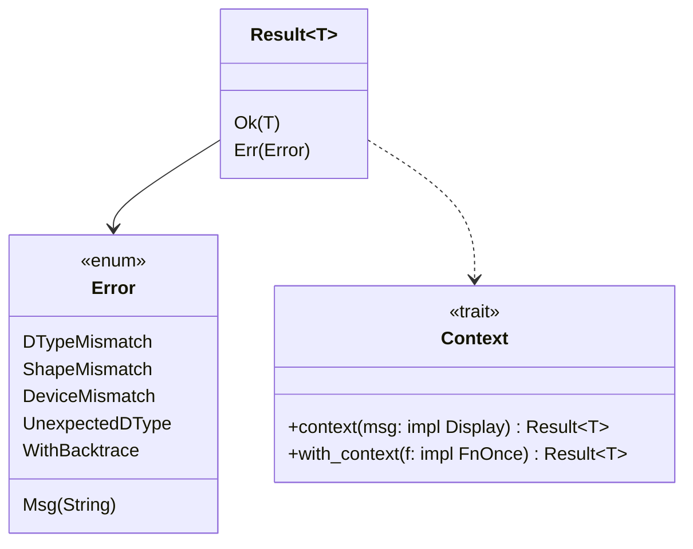

## 10. 依赖关系图

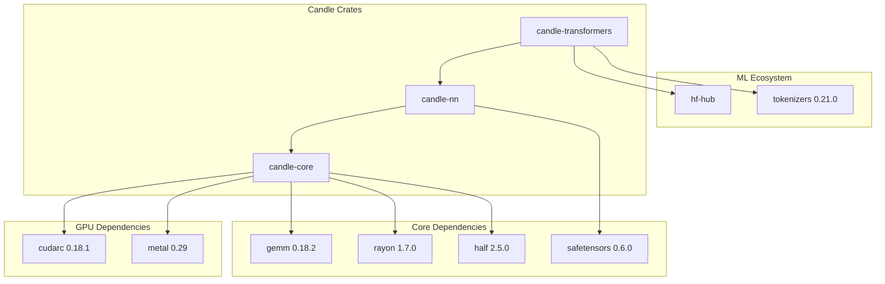

## 11. 特性开关 (Feature Flags)

```mermaid
graph LR
    subgraph "candle-core features"
        CUDA[cuda]
        CUDNN[cudnn]
        NCCL[nccl]
        MKL[mkl]
        ACCELERATE[accelerate]
        METAL[metal]
    end

    subgraph "Effects"
        CUDA --> |enables| CUDA_BACKEND[CUDA Backend]
        CUDNN --> |enables| CUDNN_OPS[cuDNN Operations]
        NCCL --> |enables| MULTI_GPU[Multi-GPU Support]
        MKL --> |enables| INTEL_BLAS[Intel BLAS]
        ACCELERATE --> |enables| APPLE_BLAS[Apple BLAS]
        METAL --> |enables| METAL_BACKEND[Metal Backend]
    end
```

## 12. 设计模式总结

### 12.1 核心设计模式

| 模式 | 应用场景 | 实现 |
|------|---------|------|
| **策略模式** | 后端切换 | Device/Storage enums |
| **工厂模式** | 张量创建 | Tensor::new, zeros, randn |
| **建造者模式** | 参数加载 | VarBuilder |
| **组合模式** | 模型构建 | Sequential, Module trait |
| **观察者模式** | 梯度追踪 | BackpropOp |
| **享元模式** | 内存共享 | Arc<Storage> |

### 12.2 架构亮点

1. **类型安全**: 利用 Rust 类型系统在编译时捕获错误
2. **零成本抽象**: trait 和泛型不引入运行时开销
3. **并发安全**: Arc + RwLock 实现线程安全共享
4. **延迟求值**: 计算图记录操作，支持优化和反向传播
5. **模块化设计**: 各组件独立，易于扩展和维护

## 13. 性能优化技术

```mermaid
graph TB
    subgraph "Computation Optimization"
        SIMD_OPT[SIMD 向量化]
        BLAS_OPT[BLAS 库加速]
        KERNEL_FUSION[内核融合]
    end

    subgraph "Memory Optimization"
        ZERO_COPY[零拷贝视图]
        STRIDED[跨步布局]
        MMAP[内存映射]
    end

    subgraph "Inference Optimization"
        QUANT[模型量化]
        KV_CACHE[KV 缓存]
        FLASH_ATT[Flash Attention]
    end
```

## 14. 扩展与集成

### 14.1 Python 绑定 (candle-pyo3)

```python
import candle

# 创建张量
x = candle.Tensor([1.0, 2.0, 3.0])

# 执行操作
y = x.matmul(x.t())

# 使用预训练模型
model = candle.load_llama("path/to/model")
output = model.generate("Hello, world!")
```

### 14.2 WebAssembly 支持

```mermaid
flowchart LR
    RUST[Rust Code] --> WASM[WASM Binary]
    WASM --> BROWSER[Browser]
    WASM --> NODE[Node.js]
    BROWSER --> SIMD128[SIMD128 Acceleration]
```

## 15. 总结

Candle 通过精心设计的分层架构，实现了：

- **高性能**: 多后端支持 (CPU/CUDA/Metal)，SIMD 优化
- **易用性**: 清晰的 API，丰富的预训练模型
- **安全性**: Rust 类型系统保证内存安全
- **可扩展性**: 模块化设计，易于添加新模型和后端
- **部署灵活**: 支持 Python、WebAssembly、原生 Rust

作为 Hugging Face 的 Rust ML 框架，Candle 为需要高性能推理的场景提供了优秀的解决方案，特别适合边缘部署、嵌入式系统和对性能敏感的生产环境。
