# CrewAI 架构设计分析

> **版本**: 1.7.2
> **分析日期**: 2025-12-30
> **核心理念**: 独立的多 AI Agent 编排框架，专为企业级自动化设计

## 目录

- [1. 概述](#1-概述)
- [2. 项目结构](#2-项目结构)
- [3. 核心架构](#3-核心架构)
- [4. 核心组件详解](#4-核心组件详解)
- [5. 执行流程与进程模型](#5-执行流程与进程模型)
- [6. 工具系统](#6-工具系统)
- [7. 记忆系统](#7-记忆系统)
- [8. 知识与 RAG 系统](#8-知识与-rag-系统)
- [9. LLM 集成层](#9-llm-集成层)
- [10. 事件系统](#10-事件系统)
- [11. Flow 事件驱动框架](#11-flow-事件驱动框架)
- [12. 安全与可观测性](#12-安全与可观测性)
- [13. 设计模式与最佳实践](#13-设计模式与最佳实践)
- [14. 总结](#14-总结)

---

## 1. 概述

CrewAI 是一个完全独立的多 Agent 编排框架，不依赖 LangChain，从零构建。它的核心设计围绕三个支柱：

- **Agent** - 自主代理，具有角色、目标和工具
- **Task** - 任务定义单元，指定工作内容和预期输出
- **Crew** - 编排器，协调多个 Agent 完成一系列 Task

### 1.1 核心特性

| 特性 | 描述 |
|------|------|
| 多 Agent 协作 | 支持顺序/层级执行模式 |
| 记忆系统 | 短期、长期、实体、外部记忆 |
| 知识系统 | 支持 PDF、CSV、JSON 等多种知识源 |
| RAG 集成 | 内置向量检索，支持 Chroma、Qdrant |
| 工具生态 | 丰富的工具系统，支持 MCP 协议 |
| 多 LLM 支持 | OpenAI、Anthropic、Azure、Bedrock、Gemini |
| 事件驱动 | 完整的事件系统支持可观测性 |
| 企业级安全 | 指纹识别、安全配置、审计追踪 |

---

## 2. 项目结构

```
crewAI/
├── lib/
│   ├── crewai/              # 核心框架 (444 个 Python 文件)
│   │   └── src/crewai/      # 源代码
│   ├── crewai-tools/        # 工具库集合
│   └── devtools/            # 开发工具
├── docs/                    # 多语言文档
├── pyproject.toml           # 工作区配置
└── conftest.py              # 测试配置
```

### 2.1 核心模块分布

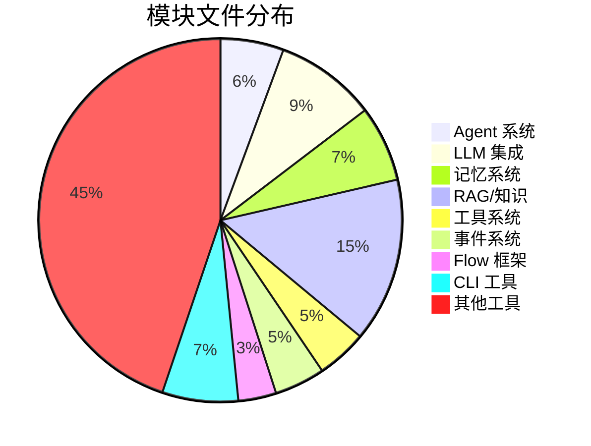
```mermaid
pie title 模块文件分布
    "Agent 系统" : 25
    "LLM 集成" : 40
    "记忆系统" : 30
    "RAG/知识" : 65
    "工具系统" : 20
    "事件系统" : 20
    "Flow 框架" : 15
    "CLI 工具" : 30
    "其他工具" : 199
```

---

## 3. 核心架构

### 3.1 整体架构图

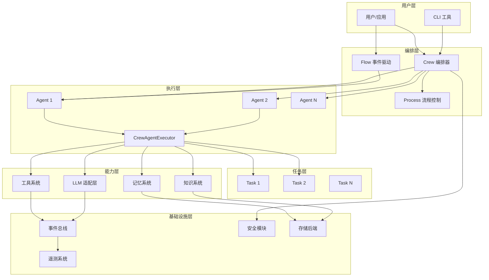
```mermaid
graph TB
    subgraph "用户层"
        User[用户/应用]
        CLI[CLI 工具]
    end

    subgraph "编排层"
        Crew[Crew 编排器]
        Flow[Flow 事件驱动]
        Process[Process 流程控制]
    end

    subgraph "执行层"
        Agent1[Agent 1]
        Agent2[Agent 2]
        AgentN[Agent N]
        Executor[CrewAgentExecutor]
    end

    subgraph "任务层"
        Task1[Task 1]
        Task2[Task 2]
        TaskN[Task N]
    end

    subgraph "能力层"
        Tools[工具系统]
        Memory[记忆系统]
        Knowledge[知识系统]
        LLM[LLM 适配层]
    end

    subgraph "基础设施层"
        Events[事件总线]
        Telemetry[遥测系统]
        Security[安全模块]
        Storage[存储后端]
    end

    User --> Crew
    User --> Flow
    CLI --> Crew

    Crew --> Process
    Crew --> Agent1
    Crew --> Agent2
    Crew --> AgentN

    Flow --> Agent1

    Agent1 --> Executor
    Agent2 --> Executor

    Executor --> Task1
    Executor --> Task2

    Executor --> Tools
    Executor --> Memory
    Executor --> Knowledge
    Executor --> LLM

    Tools --> Events
    Memory --> Storage
    Knowledge --> Storage
    LLM --> Events

    Events --> Telemetry
    Crew --> Security
```

### 3.2 核心类关系图

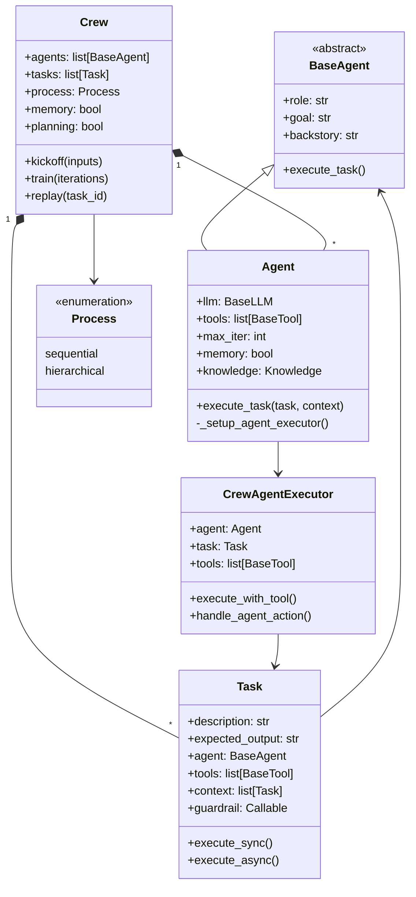
```mermaid
classDiagram
    class BaseAgent {
        <<abstract>>
        +role: str
        +goal: str
        +backstory: str
        +execute_task()
    }

    class Agent {
        +llm: BaseLLM
        +tools: list[BaseTool]
        +max_iter: int
        +memory: bool
        +knowledge: Knowledge
        +execute_task(task, context)
        -_setup_agent_executor()
    }

    class Task {
        +description: str
        +expected_output: str
        +agent: BaseAgent
        +tools: list[BaseTool]
        +context: list[Task]
        +guardrail: Callable
        +execute_sync()
        +execute_async()
    }

    class Crew {
        +agents: list[BaseAgent]
        +tasks: list[Task]
        +process: Process
        +memory: bool
        +planning: bool
        +kickoff(inputs)
        +train(iterations)
        +replay(task_id)
    }

    class CrewAgentExecutor {
        +agent: Agent
        +task: Task
        +tools: list[BaseTool]
        +execute_with_tool()
        +handle_agent_action()
    }

    class Process {
        <<enumeration>>
        sequential
        hierarchical
    }

    BaseAgent <|-- Agent
    Crew "1" *-- "*" Agent
    Crew "1" *-- "*" Task
    Crew --> Process
    Task --> BaseAgent
    Agent --> CrewAgentExecutor
    CrewAgentExecutor --> Task
```

---

## 4. 核心组件详解

### 4.1 Agent (代理)

Agent 是 CrewAI 的核心执行单元，代表一个具有特定角色和能力的 AI 代理。

**文件位置**: `lib/crewai/src/crewai/agent/core.py` (1,655 行)

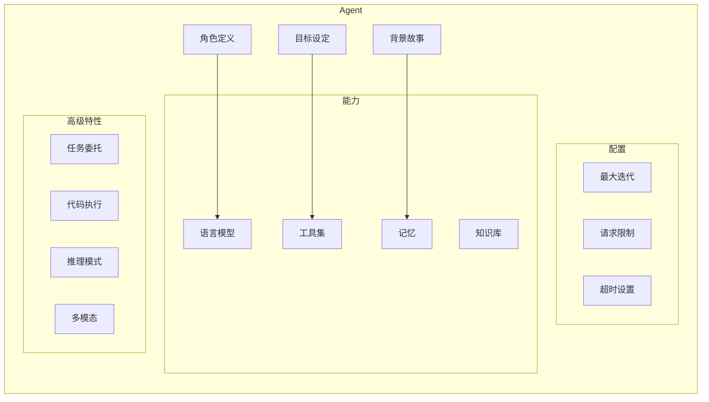
```mermaid
graph LR
    subgraph Agent
        Role[角色定义]
        Goal[目标设定]
        Backstory[背景故事]

        subgraph 能力
            LLM[语言模型]
            Tools[工具集]
            Memory[记忆]
            Knowledge[知识库]
        end

        subgraph 配置
            MaxIter[最大迭代]
            MaxRPM[请求限制]
            Timeout[超时设置]
        end

        subgraph 高级特性
            Delegation[任务委托]
            CodeExec[代码执行]
            Reasoning[推理模式]
            Multimodal[多模态]
        end
    end

    Role --> LLM
    Goal --> Tools
    Backstory --> Memory
```

**关键属性**:

| 属性 | 类型 | 描述 |
|------|------|------|
| `role` | str | 代理角色 |
| `goal` | str | 代理目标 |
| `backstory` | str | 背景故事（提供上下文） |
| `llm` | BaseLLM | 语言模型实例 |
| `tools` | list[BaseTool] | 可用工具列表 |
| `max_iter` | int | 最大迭代次数 (默认 25) |
| `allow_delegation` | bool | 允许任务委托 |
| `reasoning` | bool | 启用推理模式 |

### 4.2 Task (任务)

Task 定义了需要完成的具体工作单元。

**文件位置**: `lib/crewai/src/crewai/task.py` (1,156 行)

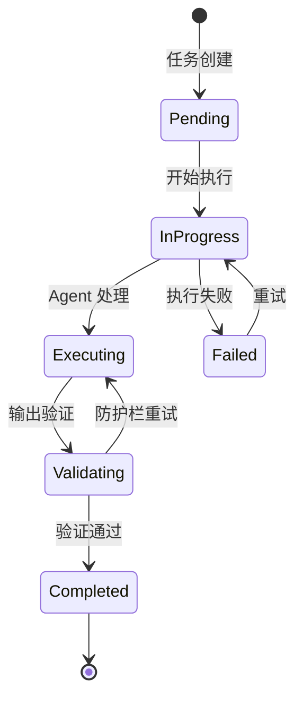
```mermaid
stateDiagram-v2
    [*] --> Pending: 任务创建
    Pending --> InProgress: 开始执行
    InProgress --> Executing: Agent 处理
    Executing --> Validating: 输出验证
    Validating --> Completed: 验证通过
    Validating --> Executing: 防护栏重试
    InProgress --> Failed: 执行失败
    Failed --> InProgress: 重试
    Completed --> [*]
```

**关键属性**:

| 属性 | 类型 | 描述 |
|------|------|------|
| `description` | str | 任务描述 |
| `expected_output` | str | 预期输出 |
| `agent` | BaseAgent | 负责执行的代理 |
| `context` | list[Task] | 上下文任务（依赖） |
| `output_json` | type[BaseModel] | JSON 输出模型 |
| `guardrail` | Callable | 输出验证函数 |
| `human_input` | bool | 需要人工审查 |

### 4.3 Crew (编排器)

Crew 负责协调多个 Agent 完成一系列 Task。

**文件位置**: `lib/crewai/src/crewai/crew.py` (1,920 行)

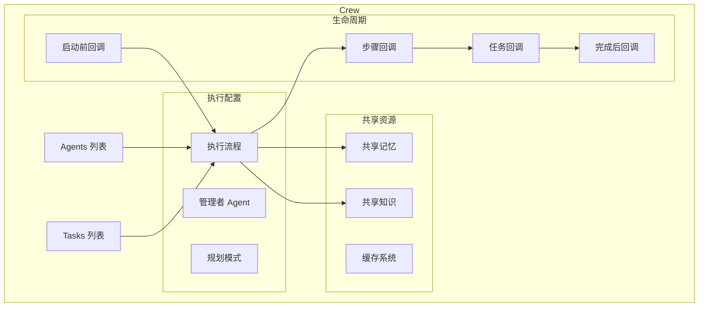
```mermaid
graph TB
    subgraph Crew
        Agents[Agents 列表]
        Tasks[Tasks 列表]

        subgraph 执行配置
            Process[执行流程]
            Manager[管理者 Agent]
            Planning[规划模式]
        end

        subgraph 共享资源
            SharedMemory[共享记忆]
            SharedKnowledge[共享知识]
            Cache[缓存系统]
        end

        subgraph 生命周期
            BeforeKickoff[启动前回调]
            StepCallback[步骤回调]
            TaskCallback[任务回调]
            AfterKickoff[完成后回调]
        end
    end

    Agents --> Process
    Tasks --> Process
    Process --> SharedMemory
    Process --> SharedKnowledge

    BeforeKickoff --> Process
    Process --> StepCallback
    StepCallback --> TaskCallback
    TaskCallback --> AfterKickoff
```

---

## 5. 执行流程与进程模型

### 5.1 执行流程类型

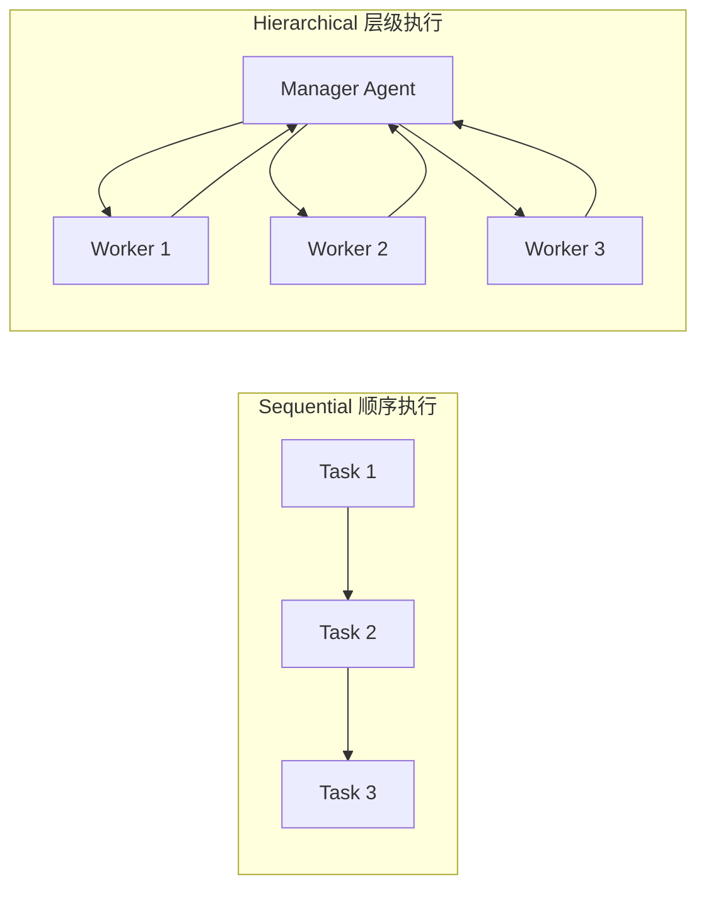
```mermaid
graph LR
    subgraph "Sequential 顺序执行"
        S1[Task 1] --> S2[Task 2] --> S3[Task 3]
    end

    subgraph "Hierarchical 层级执行"
        Manager[Manager Agent]
        Manager --> W1[Worker 1]
        Manager --> W2[Worker 2]
        Manager --> W3[Worker 3]
        W1 --> Manager
        W2 --> Manager
        W3 --> Manager
    end
```

**Process 枚举** (`lib/crewai/src/crewai/process.py`):

```python
class Process(str, Enum):
    sequential = "sequential"      # 任务按顺序执行
    hierarchical = "hierarchical"  # 管理者协调执行
```

### 5.2 Crew 执行流程

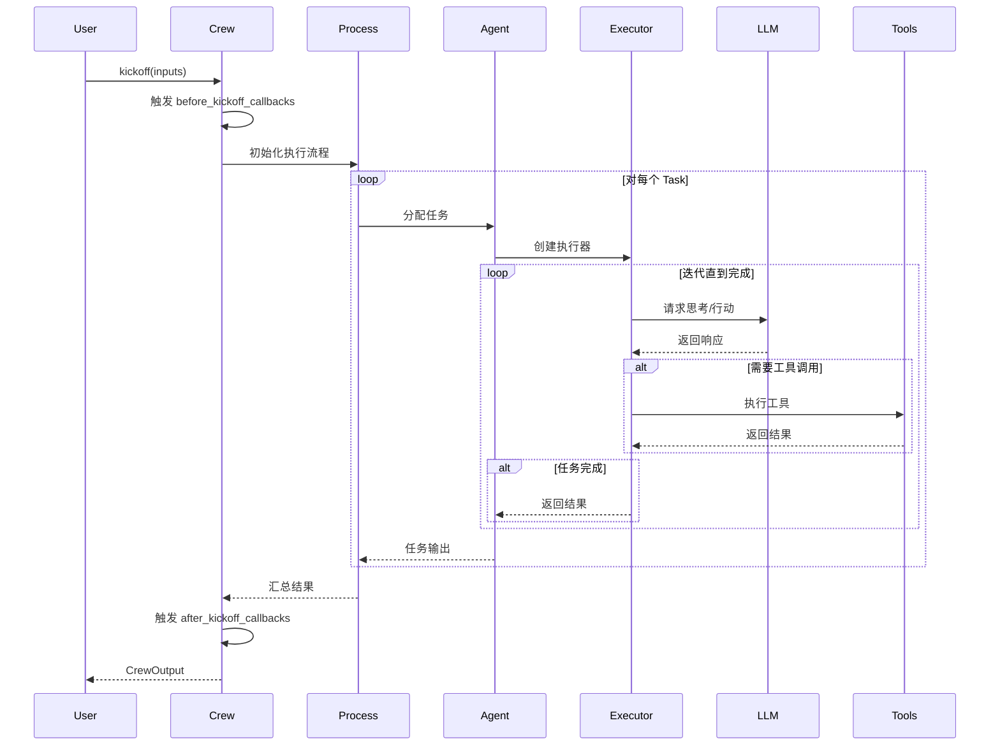
```mermaid
sequenceDiagram
    participant User
    participant Crew
    participant Process
    participant Agent
    participant Executor
    participant LLM
    participant Tools

    User->>Crew: kickoff(inputs)
    Crew->>Crew: 触发 before_kickoff_callbacks
    Crew->>Process: 初始化执行流程

    loop 对每个 Task
        Process->>Agent: 分配任务
        Agent->>Executor: 创建执行器

        loop 迭代直到完成
            Executor->>LLM: 请求思考/行动
            LLM-->>Executor: 返回响应

            alt 需要工具调用
                Executor->>Tools: 执行工具
                Tools-->>Executor: 返回结果
            end

            alt 任务完成
                Executor-->>Agent: 返回结果
            end
        end

        Agent-->>Process: 任务输出
    end

    Process-->>Crew: 汇总结果
    Crew->>Crew: 触发 after_kickoff_callbacks
    Crew-->>User: CrewOutput
```

### 5.3 CrewAgentExecutor 执行循环

**文件位置**: `lib/crewai/src/crewai/agents/crew_agent_executor.py` (717 行)

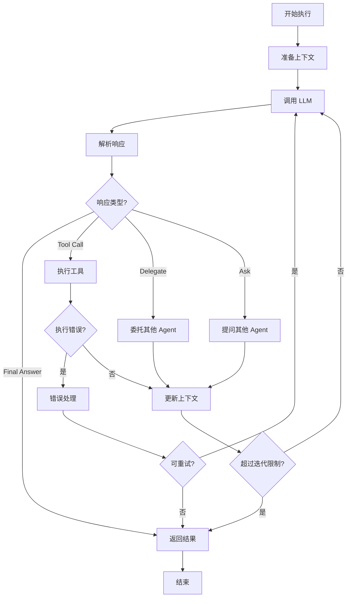
```mermaid
flowchart TB
    Start[开始执行] --> PrepareContext[准备上下文]
    PrepareContext --> CallLLM[调用 LLM]
    CallLLM --> ParseResponse[解析响应]

    ParseResponse --> CheckType{响应类型?}

    CheckType -->|Final Answer| Return[返回结果]
    CheckType -->|Tool Call| ExecuteTool[执行工具]
    CheckType -->|Delegate| Delegate[委托其他 Agent]
    CheckType -->|Ask| AskQuestion[提问其他 Agent]

    ExecuteTool --> CheckError{执行错误?}
    CheckError -->|是| HandleError[错误处理]
    CheckError -->|否| UpdateContext[更新上下文]

    HandleError --> CheckRetry{可重试?}
    CheckRetry -->|是| CallLLM
    CheckRetry -->|否| Return

    UpdateContext --> CheckIterations{超过迭代限制?}
    CheckIterations -->|是| Return
    CheckIterations -->|否| CallLLM

    Delegate --> UpdateContext
    AskQuestion --> UpdateContext

    Return --> End[结束]
```

---

## 6. 工具系统

### 6.1 工具架构

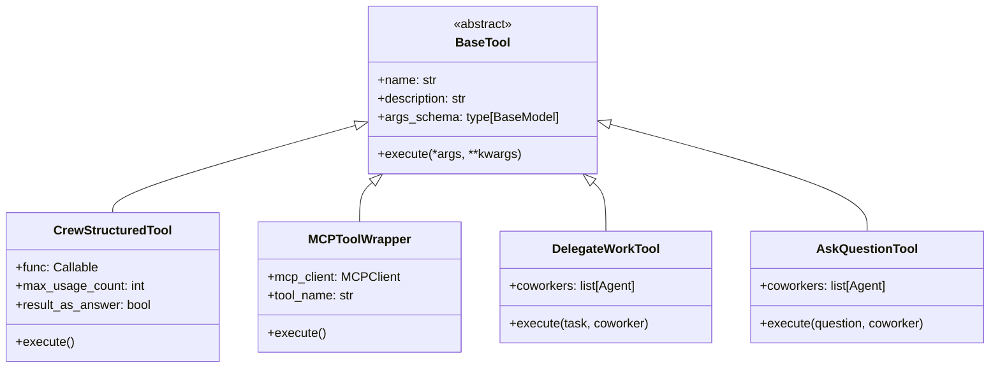
```mermaid
classDiagram
    class BaseTool {
        <<abstract>>
        +name: str
        +description: str
        +args_schema: type[BaseModel]
        +execute(*args, **kwargs)
    }

    class CrewStructuredTool {
        +func: Callable
        +max_usage_count: int
        +result_as_answer: bool
        +execute()
    }

    class MCPToolWrapper {
        +mcp_client: MCPClient
        +tool_name: str
        +execute()
    }

    class DelegateWorkTool {
        +coworkers: list[Agent]
        +execute(task, coworker)
    }

    class AskQuestionTool {
        +coworkers: list[Agent]
        +execute(question, coworker)
    }

    BaseTool <|-- CrewStructuredTool
    BaseTool <|-- MCPToolWrapper
    BaseTool <|-- DelegateWorkTool
    BaseTool <|-- AskQuestionTool
```

### 6.2 工具执行流程

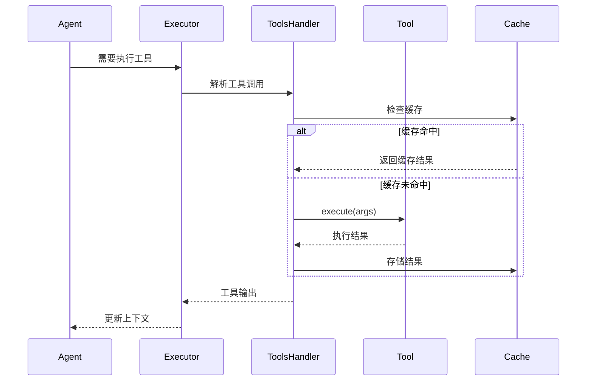
```mermaid
sequenceDiagram
    participant Agent
    participant Executor
    participant ToolsHandler
    participant Tool
    participant Cache

    Agent->>Executor: 需要执行工具
    Executor->>ToolsHandler: 解析工具调用
    ToolsHandler->>Cache: 检查缓存

    alt 缓存命中
        Cache-->>ToolsHandler: 返回缓存结果
    else 缓存未命中
        ToolsHandler->>Tool: execute(args)
        Tool-->>ToolsHandler: 执行结果
        ToolsHandler->>Cache: 存储结果
    end

    ToolsHandler-->>Executor: 工具输出
    Executor-->>Agent: 更新上下文
```

### 6.3 MCP 工具集成

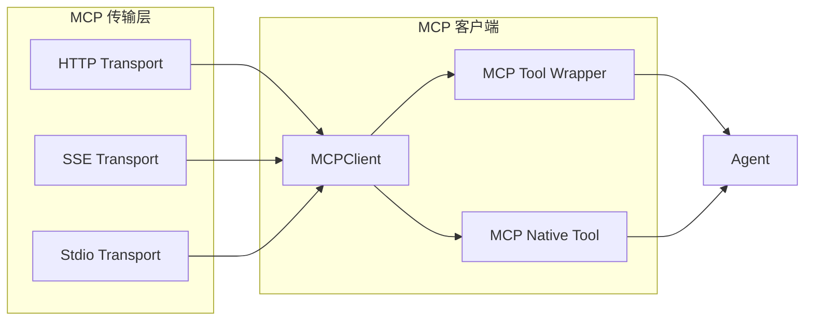
```mermaid
graph LR
    subgraph "MCP 传输层"
        HTTP[HTTP Transport]
        SSE[SSE Transport]
        STDIO[Stdio Transport]
    end

    subgraph "MCP 客户端"
        Client[MCPClient]
        NativeTool[MCP Native Tool]
        Wrapper[MCP Tool Wrapper]
    end

    HTTP --> Client
    SSE --> Client
    STDIO --> Client

    Client --> NativeTool
    Client --> Wrapper

    Wrapper --> Agent[Agent]
    NativeTool --> Agent
```

---

## 7. 记忆系统

### 7.1 记忆类型架构

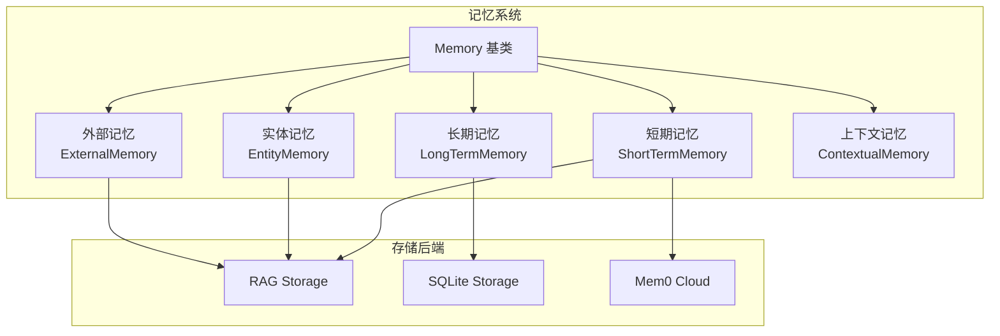
```mermaid
graph TB
    subgraph "记忆系统"
        Memory[Memory 基类]

        Memory --> STM[短期记忆<br/>ShortTermMemory]
        Memory --> LTM[长期记忆<br/>LongTermMemory]
        Memory --> EM[实体记忆<br/>EntityMemory]
        Memory --> ExtM[外部记忆<br/>ExternalMemory]
        Memory --> CM[上下文记忆<br/>ContextualMemory]
    end

    subgraph "存储后端"
        RAGStorage[RAG Storage]
        SQLite[SQLite Storage]
        Mem0[Mem0 Cloud]
    end

    STM --> RAGStorage
    STM --> Mem0
    LTM --> SQLite
    EM --> RAGStorage
    ExtM --> RAGStorage
```

### 7.2 记忆数据流

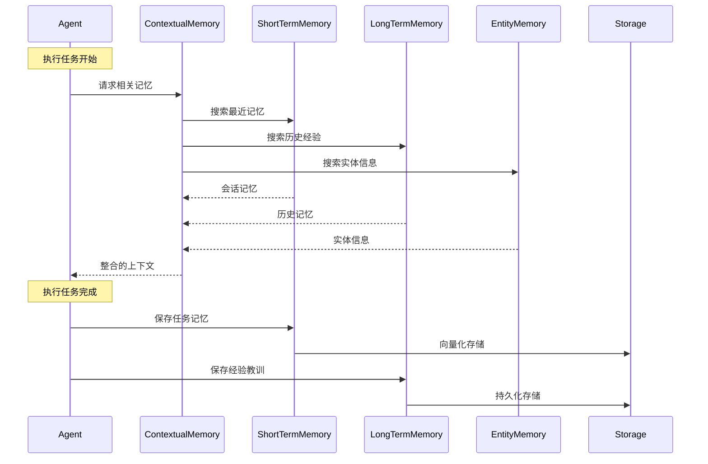
```mermaid
sequenceDiagram
    participant Agent
    participant ContextualMemory
    participant ShortTermMemory
    participant LongTermMemory
    participant EntityMemory
    participant Storage

    Note over Agent: 执行任务开始

    Agent->>ContextualMemory: 请求相关记忆
    ContextualMemory->>ShortTermMemory: 搜索最近记忆
    ContextualMemory->>LongTermMemory: 搜索历史经验
    ContextualMemory->>EntityMemory: 搜索实体信息

    ShortTermMemory-->>ContextualMemory: 会话记忆
    LongTermMemory-->>ContextualMemory: 历史记忆
    EntityMemory-->>ContextualMemory: 实体信息

    ContextualMemory-->>Agent: 整合的上下文

    Note over Agent: 执行任务完成

    Agent->>ShortTermMemory: 保存任务记忆
    ShortTermMemory->>Storage: 向量化存储

    Agent->>LongTermMemory: 保存经验教训
    LongTermMemory->>Storage: 持久化存储
```

### 7.3 记忆项结构

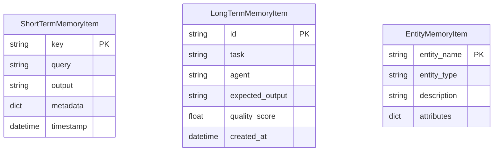
```mermaid
erDiagram
    ShortTermMemoryItem {
        string key PK
        string query
        string output
        dict metadata
        datetime timestamp
    }

    LongTermMemoryItem {
        string id PK
        string task
        string agent
        string expected_output
        float quality_score
        datetime created_at
    }

    EntityMemoryItem {
        string entity_name PK
        string entity_type
        string description
        dict attributes
    }
```

---

## 8. 知识与 RAG 系统

### 8.1 知识系统架构

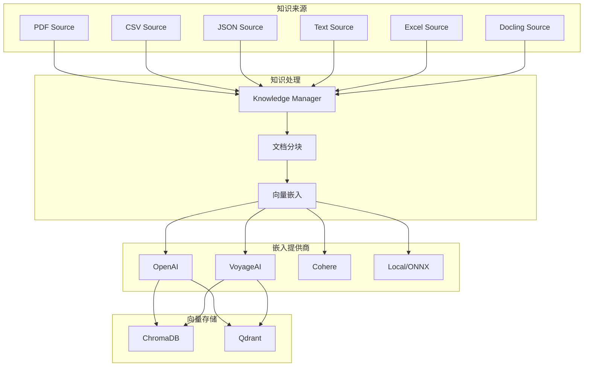
```mermaid
graph TB
    subgraph "知识来源"
        PDF[PDF Source]
        CSV[CSV Source]
        JSON[JSON Source]
        Text[Text Source]
        Excel[Excel Source]
        Docling[Docling Source]
    end

    subgraph "知识处理"
        Knowledge[Knowledge Manager]
        Chunking[文档分块]
        Embedding[向量嵌入]
    end

    subgraph "嵌入提供商"
        OpenAI[OpenAI]
        Voyage[VoyageAI]
        Cohere[Cohere]
        Local[Local/ONNX]
    end

    subgraph "向量存储"
        Chroma[ChromaDB]
        Qdrant[Qdrant]
    end

    PDF --> Knowledge
    CSV --> Knowledge
    JSON --> Knowledge
    Text --> Knowledge
    Excel --> Knowledge
    Docling --> Knowledge

    Knowledge --> Chunking
    Chunking --> Embedding

    Embedding --> OpenAI
    Embedding --> Voyage
    Embedding --> Cohere
    Embedding --> Local

    OpenAI --> Chroma
    OpenAI --> Qdrant
    Voyage --> Chroma
    Voyage --> Qdrant
```

### 8.2 RAG 检索流程

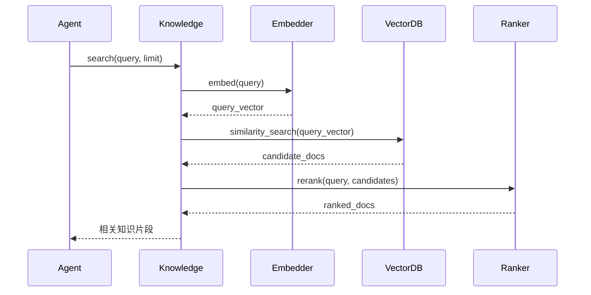
```mermaid
sequenceDiagram
    participant Agent
    participant Knowledge
    participant Embedder
    participant VectorDB
    participant Ranker

    Agent->>Knowledge: search(query, limit)
    Knowledge->>Embedder: embed(query)
    Embedder-->>Knowledge: query_vector

    Knowledge->>VectorDB: similarity_search(query_vector)
    VectorDB-->>Knowledge: candidate_docs

    Knowledge->>Ranker: rerank(query, candidates)
    Ranker-->>Knowledge: ranked_docs

    Knowledge-->>Agent: 相关知识片段
```

### 8.3 支持的嵌入提供商

| 提供商 | 位置 | 特点 |
|--------|------|------|
| OpenAI | `rag/embeddings/providers/openai/` | text-embedding-3-small/large |
| VoyageAI | `rag/embeddings/providers/voyageai/` | 高质量检索嵌入 |
| Cohere | `rag/embeddings/providers/cohere/` | 多语言支持 |
| Sentence Transformer | `rag/embeddings/providers/sentence_transformer/` | 本地运行 |
| ONNX | `rag/embeddings/providers/onnx/` | 本地高性能 |
| Google | `rag/embeddings/providers/google/` | Vertex AI/Generative AI |

---

## 9. LLM 集成层

### 9.1 LLM 适配架构

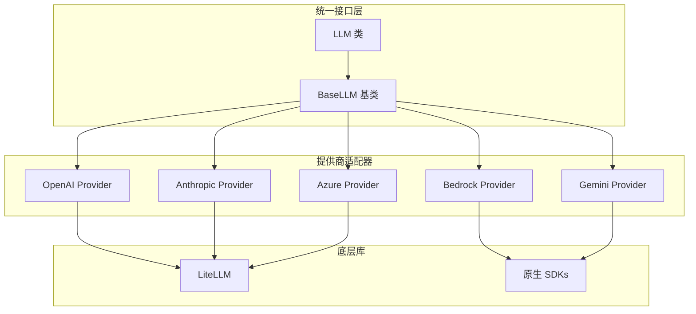
```mermaid
graph TB
    subgraph "统一接口层"
        LLM[LLM 类]
        BaseLLM[BaseLLM 基类]
    end

    subgraph "提供商适配器"
        OpenAI[OpenAI Provider]
        Anthropic[Anthropic Provider]
        Azure[Azure Provider]
        Bedrock[Bedrock Provider]
        Gemini[Gemini Provider]
    end

    subgraph "底层库"
        LiteLLM[LiteLLM]
        SDKs[原生 SDKs]
    end

    LLM --> BaseLLM
    BaseLLM --> OpenAI
    BaseLLM --> Anthropic
    BaseLLM --> Azure
    BaseLLM --> Bedrock
    BaseLLM --> Gemini

    OpenAI --> LiteLLM
    Anthropic --> LiteLLM
    Azure --> LiteLLM
    Bedrock --> SDKs
    Gemini --> SDKs
```

### 9.2 LLM 调用流程

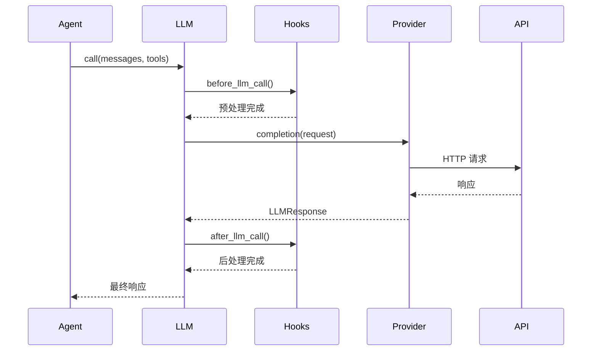
```mermaid
sequenceDiagram
    participant Agent
    participant LLM
    participant Hooks
    participant Provider
    participant API

    Agent->>LLM: call(messages, tools)
    LLM->>Hooks: before_llm_call()
    Hooks-->>LLM: 预处理完成

    LLM->>Provider: completion(request)
    Provider->>API: HTTP 请求
    API-->>Provider: 响应
    Provider-->>LLM: LLMResponse

    LLM->>Hooks: after_llm_call()
    Hooks-->>LLM: 后处理完成

    LLM-->>Agent: 最终响应
```

### 9.3 支持的模型

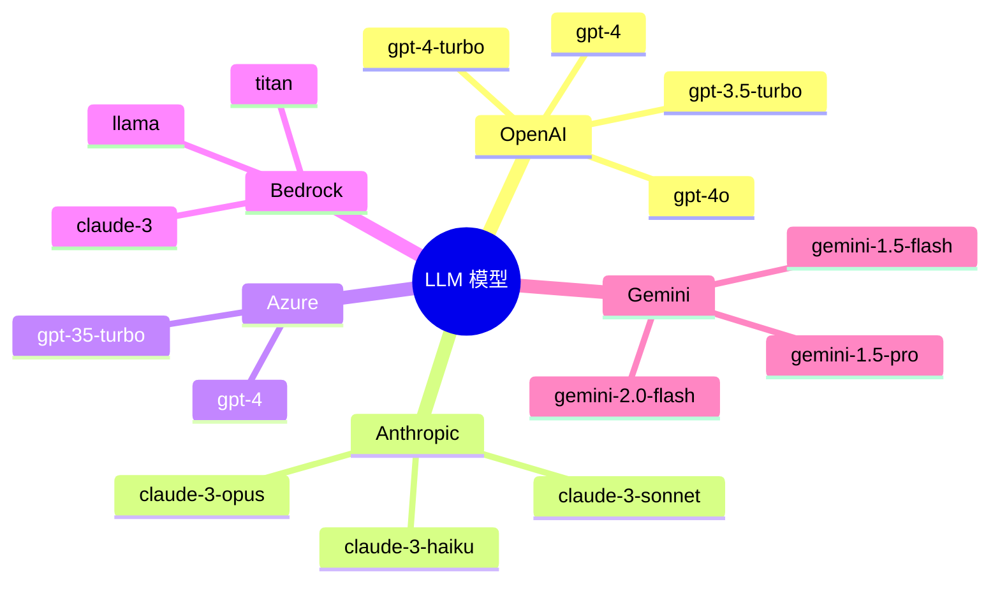
```mermaid
mindmap
  root((LLM 模型))
    OpenAI
      gpt-4o
      gpt-4-turbo
      gpt-4
      gpt-3.5-turbo
    Anthropic
      claude-3-opus
      claude-3-sonnet
      claude-3-haiku
    Azure
      gpt-4
      gpt-35-turbo
    Bedrock
      claude-3
      titan
      llama
    Gemini
      gemini-2.0-flash
      gemini-1.5-pro
      gemini-1.5-flash
```

---

## 10. 事件系统

### 10.1 事件架构

```mermaid
graph TB
    subgraph "事件发送者"
        Crew[Crew]
        Agent[Agent]
        Task[Task]
        LLM[LLM]
        Tool[Tool]
        Memory[Memory]
    end

    subgraph "事件总线"
        EventBus[CrewAI Event Bus]
    end

    subgraph "事件监听器"
        Trace[Trace Collector]
        Logger[Logger]
        Custom[Custom Listeners]
    end

    subgraph "事件类型"
        CrewEvents[Crew Events]
        AgentEvents[Agent Events]
        TaskEvents[Task Events]
        LLMEvents[LLM Events]
        ToolEvents[Tool Events]
    end

    Crew --> EventBus
    Agent --> EventBus
    Task --> EventBus
    LLM --> EventBus
    Tool --> EventBus
    Memory --> EventBus

    EventBus --> CrewEvents
    EventBus --> AgentEvents
    EventBus --> TaskEvents
    EventBus --> LLMEvents
    EventBus --> ToolEvents

    EventBus --> Trace
    EventBus --> Logger
    EventBus --> Custom
```

### 10.2 事件类型详解

| 事件类别 | 事件 | 触发时机 |
|---------|------|---------|
| **Crew 事件** | CrewKickoffStarted | Crew 开始执行 |
| | CrewKickoffCompleted | Crew 执行完成 |
| **Agent 事件** | AgentAction | Agent 执行动作 |
| | AgentThinking | Agent 思考中 |
| | AgentFinished | Agent 完成任务 |
| **Task 事件** | TaskStarted | 任务开始 |
| | TaskCompleted | 任务完成 |
| | TaskFailed | 任务失败 |
| **LLM 事件** | LLMCallStarted | LLM 调用开始 |
| | LLMStreamChunk | 流式响应片段 |
| | LLMCallCompleted | LLM 调用完成 |
| **Tool 事件** | ToolUsageStarted | 工具使用开始 |
| | ToolUsageFinished | 工具使用完成 |
| | ToolUsageError | 工具使用错误 |

### 10.3 事件流示例

```mermaid
sequenceDiagram
    participant Crew
    participant EventBus
    participant TraceCollector
    participant Logger

    Crew->>EventBus: emit(CrewKickoffStarted)
    EventBus->>TraceCollector: handle(event)
    EventBus->>Logger: handle(event)

    Note over Crew: 执行任务...

    Crew->>EventBus: emit(TaskStarted)
    Crew->>EventBus: emit(LLMCallStarted)
    Crew->>EventBus: emit(ToolUsageStarted)
    Crew->>EventBus: emit(ToolUsageFinished)
    Crew->>EventBus: emit(LLMCallCompleted)
    Crew->>EventBus: emit(TaskCompleted)

    Crew->>EventBus: emit(CrewKickoffCompleted)
```

---

## 11. Flow 事件驱动框架

### 11.1 Flow 概述

Flow 是 CrewAI 提供的另一种执行范式，适用于需要精细控制的复杂工作流。

```mermaid
graph TB
    subgraph "Flow 框架"
        Flow[Flow 类]
        FlowState[FlowState]

        subgraph "装饰器"
            Start[@start]
            Listen[@listen]
            Router[@router]
            And[@and_]
            Or[@or_]
        end

        subgraph "执行控制"
            AsyncFeedback[异步反馈]
            Persistence[持久化]
            Visualization[可视化]
        end
    end

    Flow --> FlowState
    Flow --> Start
    Flow --> Listen
    Flow --> Router

    Flow --> AsyncFeedback
    Flow --> Persistence
    Flow --> Visualization
```

### 11.2 Flow 执行模型

```mermaid
stateDiagram-v2
    [*] --> Start: @start
    Start --> Step1: @listen(start)
    Step1 --> Router: @router

    state Router {
        [*] --> Condition
        Condition --> PathA: condition_a
        Condition --> PathB: condition_b
    }

    PathA --> Step2: @listen(path_a)
    PathB --> Step3: @listen(path_b)

    Step2 --> End: @listen(step2)
    Step3 --> End: @listen(step3)
    End --> [*]
```

### 11.3 Flow vs Crew 对比

| 特性 | Crew | Flow |
|------|------|------|
| 执行模式 | 自主/层级 | 显式定义 |
| 控制粒度 | 任务级 | 步骤级 |
| 状态管理 | 隐式 | 显式 FlowState |
| 分支逻辑 | 有限 | 完全支持 |
| 适用场景 | 标准 Agent 协作 | 复杂工作流 |

---

## 12. 安全与可观测性

### 12.1 安全架构

```mermaid
graph TB
    subgraph "安全模块"
        SecurityConfig[SecurityConfig]
        Fingerprint[Fingerprint]
        Auth[Authentication]
    end

    subgraph "安全特性"
        InputValidation[输入验证]
        OutputGuardrail[输出防护栏]
        RateLimit[速率限制]
        Sandboxing[沙箱执行]
    end

    SecurityConfig --> InputValidation
    SecurityConfig --> OutputGuardrail
    SecurityConfig --> RateLimit

    Fingerprint --> Auth

    subgraph "代码执行安全"
        DockerSandbox[Docker 沙箱]
        SafeMode[安全模式]
    end

    Sandboxing --> DockerSandbox
    Sandboxing --> SafeMode
```

### 12.2 可观测性

```mermaid
graph LR
    subgraph "遥测系统"
        Telemetry[Telemetry 收集器]
    end

    subgraph "OpenTelemetry"
        Traces[分布式追踪]
        Metrics[指标收集]
        Logs[日志聚合]
    end

    subgraph "输出"
        Console[控制台]
        File[日志文件]
        External[外部系统]
    end

    Telemetry --> Traces
    Telemetry --> Metrics
    Telemetry --> Logs

    Traces --> External
    Metrics --> External
    Logs --> File
    Logs --> Console
```

### 12.3 防护栏系统

```mermaid
flowchart TB
    TaskOutput[任务输出] --> Guardrail{防护栏检查}

    Guardrail -->|通过| Accept[接受输出]
    Guardrail -->|失败| Retry{重试?}

    Retry -->|是| ReExecute[重新执行]
    Retry -->|否| Reject[拒绝输出]

    ReExecute --> TaskOutput

    subgraph "防护栏类型"
        LLMGuardrail[LLM 防护栏]
        CustomGuardrail[自定义函数]
        SchemaValidation[Schema 验证]
    end

    Guardrail --- LLMGuardrail
    Guardrail --- CustomGuardrail
    Guardrail --- SchemaValidation
```

---

## 13. 设计模式与最佳实践

### 13.1 使用的设计模式

```mermaid
mindmap
  root((设计模式))
    创建型
      工厂模式
        AgentBuilder
        ToolFactory
      单例模式
        EventBus
        TelemetryCollector
    结构型
      适配器模式
        LLM Providers
        Agent Adapters
      装饰器模式
        Flow Decorators
        Hook Decorators
      组合模式
        Crew-Agent-Task
    行为型
      策略模式
        Process Types
        Embedding Providers
      观察者模式
        Event System
      命令模式
        Tool Execution
      状态模式
        Task Lifecycle
```

### 13.2 关键设计决策

| 决策 | 说明 | 优势 |
|------|------|------|
| **独立于 LangChain** | 完全自主实现 | 更好的控制和优化 |
| **Pydantic 数据模型** | 全面使用 Pydantic | 类型安全和验证 |
| **事件驱动架构** | 解耦组件通信 | 可扩展性和可观测性 |
| **插件式 LLM** | 抽象 LLM 接口 | 多提供商支持 |
| **分层记忆** | 多类型记忆系统 | 灵活的上下文管理 |

### 13.3 扩展点

```mermaid
graph TB
    subgraph "扩展接口"
        BaseTool[BaseTool 接口]
        BaseLLM[BaseLLM 接口]
        BaseAgent[BaseAgent 接口]
        BaseKnowledge[BaseKnowledgeSource 接口]
        BaseEmbedder[BaseEmbedder 接口]
    end

    subgraph "钩子系统"
        LLMHooks[LLM 钩子]
        ToolHooks[工具钩子]
        FlowHooks[Flow 钩子]
    end

    subgraph "事件系统"
        CustomListeners[自定义监听器]
        CustomEvents[自定义事件]
    end

    BaseTool --> 自定义工具
    BaseLLM --> 自定义LLM提供商
    BaseAgent --> 自定义Agent类型
    BaseKnowledge --> 自定义知识源
    BaseEmbedder --> 自定义嵌入器

    LLMHooks --> 调用拦截
    ToolHooks --> 工具拦截

    CustomListeners --> 自定义处理
```

---

## 14. 总结

### 14.1 架构优势

1. **完全独立** - 不依赖外部 Agent 框架，从零设计
2. **企业级** - 完整的安全、审计、可观测性支持
3. **高度灵活** - 支持 Crew（自主）和 Flow（精细控制）两种范式
4. **多模式执行** - 顺序、层级、自定义流程支持
5. **智能化** - 内置推理、规划、多类型记忆系统
6. **广泛集成** - 支持主流 LLM 提供商和向量数据库

### 14.2 核心文件参考

| 模块 | 关键文件 | 行数 |
|------|---------|------|
| Agent | `agent/core.py` | 1,655 |
| Task | `task.py` | 1,156 |
| Crew | `crew.py` | 1,920 |
| Executor | `agents/crew_agent_executor.py` | 717 |
| LLM | `llm.py` | 86,243 |
| Process | `process.py` | ~50 |

### 14.3 学习路径建议

```mermaid
graph LR
    A[了解基本概念] --> B[Agent + Task + Crew]
    B --> C[工具系统]
    C --> D[记忆系统]
    D --> E[知识/RAG]
    E --> F[Flow 框架]
    F --> G[高级特性]
    G --> H[生产部署]
```

### 14.4 快速开始示例

```python
from crewai import Agent, Task, Crew, Process

# 创建 Agent
researcher = Agent(
    role="研究员",
    goal="收集和分析信息",
    backstory="你是一位经验丰富的研究员",
    llm="gpt-4o"
)

writer = Agent(
    role="作家",
    goal="撰写高质量内容",
    backstory="你是一位专业作家",
    llm="gpt-4o"
)

# 创建 Task
research_task = Task(
    description="研究 AI 最新进展",
    expected_output="详细的研究报告",
    agent=researcher
)

write_task = Task(
    description="基于研究撰写文章",
    expected_output="一篇完整的文章",
    agent=writer,
    context=[research_task]  # 依赖研究任务
)

# 创建 Crew 并执行
crew = Crew(
    agents=[researcher, writer],
    tasks=[research_task, write_task],
    process=Process.sequential,
    memory=True
)

result = crew.kickoff()
```

---

> 本文档基于 CrewAI v1.7.2 源码分析生成
