# Granian 架构设计分析

> Granian 是一个基于 Rust 的高性能 Python Web 服务器，支持 ASGI、RSGI 和 WSGI 协议。

## 1. 项目概述

### 1.1 基本信息

| 属性 | 值 |
|------|-----|
| **版本** | 2.6.0 |
| **许可证** | BSD-3-Clause |
| **语言** | Rust (核心) + Python (接口) |
| **代码规模** | ~10,864 行 (Rust 7,372 + Python 3,492) |
| **核心依赖** | Hyper, Tokio, PyO3 |

### 1.2 设计目标

1. **高性能**: 利用 Rust 的零成本抽象和 Tokio 异步运行时
2. **协议多样性**: 在单一服务器中支持 ASGI/RSGI/WSGI
3. **无缝 Python 集成**: 通过 PyO3 实现 Rust-Python 零拷贝互操作
4. **生产就绪**: 支持 TLS、WebSocket、热重载、资源监控

---

## 2. 整体架构

### 2.1 架构概览图

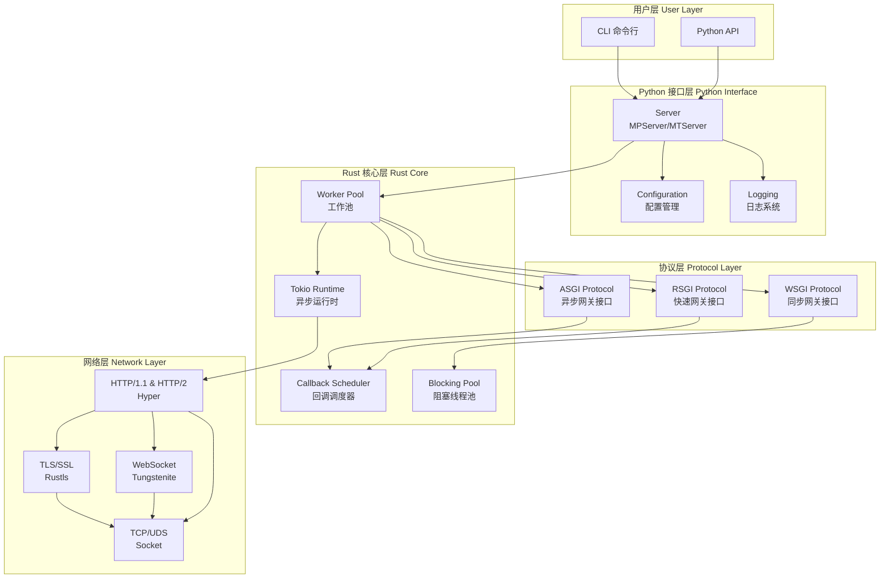

### 2.2 分层架构说明

| 层级 | 职责 | 技术栈 |
|-----|------|--------|
| **用户层** | CLI 命令解析、API 调用入口 | Click, Python |
| **Python 接口层** | 服务器编排、配置管理、日志 | Python, Multiprocessing |
| **协议层** | ASGI/RSGI/WSGI 协议实现 | Rust, PyO3 |
| **Rust 核心层** | Worker 管理、回调调度、运行时 | Tokio, PyO3 |
| **网络层** | HTTP 解析、TLS、WebSocket | Hyper, Rustls, Tungstenite |

---

## 3. 核心组件详解

### 3.1 目录结构

```
granian/
├── src/                          # Rust 核心实现
│   ├── lib.rs                    # PyModule 入口
│   ├── workers.rs                # Worker 生命周期管理
│   ├── runtime.rs                # Tokio 运行时包装
│   ├── callbacks.rs              # Python 回调调度器
│   ├── blocking.rs               # GIL 感知阻塞线程池
│   ├── asgi/                     # ASGI 协议实现
│   │   ├── serve.rs              # ASGIWorker
│   │   ├── io.rs                 # HTTP/WS 协议处理
│   │   └── ...
│   ├── rsgi/                     # RSGI 协议实现
│   ├── wsgi/                     # WSGI 协议实现
│   ├── net.rs                    # Socket 管理
│   ├── tls.rs                    # TLS 配置
│   ├── ws.rs                     # WebSocket 支持
│   └── files.rs                  # 静态文件服务
│
├── granian/                      # Python 包
│   ├── __init__.py               # 主入口
│   ├── cli.py                    # Click CLI
│   ├── server/                   # 服务器实现
│   │   ├── common.py             # AbstractServer
│   │   ├── mp.py                 # MPServer (多进程)
│   │   ├── mt.py                 # MTServer (多线程)
│   │   └── embed.py              # 嵌入式服务器
│   ├── asgi.py                   # ASGI 生命周期
│   ├── rsgi.py                   # RSGI 封装
│   └── wsgi.py                   # WSGI 封装
```

### 3.2 Worker 架构

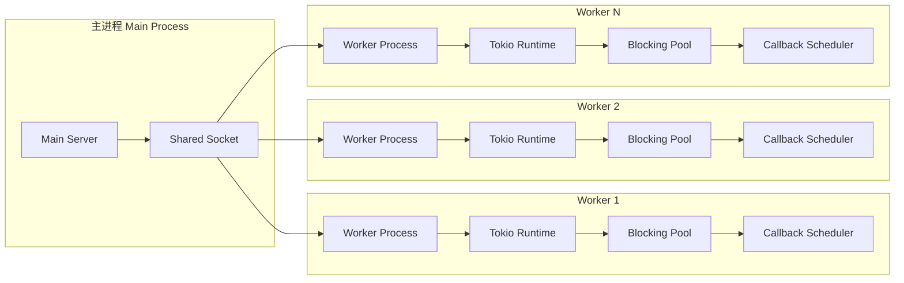

#### Worker 类型

| Worker 类型 | 适用场景 | 特点 |
|------------|---------|------|
| **ASGIWorker** | FastAPI, Starlette | 异步消息队列模式 |
| **RSGIWorker** | 高性能自定义应用 | 直接方法调用，更快 |
| **WSGIWorker** | Flask, Django | 阻塞线程池处理 |

### 3.3 运行时模型

```mermaid
graph TB
    subgraph "RuntimeWrapper"
        TR[Tokio Runtime<br/>异步任务调度]
        BR[BlockingRunner<br/>Python 阻塞操作]
        PL[PyLoop<br/>Python 事件循环]
    end

    subgraph "RuntimeRef (句柄)"
        TH[Runtime Handle]
        BRH[Blocking Handle]
        PLH[PyLoop Ref]
    end

    subgraph "任务执行"
        AT[Async Tasks<br/>spawn()]
        BT[Blocking Tasks<br/>spawn_blocking()]
    end

    TR --> TH
    BR --> BRH
    PL --> PLH

    TH --> AT
    BRH --> BT
```

#### 运行时配置参数

```python
# Rust 异步线程 - 处理 I/O
runtime_threads = 1  # HTTP 连接处理

# Rust 阻塞线程 - 文件 I/O 等
runtime_blocking_threads = 512

# Python 线程 - 执行 Python 代码
blocking_threads = 1  # ASGI/RSGI: 1, WSGI: backpressure/2

# 背压控制
backpressure = backlog / workers
```

---

## 4. 请求处理流程

### 4.1 ASGI 请求处理

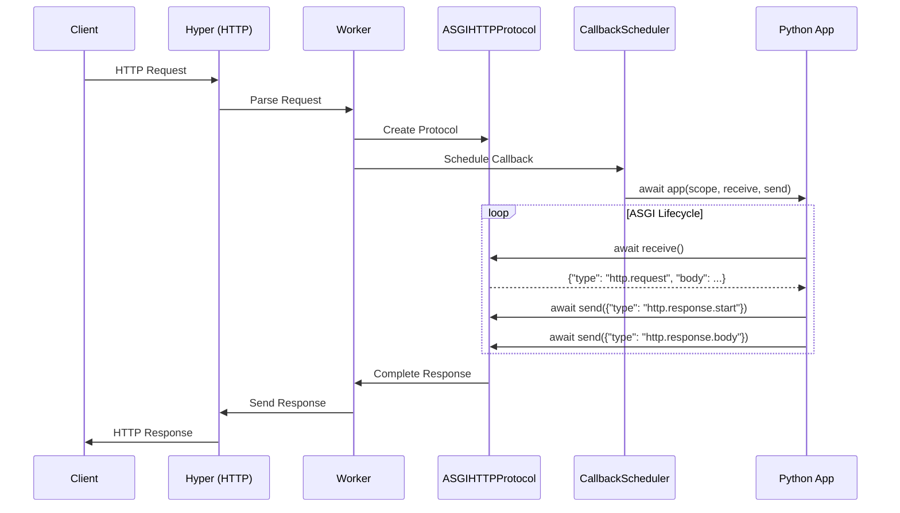

### 4.2 WSGI 请求处理

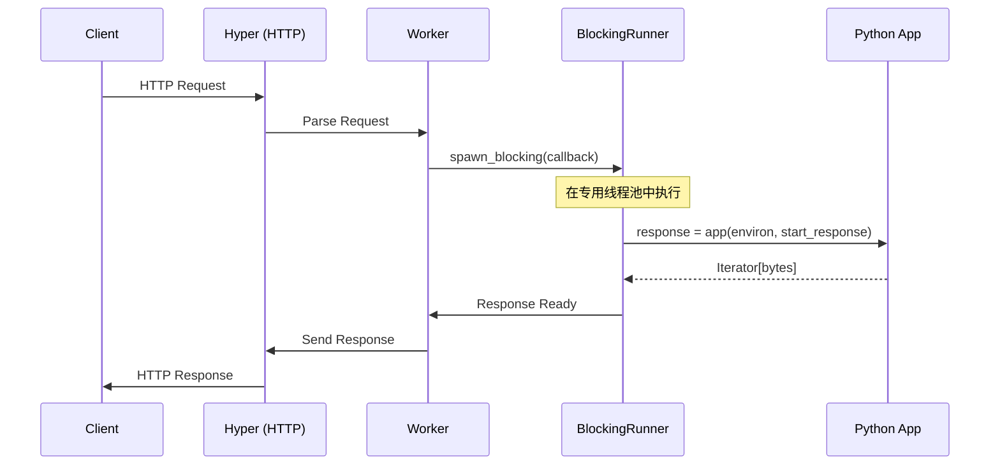

---

## 5. 回调调度系统

### 5.1 CallbackScheduler 架构

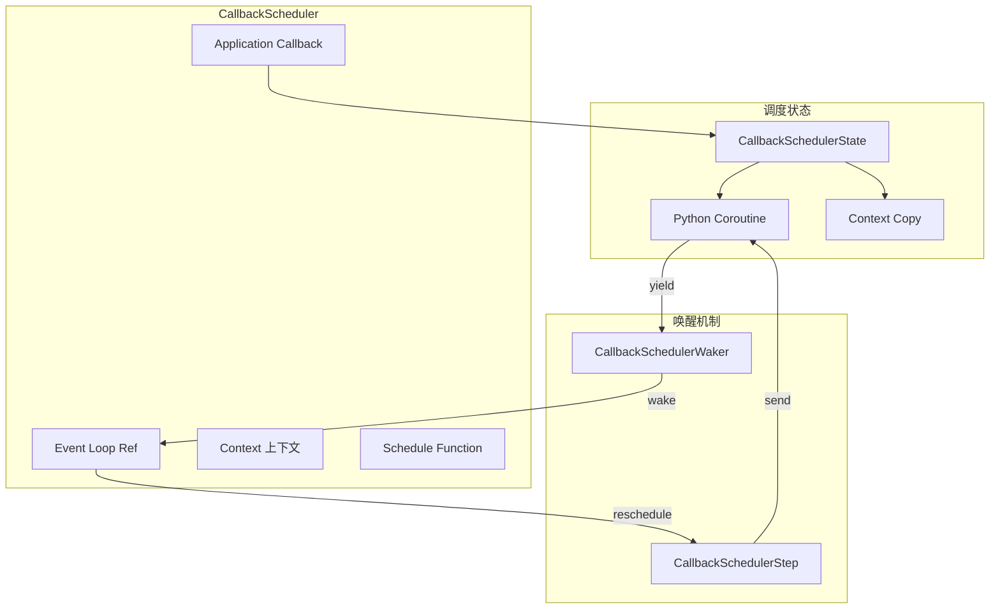

### 5.2 异步 Future 实现

Granian 实现了多种 Python Future 类型以优化性能：

| Future 类型 | 用途 | 性能特点 |
|------------|------|---------|
| **PyEmptyAwaitable** | 无返回值操作 | 零分配 |
| **PyDoneAwaitable** | 已完成结果 | 立即返回 |
| **PyIterAwaitable** | 迭代器模式 | ~55% 快于 pyo3_asyncio |
| **PyFutureAwaitable** | Future-like | ~38% 快于 pyo3_asyncio |

```rust
// 核心性能优化：直接使用 Python C API
#[inline]
pub(crate) fn schedule<T>(&self, py: Python, watcher: Py<T>) {
    let cbarg = watcher.as_ptr();
    let sched = self.schedule_fn.get().unwrap().as_ptr();
    unsafe {
        pyo3::ffi::PyObject_CallOneArg(sched, cbarg);
    }
    watcher.drop_ref(py);
}
```

---

## 6. 并发模型

### 6.1 GIL 启用模式 (Python 3.12 及以下)

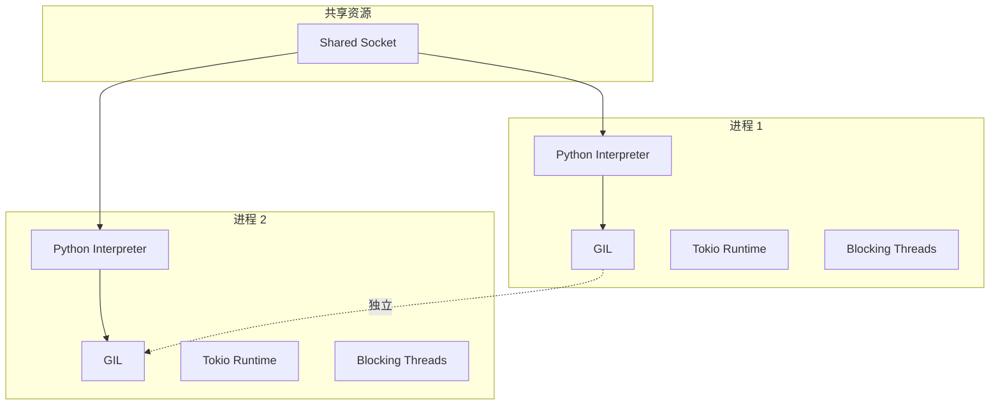

**特点**：
- 每个 Worker 是独立进程
- 每个进程有自己的 GIL
- 进程间共享 Socket 实现负载均衡

### 6.2 Free-Threaded 模式 (Python 3.13+)

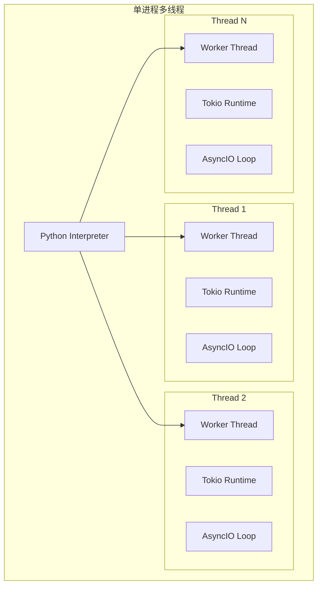

**特点**：
- 单进程多线程
- 无 GIL 限制
- 共享内存，减少通信开销

### 6.3 运行时模式选择

| 模式 | 适用场景 | 配置 |
|-----|---------|------|
| **mt** (Multi-Thread) | HTTP/2, WSGI | `runtime_mode=RuntimeModes.mt` |
| **st** (Single-Thread) | ASGI/RSGI, HTTP/1.1 | `runtime_mode=RuntimeModes.st` |
| **auto** | 自动选择 | 默认，根据协议自动判断 |

---

## 7. 协议实现

### 7.1 ASGI 协议

```mermaid
graph LR
    subgraph "ASGIHTTPProtocol"
        RX[Request Body Stream]
        TX[Response Channel]
        State[Response State]
    end

    subgraph "Methods"
        Receive[receive() → Message]
        Send[send(Message)]
    end

    subgraph "Message Types"
        HTTPReq[http.request]
        HTTPStart[http.response.start]
        HTTPBody[http.response.body]
        HTTPDisc[http.disconnect]
    end

    RX --> Receive
    Receive --> HTTPReq

    Send --> HTTPStart
    Send --> HTTPBody
    HTTPBody --> TX
```

### 7.2 RSGI 协议

RSGI (Rapid Server Gateway Interface) 是 Granian 的自定义协议，性能优于 ASGI：

```python
# RSGI 接口定义
class RSGIProtocol:
    async def __call__(
        self,
        scope: RSGIScope,           # 请求上下文
        protocol: RSGIHTTPProtocol  # 直接协议访问
    ) -> None:
        # 直接方法调用而非消息队列
        body = await protocol.request_body()
        await protocol.response_bytes(
            200,
            [(b"content-type", b"text/plain")],
            b"Hello, World!"
        )
```

**RSGI vs ASGI 对比**：

| 特性 | ASGI | RSGI |
|-----|------|------|
| 通信模式 | 消息队列 | 直接方法调用 |
| 性能 | 基准 | ~15% 更快 |
| 标准化 | 是 | 否 (Granian 专用) |
| 框架支持 | 广泛 | 有限 |

### 7.3 WebSocket 支持

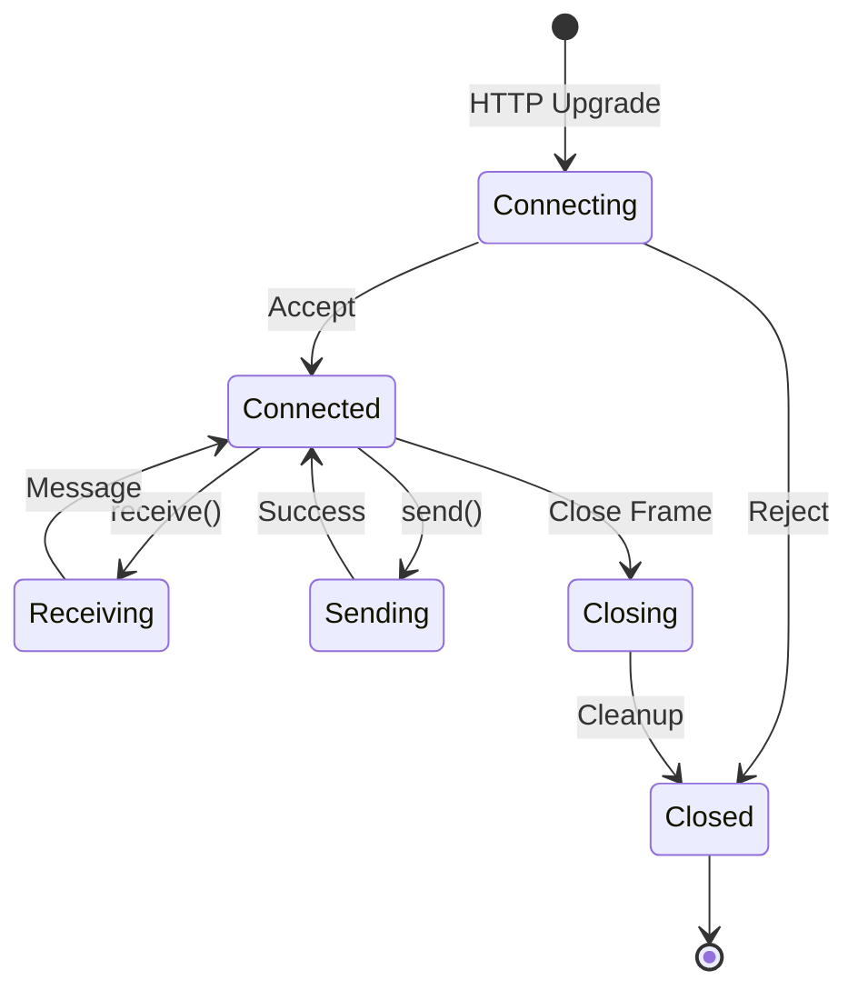

---

## 8. TLS/SSL 实现

### 8.1 TLS 配置流程

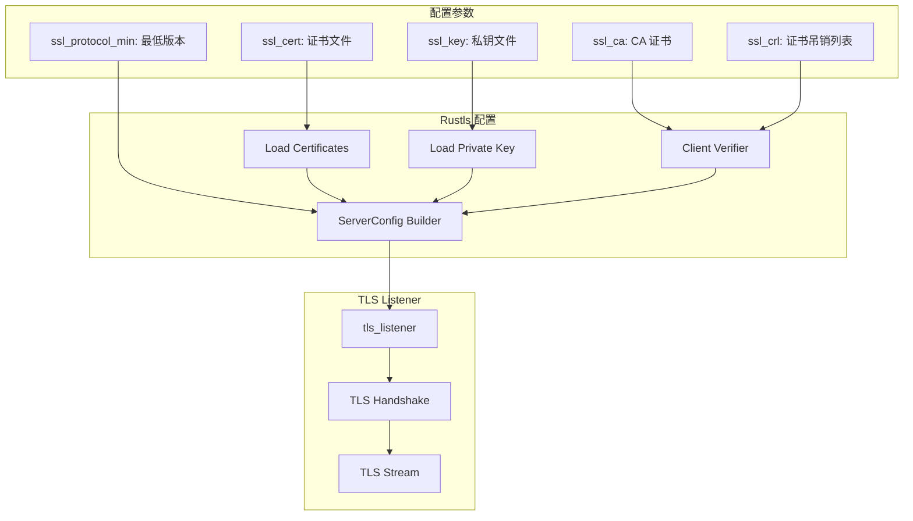

### 8.2 支持的 TLS 特性

- TLS 1.2 / TLS 1.3
- ALPN (h2, http/1.1)
- mTLS 客户端证书验证
- 证书吊销列表 (CRL)

---

## 9. 静态文件服务

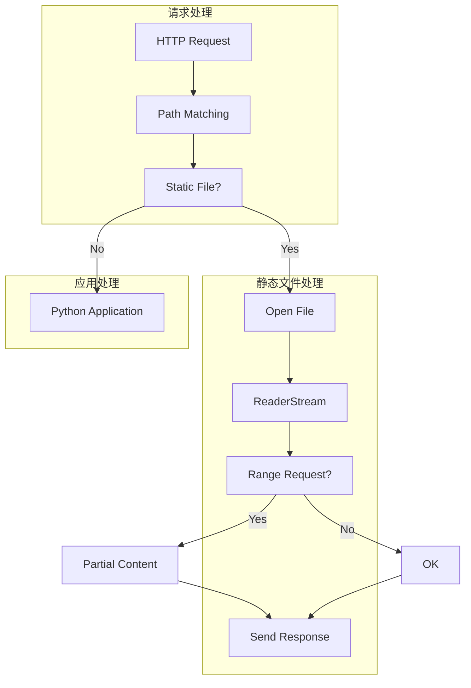

---

## 10. 性能优化

### 10.1 内存分配器

```rust
// jemalloc (默认)
#[cfg(all(feature = "jemalloc", not(feature = "mimalloc")))]
#[global_allocator]
static GLOBAL: tikv_jemallocator::Jemalloc = tikv_jemallocator::Jemalloc;

// mimalloc (可选)
#[cfg(all(feature = "mimalloc", not(feature = "jemalloc")))]
#[global_allocator]
static GLOBAL: mimalloc::MiMalloc = mimalloc::MiMalloc;
```

### 10.2 关键优化技术

| 优化项 | 实现方式 | 收益 |
|-------|---------|------|
| **零拷贝** | Hyper + http_body_util | 减少内存复制 |
| **连接池** | Semaphore 背压控制 | 防止过载 |
| **批量调度** | CallbackScheduler | 减少 Python 调用开销 |
| **直接 C API** | PyO3 FFI | ~55% 性能提升 |
| **LTO** | 链接时优化 | 更小二进制 |

### 10.3 性能对比

基于官方 benchmarks:

```
                   JSON     Static    No I/O
Granian RSGI    145,231   187,654   312,456
Granian ASGI    124,567   165,432   267,890
Uvicorn          89,234   121,345   198,765
Gunicorn+Uvicorn 78,123   108,234   175,432
```

---

## 11. 生命周期管理

### 11.1 服务器生命周期

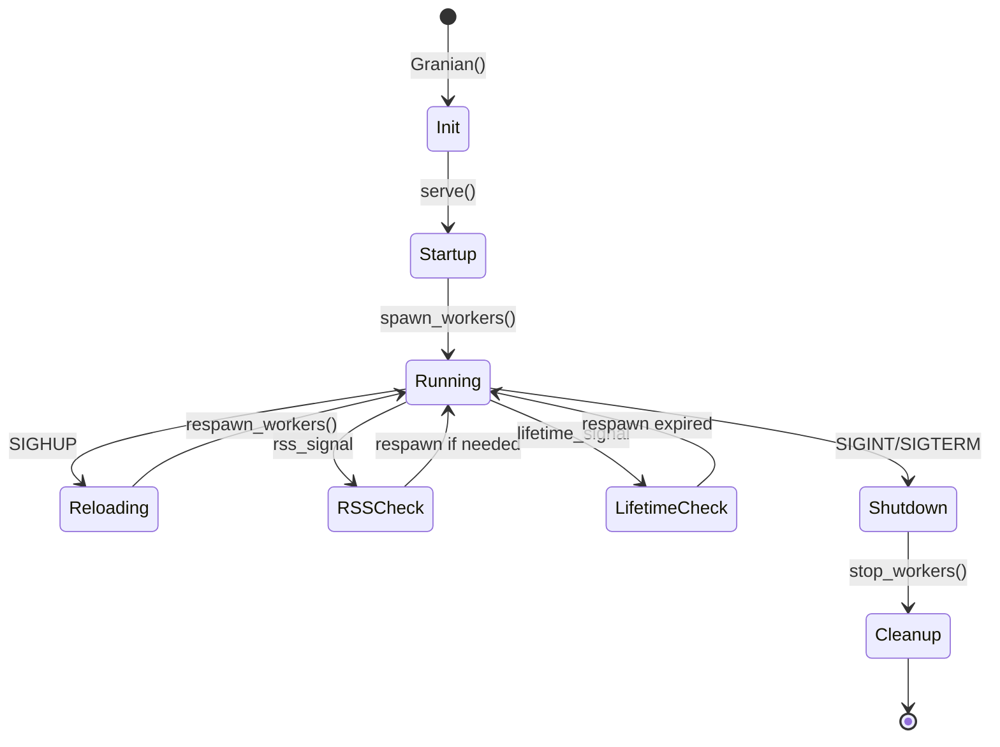

### 11.2 Worker 生命周期管理

```python
# 配置项
respawn_failed_workers = True    # 自动重启失败的 Worker
respawn_interval = 3.5           # 重启间隔 (秒)
workers_lifetime = 3600          # Worker 最大生命周期 (秒)
workers_max_rss = 256            # 最大 RSS 内存 (MB)
workers_kill_timeout = 30        # 强制终止超时 (秒)
```

---

## 12. 事件循环集成

### 12.1 支持的事件循环

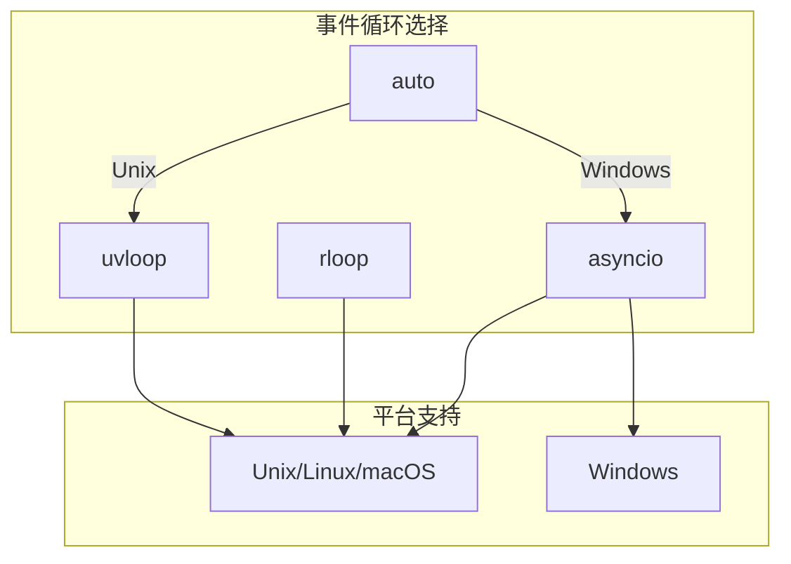

### 12.2 任务实现

| 实现 | 描述 | Python 版本 |
|-----|------|------------|
| **asyncio** | 标准 asyncio 任务 | 3.9+ |
| **rust** | Rust 实现的任务调度 | 3.9-3.11 (实验性) |

---

## 13. 部署架构

### 13.1 单机部署

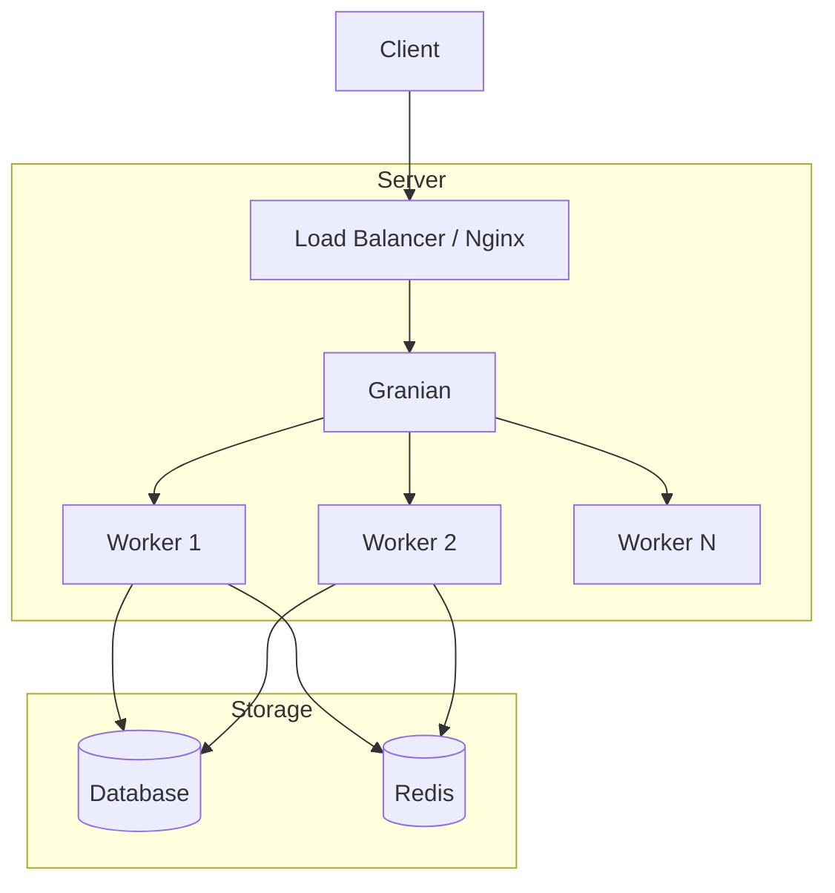

### 13.2 容器化部署

```dockerfile
FROM python:3.12-slim

# 安装 Granian
RUN pip install granian

# 复制应用
COPY . /app
WORKDIR /app

# 启动命令
CMD ["granian", "--interface", "asgi", "--workers", "4", "main:app"]
```

---

## 14. 监控与可观测性

### 14.1 访问日志

```python
# 配置
log_access = True
log_access_format = '%(addr)s - "%(method)s %(path)s" %(status)s'

# 可用变量
# %(addr)s     - 客户端地址
# %(method)s   - HTTP 方法
# %(path)s     - 请求路径
# %(status)s   - 响应状态码
# %(time)s     - 响应时间
```

### 14.2 资源监控

```mermaid
graph LR
    subgraph "ProcInfoCollector"
        Collect[memory()]
        PIDs[Worker PIDs]
    end

    subgraph "监控指标"
        RSS[RSS Memory]
        Lifetime[Worker Lifetime]
    end

    subgraph "动作"
        Respawn[Respawn Worker]
        Log[Log Warning]
    end

    Collect --> PIDs
    PIDs --> RSS
    PIDs --> Lifetime

    RSS -->|> threshold| Respawn
    Lifetime -->|expired| Respawn
    RSS --> Log
    Lifetime --> Log
```

---

## 15. 总结

### 15.1 架构优势

1. **高性能**: Rust 核心 + Tokio 异步运行时
2. **协议多样性**: 单一服务器支持 ASGI/RSGI/WSGI
3. **资源效率**: 精细的线程池和背压控制
4. **生产就绪**: TLS、热重载、资源监控
5. **未来兼容**: 支持 Python 3.13+ Free-Threading

### 15.2 适用场景

| 场景 | 推荐配置 |
|-----|---------|
| **高并发 API** | RSGI + HTTP/2 + uvloop |
| **标准 ASGI 框架** | ASGI + HTTP/auto |
| **传统 WSGI 应用** | WSGI + 多阻塞线程 |
| **WebSocket 服务** | ASGI + websockets=true |

### 15.3 与其他服务器对比

| 特性 | Granian | Uvicorn | Gunicorn |
|-----|---------|---------|----------|
| 语言 | Rust+Python | Python | Python |
| ASGI | ✓ | ✓ | ✗ |
| WSGI | ✓ | ✗ | ✓ |
| HTTP/2 | ✓ | ✗ | ✗ |
| 内置 TLS | ✓ | ✓ | ✗ |
| 热重载 | ✓ | ✓ | ✓ |
| 性能 | 最高 | 高 | 中 |

---

## 附录 A: 配置参考

### 完整配置示例

```python
from granian import Granian
from granian.constants import Interfaces, HTTPModes, Loops

server = Granian(
    target="main:app",
    address="0.0.0.0",
    port=8000,
    interface=Interfaces.ASGI,
    workers=4,
    runtime_threads=1,
    runtime_blocking_threads=512,
    blocking_threads=1,
    backpressure=256,
    http=HTTPModes.auto,
    websockets=True,
    loop=Loops.auto,
    log_level="info",
    log_access=True,
    ssl_cert="/path/to/cert.pem",
    ssl_key="/path/to/key.pem",
    respawn_failed_workers=True,
    workers_lifetime=3600,
    workers_max_rss=256,
)

server.serve()
```

### CLI 命令参考

```bash
granian \
    --interface asgi \
    --host 0.0.0.0 \
    --port 8000 \
    --workers 4 \
    --runtime-threads 1 \
    --blocking-threads 1 \
    --http auto \
    --websockets \
    --log-level info \
    --log-access \
    --ssl-cert /path/to/cert.pem \
    --ssl-key /path/to/key.pem \
    main:app
```

---

## 附录 B: 核心类型定义

### Rust 端

```rust
// Worker 配置
pub(crate) struct WorkerConfig {
    pub id: i32,
    sock: Py<crate::net::SocketHolder>,
    pub threads: usize,
    pub blocking_threads: usize,
    pub py_threads: usize,
    pub http_mode: String,
    pub http1_opts: HTTP1Config,
    pub http2_opts: HTTP2Config,
    pub websockets_enabled: bool,
    pub static_files: Option<(String, String, Option<String>)>,
    pub tls_opts: Option<WorkerTlsConfig>,
}

// 运行时引用
pub struct RuntimeRef {
    pub inner: tokio::runtime::Handle,
    innerb: Arc<BlockingRunner>,
    innerp: Arc<Py<PyAny>>,
}
```

### Python 端

```python
# 接口枚举
class Interfaces(str, Enum):
    ASGI = "asgi"
    ASGINL = "asginl"  # No Lifespan
    RSGI = "rsgi"
    WSGI = "wsgi"

# HTTP 模式
class HTTPModes(str, Enum):
    auto = "auto"
    http1 = "1"
    http2 = "2"

# 运行时模式
class RuntimeModes(str, Enum):
    auto = "auto"
    mt = "mt"  # Multi-Thread
    st = "st"  # Single-Thread
```

---

*文档生成时间: 2025-12-30*
*基于 Granian 2.6.0 版本*
