# Ladybird 浏览器架构分析

## 概述

Ladybird 是一个全新的独立 Web 浏览器，最初从 SerenityOS 项目中分离出来。它采用现代化的多进程架构设计，拥有自研的渲染引擎、JavaScript 引擎以及完整的网络协议栈。

## 目录结构

```
ladybird/
├── AK/                    # AsterKernel 基础库（数据结构、工具类）
├── Libraries/             # 32 个核心库
│   ├── LibWeb/           # HTML/CSS 渲染引擎
│   ├── LibJS/            # JavaScript 引擎
│   ├── LibGfx/           # 2D 图形和图像编解码
│   ├── LibCore/          # 操作系统抽象层
│   ├── LibIPC/           # 进程间通信
│   ├── LibWebView/       # UI 与 WebContent 桥接层
│   ├── LibHTTP/          # HTTP 协议实现
│   ├── LibTLS/           # TLS/SSL 安全层
│   └── ...               # 其他支持库
├── Services/              # 独立进程服务
│   ├── WebContent/       # Web 内容渲染服务
│   ├── RequestServer/    # 网络请求服务
│   ├── ImageDecoder/     # 图像解码服务
│   └── WebWorker/        # Web Worker 服务
├── UI/                    # 用户界面层
│   ├── Qt/               # Qt 跨平台实现
│   ├── AppKit/           # macOS 原生实现
│   └── Android/          # Android 实现
├── Meta/                  # 构建系统和代码生成
└── Tests/                 # 测试套件
```

## 多进程架构

Ladybird 采用现代浏览器的多进程架构，通过进程隔离提供安全性和稳定性。

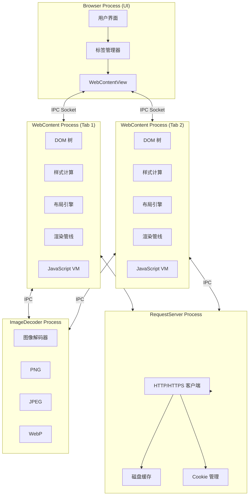

### 进程职责

| 进程类型 | 入口点 | 职责 |
|---------|--------|------|
| **Browser Process** | `UI/Qt/main.cpp` | GUI 管理、标签控制、用户交互 |
| **WebContent Process** | `Services/WebContent/main.cpp` | HTML 解析、CSS 渲染、JS 执行 |
| **RequestServer** | `Services/RequestServer/main.cpp` | HTTP/HTTPS 请求、缓存、Cookie |
| **ImageDecoder** | `Services/ImageDecoder/main.cpp` | 图像解码（PNG、JPEG、WebP 等） |
| **WebWorker** | `Services/WebWorker/main.cpp` | Web Worker 执行环境 |

## 核心库依赖层次

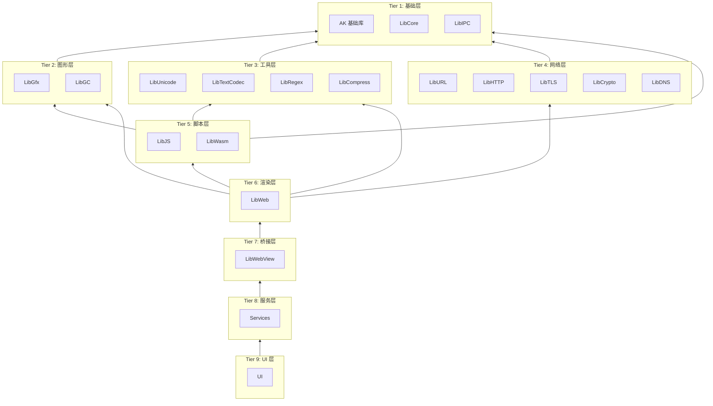

## LibWeb 渲染引擎

LibWeb 是 Ladybird 的核心渲染引擎，包含 90+ 子目录和 2800+ 源文件。

### 主要组件

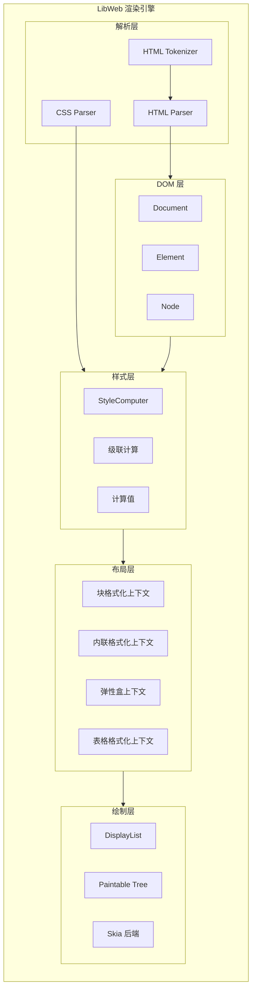

### 渲染管线详解

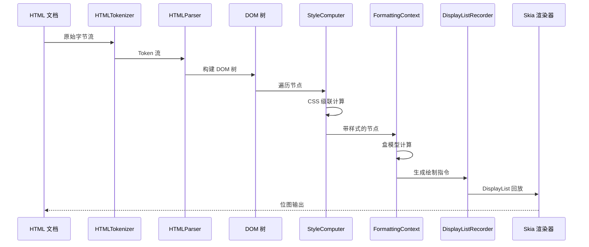

## LibJS JavaScript 引擎

LibJS 是完整的 ECMAScript 引擎实现，包含 1500+ 源文件。

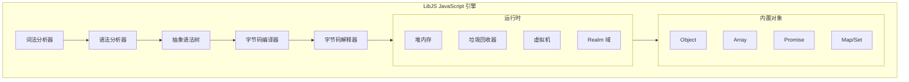

### 执行模型

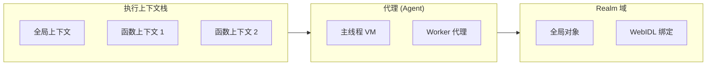

## IPC 通信机制

Ladybird 使用自定义的 IPC 协议进行进程间通信。

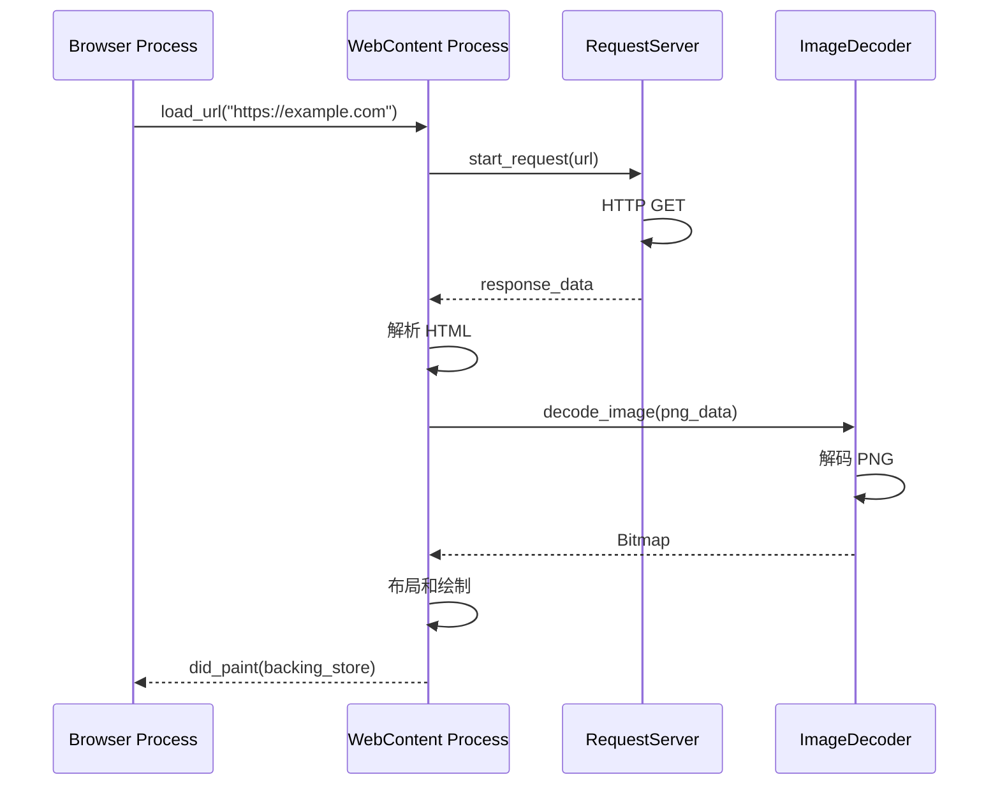

### IPC 协议文件

关键的 `.ipc` 定义文件：

| 文件 | 用途 |
|------|------|
| `WebContentServer.ipc` | Browser → WebContent 命令 |
| `WebContentClient.ipc` | WebContent → Browser 回调 |
| `RequestClient.ipc` | WebContent → RequestServer 请求 |
| `ImageDecoderClient.ipc` | WebContent → ImageDecoder 解码请求 |

## 平台抽象层

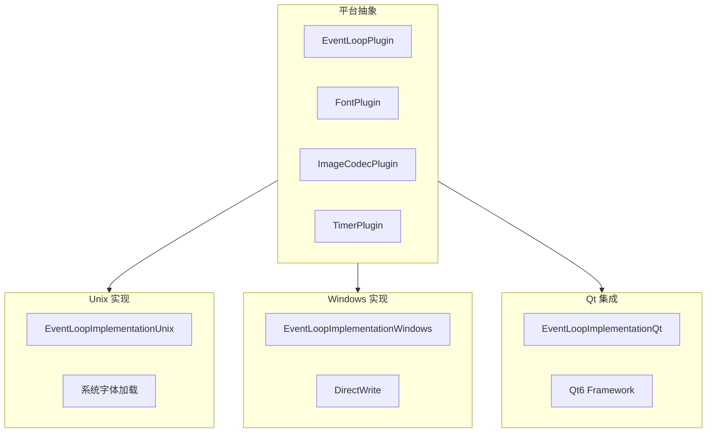

## 安全模型

Ladybird 采用多层次安全架构：

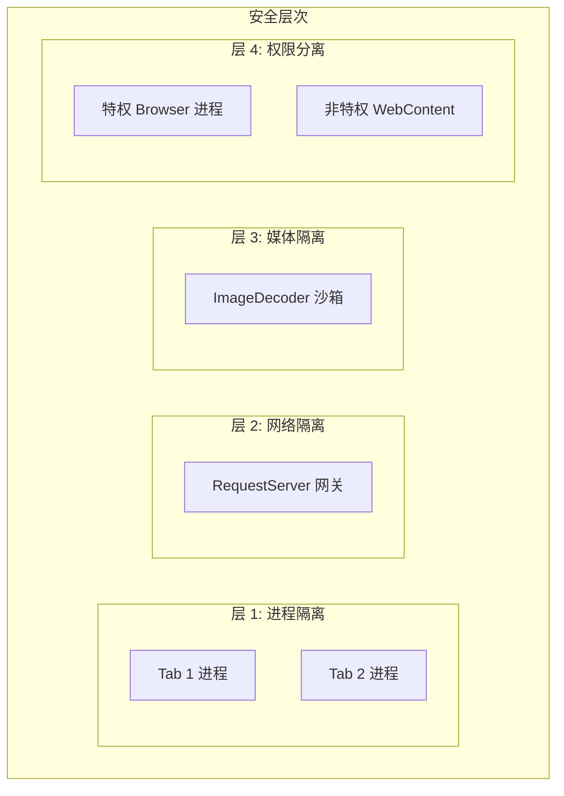

### 安全特性

1. **进程隔离**: 每个标签页运行在独立进程中
2. **网络网关**: 所有网络请求通过 RequestServer 代理
3. **图像解码沙箱**: 不受信任的图像在隔离进程中解码
4. **权限分离**: 辅助进程以低权限用户运行
5. **站点隔离**: 支持按站点隔离渲染进程

## 内存管理

### 垃圾回收器 (LibGC)

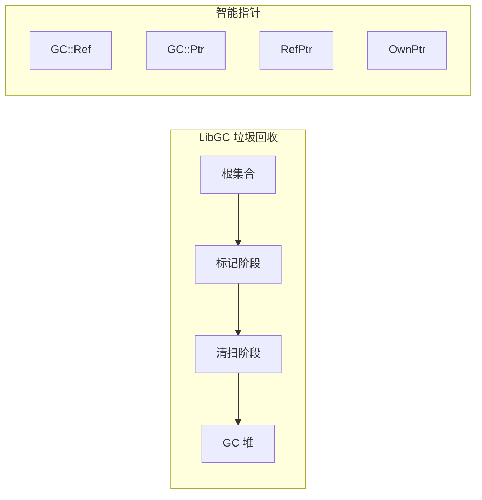

### 指针类型

| 类型 | 用途 |
|------|------|
| `GC::Ref<T>` | GC 管理的引用（非空） |
| `GC::Ptr<T>` | GC 管理的指针（可空） |
| `RefPtr<T>` | 引用计数智能指针 |
| `NonnullRefPtr<T>` | 非空引用计数指针 |
| `OwnPtr<T>` | 独占所有权指针 |
| `WeakPtr<T>` | 弱引用指针 |

## 错误处理模式

Ladybird 使用类似 Rust 的错误处理模式：

```cpp
// ErrorOr<T> 返回类型
ErrorOr<NonnullRefPtr<Document>> Document::create(...)
{
    auto document = TRY(adopt_ref(...));
    return document;
}

// TRY 宏自动传播错误
auto result = TRY(some_fallible_operation());

// MUST 宏断言成功
auto value = MUST(operation_that_must_succeed());
```

## 构建系统

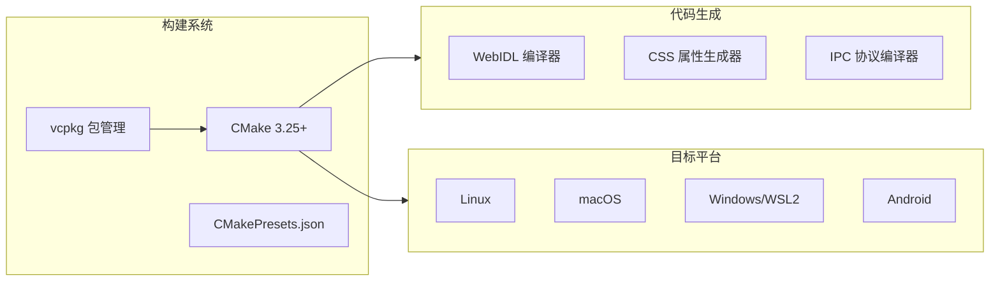

## 关键文件索引

### 入口点

| 文件 | 描述 |
|------|------|
| `UI/Qt/main.cpp` | Browser 进程入口 |
| `Services/WebContent/main.cpp` | WebContent 进程入口 |
| `Services/RequestServer/main.cpp` | RequestServer 进程入口 |
| `Services/ImageDecoder/main.cpp` | ImageDecoder 进程入口 |

### 核心接口

| 文件 | 描述 |
|------|------|
| `Libraries/LibWebView/ViewImplementation.h` | 视图抽象接口 |
| `Libraries/LibWebView/WebContentClient.h` | IPC 客户端 |
| `Libraries/LibWeb/Page/Page.h` | 网页表示 |
| `Libraries/LibWeb/DOM/Node.h` | DOM 节点基类 |
| `Libraries/LibWeb/CSS/StyleComputer.h` | 样式级联计算 |
| `Libraries/LibWeb/Layout/FormattingContext.h` | 布局算法 |
| `Libraries/LibJS/Runtime/VM.h` | JavaScript 虚拟机 |

## 与其他浏览器架构对比

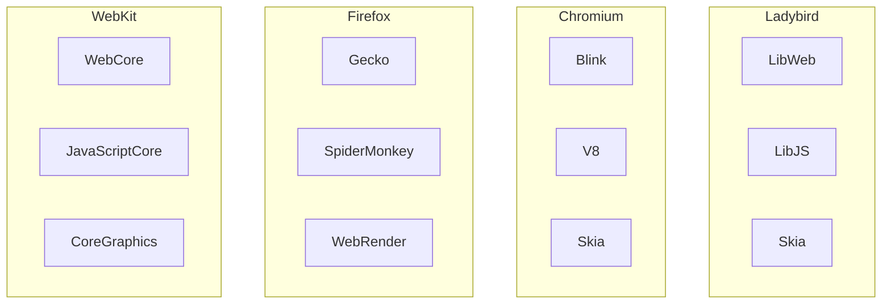

| 特性 | Ladybird | Chromium | Firefox | Safari |
|------|----------|----------|---------|--------|
| 渲染引擎 | LibWeb | Blink | Gecko | WebCore |
| JS 引擎 | LibJS | V8 | SpiderMonkey | JavaScriptCore |
| 图形后端 | Skia | Skia | WebRender | CoreGraphics |
| 进程模型 | 多进程 | 多进程 | 多进程 | 多进程 |
| 代码库 | 全新独立 | WebKit 分支 | 自研 | KHTML 演进 |

## 总结

Ladybird 是一个现代化的、完全独立的 Web 浏览器实现，具有以下特点：

1. **规范驱动**: 严格遵循 W3C/WHATWG 规范
2. **安全优先**: 多进程沙箱架构
3. **模块化设计**: 32 个独立库，职责清晰
4. **跨平台**: 支持 Linux、macOS、Windows、Android
5. **现代 C++**: 使用 C++23，自研基础库
6. **性能导向**: Display List 渲染、增量布局

该项目展示了从零构建现代 Web 浏览器的可行性，是学习浏览器内核的优秀资源。
