# LangGraph 架构设计分析

## 1. 概述

LangGraph 是 LangChain 团队开发的低级编排框架，专门用于构建、管理和部署**长期运行的有状态代理（Stateful Agents）**。它基于 Google 的 Pregel 计算模型，提供了一套强大的图执行引擎，支持状态持久化、人机交互循环（Human-in-the-Loop）和复杂的多代理工作流。

### 核心特性

- **有状态执行**：通过 StateGraph 实现节点间的状态共享和传递
- **持久化检查点**：支持内存、SQLite、PostgreSQL 等多种存储后端
- **人机交互循环**：内置中断和恢复机制
- **异步支持**：完整的 async/await 支持
- **可扩展性**：模块化设计，易于扩展

### 版本信息

- **当前版本**：1.0.5
- **Python 版本要求**：>=3.10
- **主要依赖**：langchain-core, pydantic, xxhash

---

## 2. 整体架构

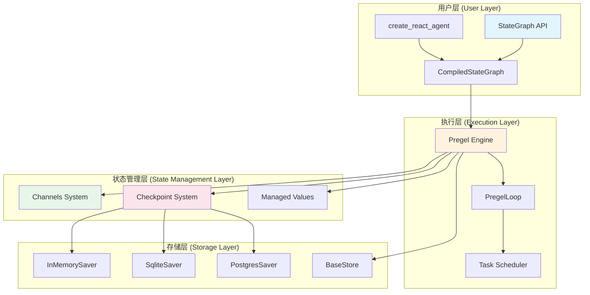

---

## 3. 核心组件详解

### 3.1 StateGraph - 图定义层

StateGraph 是 LangGraph 的核心 API，用于定义有状态的计算图。

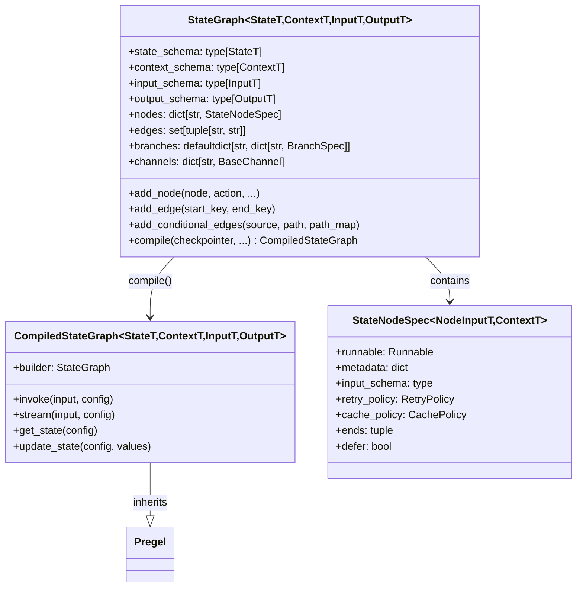

**关键设计点**：

1. **泛型支持**：使用 Python 泛型支持类型安全的状态定义
2. **Schema 分离**：input_schema 和 output_schema 可以与 state_schema 不同
3. **延迟编译**：图在调用 `compile()` 后才能执行，编译时进行验证

**源码位置**：`libs/langgraph/langgraph/graph/state.py`

---

### 3.2 Pregel 执行引擎

Pregel 是 LangGraph 的核心执行引擎，实现了类似 Google Pregel 的超步（Superstep）计算模型。

```mermaid
sequenceDiagram
    participant User as 用户
    participant Pregel as Pregel Engine
    participant Loop as PregelLoop
    participant Tasks as Task Scheduler
    participant Channels as Channels
    participant Checkpoint as Checkpointer

    User->>Pregel: invoke(input)
    Pregel->>Loop: __enter__()
    Loop->>Checkpoint: get_tuple(config)
    Checkpoint-->>Loop: CheckpointTuple
    Loop->>Channels: channels_from_checkpoint()

    loop Superstep Loop
        Loop->>Loop: tick()
        Loop->>Tasks: prepare_next_tasks()
        Tasks-->>Loop: PregelExecutableTask[]

        alt interrupt_before
            Loop-->>User: GraphInterrupt
        end

        Loop->>Tasks: execute_tasks()
        Tasks->>Channels: apply_writes()

        alt interrupt_after
            Loop-->>User: GraphInterrupt
        end

        Loop->>Checkpoint: put(checkpoint)
    end

    Loop->>Loop: __exit__()
    Pregel-->>User: output
```

**超步执行模型**：

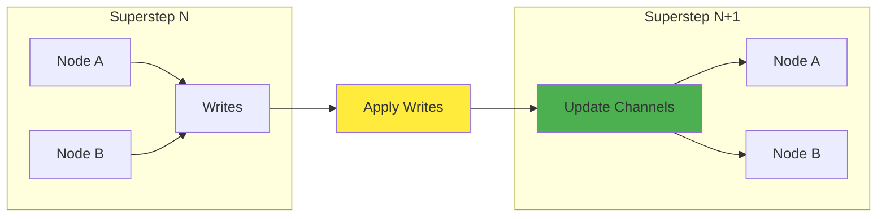

**关键类**：

| 类名 | 职责 | 源码位置 |
|------|------|---------|
| `Pregel` | 主执行引擎 | `pregel/main.py` |
| `PregelLoop` | 执行循环管理 | `pregel/_loop.py` |
| `PregelNode` | 节点封装 | `pregel/_read.py` |
| `PregelExecutableTask` | 可执行任务 | `types.py` |

---

### 3.3 Channel 系统

Channel（通道）是节点间通信的核心机制，实现了状态的读写和聚合。

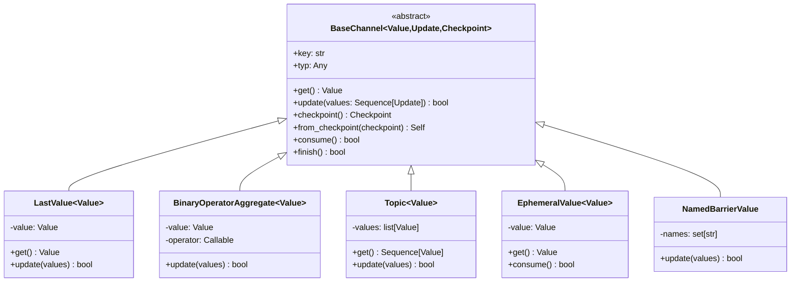

**通道类型说明**：

| 通道类型 | 用途 | 典型场景 |
|---------|------|---------|
| `LastValue` | 保存最后一个写入的值 | 普通状态字段 |
| `BinaryOperatorAggregate` | 使用 reducer 函数聚合多个值 | 消息历史（使用 `add_messages`） |
| `Topic` | 保存所有写入的值（队列） | 任务分发（`Send`） |
| `EphemeralValue` | 临时值，每步清空 | 输入通道 |
| `NamedBarrierValue` | 等待多个节点完成 | 并行执行同步 |

**Reducer 模式示例**：

```python
from typing import Annotated
from langgraph.graph.message import add_messages

class State(TypedDict):
    # 使用 add_messages reducer 聚合消息
    messages: Annotated[list, add_messages]
    # 普通字段，使用 LastValue
    count: int
```

---

### 3.4 Checkpoint 系统

Checkpoint 系统实现了状态的持久化，支持图的暂停、恢复和时间回溯。

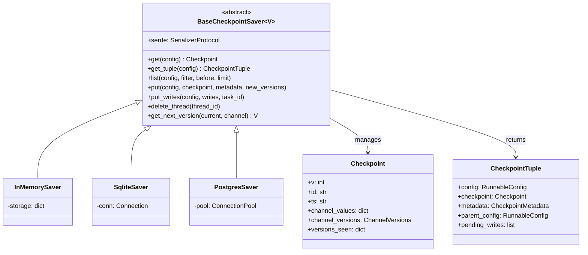

**Checkpoint 数据结构**：

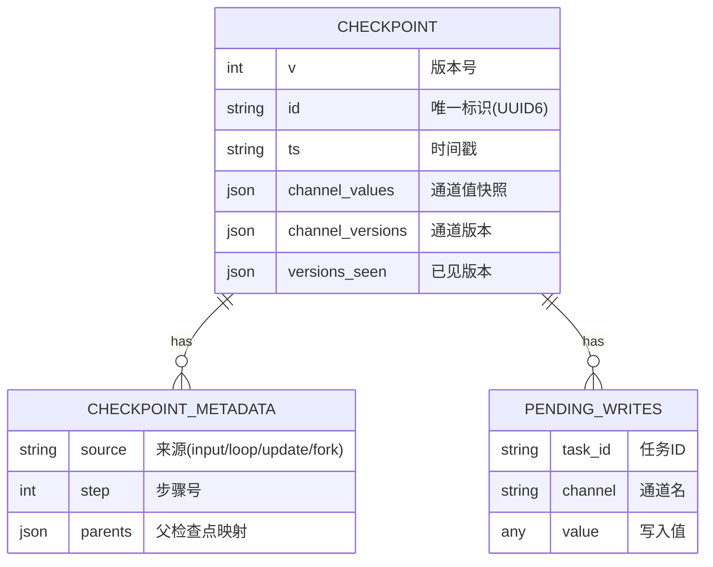

---

### 3.5 任务执行流程

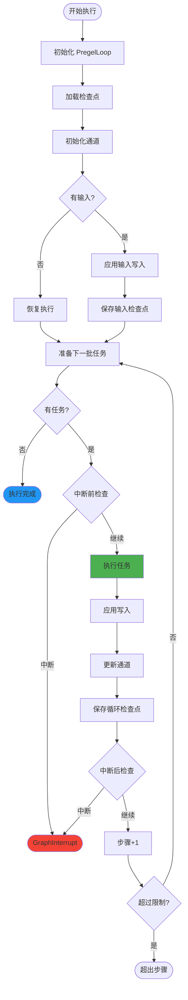

---

## 4. 数据流架构

### 4.1 写入流程

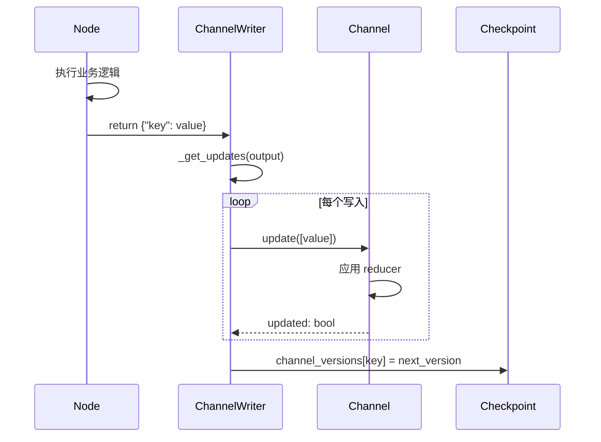

### 4.2 读取流程

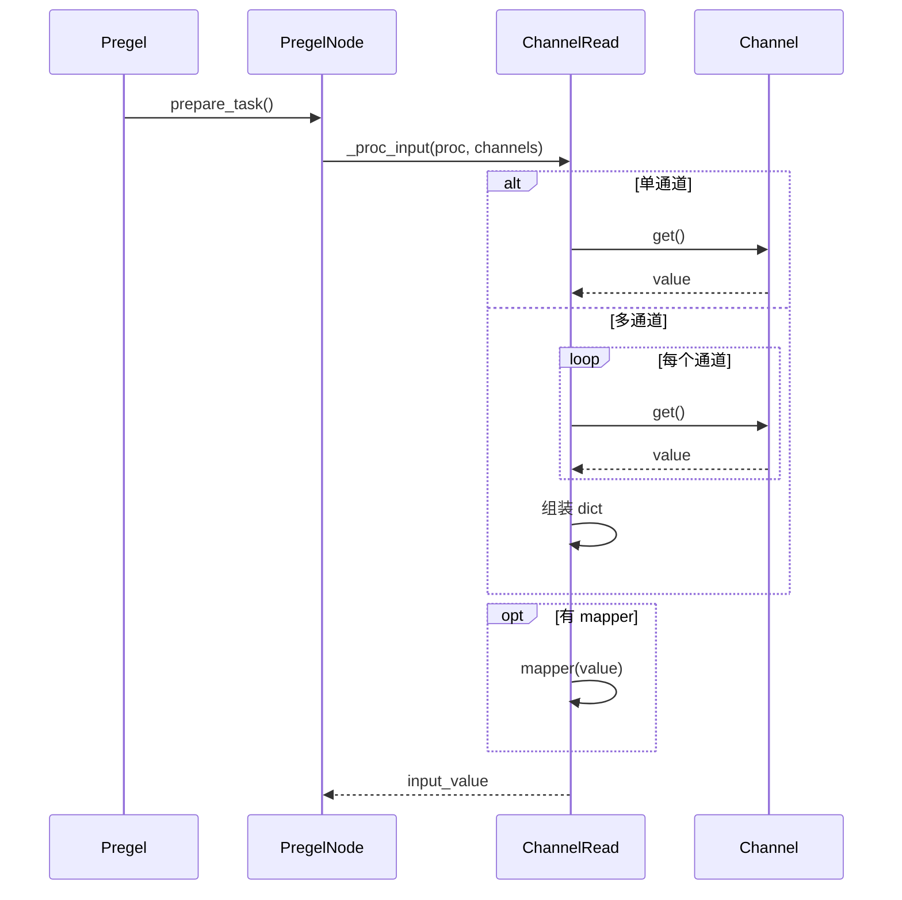

---

## 5. 中断与恢复机制

LangGraph 提供了强大的人机交互循环支持。

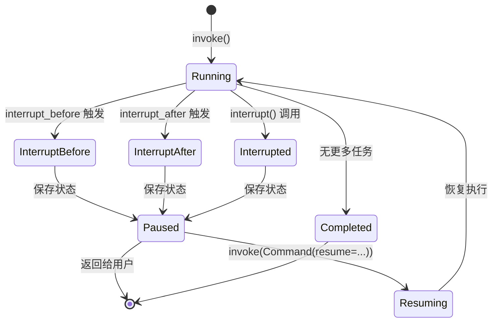

**中断类型**：

| 类型 | 触发方式 | 用途 |
|------|---------|------|
| `interrupt_before` | compile 参数 | 节点执行前暂停 |
| `interrupt_after` | compile 参数 | 节点执行后暂停 |
| `interrupt()` | 节点内调用 | 程序化中断 |

**恢复机制**：

```python
# 使用 Command 恢复执行
from langgraph.types import Command

# 单值恢复
graph.invoke(Command(resume="user input"), config)

# 多中断恢复（指定中断ID）
graph.invoke(Command(resume={
    "interrupt_id_1": "value1",
    "interrupt_id_2": "value2"
}), config)
```

---

## 6. 库依赖关系

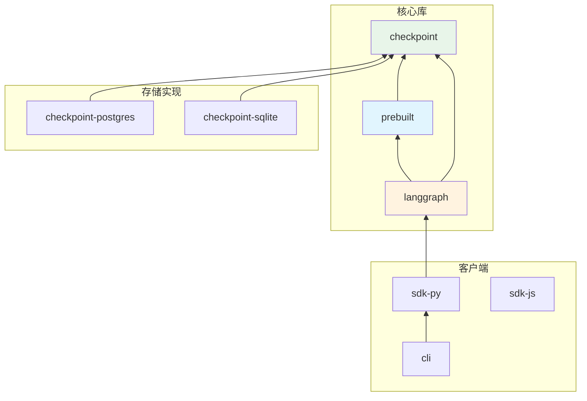

**依赖版本约束**：

```text
checkpoint          >=2.1.0,<4.0.0
checkpoint-postgres >=3.0.0
checkpoint-sqlite   >=3.0.0
prebuilt           >=1.0.2,<1.1.0
sdk-py             >=0.3.0,<0.4.0
```

---

## 7. 关键设计模式

### 7.1 Pregel 超步模型

LangGraph 采用 Pregel 的 BSP (Bulk Synchronous Parallel) 模型：

1. **计算阶段**：所有活跃节点并行执行
2. **通信阶段**：收集所有写入，统一应用到通道
3. **同步屏障**：等待所有节点完成后进入下一超步

```mermaid
gantt
    title Pregel 超步执行时序
    dateFormat X
    axisFormat %s

    section Superstep 1
    Node A 执行    :a1, 0, 2
    Node B 执行    :b1, 0, 3
    Apply Writes   :w1, 3, 4

    section Superstep 2
    Node C 执行    :c1, 4, 6
    Node D 执行    :d1, 4, 5
    Apply Writes   :w2, 6, 7

    section Superstep 3
    Node E 执行    :e1, 7, 9
    Apply Writes   :w3, 9, 10
```

### 7.2 通道版本控制

LangGraph 使用单调递增的版本号追踪通道更新：

```python
# 版本更新逻辑
def get_next_version(current: int | None, channel: None) -> int:
    if current is None:
        return 1
    return current + 1
```

**版本用途**：

- 确定节点是否需要重新执行
- 支持检查点的增量保存
- 实现精确的状态回溯

### 7.3 Send 机制

Send 允许动态创建任务，实现 map-reduce 模式：

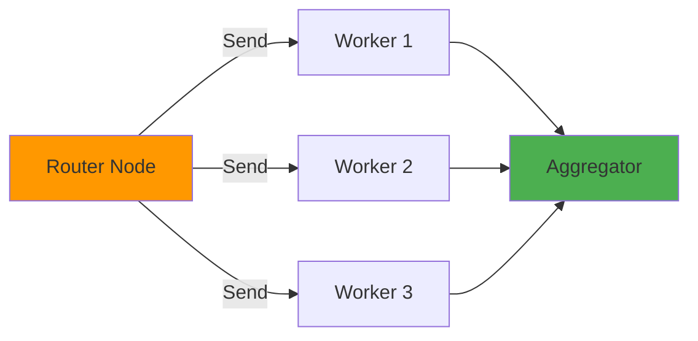

---

## 8. 预构建组件

### 8.1 ReAct Agent

`create_react_agent` 提供了开箱即用的 ReAct 模式代理：

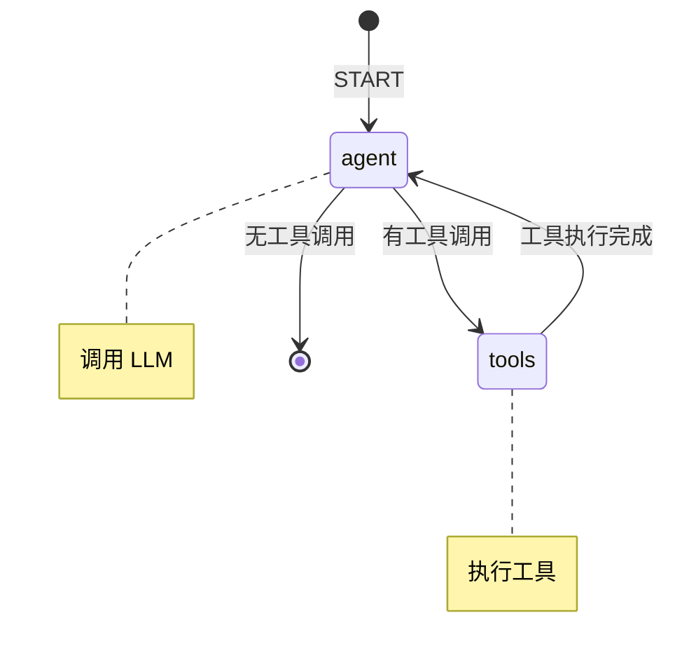

### 8.2 ToolNode

ToolNode 封装了工具执行逻辑：

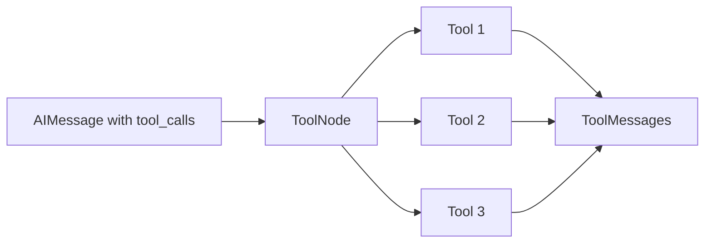

---

## 9. 配置与扩展

### 9.1 Runtime Context

LangGraph 支持运行时上下文注入：

```python
class Context(TypedDict):
    user_id: str
    db_conn: Connection

def my_node(state: State, runtime: Runtime[Context]) -> dict:
    user_id = runtime.context["user_id"]
    # 使用上下文
    return {"result": ...}

graph = StateGraph(State, context_schema=Context)
graph.add_node("my_node", my_node)
compiled = graph.compile()

# 执行时传入上下文
compiled.invoke(input, context={"user_id": "123", "db_conn": conn})
```

### 9.2 重试与缓存策略

```python
from langgraph.types import RetryPolicy, CachePolicy

# 重试策略
retry = RetryPolicy(
    initial_interval=0.5,
    backoff_factor=2.0,
    max_attempts=3,
    retry_on=lambda e: isinstance(e, ConnectionError)
)

# 缓存策略
cache = CachePolicy(
    key_func=lambda x: hash(str(x)),
    ttl=3600
)

graph.add_node("my_node", my_func, retry_policy=retry, cache_policy=cache)
```

---

## 10. 性能优化

### 10.1 触发优化

LangGraph 维护 `trigger_to_nodes` 映射，避免遍历所有节点：

```python
# 优化：只检查可能被触发的节点
if updated_channels and trigger_to_nodes:
    triggered_nodes = set()
    for channel in updated_channels:
        if node_ids := trigger_to_nodes.get(channel):
            triggered_nodes.update(node_ids)
    candidate_nodes = sorted(triggered_nodes)
```

### 10.2 输入缓存

节点输入在同一超步内缓存，避免重复计算：

```python
input_cache: dict[INPUT_CACHE_KEY_TYPE, Any] = {}
# 缓存键基于 mapper 和 channels
input_cache_key = (self.mapper, tuple(self.channels))
```

### 10.3 写入合并

连续的 ChannelWrite 会被合并以减少开销：

```python
while len(writers) > 1 and isinstance(writers[-1], ChannelWrite):
    writers[-2] = ChannelWrite(
        writes=writers[-2].writes + writers[-1].writes
    )
    writers.pop()
```

---

## 11. 源码目录结构

```
libs/langgraph/langgraph/
├── graph/                  # 图定义
│   ├── state.py           # StateGraph, CompiledStateGraph
│   ├── message.py         # MessageGraph, add_messages
│   └── _branch.py         # 分支逻辑
├── pregel/                 # 执行引擎
│   ├── main.py            # Pregel 主类
│   ├── _algo.py           # 核心算法
│   ├── _loop.py           # 执行循环
│   ├── _read.py           # PregelNode, ChannelRead
│   ├── _write.py          # ChannelWrite
│   ├── _checkpoint.py     # 检查点操作
│   └── _executor.py       # 任务执行器
├── channels/               # 通道实现
│   ├── base.py            # BaseChannel
│   ├── last_value.py      # LastValue
│   ├── binop.py           # BinaryOperatorAggregate
│   ├── topic.py           # Topic
│   └── ephemeral_value.py # EphemeralValue
├── managed/                # 托管值
├── _internal/              # 内部实现
├── types.py               # 公共类型
├── errors.py              # 错误定义
└── config.py              # 配置管理

libs/checkpoint/langgraph/
├── checkpoint/             # 检查点基础
│   ├── base/              # BaseCheckpointSaver
│   ├── memory/            # InMemorySaver
│   └── serde/             # 序列化
├── store/                  # 存储接口
└── cache/                  # 缓存接口

libs/prebuilt/langgraph/prebuilt/
├── chat_agent_executor.py  # create_react_agent
├── tool_node.py           # ToolNode
└── interrupt.py           # 中断处理
```

---

## 12. 总结

LangGraph 的架构设计体现了以下核心理念：

1. **图计算模型**：采用 Pregel BSP 模型，支持并行执行和确定性重放
2. **状态优先**：通道系统提供灵活的状态管理和聚合机制
3. **持久化优先**：检查点系统确保长时间运行的代理可以安全暂停和恢复
4. **可组合性**：模块化设计允许灵活组合不同组件
5. **类型安全**：广泛使用 Python 类型提示和 Pydantic 验证

这套架构使 LangGraph 成为构建复杂、可靠的 AI 代理系统的理想选择。

---

## 参考资料

- [LangGraph 官方文档](https://langchain-ai.github.io/langgraph/)
- [Google Pregel 论文](https://dl.acm.org/doi/10.1145/1807167.1807184)
- [LangChain 文档](https://python.langchain.com/)
