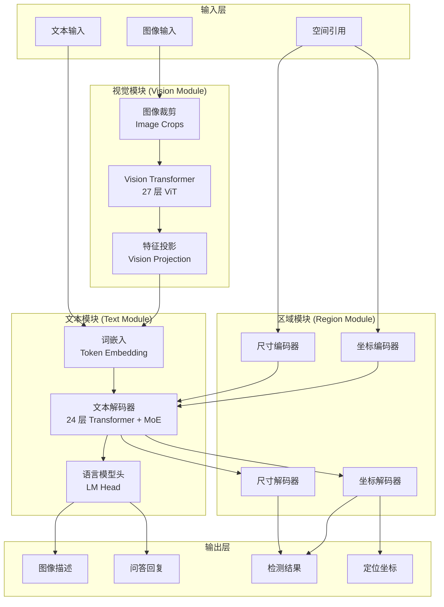
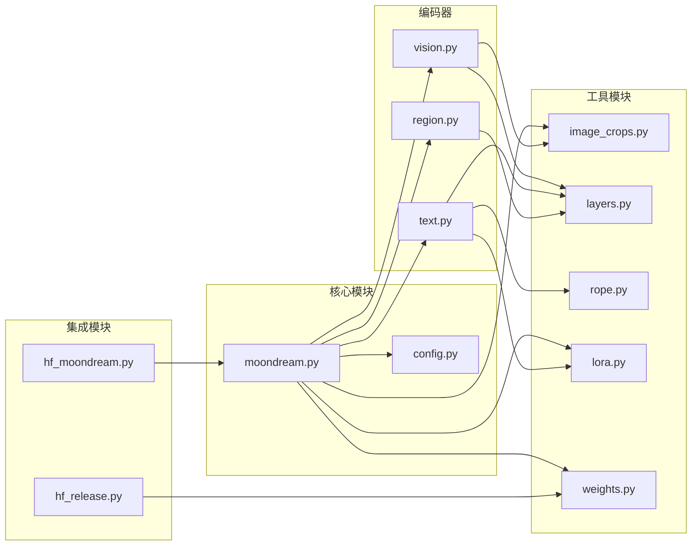
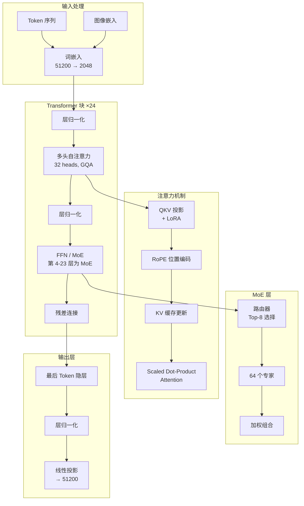
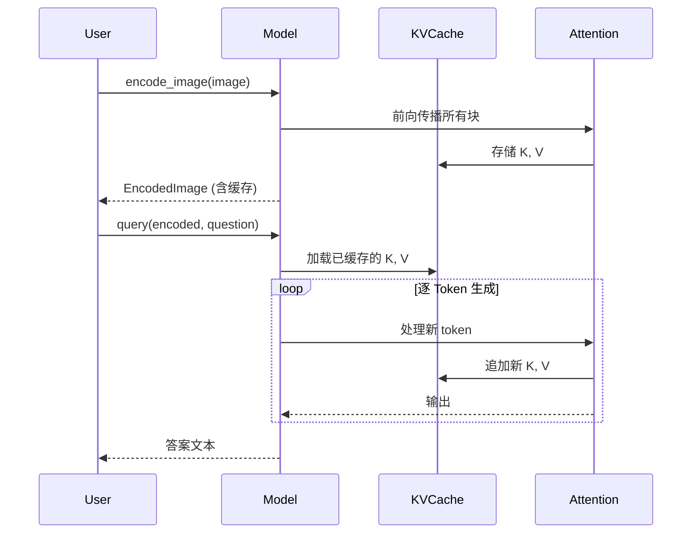
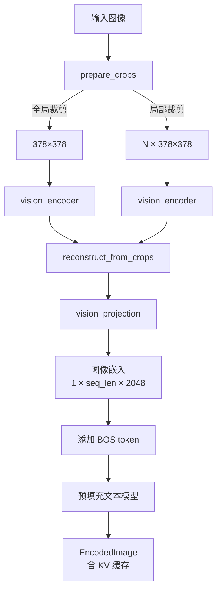
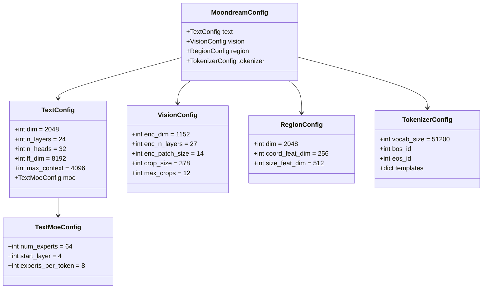
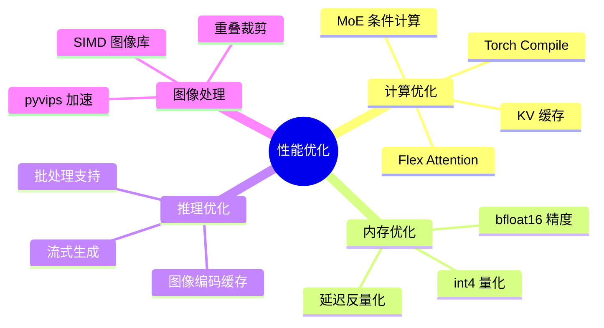
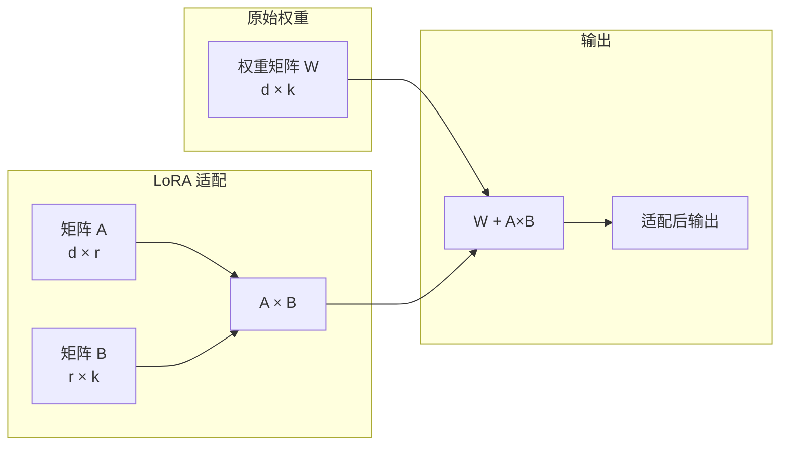
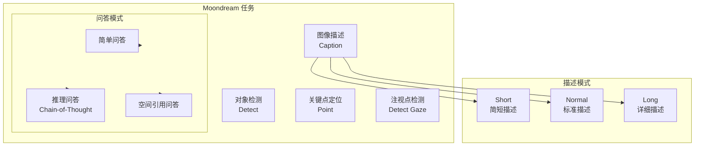
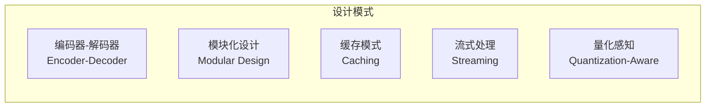

# Moondream 视觉语言模型架构分析

> Moondream 是一个轻量级、高效的视觉语言模型 (VLM)，专为本地部署和实时推理设计。本文档详细分析其架构设计、核心模块和实现细节。

## 目录

1. [项目概述](#1-项目概述)
2. [目录结构](#2-目录结构)
3. [系统架构](#3-系统架构)
4. [核心模块详解](#4-核心模块详解)
5. [数据流分析](#5-数据流分析)
6. [模型配置](#6-模型配置)
7. [性能优化](#7-性能优化)
8. [扩展机制](#8-扩展机制)
9. [应用场景](#9-应用场景)
10. [总结](#10-总结)

---

## 1. 项目概述

### 1.1 设计目标

- **轻量高效**: 2B 参数实现接近大模型的能力
- **多任务支持**: 图像描述、视觉问答、对象检测、关键点定位
- **本地部署**: 支持 CPU/GPU/MPS，适合边缘设备
- **推理优化**: KV 缓存、Torch Compile、量化支持

### 1.2 核心特性

| 特性 | 描述 |
|------|------|
| 模型规模 | 2B (主模型) / 0.5B (轻量版) |
| 视觉编码 | 27 层 ViT + 多尺度裁剪 |
| 文本解码 | 24 层 Transformer + MoE |
| 空间理解 | Fourier 特征 + Bin 化坐标 |
| 推理能力 | 支持思维链 (Chain-of-Thought) |

---

## 2. 目录结构

```
moondream/
├── moondream/
│   ├── __init__.py
│   ├── torch/                    # 核心 PyTorch 实现
│   │   ├── config.py            # 模型配置定义
│   │   ├── moondream.py         # 主模型类 (核心入口)
│   │   ├── vision.py            # 视觉编码器
│   │   ├── text.py              # 文本解码器
│   │   ├── region.py            # 区域/坐标编码模块
│   │   ├── layers.py            # 基础网络层
│   │   ├── rope.py              # 旋转位置编码 (RoPE)
│   │   ├── image_crops.py       # 图像裁剪处理
│   │   ├── lora.py              # LoRA 适配支持
│   │   ├── weights.py           # 权重加载器
│   │   ├── utils.py             # 工具函数
│   │   ├── hf_moondream.py      # HuggingFace 集成
│   │   └── hf_release.py        # HF 模型发布
│   ├── config/
│   │   ├── config_md2.json      # Moondream 2B 配置
│   │   └── config_md05.json     # Moondream 0.5B 配置
│   └── eval/                     # 评估脚本
├── recipes/                      # 示例应用
│   ├── promptable-content-moderation/
│   ├── gaze-detection-video/
│   └── promptable-video-redaction/
├── tests/
├── sample.py                     # 命令行演示
├── gradio_demo.py               # Gradio Web UI
└── requirements.txt
```

---

## 3. 系统架构

### 3.1 高层架构图



### 3.2 模块依赖关系



---

## 4. 核心模块详解

### 4.1 视觉编码器 (Vision Encoder)

视觉编码器负责将输入图像转换为模型可理解的特征表示。

#### 架构设计

```mermaid
flowchart TB
    subgraph ImagePreprocess["图像预处理"]
        INPUT[输入图像<br/>任意尺寸]
        RGB[转换 RGB]
        GLOBAL[全局裁剪<br/>378×378]
        LOCAL[局部裁剪<br/>最多 12 个]
        NORM[归一化<br/>[-0.5, 0.5]]
    end

    subgraph ViT["Vision Transformer"]
        PATCH[Patch Embedding<br/>14×14 → 1152]
        POS[位置编码]
        BLOCKS[27 个 Transformer 块]
        LN[层归一化]
    end

    subgraph Projection["特征投影"]
        RECON[裁剪重建]
        POOL[自适应池化<br/>27×27]
        CONCAT[特征拼接<br/>2304 维]
        MLP[MLP 投影<br/>→ 2048 维]
    end

    INPUT --> RGB --> GLOBAL
    RGB --> LOCAL
    GLOBAL --> NORM
    LOCAL --> NORM

    NORM --> PATCH --> POS --> BLOCKS --> LN

    LN --> RECON --> POOL --> CONCAT --> MLP
```

#### 关键实现

```python
# vision.py 核心函数

def prepare_crops(image, config, device):
    """创建重叠裁剪"""
    # 1. 转换为 RGB numpy 数组
    # 2. 创建全局裁剪 (378×378)
    # 3. 创建重叠局部裁剪 (最多 12 个)
    # 4. 归一化到 [-0.5, 0.5]
    return (all_crops, tiling)

def vision_encoder(input_BCHW, w, config):
    """ViT 风格的编码"""
    # 1. Patch embedding: 3×14×14=588 → 1152
    # 2. 添加位置编码
    # 3. 27 个 Transformer 块 (attn + mlp)
    # 4. 层归一化
    return encoded_features

def vision_projection(global_features, reconstructed, w, config):
    """特征投影到文本空间"""
    # 1. 重建特征自适应池化
    # 2. 全局特征拼接
    # 3. MLP 投影到文本维度 (2048)
    return projected_features
```

### 4.2 文本解码器 (Text Decoder)

文本解码器采用 24 层 Transformer 架构，并集成了 MoE (Mixture of Experts) 机制。

#### 架构设计



#### 关键实现

```python
# text.py 核心函数

def attn(x, w, freqs_cis, kv_cache, attn_mask, ...):
    """多头自注意力"""
    # 1. QKV 投影 (支持 LoRA)
    # 2. 应用 RoPE 位置编码
    # 3. 更新 KV 缓存
    # 4. flex_attention 或 scaled_dot_product_attention
    # 5. 输出投影

def text_decoder(x, w, attn_mask, position_ids, config, lora, ...):
    """24 层 Transformer 解码器"""
    for i in range(24):
        # 层归一化
        # 多头自注意力 (支持 GQA, LoRA)
        # MLP 或 MoE (从第 4 层开始)
        # 残差连接
    return hidden_states

def moe_mlp(x, mlp_module, experts_per_token):
    """混合专家层"""
    # 路由器选择 top-k 专家
    # 加权组合专家输出
```

### 4.3 区域模块 (Region Module)

区域模块负责空间理解，支持坐标和尺寸的编码/解码。

#### 架构设计

```mermaid
flowchart LR
    subgraph Input["输入"]
        COORD[坐标 (x, y)]
        SIZE[尺寸 (w, h)]
        BOX[边界框]
    end

    subgraph Fourier["Fourier 特征"]
        FF1[sin/cos 变换]
        FF2[增加维度]
    end

    subgraph Encoder["编码器"]
        COORD_E[坐标编码器<br/>→ hidden_dim]
        SIZE_E[尺寸编码器<br/>→ hidden_dim]
    end

    subgraph Decoder["解码器"]
        COORD_D[坐标解码器<br/>→ 1024 bins]
        SIZE_D[尺寸解码器<br/>→ 2×1024 bins]
    end

    subgraph Output["输出"]
        POINT[点坐标]
        BBOX[边界框]
    end

    COORD --> FF1 --> COORD_E
    SIZE --> FF1 --> SIZE_E
    BOX --> COORD_E
    BOX --> SIZE_E

    COORD_E --> COORD_D --> POINT
    SIZE_E --> SIZE_D --> BBOX
```

#### Bin 化策略

坐标和尺寸被离散化为 1024 个 bin，实现量化友好的空间表示：

```python
# 坐标 bin 化: 线性映射
coord_bin = int(coord * 1023)  # [0, 1] → [0, 1023]

# 尺寸 bin 化: 对数映射
size = 2 ** ((bin / 1023.0) * 10.0 - 10.0)
```

### 4.4 KV 缓存机制

KV 缓存是推理优化的核心，避免重复计算已处理的 token。



---

## 5. 数据流分析

### 5.1 图像编码流程



### 5.2 Query 流程

```mermaid
flowchart TB
    subgraph Input["输入"]
        ENCODED[EncodedImage]
        QUESTION[问题文本]
        SPATIAL[空间引用<br/>可选]
    end

    subgraph Reasoning["推理阶段 (可选)"]
        THINK[思考 Token]
        GEN_R[生成推理内容]
        GROUND[坐标接地]
    end

    subgraph Answer["回答阶段"]
        SUFFIX[后缀 Token]
        GEN_A[生成答案]
        STREAM[流式输出]
    end

    subgraph Output["输出"]
        RESULT[{"reasoning": {...},<br/>"answer": "..."}]
    end

    ENCODED --> QUESTION
    QUESTION --> SPATIAL
    SPATIAL --> THINK --> GEN_R --> GROUND

    GROUND --> SUFFIX --> GEN_A --> STREAM --> RESULT
```

### 5.3 Detect 流程

```mermaid
flowchart TB
    ENCODED[EncodedImage] --> PROMPT[构建 Prompt<br/>prefix + object + suffix]
    PROMPT --> PREFILL[预填充模型]
    PREFILL --> HIDDEN[获取隐层状态]

    HIDDEN --> LOOP{循环直到 EOS<br/>或达到上限}

    LOOP --> DEC_X[decode_coordinate → x]
    DEC_X --> DEC_Y[decode_coordinate → y]
    DEC_Y --> DEC_SIZE[decode_size → w, h]
    DEC_SIZE --> BOX[添加边界框<br/>x_min, y_min, x_max, y_max]
    BOX --> LOOP

    LOOP --> |完成| OUTPUT[{"objects": [...]}]
```

---

## 6. 模型配置

### 6.1 配置类层次结构



### 6.2 模型变体对比

| 配置项 | Moondream 2B | Moondream 0.5B |
|--------|--------------|----------------|
| 文本维度 | 2048 | 1024 |
| 文本 FFN | 8192 | 4096 |
| 文本头数 | 32 | 16 |
| 视觉维度 | 1152 | 720 |
| 视觉 FFN | 4304 | 2690 |
| 投影输出 | 2048 | 1024 |
| 参数总量 | ~2B | ~0.5B |

---

## 7. 性能优化

### 7.1 优化策略总览



### 7.2 关键优化实现

#### KV 缓存

```python
class KVCache:
    def __init__(self, n_layers, n_heads, max_context):
        self.k = torch.zeros(n_layers, n_heads, max_context, head_dim)
        self.v = torch.zeros(n_layers, n_heads, max_context, head_dim)
        self.pos = 0

    def update(self, layer_idx, new_k, new_v):
        self.k[layer_idx, :, self.pos:self.pos+1] = new_k
        self.v[layer_idx, :, self.pos:self.pos+1] = new_v
        self.pos += 1
```

#### 量化线性层

```python
class QuantizedLinear(nn.Module):
    """int4 量化线性层"""
    def __init__(self):
        self.packed = ...      # uint8 打包权重
        self.scale = ...       # 缩放因子
        self.zero_point = ...  # 零点

    def unpack(self):
        """延迟反量化到 bfloat16"""
        return dequantize(self.packed, self.scale, self.zero_point)
```

### 7.3 性能指标

| 优化项 | 效果 |
|--------|------|
| KV 缓存 | 避免 O(n²) 重复计算 |
| Torch Compile | ~2x 推理加速 |
| bfloat16 | 内存减半 |
| int4 量化 | 内存减少 75% |
| MoE | 激活参数减少 8x |

---

## 8. 扩展机制

### 8.1 LoRA 适配



#### 使用示例

```python
# 加载 LoRA 变体
lora_weights = variant_state_dict("geoguesser_lora_only", device)
model.set_lora(lora_weights)

# 推理时自动应用
result = model.query(encoded, "Where is this?")
```

### 8.2 HuggingFace 集成

```python
from transformers import AutoModel

# 从 HuggingFace Hub 加载
model = AutoModel.from_pretrained(
    "vikhyatk/moondream2",
    trust_remote_code=True,
    device_map="auto"
)
```

---

## 9. 应用场景

### 9.1 支持的任务



### 9.2 使用示例

```python
from moondream import MoondreamModel
from PIL import Image

# 初始化模型
model = MoondreamModel.from_pretrained("moondream-2b")
image = Image.open("example.jpg")

# 编码图像 (可复用)
encoded = model.encode_image(image)

# 图像描述
caption = model.caption(encoded, length="normal")
print(caption["caption"])

# 视觉问答
answer = model.query(encoded, "What is in this image?")
print(answer["answer"])

# 带推理的问答
answer = model.query(encoded, "Count the people", reasoning=True)
print(answer["reasoning"]["text"])
print(answer["answer"])

# 对象检测
objects = model.detect(encoded, "person")
for obj in objects["objects"]:
    print(f"Box: ({obj['x_min']}, {obj['y_min']}, {obj['x_max']}, {obj['y_max']})")

# 关键点定位
points = model.point(encoded, "eye")
for pt in points["points"]:
    print(f"Point: ({pt['x']}, {pt['y']})")
```

### 9.3 Recipe 示例

项目提供了多个实用示例：

1. **Promptable Content Moderation**: 可提示的内容审核
2. **Gaze Detection Video**: 视频注视点检测
3. **Promptable Video Redaction**: 可提示的视频遮蔽

---

## 10. 总结

### 10.1 架构亮点

1. **多尺度视觉理解**
   - 全局视图 + 局部细节
   - 重叠裁剪确保连续性

2. **高效缓存机制**
   - 图像编码一次，多次查询
   - KVCache 避免重复计算

3. **灵活的空间推理**
   - Fourier 特征防止光谱偏差
   - Bin 化坐标/尺寸允许量化

4. **优化的文本生成**
   - 流式输出处理 CJK 字符
   - 支持推理过程展示

5. **模型压缩**
   - 提供 0.5B 小模型
   - 支持 LoRA 适配
   - Int4 量化选项

### 10.2 设计模式



### 10.3 技术栈

| 层级 | 技术 |
|------|------|
| 深度学习框架 | PyTorch 2.8+ |
| 模型集成 | HuggingFace Transformers |
| 图像处理 | Pillow-SIMD, pyvips |
| Web UI | Gradio |
| 权重格式 | SafeTensors |
| 分布式 | Accelerate |

### 10.4 适用场景

- 边缘设备部署
- 实时视觉问答
- 图像内容分析
- 对象定位与检测
- 多模态应用开发

---

*本文档基于 Moondream 代码库分析生成，版本信息以实际代码为准。*
