# NocoDB 架构设计分析

## 1. 项目概述

NocoDB 是一个开源的 Airtable 替代方案，可以将任何关系型数据库转换为智能电子表格界面。它支持 MySQL、PostgreSQL、SQLite 等多种数据库，提供丰富的视图类型（表格、看板、画廊、日历等）以及实时协作功能。

### 核心特性

- **多数据库支持**: MySQL、PostgreSQL、SQLite、MariaDB、SQL Server
- **多种视图类型**: 表格视图、看板视图、画廊视图、表单视图、日历视图、地图视图
- **实时协作**: 基于 Socket.io 的实时数据同步
- **可扩展插件系统**: 存储、邮件、通知等插件
- **REST API**: 完整的 REST API 支持
- **SDK**: TypeScript SDK 自动生成

## 2. 技术栈

| 层级 | 技术 | 版本 |
|------|------|------|
| **后端框架** | NestJS | 10.4.19 |
| **前端框架** | Nuxt 3 + Vue 3 | 3.17.4 + 3.5.13 |
| **数据库 ORM** | Knex.js | 3.1.0 |
| **实时通信** | Socket.io | 4.8.1 |
| **任务队列** | Bull + Redis | 4.16.5 + 5.6.1 |
| **认证** | Passport.js | 0.7.0 |
| **UI 组件库** | Ant Design Vue | 3.2.20 |
| **状态管理** | Pinia | 2.3.1 |
| **代码编辑器** | Monaco Editor | 0.52.2 |
| **富文本** | Tiptap | 2.11.5 |
| **构建工具** | rspack (后端), Vite (前端) | - |
| **包管理** | pnpm + Lerna | 9.6.0 |
| **Node 版本** | Node.js | >=22 (后端), >=18 (前端) |

## 3. 整体架构

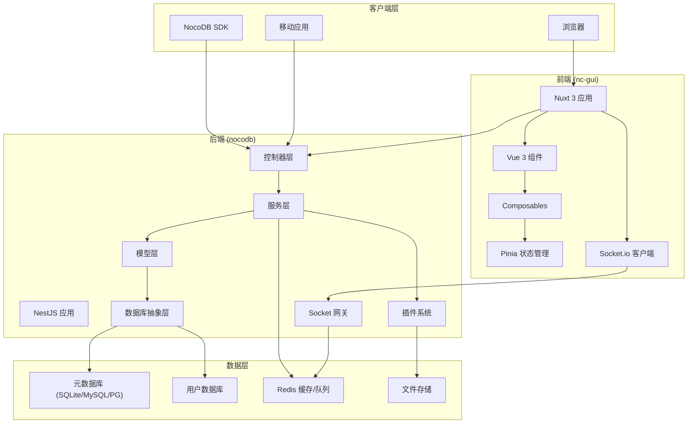
```mermaid
graph TB
    subgraph Client["客户端层"]
        Browser["浏览器"]
        SDK["NocoDB SDK"]
        MobileApp["移动应用"]
    end

    subgraph Frontend["前端 (nc-gui)"]
        NuxtApp["Nuxt 3 应用"]
        VueComponents["Vue 3 组件"]
        Composables["Composables"]
        PiniaStore["Pinia 状态管理"]
        SocketClient["Socket.io 客户端"]
    end

    subgraph Backend["后端 (nocodb)"]
        NestJS["NestJS 应用"]
        Controllers["控制器层"]
        Services["服务层"]
        Models["模型层"]
        DB["数据库抽象层"]
        Plugins["插件系统"]
        Gateway["Socket 网关"]
    end

    subgraph DataLayer["数据层"]
        MetaDB["元数据库 (SQLite/MySQL/PG)"]
        UserDB["用户数据库"]
        Redis["Redis 缓存/队列"]
        Storage["文件存储"]
    end

    Browser --> NuxtApp
    SDK --> Controllers
    MobileApp --> Controllers

    NuxtApp --> VueComponents
    VueComponents --> Composables
    Composables --> PiniaStore
    NuxtApp --> SocketClient
    SocketClient --> Gateway

    NuxtApp --> Controllers
    Controllers --> Services
    Services --> Models
    Models --> DB
    DB --> MetaDB
    DB --> UserDB

    Services --> Plugins
    Plugins --> Storage
    Services --> Redis
    Gateway --> Redis
```

## 4. 代码库结构

```
nocodb/
├── packages/
│   ├── nocodb/                 # 后端服务
│   │   ├── src/
│   │   │   ├── controllers/    # API 控制器 (91个)
│   │   │   ├── services/       # 业务逻辑 (110+个)
│   │   │   ├── models/         # 数据模型 (62个)
│   │   │   ├── db/             # 数据库抽象层
│   │   │   ├── modules/        # NestJS 模块
│   │   │   ├── plugins/        # 插件实现 (25+个)
│   │   │   ├── strategies/     # 认证策略
│   │   │   ├── guards/         # 权限守卫
│   │   │   ├── middlewares/    # 中间件
│   │   │   ├── gateways/       # WebSocket 网关
│   │   │   └── meta/           # 元数据迁移
│   │   └── rspack.config.js    # 构建配置
│   │
│   ├── nc-gui/                 # 前端应用
│   │   ├── pages/              # 页面组件 (49个)
│   │   ├── components/         # UI 组件 (32类)
│   │   ├── composables/        # Vue Composables (93+个)
│   │   ├── store/              # Pinia 状态
│   │   ├── plugins/            # Nuxt 插件
│   │   ├── extensions/         # 扩展系统
│   │   └── lang/               # 国际化 (42+语言)
│   │
│   ├── nocodb-sdk/             # TypeScript SDK
│   ├── nocodb-sdk-v2/          # 新版 SDK
│   ├── nc-lib-gui/             # GUI 库
│   ├── nc-secret-mgr/          # 密钥管理 CLI
│   └── noco-integrations/      # 集成框架
│
├── tests/                      # E2E 测试 (Playwright)
├── docker-compose/             # Docker 配置
├── charts/                     # Kubernetes Helm Charts
└── scripts/                    # 构建脚本
```

## 5. 后端架构详解

### 5.1 模块系统

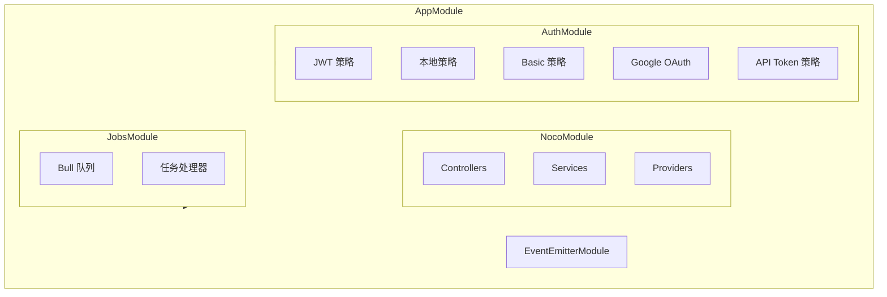
```mermaid
graph LR
    subgraph AppModule["AppModule"]
        NocoModule["NocoModule"]
        AuthModule["AuthModule"]
        JobsModule["JobsModule"]
        EventEmitterModule["EventEmitterModule"]
    end

    subgraph NocoModule["NocoModule"]
        Controllers["Controllers"]
        Services["Services"]
        Providers["Providers"]
    end

    subgraph AuthModule["AuthModule"]
        JWTStrategy["JWT 策略"]
        LocalStrategy["本地策略"]
        BasicStrategy["Basic 策略"]
        GoogleStrategy["Google OAuth"]
        AuthTokenStrategy["API Token 策略"]
    end

    subgraph JobsModule["JobsModule"]
        BullQueue["Bull 队列"]
        JobProcessor["任务处理器"]
    end

    AppModule --> NocoModule
    AppModule --> AuthModule
    AppModule --> JobsModule
    AppModule --> EventEmitterModule
```

**核心模块:**

- **AppModule**: 应用根模块，配置全局中间件和守卫
- **NocoModule**: 核心业务模块，包含所有控制器和服务
- **AuthModule**: 认证模块，支持多种认证策略
- **JobsModule**: 异步任务模块，基于 Bull 队列
- **EventEmitterModule**: 事件发布/订阅模块

### 5.2 数据库抽象层

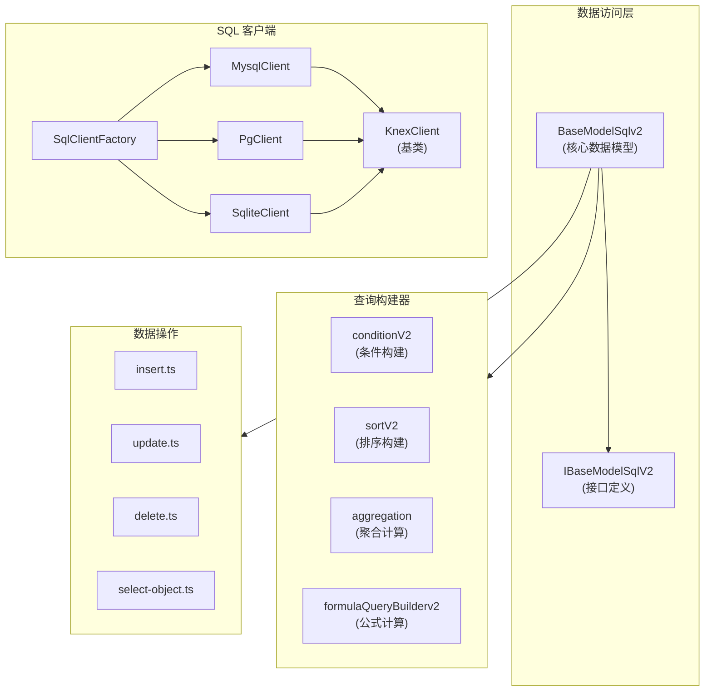
```mermaid
graph TB
    subgraph DAL["数据访问层"]
        BaseModelSqlv2["BaseModelSqlv2<br/>(核心数据模型)"]
        IBaseModelSqlV2["IBaseModelSqlV2<br/>(接口定义)"]
    end

    subgraph QueryBuilder["查询构建器"]
        ConditionV2["conditionV2<br/>(条件构建)"]
        SortV2["sortV2<br/>(排序构建)"]
        Aggregation["aggregation<br/>(聚合计算)"]
        FormulaBuilder["formulaQueryBuilderv2<br/>(公式计算)"]
    end

    subgraph SqlClient["SQL 客户端"]
        SqlClientFactory["SqlClientFactory"]
        MysqlClient["MysqlClient"]
        PgClient["PgClient"]
        SqliteClient["SqliteClient"]
        KnexClient["KnexClient<br/>(基类)"]
    end

    subgraph Operations["数据操作"]
        Insert["insert.ts"]
        Update["update.ts"]
        Delete["delete.ts"]
        SelectObject["select-object.ts"]
    end

    BaseModelSqlv2 --> IBaseModelSqlV2
    BaseModelSqlv2 --> QueryBuilder
    BaseModelSqlv2 --> Operations
    SqlClientFactory --> MysqlClient
    SqlClientFactory --> PgClient
    SqlClientFactory --> SqliteClient
    MysqlClient --> KnexClient
    PgClient --> KnexClient
    SqliteClient --> KnexClient
```

**关键组件:**

#### BaseModelSqlv2
核心数据访问模型，提供所有数据操作的抽象层：

```typescript
class BaseModelSqlv2 implements IBaseModelSqlV2 {
  // 核心属性
  protected model: Model;
  protected view: View;
  protected dbDriver: CustomKnex;

  // 主要操作
  async list(args: ListArgs): Promise<any[]>;
  async readByPk(id: string): Promise<any>;
  async insert(data: any): Promise<any>;
  async updateByPk(id: string, data: any): Promise<any>;
  async delByPk(id: string): Promise<void>;

  // 高级功能
  async execAndParse(qb: Knex.QueryBuilder): Promise<any[]>;
  async selectObject(args: SelectObjectArgs): Promise<Knex.QueryBuilder>;
}
```

#### SQL 客户端层级
所有数据库客户端继承自 `KnexClient`：

```typescript
abstract class KnexClient {
  protected sqlClient: Knex;

  abstract testConnection(): Promise<boolean>;
  abstract createTable(args: CreateTableArgs): Promise<void>;
  abstract alterTable(args: AlterTableArgs): Promise<void>;
  abstract getTableList(): Promise<TableInfo[]>;
  abstract getColumns(tableName: string): Promise<ColumnInfo[]>;
}
```

### 5.3 API 架构

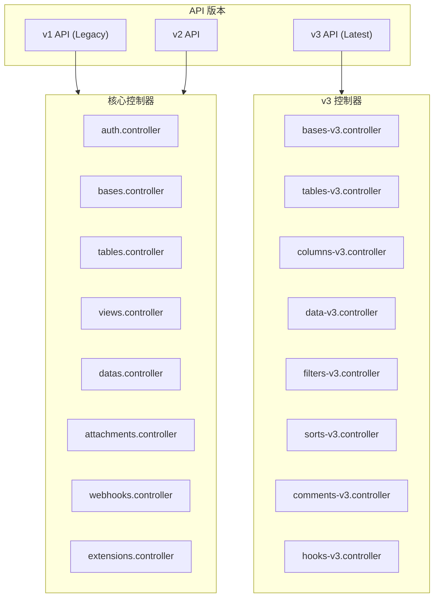
```mermaid
graph TB
    subgraph Versions["API 版本"]
        V1["v1 API (Legacy)"]
        V2["v2 API"]
        V3["v3 API (Latest)"]
    end

    subgraph V3Controllers["v3 控制器"]
        BasesV3["bases-v3.controller"]
        TablesV3["tables-v3.controller"]
        ColumnsV3["columns-v3.controller"]
        DataV3["data-v3.controller"]
        FiltersV3["filters-v3.controller"]
        SortsV3["sorts-v3.controller"]
        CommentsV3["comments-v3.controller"]
        HooksV3["hooks-v3.controller"]
    end

    subgraph CoreControllers["核心控制器"]
        Auth["auth.controller"]
        Bases["bases.controller"]
        Tables["tables.controller"]
        Views["views.controller"]
        Datas["datas.controller"]
        Attachments["attachments.controller"]
        Webhooks["webhooks.controller"]
        Extensions["extensions.controller"]
    end

    V3 --> V3Controllers
    V1 --> CoreControllers
    V2 --> CoreControllers
```

**API 端点分类:**

| 类别 | 端点 | 描述 |
|------|------|------|
| 认证 | `/api/v1/auth/*` | 登录、注册、令牌管理 |
| 工作区 | `/api/v1/workspaces/*` | 工作区 CRUD |
| Base | `/api/v1/bases/*` | Base/Project 管理 |
| 表格 | `/api/v1/tables/*` | 表格元数据操作 |
| 数据 | `/api/v1/data/*` | 数据 CRUD 操作 |
| 视图 | `/api/v1/views/*` | 视图管理 |
| 字段 | `/api/v1/columns/*` | 字段定义 |
| 附件 | `/api/v1/attachments/*` | 文件上传下载 |
| Webhooks | `/api/v1/hooks/*` | Webhook 配置 |

### 5.4 认证系统

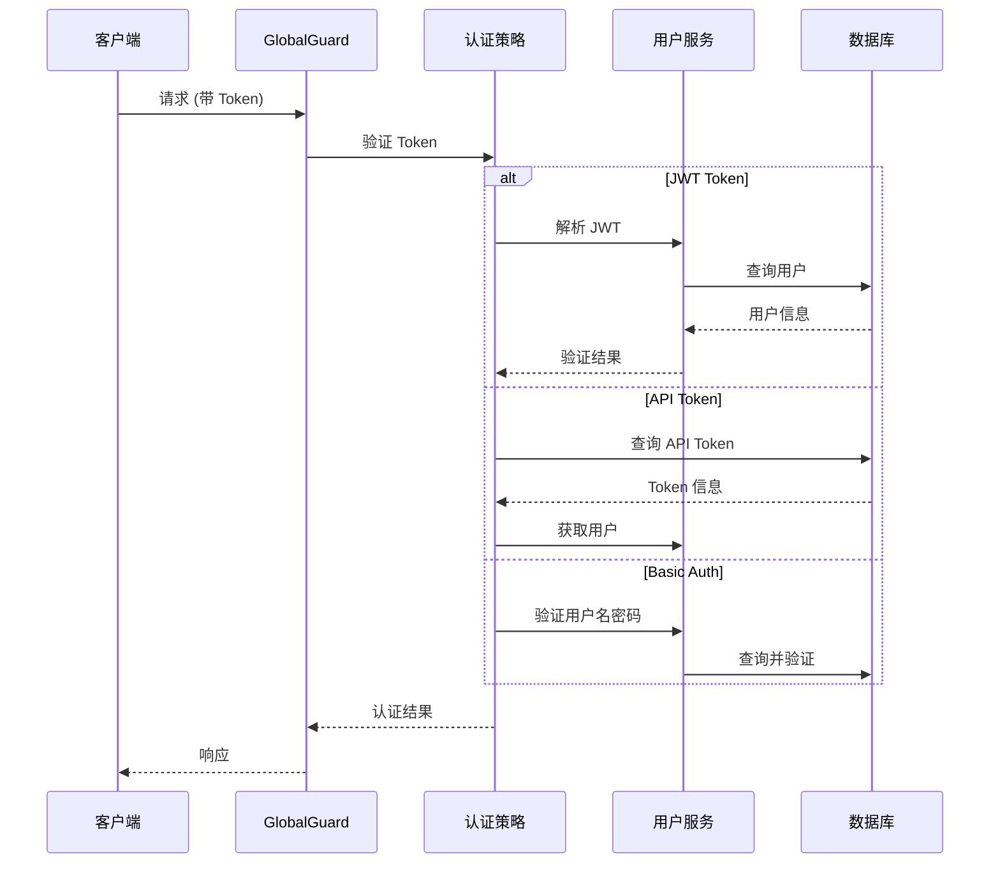
```mermaid
sequenceDiagram
    participant Client as 客户端
    participant Guard as GlobalGuard
    participant Strategy as 认证策略
    participant UserService as 用户服务
    participant DB as 数据库

    Client->>Guard: 请求 (带 Token)
    Guard->>Strategy: 验证 Token

    alt JWT Token
        Strategy->>UserService: 解析 JWT
        UserService->>DB: 查询用户
        DB-->>UserService: 用户信息
        UserService-->>Strategy: 验证结果
    else API Token
        Strategy->>DB: 查询 API Token
        DB-->>Strategy: Token 信息
        Strategy->>UserService: 获取用户
    else Basic Auth
        Strategy->>UserService: 验证用户名密码
        UserService->>DB: 查询并验证
    end

    Strategy-->>Guard: 认证结果
    Guard-->>Client: 响应
```

**支持的认证策略:**

1. **JWT 策略** (`jwt.strategy.ts`)
   - 默认认证方式
   - 支持 access token 和 refresh token
   - Token 存储在 Cookie 或 Header

2. **本地策略** (`local.strategy.ts`)
   - 用户名/邮箱 + 密码登录
   - 支持密码加密验证

3. **Basic Auth** (`basic.strategy.ts`)
   - HTTP Basic 认证
   - 用于 API 调用

4. **API Token** (`authtoken.strategy.ts`)
   - 长期有效的 API 令牌
   - 用于自动化集成

5. **Google OAuth** (`google.strategy.ts`)
   - Google SSO 登录
   - 支持自动用户创建

### 5.5 任务队列系统

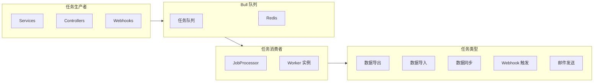
```mermaid
graph LR
    subgraph Producer["任务生产者"]
        Services["Services"]
        Controllers["Controllers"]
        Hooks["Webhooks"]
    end

    subgraph Queue["Bull 队列"]
        JobQueue["任务队列"]
        Redis["Redis"]
    end

    subgraph Consumer["任务消费者"]
        JobProcessor["JobProcessor"]
        Workers["Worker 实例"]
    end

    subgraph Jobs["任务类型"]
        Export["数据导出"]
        Import["数据导入"]
        Sync["数据同步"]
        Webhook["Webhook 触发"]
        Email["邮件发送"]
    end

    Producer --> Queue
    Queue --> Consumer
    Consumer --> Jobs
    Queue <--> Redis
```

**任务类型:**

- **数据导出**: CSV、Excel、JSON 导出
- **数据导入**: 批量数据导入
- **数据同步**: 外部数据源同步
- **Webhook 触发**: 异步 Webhook 调用
- **邮件发送**: 通知邮件发送
- **附件处理**: 图片缩略图生成

## 6. 前端架构详解

### 6.1 应用结构

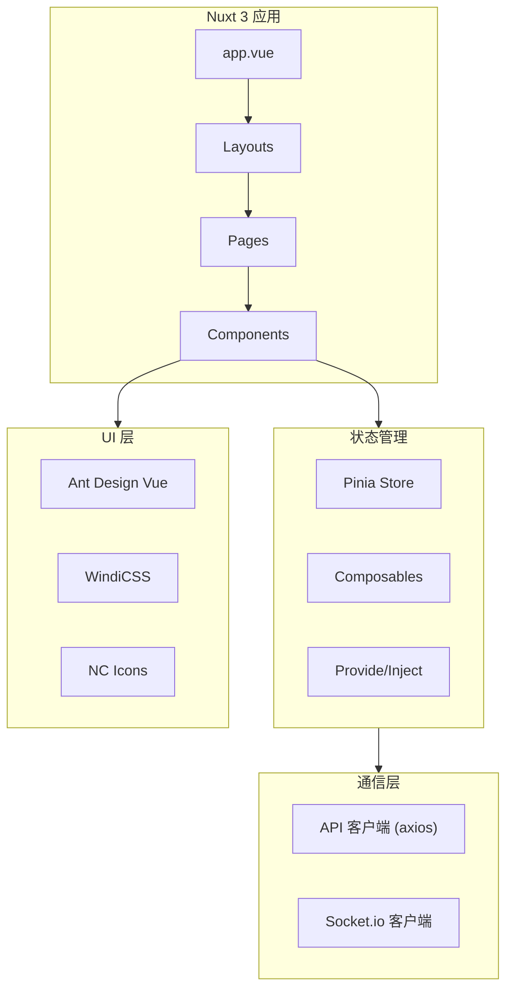
```mermaid
graph TB
    subgraph NuxtApp["Nuxt 3 应用"]
        AppVue["app.vue"]
        Layouts["Layouts"]
        Pages["Pages"]
        Components["Components"]
    end

    subgraph StateManagement["状态管理"]
        Pinia["Pinia Store"]
        Composables["Composables"]
        Provide["Provide/Inject"]
    end

    subgraph Communication["通信层"]
        API["API 客户端 (axios)"]
        Socket["Socket.io 客户端"]
    end

    subgraph UILayer["UI 层"]
        AntDesign["Ant Design Vue"]
        WindiCSS["WindiCSS"]
        CustomIcons["NC Icons"]
    end

    AppVue --> Layouts
    Layouts --> Pages
    Pages --> Components
    Components --> StateManagement
    Components --> UILayer
    StateManagement --> Communication
```

### 6.2 核心 Composables

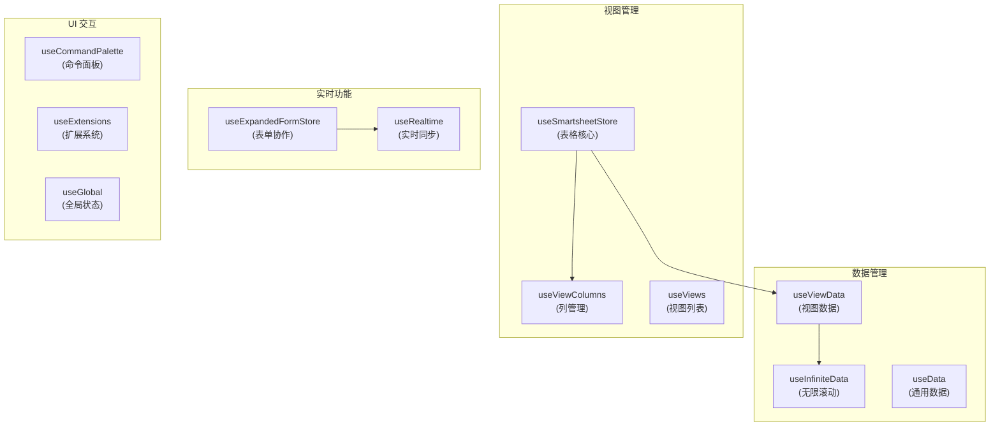
```mermaid
graph TB
    subgraph DataComposables["数据管理"]
        useViewData["useViewData<br/>(视图数据)"]
        useInfiniteData["useInfiniteData<br/>(无限滚动)"]
        useData["useData<br/>(通用数据)"]
    end

    subgraph ViewComposables["视图管理"]
        useSmartsheetStore["useSmartsheetStore<br/>(表格核心)"]
        useViewColumns["useViewColumns<br/>(列管理)"]
        useViews["useViews<br/>(视图列表)"]
    end

    subgraph RealTimeComposables["实时功能"]
        useRealtime["useRealtime<br/>(实时同步)"]
        useExpandedFormStore["useExpandedFormStore<br/>(表单协作)"]
    end

    subgraph UIComposables["UI 交互"]
        useCommandPalette["useCommandPalette<br/>(命令面板)"]
        useExtensions["useExtensions<br/>(扩展系统)"]
        useGlobal["useGlobal<br/>(全局状态)"]
    end

    useSmartsheetStore --> useViewData
    useViewData --> useInfiniteData
    useSmartsheetStore --> useViewColumns
    useExpandedFormStore --> useRealtime
```

**关键 Composables:**

| Composable | 功能 | 文件大小 |
|------------|------|----------|
| `useInfiniteData` | 无限滚动数据加载 | 2000+ 行 |
| `useSmartsheetStore` | 表格核心状态管理 | 1500+ 行 |
| `useViewColumns` | 列显示/隐藏/排序 | 800+ 行 |
| `useExpandedFormStore` | 展开表单协作 | 600+ 行 |
| `useRealtime` | 实时数据同步 | 400+ 行 |
| `useExtensions` | 扩展加载管理 | 300+ 行 |

### 6.3 组件架构

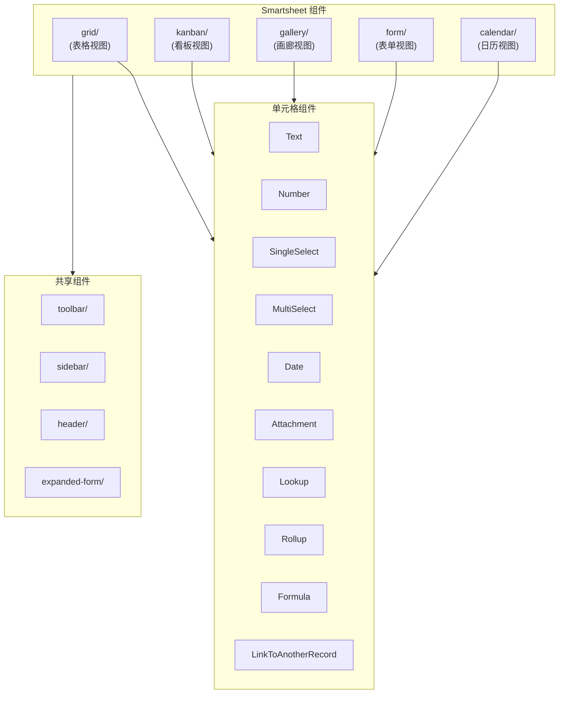
```mermaid
graph TB
    subgraph SmartsheetComponents["Smartsheet 组件"]
        Grid["grid/<br/>(表格视图)"]
        Kanban["kanban/<br/>(看板视图)"]
        Gallery["gallery/<br/>(画廊视图)"]
        Form["form/<br/>(表单视图)"]
        Calendar["calendar/<br/>(日历视图)"]
    end

    subgraph CellComponents["单元格组件"]
        Text["Text"]
        Number["Number"]
        SingleSelect["SingleSelect"]
        MultiSelect["MultiSelect"]
        Date["Date"]
        Attachment["Attachment"]
        Lookup["Lookup"]
        Rollup["Rollup"]
        Formula["Formula"]
        Link["LinkToAnotherRecord"]
    end

    subgraph SharedComponents["共享组件"]
        Toolbar["toolbar/"]
        Sidebar["sidebar/"]
        Header["header/"]
        ExpandedForm["expanded-form/"]
    end

    Grid --> CellComponents
    Kanban --> CellComponents
    Gallery --> CellComponents
    Form --> CellComponents
    Calendar --> CellComponents

    SmartsheetComponents --> SharedComponents
```

### 6.4 路由结构

```
pages/
├── index/                    # 首页/仪表盘
│   ├── index.vue
│   └── [typeOrId]/          # 工作区类型
├── nc/                       # 主应用路由
│   └── [...all].vue         # 动态路由
├── account/                  # 账户设置
│   ├── profile.vue
│   ├── tokens.vue
│   └── apps.vue
├── auth/                     # 认证页面
│   ├── signin.vue
│   ├── signup.vue
│   └── password/
└── projects/                 # 项目管理
    └── [baseId]/            # Base 详情
```

## 7. 实时协作系统

### 7.1 架构概览

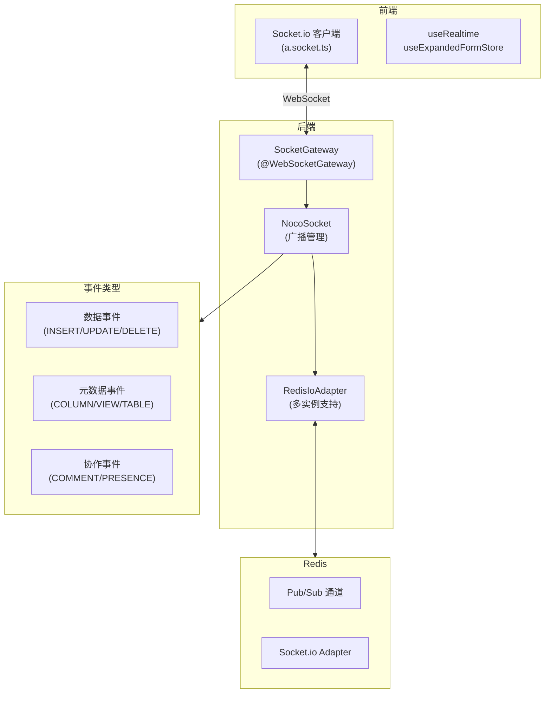
```mermaid
graph TB
    subgraph Frontend["前端"]
        SocketPlugin["Socket.io 客户端<br/>(a.socket.ts)"]
        Composables["useRealtime<br/>useExpandedFormStore"]
    end

    subgraph Backend["后端"]
        SocketGateway["SocketGateway<br/>(@WebSocketGateway)"]
        NocoSocket["NocoSocket<br/>(广播管理)"]
        RedisAdapter["RedisIoAdapter<br/>(多实例支持)"]
    end

    subgraph Events["事件类型"]
        DataEvents["数据事件<br/>(INSERT/UPDATE/DELETE)"]
        MetaEvents["元数据事件<br/>(COLUMN/VIEW/TABLE)"]
        CollabEvents["协作事件<br/>(COMMENT/PRESENCE)"]
    end

    subgraph Redis["Redis"]
        PubSub["Pub/Sub 通道"]
        Adapter["Socket.io Adapter"]
    end

    SocketPlugin <-->|WebSocket| SocketGateway
    SocketGateway --> NocoSocket
    NocoSocket --> RedisAdapter
    RedisAdapter <--> Redis
    NocoSocket --> Events
```

### 7.2 事件流程

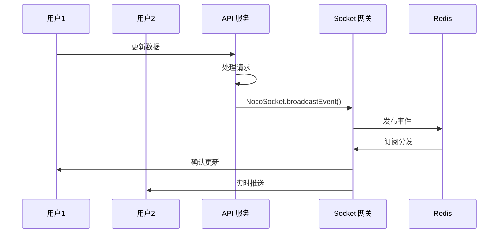
```mermaid
sequenceDiagram
    participant User1 as 用户1
    participant User2 as 用户2
    participant API as API 服务
    participant Socket as Socket 网关
    participant Redis as Redis

    User1->>API: 更新数据
    API->>API: 处理请求
    API->>Socket: NocoSocket.broadcastEvent()
    Socket->>Redis: 发布事件
    Redis->>Socket: 订阅分发
    Socket->>User1: 确认更新
    Socket->>User2: 实时推送
```

### 7.3 事件类型

```typescript
enum EventType {
  // 数据事件
  DATA_INSERT = 'data:insert',
  DATA_UPDATE = 'data:update',
  DATA_DELETE = 'data:delete',
  DATA_BULK_INSERT = 'data:bulk:insert',
  DATA_BULK_UPDATE = 'data:bulk:update',
  DATA_BULK_DELETE = 'data:bulk:delete',

  // 元数据事件
  TABLE_CREATE = 'table:create',
  TABLE_UPDATE = 'table:update',
  TABLE_DELETE = 'table:delete',
  COLUMN_CREATE = 'column:create',
  COLUMN_UPDATE = 'column:update',
  COLUMN_DELETE = 'column:delete',
  VIEW_CREATE = 'view:create',
  VIEW_UPDATE = 'view:update',
  VIEW_DELETE = 'view:delete',

  // 协作事件
  COMMENT_CREATE = 'comment:create',
  COMMENT_UPDATE = 'comment:update',
  USER_PRESENCE = 'user:presence',
}
```

### 7.4 NocoSocket 实现

```typescript
class NocoSocket {
  private static ioServer: SocketIo.Server;

  // 广播给 Base 所有用户
  static broadcastEvent(args: {
    eventType: EventType;
    baseId: string;
    payload: any;
  }): void;

  // 广播给特定用户
  static broadcastEventToUser(args: {
    eventType: EventType;
    userId: string;
    payload: any;
  }): void;

  // 广播给 Base 所有成员
  static broadcastEventToBaseUsers(args: {
    eventType: EventType;
    baseId: string;
    payload: any;
  }): void;
}
```

## 8. 插件系统

### 8.1 插件架构

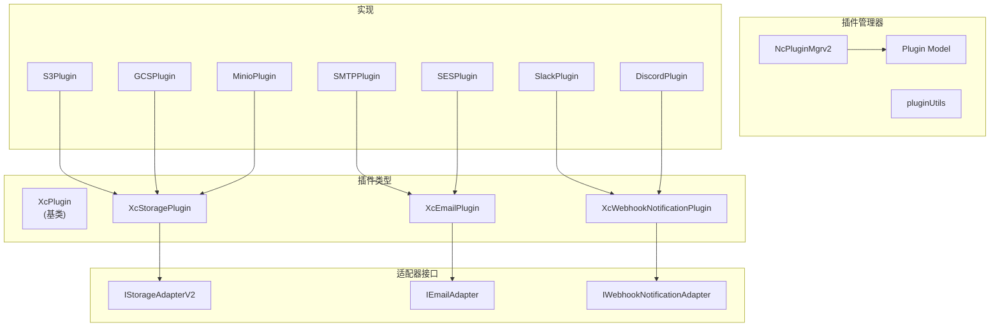
```mermaid
graph TB
    subgraph PluginManager["插件管理器"]
        NcPluginMgrv2["NcPluginMgrv2"]
        PluginModel["Plugin Model"]
        PluginUtils["pluginUtils"]
    end

    subgraph PluginTypes["插件类型"]
        XcPlugin["XcPlugin<br/>(基类)"]
        XcStoragePlugin["XcStoragePlugin"]
        XcEmailPlugin["XcEmailPlugin"]
        XcWebhookNotificationPlugin["XcWebhookNotificationPlugin"]
    end

    subgraph Adapters["适配器接口"]
        IStorageAdapterV2["IStorageAdapterV2"]
        IEmailAdapter["IEmailAdapter"]
        IWebhookNotificationAdapter["IWebhookNotificationAdapter"]
    end

    subgraph Implementations["实现"]
        S3["S3Plugin"]
        GCS["GCSPlugin"]
        MinIO["MinioPlugin"]
        SMTP["SMTPPlugin"]
        SES["SESPlugin"]
        Slack["SlackPlugin"]
        Discord["DiscordPlugin"]
    end

    NcPluginMgrv2 --> PluginModel
    XcStoragePlugin --> IStorageAdapterV2
    XcEmailPlugin --> IEmailAdapter
    XcWebhookNotificationPlugin --> IWebhookNotificationAdapter

    S3 --> XcStoragePlugin
    GCS --> XcStoragePlugin
    MinIO --> XcStoragePlugin
    SMTP --> XcEmailPlugin
    SES --> XcEmailPlugin
    Slack --> XcWebhookNotificationPlugin
    Discord --> XcWebhookNotificationPlugin
```

### 8.2 插件接口定义

```typescript
// 存储适配器接口
interface IStorageAdapterV2 {
  init(): Promise<void>;
  test(): Promise<boolean>;
  fileCreate(key: string, file: XcFile): Promise<string>;
  fileRead(key: string): Promise<Buffer>;
  fileDelete(key: string): Promise<void>;
  getSignedUrl(key: string, expiresInSeconds: number): Promise<string>;
  scanFiles(prefix: string): AsyncIterable<string>;
}

// 邮件适配器接口
interface IEmailAdapter {
  init(): Promise<void>;
  test(): Promise<boolean>;
  mailSend(mail: Email): Promise<boolean>;
}

// Webhook 通知适配器接口
interface IWebhookNotificationAdapter {
  init(): Promise<void>;
  test(): Promise<boolean>;
  sendMessage(content: string, payload: any): Promise<boolean>;
}
```

### 8.3 插件清单

| 类别 | 插件 | 描述 |
|------|------|------|
| **存储** | S3 | AWS S3 存储 |
| | GCS | Google Cloud Storage |
| | MinIO | MinIO 对象存储 |
| | Backblaze B2 | Backblaze 存储 |
| | DigitalOcean Spaces | DO 对象存储 |
| | Vultr Object Storage | Vultr 存储 |
| | OVH Cloud | OVH 对象存储 |
| | Linode | Linode 存储 |
| | Scaleway | Scaleway 存储 |
| | UpCloud | UpCloud 存储 |
| | Local | 本地文件系统 |
| **邮件** | SMTP | 通用 SMTP |
| | SES | AWS SES |
| | MailerSend | MailerSend 服务 |
| **通知** | Slack | Slack 通知 |
| | Discord | Discord 通知 |
| | Mattermost | Mattermost 通知 |
| | Microsoft Teams | Teams 通知 |
| | Twilio | Twilio SMS |

### 8.4 插件注册流程

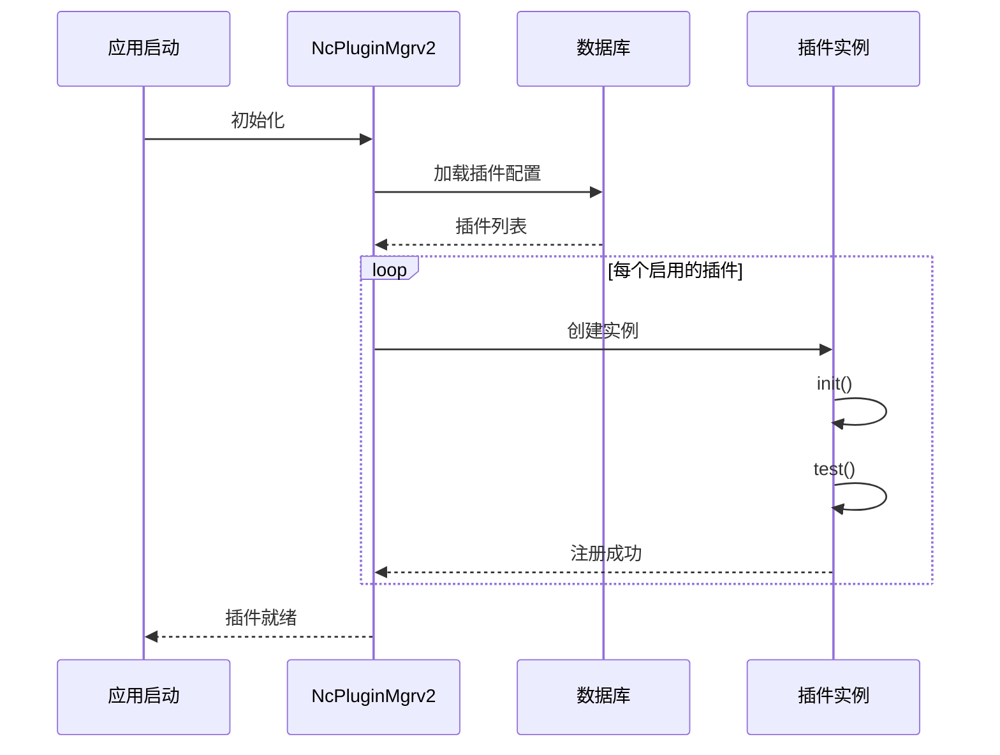
```mermaid
sequenceDiagram
    participant App as 应用启动
    participant Manager as NcPluginMgrv2
    participant DB as 数据库
    participant Plugin as 插件实例

    App->>Manager: 初始化
    Manager->>DB: 加载插件配置
    DB-->>Manager: 插件列表

    loop 每个启用的插件
        Manager->>Plugin: 创建实例
        Plugin->>Plugin: init()
        Plugin->>Plugin: test()
        Plugin-->>Manager: 注册成功
    end

    Manager-->>App: 插件就绪
```

## 9. 数据模型

### 9.1 核心模型关系

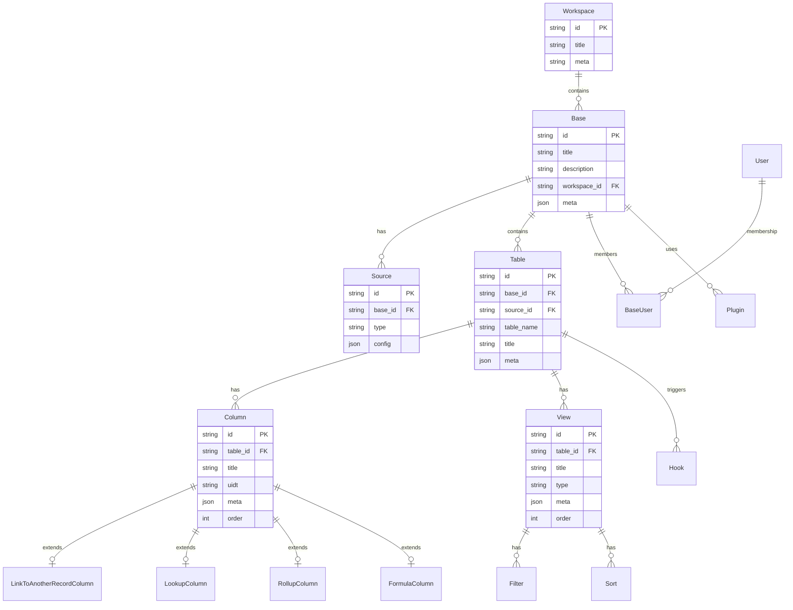
```mermaid
erDiagram
    Workspace ||--o{ Base : contains
    Base ||--o{ Source : has
    Base ||--o{ Table : contains
    Table ||--o{ Column : has
    Table ||--o{ View : has
    View ||--o{ Filter : has
    View ||--o{ Sort : has
    Column ||--o| LinkToAnotherRecordColumn : extends
    Column ||--o| LookupColumn : extends
    Column ||--o| RollupColumn : extends
    Column ||--o| FormulaColumn : extends
    User ||--o{ BaseUser : membership
    Base ||--o{ BaseUser : members
    Table ||--o{ Hook : triggers
    Base ||--o{ Plugin : uses

    Workspace {
        string id PK
        string title
        string meta
    }

    Base {
        string id PK
        string title
        string description
        string workspace_id FK
        json meta
    }

    Source {
        string id PK
        string base_id FK
        string type
        json config
    }

    Table {
        string id PK
        string base_id FK
        string source_id FK
        string table_name
        string title
        json meta
    }

    Column {
        string id PK
        string table_id FK
        string title
        string uidt
        json meta
        int order
    }

    View {
        string id PK
        string table_id FK
        string title
        string type
        json meta
        int order
    }
```

### 9.2 字段类型 (UITypes)

```typescript
enum UITypes {
  // 基础类型
  ID = 'ID',
  SingleLineText = 'SingleLineText',
  LongText = 'LongText',
  Number = 'Number',
  Decimal = 'Decimal',
  Currency = 'Currency',
  Percent = 'Percent',

  // 选择类型
  SingleSelect = 'SingleSelect',
  MultiSelect = 'MultiSelect',
  Checkbox = 'Checkbox',
  Rating = 'Rating',

  // 日期时间
  Date = 'Date',
  DateTime = 'DateTime',
  Time = 'Time',
  Duration = 'Duration',
  Year = 'Year',

  // 关联类型
  LinkToAnotherRecord = 'LinkToAnotherRecord',
  Links = 'Links',
  Lookup = 'Lookup',
  Rollup = 'Rollup',

  // 计算类型
  Formula = 'Formula',
  Count = 'Count',

  // 媒体类型
  Attachment = 'Attachment',

  // 其他
  Email = 'Email',
  PhoneNumber = 'PhoneNumber',
  URL = 'URL',
  JSON = 'JSON',
  Barcode = 'Barcode',
  QrCode = 'QrCode',
  GeoData = 'GeoData',
  User = 'User',
  CreatedBy = 'CreatedBy',
  LastModifiedBy = 'LastModifiedBy',
  CreatedTime = 'CreatedTime',
  LastModifiedTime = 'LastModifiedTime',
}
```

### 9.3 关联列类型

```typescript
// LinkToAnotherRecord - 表间关联
interface LinkToAnotherRecordColumn {
  id: string;
  fk_column_id: string;           // 当前列 ID
  fk_related_model_id: string;    // 关联表 ID
  fk_child_column_id: string;     // 子表外键列
  fk_parent_column_id: string;    // 父表主键列
  fk_mm_model_id?: string;        // 多对多中间表
  type: RelationTypes;            // hm | mm | bt
  virtual: boolean;
}

// Lookup - 查找关联表字段
interface LookupColumn {
  id: string;
  fk_column_id: string;
  fk_relation_column_id: string;  // 关联列
  fk_lookup_column_id: string;    // 查找目标列
}

// Rollup - 聚合关联表数据
interface RollupColumn {
  id: string;
  fk_column_id: string;
  fk_relation_column_id: string;
  fk_rollup_column_id: string;
  rollup_function: string;        // sum | avg | count | min | max
}
```

## 10. SDK 生成

### 10.1 SDK 架构

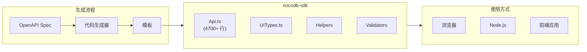
```mermaid
graph LR
    subgraph Generation["生成流程"]
        OpenAPI["OpenAPI Spec"]
        Generator["代码生成器"]
        Templates["模板"]
    end

    subgraph SDK["nocodb-sdk"]
        Api["Api.ts<br/>(4700+ 行)"]
        UITypes["UITypes.ts"]
        Helpers["Helpers"]
        Validators["Validators"]
    end

    subgraph Usage["使用方式"]
        Browser["浏览器"]
        NodeJS["Node.js"]
        Frontend["前端应用"]
    end

    OpenAPI --> Generator
    Generator --> Templates
    Templates --> SDK
    SDK --> Usage
```

### 10.2 SDK 使用示例

```typescript
import { Api } from 'nocodb-sdk';

const api = new Api({
  baseURL: 'http://localhost:8080',
  headers: {
    'xc-token': 'your-api-token'
  }
});

// 获取表格列表
const tables = await api.dbTable.list('base_id');

// 读取数据
const records = await api.dbTableRow.list(
  'noco',
  'base_id',
  'table_name',
  { limit: 25, offset: 0 }
);

// 创建记录
const newRecord = await api.dbTableRow.create(
  'noco',
  'base_id',
  'table_name',
  { field1: 'value1', field2: 'value2' }
);

// 更新记录
await api.dbTableRow.update(
  'noco',
  'base_id',
  'table_name',
  'row_id',
  { field1: 'new_value' }
);
```

## 11. 扩展系统

### 11.1 前端扩展架构

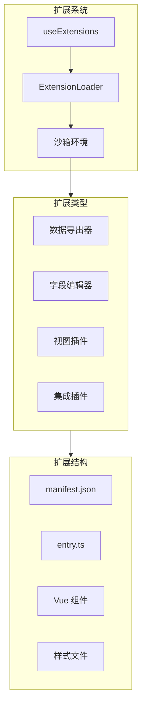
```mermaid
graph TB
    subgraph ExtensionSystem["扩展系统"]
        useExtensions["useExtensions"]
        ExtensionLoader["ExtensionLoader"]
        Sandbox["沙箱环境"]
    end

    subgraph ExtensionTypes["扩展类型"]
        DataExporter["数据导出器"]
        FieldEditor["字段编辑器"]
        ViewPlugin["视图插件"]
        Integration["集成插件"]
    end

    subgraph ExtensionStructure["扩展结构"]
        Manifest["manifest.json"]
        Entry["entry.ts"]
        Components["Vue 组件"]
        Styles["样式文件"]
    end

    useExtensions --> ExtensionLoader
    ExtensionLoader --> Sandbox
    Sandbox --> ExtensionTypes
    ExtensionTypes --> ExtensionStructure
```

### 11.2 扩展 Manifest

```json
{
  "name": "data-exporter",
  "title": "Data Exporter",
  "description": "Export data to various formats",
  "version": "1.0.0",
  "author": "NocoDB",
  "icon": "export",
  "entry": "index.js",
  "permissions": [
    "read:data",
    "write:file"
  ],
  "config": {
    "formats": ["csv", "excel", "json"]
  }
}
```

## 12. 部署架构

### 12.1 单节点部署

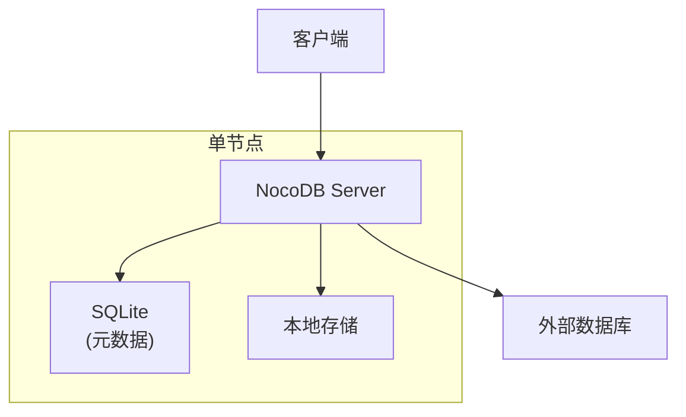
```mermaid
graph TB
    subgraph SingleNode["单节点"]
        NocoDB["NocoDB Server"]
        SQLite["SQLite<br/>(元数据)"]
        LocalStorage["本地存储"]
    end

    Client["客户端"] --> NocoDB
    NocoDB --> SQLite
    NocoDB --> LocalStorage
    NocoDB --> ExternalDB["外部数据库"]
```

### 12.2 高可用部署

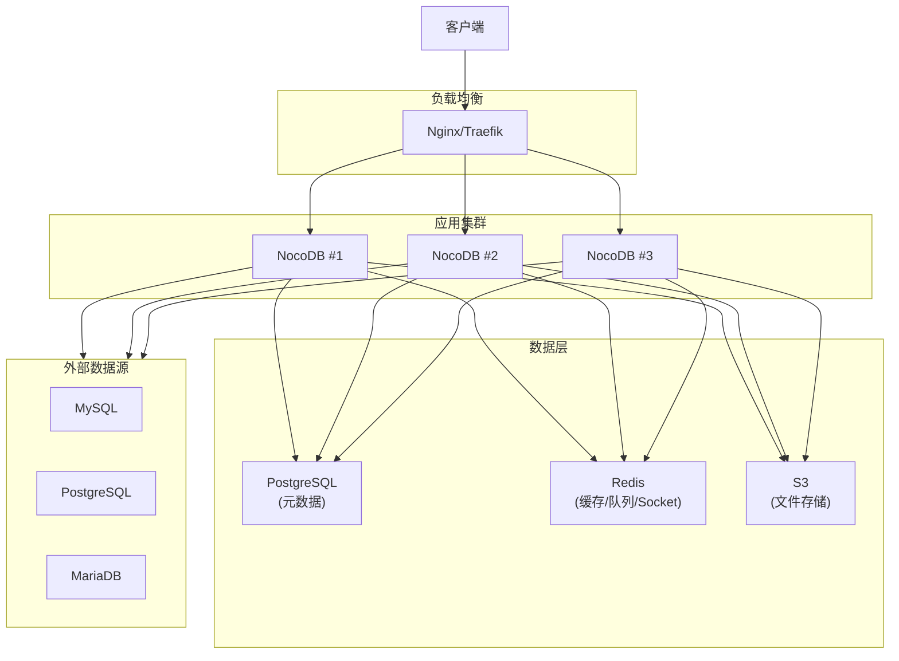
```mermaid
graph TB
    subgraph LoadBalancer["负载均衡"]
        LB["Nginx/Traefik"]
    end

    subgraph AppCluster["应用集群"]
        Node1["NocoDB #1"]
        Node2["NocoDB #2"]
        Node3["NocoDB #3"]
    end

    subgraph DataLayer["数据层"]
        PostgreSQL["PostgreSQL<br/>(元数据)"]
        Redis["Redis<br/>(缓存/队列/Socket)"]
        S3["S3<br/>(文件存储)"]
    end

    subgraph ExternalDBs["外部数据源"]
        MySQL["MySQL"]
        PG["PostgreSQL"]
        MariaDB["MariaDB"]
    end

    Client["客户端"] --> LB
    LB --> Node1
    LB --> Node2
    LB --> Node3

    Node1 --> PostgreSQL
    Node1 --> Redis
    Node1 --> S3
    Node2 --> PostgreSQL
    Node2 --> Redis
    Node2 --> S3
    Node3 --> PostgreSQL
    Node3 --> Redis
    Node3 --> S3

    Node1 --> ExternalDBs
    Node2 --> ExternalDBs
    Node3 --> ExternalDBs
```

### 12.3 Kubernetes 部署

```yaml
# 简化的 Helm Values
nocodb:
  replicaCount: 3

  image:
    repository: nocodb/nocodb
    tag: latest

  env:
    NC_DB: "pg://host:port?u=user&p=pass&d=db"
    NC_REDIS_URL: "redis://redis:6379"

  storage:
    type: s3
    bucket: nocodb-attachments

  resources:
    limits:
      cpu: "2"
      memory: "4Gi"
    requests:
      cpu: "500m"
      memory: "1Gi"

  autoscaling:
    enabled: true
    minReplicas: 3
    maxReplicas: 10
    targetCPU: 70
```

## 13. 性能优化

### 13.1 缓存策略

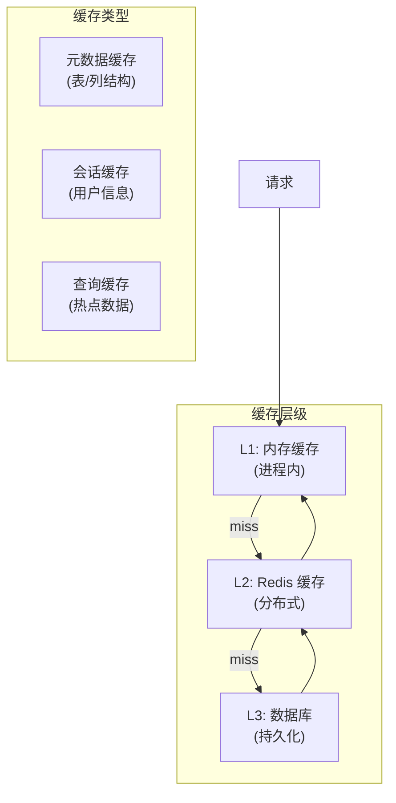
```mermaid
graph TB
    subgraph CacheLayers["缓存层级"]
        L1["L1: 内存缓存<br/>(进程内)"]
        L2["L2: Redis 缓存<br/>(分布式)"]
        L3["L3: 数据库<br/>(持久化)"]
    end

    subgraph CacheTypes["缓存类型"]
        MetaCache["元数据缓存<br/>(表/列结构)"]
        SessionCache["会话缓存<br/>(用户信息)"]
        QueryCache["查询缓存<br/>(热点数据)"]
    end

    Request["请求"] --> L1
    L1 -->|miss| L2
    L2 -->|miss| L3
    L3 --> L2
    L2 --> L1
```

### 13.2 查询优化

- **分页查询**: 使用 offset/limit 分页
- **虚拟滚动**: 前端只渲染可视区域
- **字段选择**: 只查询需要的字段
- **索引优化**: 自动创建常用查询索引
- **批量操作**: 批量插入/更新/删除

### 13.3 前端优化

- **代码分割**: 路由级别代码分割
- **懒加载**: 组件按需加载
- **虚拟列表**: 大数据表格虚拟滚动
- **防抖/节流**: 输入和滚动事件优化
- **Web Worker**: 大数据处理离线计算

## 14. 安全特性

### 14.1 安全架构

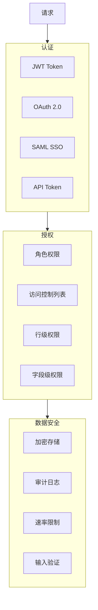
```mermaid
graph TB
    subgraph Authentication["认证"]
        JWT["JWT Token"]
        OAuth["OAuth 2.0"]
        SAML["SAML SSO"]
        APIToken["API Token"]
    end

    subgraph Authorization["授权"]
        RBAC["角色权限"]
        ACL["访问控制列表"]
        RowLevel["行级权限"]
        FieldLevel["字段级权限"]
    end

    subgraph DataSecurity["数据安全"]
        Encryption["加密存储"]
        Audit["审计日志"]
        RateLimit["速率限制"]
        InputValidation["输入验证"]
    end

    Request["请求"] --> Authentication
    Authentication --> Authorization
    Authorization --> DataSecurity
```

### 14.2 权限模型

| 角色 | 描述 | 权限 |
|------|------|------|
| Owner | 工作区所有者 | 所有权限 |
| Creator | 创建者 | 创建/编辑表格和视图 |
| Editor | 编辑者 | 编辑数据 |
| Commenter | 评论者 | 查看和评论 |
| Viewer | 查看者 | 只读访问 |
| No Access | 无权限 | 无法访问 |

## 15. 监控与可观测性

### 15.1 监控架构

```mermaid
graph LR
    subgraph Application["应用"]
        NocoDB["NocoDB"]
        Metrics["指标收集"]
        Logs["日志"]
        Traces["链路追踪"]
    end

    subgraph Observability["可观测性"]
        Prometheus["Prometheus"]
        Grafana["Grafana"]
        ELK["ELK Stack"]
        Jaeger["Jaeger"]
    end

    NocoDB --> Metrics --> Prometheus --> Grafana
    NocoDB --> Logs --> ELK
    NocoDB --> Traces --> Jaeger
```

### 15.2 关键指标

- **API 延迟**: 请求响应时间
- **错误率**: 5xx 错误比例
- **活跃连接**: WebSocket 连接数
- **队列深度**: Bull 任务积压
- **缓存命中**: Redis 命中率
- **数据库连接**: 连接池使用率

## 16. 总结

NocoDB 是一个设计精良的现代化数据库管理平台，具有以下特点：

### 架构优势

1. **模块化设计**: 基于 NestJS 的模块化后端，易于扩展和维护
2. **多数据库支持**: 统一的数据库抽象层，支持主流关系型数据库
3. **实时协作**: 基于 Socket.io + Redis 的实时同步方案
4. **可扩展插件**: 完善的插件系统，支持存储、邮件、通知等扩展
5. **类型安全**: TypeScript 全栈开发，自动生成 SDK

### 技术亮点

1. **BaseModelSqlv2**: 强大的数据访问抽象层
2. **公式引擎**: 支持复杂的公式计算
3. **关联查询**: Lookup、Rollup 等高级关联功能
4. **实时事件**: 细粒度的数据变更推送
5. **高可用**: 支持水平扩展和 Kubernetes 部署

### 适用场景

- 替代 Airtable 的内部数据管理平台
- 快速搭建后台管理系统
- 低代码/无代码数据库应用
- 团队协作数据中心
- API 快速开发平台
