# Qdrant 架构设计分析

## 1. 项目概述

**Qdrant** (读作 "quadrant") 是一个高性能的向量相似度搜索引擎和向量数据库，完全使用 Rust 编写。它提供了一个生产就绪的服务，具备便捷的 API 用于存储、搜索和管理 **向量点 (points)** —— 带有额外元数据 (payload) 的向量。

### 基本信息

| 属性 | 值 |
|------|-----|
| 版本 | 1.16.3 |
| 语言 | Rust (Edition 2024, MSRV: 1.89) |
| 许可证 | Apache 2.0 |
| 仓库 | github.com/qdrant/qdrant |

### 核心特性

- **高性能向量搜索**: 基于 HNSW 算法的近似最近邻搜索
- **丰富的过滤能力**: 支持 payload 元数据过滤与向量搜索组合
- **分布式架构**: 基于 Raft 共识的水平扩展能力
- **多种向量类型**: 支持稠密向量、稀疏向量、多向量
- **向量量化**: Binary、Scalar、Product Quantization
- **GPU 加速**: 可选的 GPU 索引构建支持

---

## 2. 整体架构

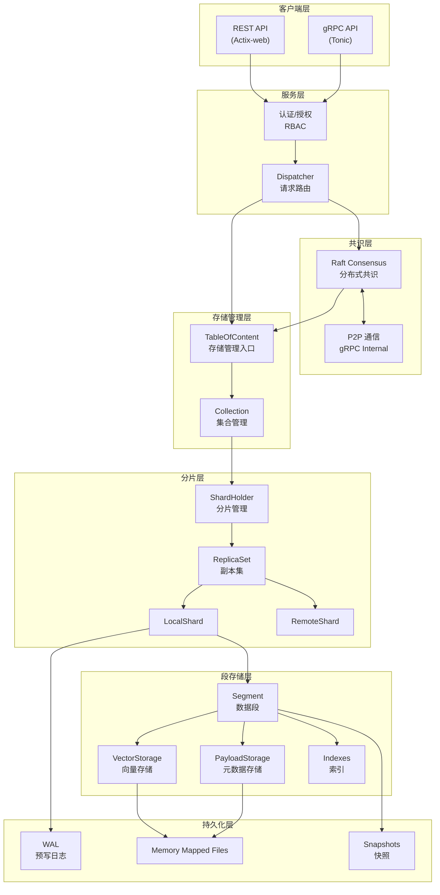
```mermaid
graph TB
    subgraph "客户端层"
        REST["REST API<br/>(Actix-web)"]
        GRPC["gRPC API<br/>(Tonic)"]
    end

    subgraph "服务层"
        AUTH["认证/授权<br/>RBAC"]
        DISPATCH["Dispatcher<br/>请求路由"]
    end

    subgraph "共识层"
        CONSENSUS["Raft Consensus<br/>分布式共识"]
        P2P["P2P 通信<br/>gRPC Internal"]
    end

    subgraph "存储管理层"
        TOC["TableOfContent<br/>存储管理入口"]
        COLLECTION["Collection<br/>集合管理"]
    end

    subgraph "分片层"
        SHARD["ShardHolder<br/>分片管理"]
        REPLICA["ReplicaSet<br/>副本集"]
        LOCAL["LocalShard"]
        REMOTE["RemoteShard"]
    end

    subgraph "段存储层"
        SEGMENT["Segment<br/>数据段"]
        VECTOR["VectorStorage<br/>向量存储"]
        PAYLOAD["PayloadStorage<br/>元数据存储"]
        INDEX["Indexes<br/>索引"]
    end

    subgraph "持久化层"
        WAL["WAL<br/>预写日志"]
        MMAP["Memory Mapped Files"]
        SNAP["Snapshots<br/>快照"]
    end

    REST --> AUTH
    GRPC --> AUTH
    AUTH --> DISPATCH
    DISPATCH --> CONSENSUS
    DISPATCH --> TOC
    CONSENSUS <--> P2P
    CONSENSUS --> TOC
    TOC --> COLLECTION
    COLLECTION --> SHARD
    SHARD --> REPLICA
    REPLICA --> LOCAL
    REPLICA --> REMOTE
    LOCAL --> SEGMENT
    SEGMENT --> VECTOR
    SEGMENT --> PAYLOAD
    SEGMENT --> INDEX
    VECTOR --> MMAP
    PAYLOAD --> MMAP
    LOCAL --> WAL
    SEGMENT --> SNAP
```

---

## 3. 项目目录结构

```
qdrant/
├── src/                           # 主服务实现
│   ├── main.rs                   # 应用入口点
│   ├── actix/                    # REST API 层
│   │   ├── api/                 # API 端点
│   │   ├── auth/                # 认证/RBAC
│   │   └── web_ui/              # Web UI 服务
│   ├── tonic/                    # gRPC API 层
│   ├── consensus.rs             # Raft 共识实现
│   ├── common/                  # 核心工具
│   │   ├── telemetry.rs        # 遥测收集
│   │   ├── health.rs           # 健康检查
│   │   └── inference/          # 推理服务
│   └── settings.rs             # 配置管理
├── lib/                          # 核心库
│   ├── collection/              # 集合管理
│   ├── segment/                 # 底层段操作
│   ├── storage/                 # 存储层和持久化
│   ├── api/                     # REST/gRPC 定义
│   ├── common/                  # 公共工具
│   ├── quantization/            # 向量量化
│   ├── shard/                   # 分片抽象
│   └── sparse/                  # 稀疏向量支持
├── config/                       # 配置文件
├── openapi/                      # OpenAPI 规范
└── tests/                        # 测试套件
```

---

## 4. 核心组件详解

### 4.1 主入口 (main.rs)

应用启动流程:

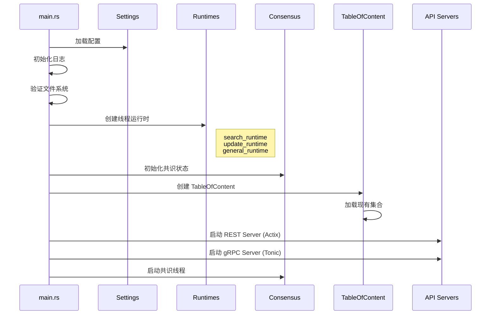
```mermaid
sequenceDiagram
    participant Main as main.rs
    participant Settings as Settings
    participant Runtime as Runtimes
    participant Consensus as Consensus
    participant TOC as TableOfContent
    participant API as API Servers

    Main->>Settings: 加载配置
    Main->>Main: 初始化日志
    Main->>Main: 验证文件系统
    Main->>Runtime: 创建线程运行时
    Note right of Runtime: search_runtime<br/>update_runtime<br/>general_runtime
    Main->>Consensus: 初始化共识状态
    Main->>TOC: 创建 TableOfContent
    TOC->>TOC: 加载现有集合
    Main->>API: 启动 REST Server (Actix)
    Main->>API: 启动 gRPC Server (Tonic)
    Main->>Consensus: 启动共识线程
```

**关键初始化步骤:**

1. **参数解析**: 使用 Clap 解析命令行参数
2. **配置加载**: 从 YAML 文件加载配置
3. **特性标志**: 初始化全局特性标志
4. **日志设置**: 配置 tracing 日志系统
5. **内存分配器**: x86_64/aarch64 上使用 Jemalloc
6. **GPU 初始化**: 可选的 GPU 设备管理器
7. **运行时创建**:
   - `search_runtime`: 查询操作
   - `update_runtime`: 优化任务
   - `general_runtime`: 通用任务
8. **共识设置**: Raft 共识初始化
9. **存储初始化**: TableOfContent 创建和集合加载
10. **API 启动**: REST 和 gRPC 服务器

### 4.2 存储层 (Storage Layer)

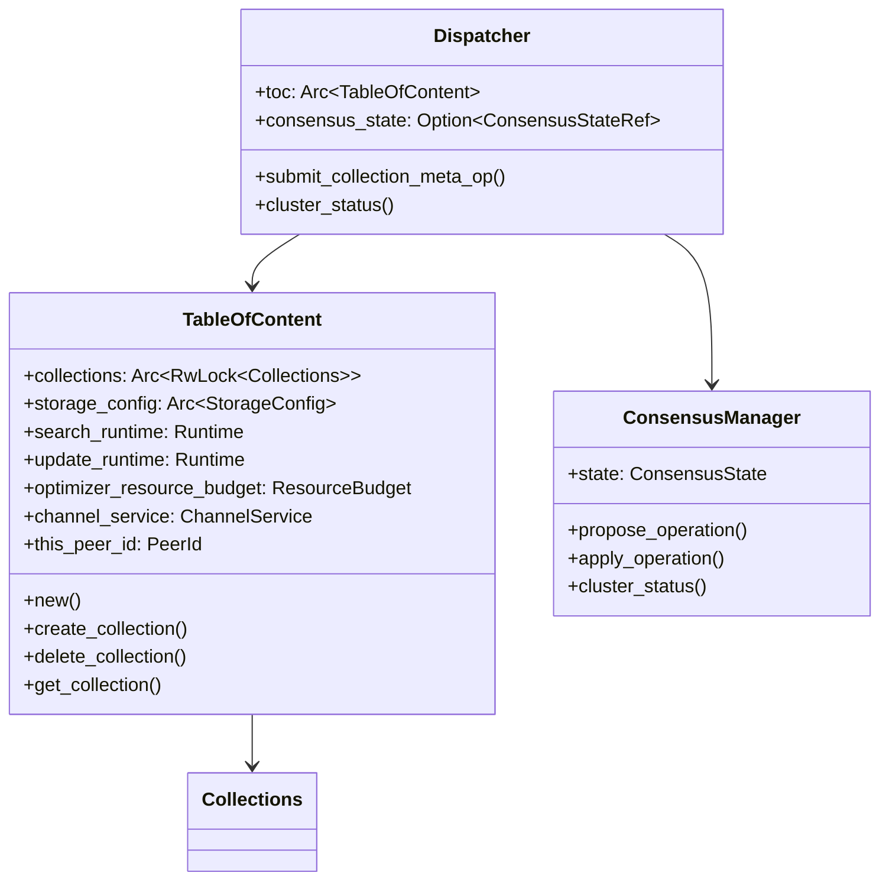
```mermaid
classDiagram
    class Dispatcher {
        +toc: Arc~TableOfContent~
        +consensus_state: Option~ConsensusStateRef~
        +submit_collection_meta_op()
        +cluster_status()
    }

    class TableOfContent {
        +collections: Arc~RwLock~Collections~~
        +storage_config: Arc~StorageConfig~
        +search_runtime: Runtime
        +update_runtime: Runtime
        +optimizer_resource_budget: ResourceBudget
        +channel_service: ChannelService
        +this_peer_id: PeerId
        +new()
        +create_collection()
        +delete_collection()
        +get_collection()
    }

    class ConsensusManager {
        +state: ConsensusState
        +propose_operation()
        +apply_operation()
        +cluster_status()
    }

    Dispatcher --> TableOfContent
    Dispatcher --> ConsensusManager
    TableOfContent --> Collections
```

**Dispatcher**: 请求路由器，决定操作是直接到存储还是通过共识

**TableOfContent**: 存储服务的主入口点
- 管理所有集合
- 维护运行时和资源预算
- 协调分布式操作

### 4.3 集合层 (Collection Layer)

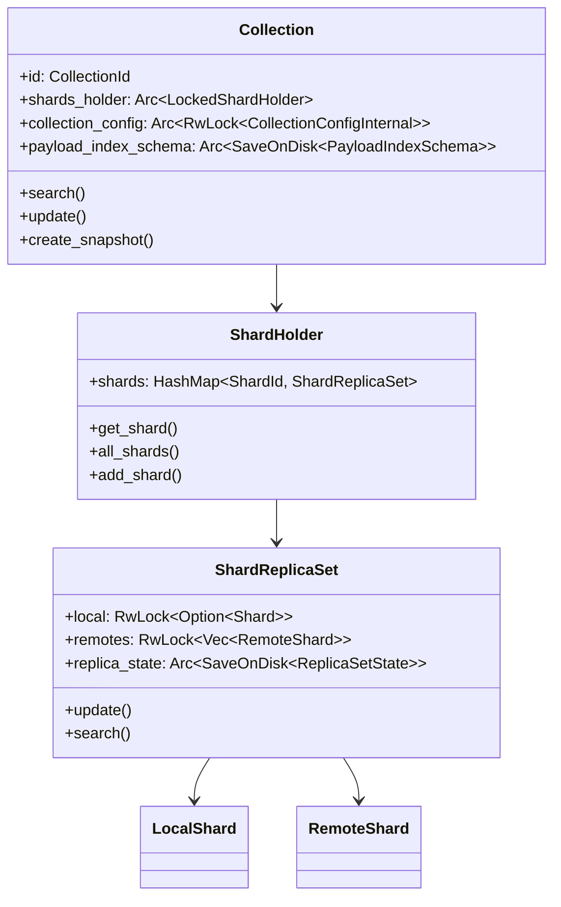
```mermaid
classDiagram
    class Collection {
        +id: CollectionId
        +shards_holder: Arc~LockedShardHolder~
        +collection_config: Arc~RwLock~CollectionConfigInternal~~
        +payload_index_schema: Arc~SaveOnDisk~PayloadIndexSchema~~
        +search()
        +update()
        +create_snapshot()
    }

    class ShardHolder {
        +shards: HashMap~ShardId, ShardReplicaSet~
        +get_shard()
        +all_shards()
        +add_shard()
    }

    class ShardReplicaSet {
        +local: RwLock~Option~Shard~~
        +remotes: RwLock~Vec~RemoteShard~~
        +replica_state: Arc~SaveOnDisk~ReplicaSetState~~
        +update()
        +search()
    }

    Collection --> ShardHolder
    ShardHolder --> ShardReplicaSet
    ShardReplicaSet --> LocalShard
    ShardReplicaSet --> RemoteShard
```

**集合配置要素:**
- 向量维度和距离度量
- 分片数量和复制因子
- HNSW 索引参数
- 量化配置
- 优化器设置

### 4.4 分片层 (Shard Layer)

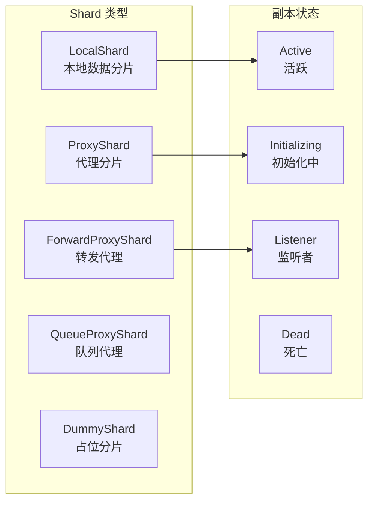
```mermaid
graph LR
    subgraph "Shard 类型"
        LOCAL["LocalShard<br/>本地数据分片"]
        PROXY["ProxyShard<br/>代理分片"]
        FORWARD["ForwardProxyShard<br/>转发代理"]
        QUEUE["QueueProxyShard<br/>队列代理"]
        DUMMY["DummyShard<br/>占位分片"]
    end

    subgraph "副本状态"
        ACTIVE["Active<br/>活跃"]
        INIT["Initializing<br/>初始化中"]
        LISTENER["Listener<br/>监听者"]
        DEAD["Dead<br/>死亡"]
    end

    LOCAL --> ACTIVE
    PROXY --> INIT
    FORWARD --> LISTENER
```

**副本状态转换:**

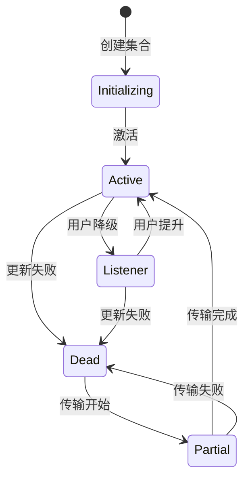
```mermaid
stateDiagram-v2
    [*] --> Initializing: 创建集合
    Initializing --> Active: 激活
    Active --> Dead: 更新失败
    Active --> Listener: 用户降级
    Listener --> Active: 用户提升
    Dead --> Partial: 传输开始
    Partial --> Active: 传输完成
    Partial --> Dead: 传输失败
    Listener --> Dead: 更新失败
```

### 4.5 段层 (Segment Layer)

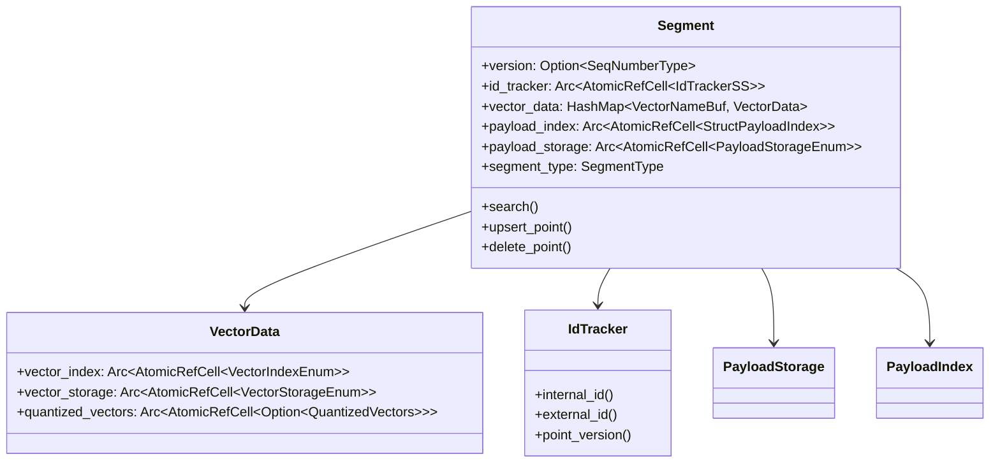
```mermaid
classDiagram
    class Segment {
        +version: Option~SeqNumberType~
        +id_tracker: Arc~AtomicRefCell~IdTrackerSS~~
        +vector_data: HashMap~VectorNameBuf, VectorData~
        +payload_index: Arc~AtomicRefCell~StructPayloadIndex~~
        +payload_storage: Arc~AtomicRefCell~PayloadStorageEnum~~
        +segment_type: SegmentType
        +search()
        +upsert_point()
        +delete_point()
    }

    class VectorData {
        +vector_index: Arc~AtomicRefCell~VectorIndexEnum~~
        +vector_storage: Arc~AtomicRefCell~VectorStorageEnum~~
        +quantized_vectors: Arc~AtomicRefCell~Option~QuantizedVectors~~~
    }

    class IdTracker {
        +internal_id()
        +external_id()
        +point_version()
    }

    Segment --> VectorData
    Segment --> IdTracker
    Segment --> PayloadStorage
    Segment --> PayloadIndex
```

**段组件:**
- **IdTracker**: 外部ID到内部偏移的映射
- **VectorStorage**: 实际向量数据存储
- **VectorIndex**: 向量索引 (HNSW)
- **PayloadStorage**: 元数据存储
- **PayloadIndex**: 元数据索引

---

## 5. 索引机制

### 5.1 HNSW 索引

**HNSW (Hierarchical Navigable Small World)** 是 Qdrant 的主要向量索引算法。

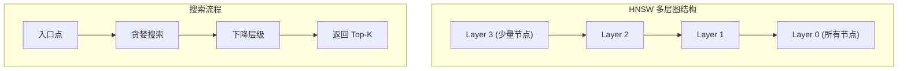
```mermaid
graph TB
    subgraph "HNSW 多层图结构"
        L3["Layer 3 (少量节点)"]
        L2["Layer 2"]
        L1["Layer 1"]
        L0["Layer 0 (所有节点)"]
    end

    L3 --> L2
    L2 --> L1
    L1 --> L0

    subgraph "搜索流程"
        ENTRY["入口点"]
        GREEDY["贪婪搜索"]
        DOWN["下降层级"]
        RESULT["返回 Top-K"]
    end

    ENTRY --> GREEDY
    GREEDY --> DOWN
    DOWN --> RESULT
```

**HNSW 配置参数:**

```rust
pub struct HnswM {
    pub m: usize,   // 每层最大连接数
    pub m0: usize,  // 第0层最大连接数 (通常为 2*m)
}
```

**关键文件:**
- `hnsw.rs`: 核心 HNSW 实现
- `graph_layers.rs`: 多层图结构
- `graph_layers_builder.rs`: 索引构建
- `point_scorer.rs`: 距离计算

### 5.2 Payload 索引

支持多种字段类型的索引:

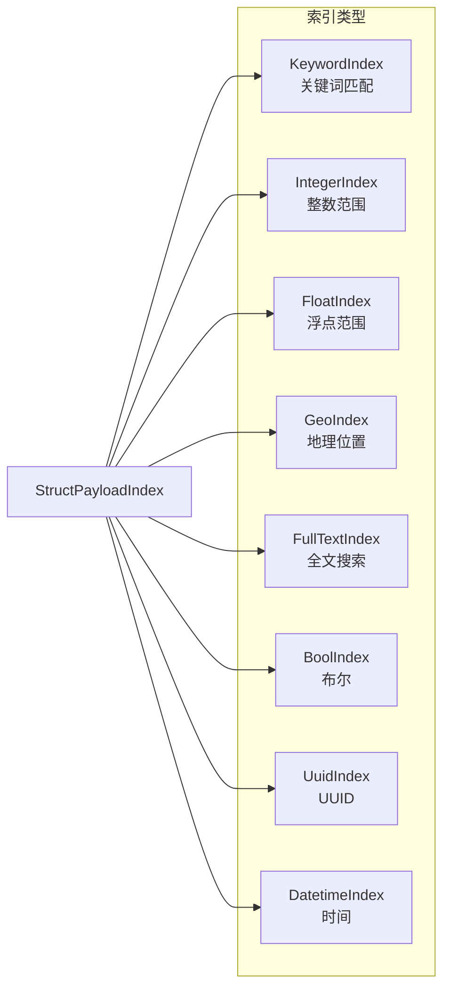
```mermaid
graph LR
    subgraph "索引类型"
        KEYWORD["KeywordIndex<br/>关键词匹配"]
        INTEGER["IntegerIndex<br/>整数范围"]
        FLOAT["FloatIndex<br/>浮点范围"]
        GEO["GeoIndex<br/>地理位置"]
        TEXT["FullTextIndex<br/>全文搜索"]
        BOOL["BoolIndex<br/>布尔"]
        UUID["UuidIndex<br/>UUID"]
        DATETIME["DatetimeIndex<br/>时间"]
    end

    STRUCT["StructPayloadIndex"] --> KEYWORD
    STRUCT --> INTEGER
    STRUCT --> FLOAT
    STRUCT --> GEO
    STRUCT --> TEXT
    STRUCT --> BOOL
    STRUCT --> UUID
    STRUCT --> DATETIME
```

---

## 6. API 层架构

### 6.1 REST API (Actix-web)

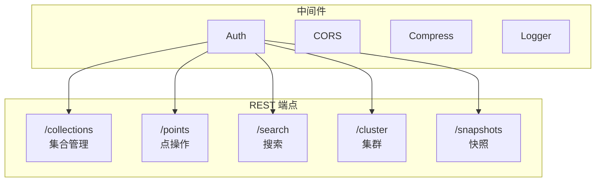
```mermaid
graph TB
    subgraph "REST 端点"
        COLL["/collections<br/>集合管理"]
        POINTS["/points<br/>点操作"]
        SEARCH["/search<br/>搜索"]
        CLUSTER["/cluster<br/>集群"]
        SNAP["/snapshots<br/>快照"]
    end

    subgraph "中间件"
        AUTH["Auth"]
        CORS["CORS"]
        COMPRESS["Compress"]
        LOG["Logger"]
    end

    AUTH --> COLL
    AUTH --> POINTS
    AUTH --> SEARCH
    AUTH --> CLUSTER
    AUTH --> SNAP
```

**主要 API 端点:**

| 端点 | 方法 | 描述 |
|------|------|------|
| `/collections` | GET/POST | 列表/创建集合 |
| `/collections/{name}` | GET/PUT/DELETE | 集合 CRUD |
| `/collections/{name}/points` | POST | 插入/更新点 |
| `/collections/{name}/points/search` | POST | 向量搜索 |
| `/collections/{name}/points/scroll` | POST | 遍历点 |
| `/cluster/peer/{id}` | GET | 集群节点信息 |

### 6.2 gRPC API (Tonic)

```protobuf
service Points {
    rpc Upsert(UpsertPoints) returns (PointsOperationResponse);
    rpc Delete(DeletePoints) returns (PointsOperationResponse);
    rpc Search(SearchPoints) returns (SearchResponse);
    rpc SearchBatch(SearchBatchPoints) returns (SearchBatchResponse);
}

service Collections {
    rpc Create(CreateCollection) returns (CollectionOperationResponse);
    rpc Delete(DeleteCollection) returns (CollectionOperationResponse);
    rpc Get(GetCollectionInfo) returns (GetCollectionInfoResponse);
}
```

**gRPC 优势:**
- 二进制协议 (更小的载荷)
- HTTP/2 多路复用
- 双向流
- 连接池

---

## 7. 分布式共识 (Raft)

### 7.1 共识架构

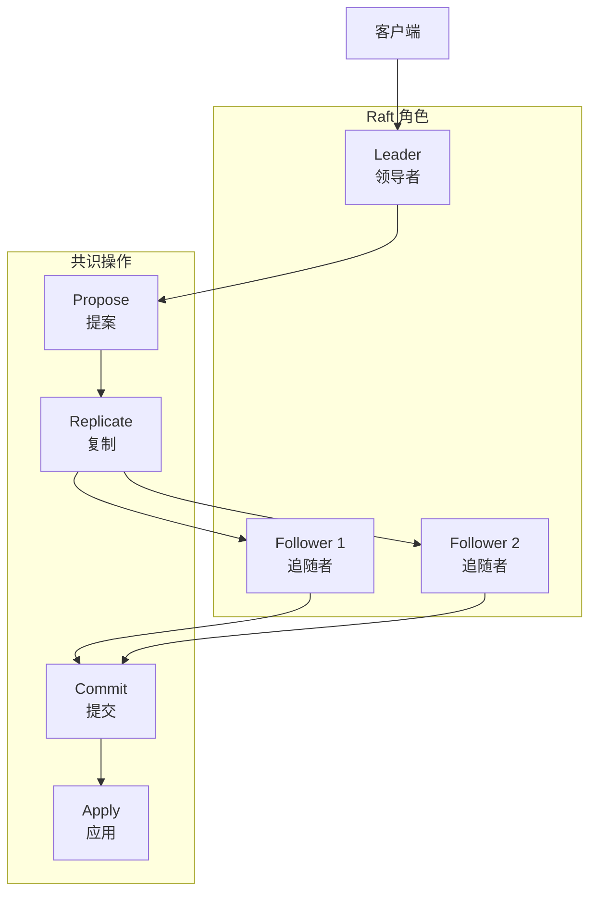
```mermaid
graph TB
    subgraph "Raft 角色"
        LEADER["Leader<br/>领导者"]
        FOLLOWER1["Follower 1<br/>追随者"]
        FOLLOWER2["Follower 2<br/>追随者"]
    end

    subgraph "共识操作"
        PROPOSE["Propose<br/>提案"]
        REPLICATE["Replicate<br/>复制"]
        COMMIT["Commit<br/>提交"]
        APPLY["Apply<br/>应用"]
    end

    CLIENT["客户端"] --> LEADER
    LEADER --> PROPOSE
    PROPOSE --> REPLICATE
    REPLICATE --> FOLLOWER1
    REPLICATE --> FOLLOWER2
    FOLLOWER1 --> COMMIT
    FOLLOWER2 --> COMMIT
    COMMIT --> APPLY
```

### 7.2 共识操作类型

```rust
pub enum ConsensusOperations {
    // 集合元操作
    CollectionMeta(Box<CollectionMetaOperations>),
    // 添加节点
    AddPeer { peer_id: PeerId, uri: String },
    // 移除节点
    RemovePeer(PeerId),
    // 更新节点元数据
    UpdatePeerMetadata { peer_id: PeerId, metadata: PeerMetadata },
    // 快照相关
    RequestSnapshot,
    ReportSnapshot { peer_id: PeerId, status: SnapshotStatus },
}
```

### 7.3 集群拓扑

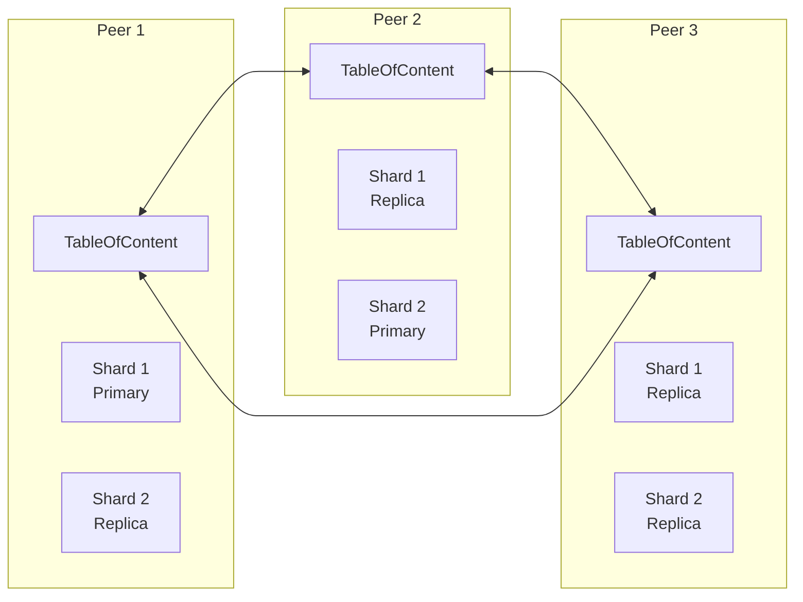
```mermaid
graph LR
    subgraph "Peer 1"
        TOC1["TableOfContent"]
        SHARD1A["Shard 1<br/>Primary"]
        SHARD2A["Shard 2<br/>Replica"]
    end

    subgraph "Peer 2"
        TOC2["TableOfContent"]
        SHARD1B["Shard 1<br/>Replica"]
        SHARD2B["Shard 2<br/>Primary"]
    end

    subgraph "Peer 3"
        TOC3["TableOfContent"]
        SHARD1C["Shard 1<br/>Replica"]
        SHARD2C["Shard 2<br/>Replica"]
    end

    TOC1 <--> TOC2
    TOC2 <--> TOC3
    TOC1 <--> TOC3
```

---

## 8. 查询处理流程

### 8.1 搜索请求处理

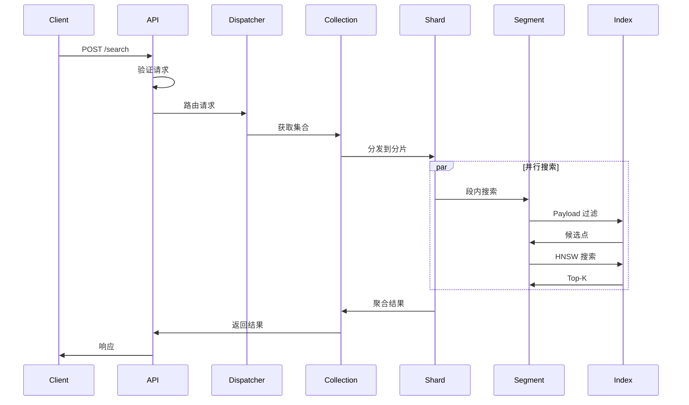
```mermaid
sequenceDiagram
    participant Client
    participant API
    participant Dispatcher
    participant Collection
    participant Shard
    participant Segment
    participant Index

    Client->>API: POST /search
    API->>API: 验证请求
    API->>Dispatcher: 路由请求
    Dispatcher->>Collection: 获取集合
    Collection->>Shard: 分发到分片

    par 并行搜索
        Shard->>Segment: 段内搜索
        Segment->>Index: Payload 过滤
        Index->>Segment: 候选点
        Segment->>Index: HNSW 搜索
        Index->>Segment: Top-K
    end

    Shard->>Collection: 聚合结果
    Collection->>API: 返回结果
    API->>Client: 响应
```

### 8.2 搜索参数

```rust
pub struct CoreSearchRequest {
    pub query: QueryVector,           // 查询向量
    pub filter: Option<Filter>,       // Payload 过滤
    pub params: SearchParams,         // 搜索参数
    pub limit: usize,                 // Top-K
    pub offset: Option<usize>,        // 分页偏移
    pub with_payload: WithPayload,    // 是否包含 payload
    pub with_vector: WithVector,      // 是否包含向量
    pub score_threshold: Option<f32>, // 最小相似度
}

pub struct SearchParams {
    pub hnsw_ef: Option<usize>,       // HNSW ef 参数
    pub exact: Option<bool>,          // 精确搜索 (跳过索引)
    pub quantization: Option<QuantizationSearchParams>,
}
```

---

## 9. 持久化策略

### 9.1 WAL (Write-Ahead Log)

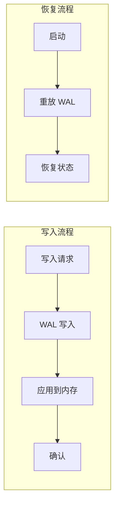
```mermaid
graph LR
    subgraph "写入流程"
        WRITE["写入请求"]
        WAL_WRITE["WAL 写入"]
        APPLY["应用到内存"]
        ACK["确认"]
    end

    WRITE --> WAL_WRITE
    WAL_WRITE --> APPLY
    APPLY --> ACK

    subgraph "恢复流程"
        STARTUP["启动"]
        REPLAY["重放 WAL"]
        RESTORE["恢复状态"]
    end

    STARTUP --> REPLAY
    REPLAY --> RESTORE
```

### 9.2 存储目录布局

```
storage_path/
├── collections/
│   └── <collection_name>/
│       ├── <shard_id>/
│       │   ├── segments/
│       │   │   ├── <segment_1>/
│       │   │   │   ├── vector_storage/
│       │   │   │   ├── payload_storage/
│       │   │   │   ├── id_tracker/
│       │   │   │   └── segment.json
│       │   │   └── <segment_2>/
│       │   └── wal/
│       ├── collection.json
│       ├── newest_clocks.json
│       └── oldest_clocks.json
├── aliases/
└── snapshots/
```

---

## 10. 量化与压缩

### 10.1 量化方法

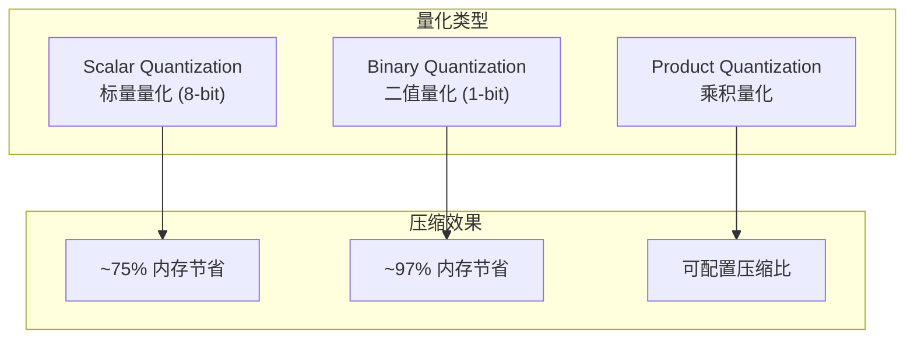
```mermaid
graph TB
    subgraph "量化类型"
        SCALAR["Scalar Quantization<br/>标量量化 (8-bit)"]
        BINARY["Binary Quantization<br/>二值量化 (1-bit)"]
        PQ["Product Quantization<br/>乘积量化"]
    end

    subgraph "压缩效果"
        SCALAR --> S_COMP["~75% 内存节省"]
        BINARY --> B_COMP["~97% 内存节省"]
        PQ --> P_COMP["可配置压缩比"]
    end
```

### 10.2 量化配置

```rust
pub enum QuantizationConfig {
    Scalar(ScalarQuantization),
    Product(ProductQuantization),
    Binary(BinaryQuantization),
}

pub struct ScalarQuantization {
    pub quantile: Option<f32>,      // 量化分位数
    pub always_ram: Option<bool>,   // 始终保持在 RAM
}

pub struct BinaryQuantization {
    pub always_ram: Option<bool>,
}
```

---

## 11. 优化与后台任务

### 11.1 段优化

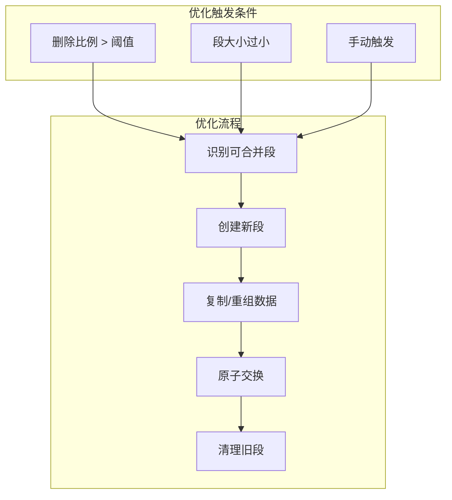
```mermaid
graph TB
    subgraph "优化触发条件"
        DELETED["删除比例 > 阈值"]
        SIZE["段大小过小"]
        MANUAL["手动触发"]
    end

    subgraph "优化流程"
        IDENTIFY["识别可合并段"]
        CREATE["创建新段"]
        COPY["复制/重组数据"]
        SWAP["原子交换"]
        CLEANUP["清理旧段"]
    end

    DELETED --> IDENTIFY
    SIZE --> IDENTIFY
    MANUAL --> IDENTIFY
    IDENTIFY --> CREATE
    CREATE --> COPY
    COPY --> SWAP
    SWAP --> CLEANUP
```

### 11.2 资源预算

```rust
pub struct ResourceBudget {
    cpu_budget: usize,    // CPU 核心数预算
    io_budget: usize,     // I/O 操作预算
}

pub struct OptimizerConfig {
    pub deleted_threshold: f64,           // 删除触发阈值
    pub vacuum_min_dead_bytes: u64,       // 最小回收字节
    pub target_vector_size: Option<usize>,// 目标段大小
    pub memmap_threshold: usize,          // mmap 使用阈值
}
```

---

## 12. 性能优化

### 12.1 优化技术

| 技术 | 描述 |
|------|------|
| **SIMD** | x86-64 AVX2/AVX-512, ARM Neon 距离计算加速 |
| **Memory Mapping** | 大集合使用 mmap 减少内存占用 |
| **Async I/O** | Linux 上使用 io_uring |
| **Jemalloc** | 更好的内存分配策略 |
| **量化** | 减少内存占用，加速搜索 |
| **GPU** | 可选的 HNSW 索引构建加速 |
| **连接池** | gRPC 通道复用 |
| **查询优化** | 自适应过滤器+向量搜索排序 |

### 12.2 并发模型

```rust
// 锁策略
Arc<RwLock<T>>         // 异步读写锁
Arc<AtomicRefCell<T>>  // 单线程内部可变性
Arc<Mutex<T>>          // 异步互斥锁
DashMap                // 并发哈希表
ArcSwap                // 无锁读取原子交换
```

---

## 13. 安全特性

### 13.1 认证与授权

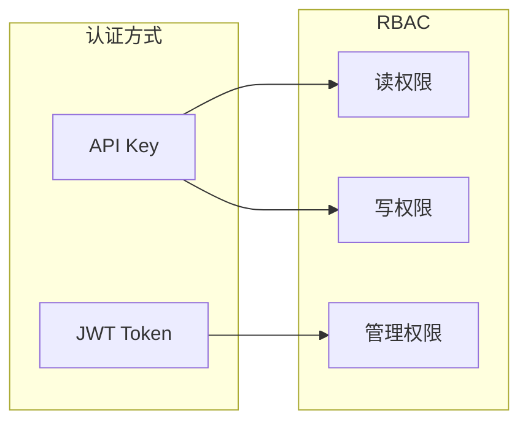
```mermaid
graph LR
    subgraph "RBAC"
        READ["读权限"]
        WRITE["写权限"]
        ADMIN["管理权限"]
    end

    subgraph "认证方式"
        APIKEY["API Key"]
        JWT["JWT Token"]
    end

    APIKEY --> READ
    APIKEY --> WRITE
    JWT --> ADMIN
```

### 13.2 TLS 配置

```yaml
# 服务端 TLS
tls:
  cert: /path/to/cert.pem
  key: /path/to/key.pem

# P2P mTLS
cluster:
  p2p:
    enable_tls: true
```

---

## 14. 配置系统

### 14.1 主要配置项

```yaml
service:
  host: 0.0.0.0
  http_port: 6333
  grpc_port: 6334
  api_key: null

storage:
  storage_path: ./storage
  snapshots_path: ./snapshots
  temp_path: ./temp
  performance:
    max_search_threads: 0        # 0 = 自动
    max_optimization_threads: 1
    optimizer_cpu_budget: 0

cluster:
  enabled: false
  p2p:
    port: 6335
    enable_tls: false
  consensus:
    tick_period_ms: 100

logger:
  level: INFO
```

---

## 15. 数据流图

### 15.1 写入流程

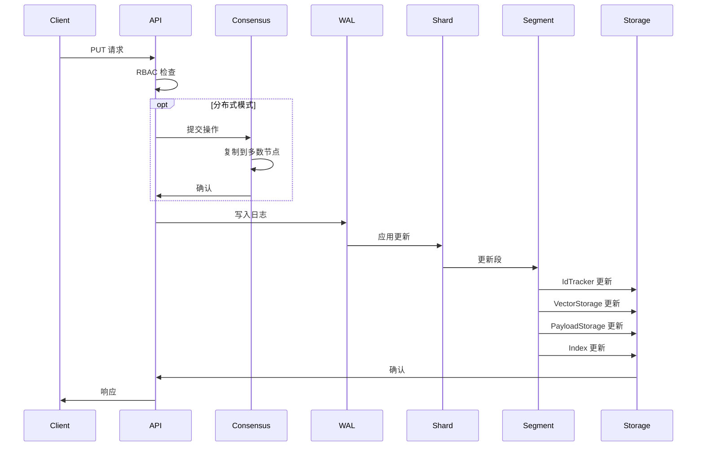
```mermaid
sequenceDiagram
    participant Client
    participant API
    participant Consensus
    participant WAL
    participant Shard
    participant Segment
    participant Storage

    Client->>API: PUT 请求
    API->>API: RBAC 检查

    opt 分布式模式
        API->>Consensus: 提交操作
        Consensus->>Consensus: 复制到多数节点
        Consensus->>API: 确认
    end

    API->>WAL: 写入日志
    WAL->>Shard: 应用更新
    Shard->>Segment: 更新段
    Segment->>Storage: IdTracker 更新
    Segment->>Storage: VectorStorage 更新
    Segment->>Storage: PayloadStorage 更新
    Segment->>Storage: Index 更新
    Storage->>API: 确认
    API->>Client: 响应
```

### 15.2 分片传输流程

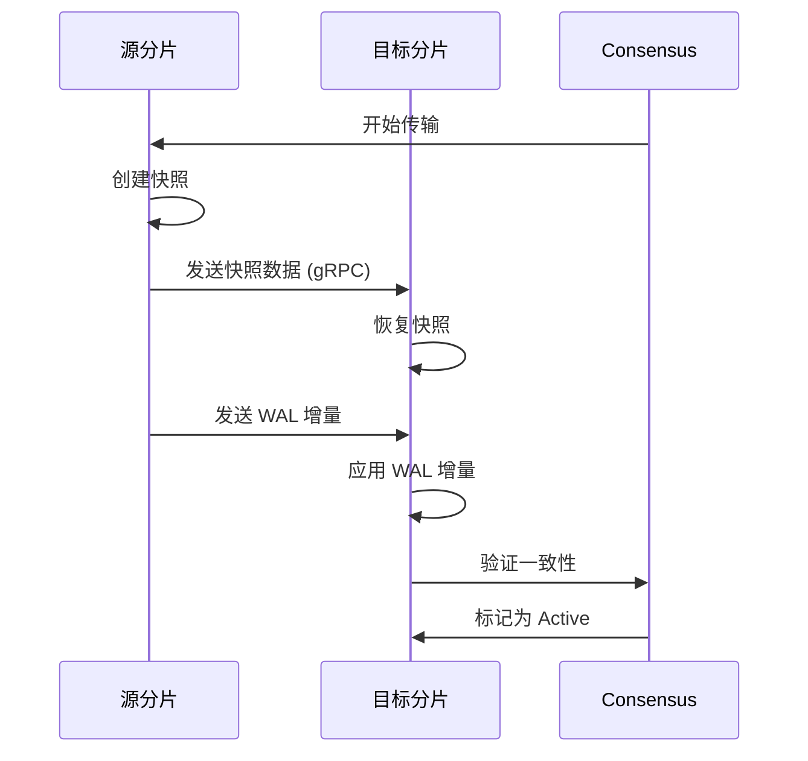
```mermaid
sequenceDiagram
    participant Source as 源分片
    participant Target as 目标分片
    participant Consensus

    Consensus->>Source: 开始传输
    Source->>Source: 创建快照
    Source->>Target: 发送快照数据 (gRPC)
    Target->>Target: 恢复快照
    Source->>Target: 发送 WAL 增量
    Target->>Target: 应用 WAL 增量
    Target->>Consensus: 验证一致性
    Consensus->>Target: 标记为 Active
```

---

## 16. 错误处理与恢复

### 16.1 错误类型层次

```rust
// 段级错误
pub enum OperationError {
    WrongVector { ... },
    PointIdError { ... },
    ServiceError { ... },
}

// 集合级错误
pub enum CollectionError {
    NotFound { ... },
    BadInput { ... },
    ServiceError { ... },
}

// 存储层错误
pub enum StorageError {
    ServiceError { ... },
    BadInput { ... },
    NotFound { ... },
}
```

### 16.2 恢复机制

| 场景 | 恢复策略 |
|------|---------|
| 启动恢复 | WAL 重放 |
| 灾难恢复 | 快照恢复 |
| 一致性恢复 | 共识日志重放 |
| 副本失效 | 分片传输 |

---

## 17. 监控与遥测

### 17.1 指标收集

- 请求延迟
- 搜索/更新操作计数
- 分片/段统计
- 内存使用
- 磁盘 I/O
- 缓存命中率

### 17.2 健康检查

```rust
pub struct HealthChecker {
    toc: Arc<TableOfContent>,
    consensus_state: Option<ConsensusStateRef>,
}

// 检查项
- 副本健康监控
- 节点连接检查
- 共识状态验证
- 磁盘空间警告
```

---

## 18. 总结

Qdrant 是一个精心设计的分布式向量数据库，具有以下特点:

### 架构优势

1. **分层架构**: API → 存储 → 集合 → 分片 → 段，职责清晰
2. **高性能索引**: HNSW + Payload 复合索引
3. **分布式共识**: 基于 Raft 的多节点协调
4. **持久化保证**: WAL + 快照的双重保障
5. **弹性扩展**: 支持分片和副本的水平扩展
6. **多种优化**: 量化、GPU、SIMD、异步I/O

### 设计亮点

- **Rust 实现**: 内存安全和高性能
- **模块化设计**: 各组件独立、可测试
- **丰富的 API**: REST + gRPC 双协议
- **灵活配置**: 支持多种部署场景
- **生产就绪**: 完善的监控、健康检查、错误处理

### 适用场景

- 语义搜索和推荐系统
- RAG (检索增强生成) 应用
- 图像/音频相似度搜索
- 异常检测
- 知识库管理
