# RAGFlow 架构设计深度分析

> 文档版本: v0.23.0
> 分析日期: 2025-12-30
> 项目地址: https://github.com/infiniflow/ragflow

## 目录

- [1. 项目概述](#1-项目概述)
- [2. 系统架构总览](#2-系统架构总览)
- [3. 核心模块详解](#3-核心模块详解)
- [4. 数据流与处理流程](#4-数据流与处理流程)
- [5. Agent 系统架构](#5-agent-系统架构)
- [6. DeepDoc 文档理解引擎](#6-deepdoc-文档理解引擎)
- [7. GraphRAG 知识图谱系统](#7-graphrag-知识图谱系统)
- [8. 部署架构](#8-部署架构)
- [9. 技术栈总结](#9-技术栈总结)
- [10. 架构优势与设计亮点](#10-架构优势与设计亮点)

---

## 1. 项目概述

RAGFlow 是由 InfiniFlow 开发的开源 RAG (Retrieval-Augmented Generation) 引擎，基于深度文档理解技术。它提供了一个适应各种规模企业的流畅 RAG 工作流，结合 LLM 提供基于可靠引用的问答能力。

### 1.1 核心特性

- **深度文档理解**: 从复杂格式的非结构化数据中提取知识
- **模板化分块**: 智能且可解释的文档分块策略
- **引用追溯**: 可视化文本分块，支持人工干预
- **异构数据源兼容**: 支持 Word、PPT、Excel、PDF、图片、网页等多种格式
- **自动化 RAG 工作流**: 可配置的 LLM 和 Embedding 模型

### 1.2 系统要求

- CPU >= 4 核
- RAM >= 16 GB
- Disk >= 50 GB
- Docker >= 24.0.0 & Docker Compose >= v2.26.1
- Python >= 3.12

---

## 2. 系统架构总览

### 2.1 高层架构图

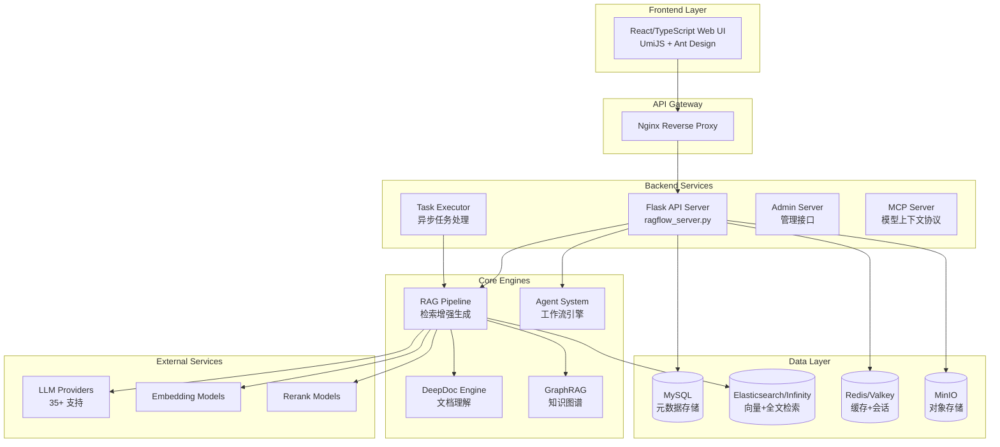

### 2.2 目录结构

```
ragflow/
├── api/                    # 后端 API 服务
│   ├── apps/              # Flask 蓝图模块
│   ├── db/                # 数据库模型和服务
│   ├── common/            # 通用工具
│   └── utils/             # API 工具函数
├── agent/                  # Agent 工作流系统
│   ├── canvas.py          # 画布执行引擎
│   ├── component/         # 工作流组件
│   ├── tools/             # 外部工具集成
│   └── templates/         # 预置模板
├── rag/                    # RAG 核心管道
│   ├── llm/               # LLM 抽象层
│   ├── flow/              # 处理流程
│   └── nlp/               # NLP 工具
├── deepdoc/                # 文档深度理解
│   ├── parser/            # 文档解析器
│   └── vision/            # 视觉识别
├── graphrag/               # 知识图谱 RAG
│   ├── general/           # 完整实现
│   └── light/             # 轻量实现
├── common/                 # 公共模块
│   ├── data_source/       # 数据源连接器
│   └── doc_store/         # 文档存储抽象
├── web/                    # 前端 React 应用
├── docker/                 # Docker 部署配置
└── sdk/                    # Python SDK
```

---

## 3. 核心模块详解

### 3.1 API 后端架构

#### 3.1.1 Flask 应用入口

**主入口**: `api/ragflow_server.py`

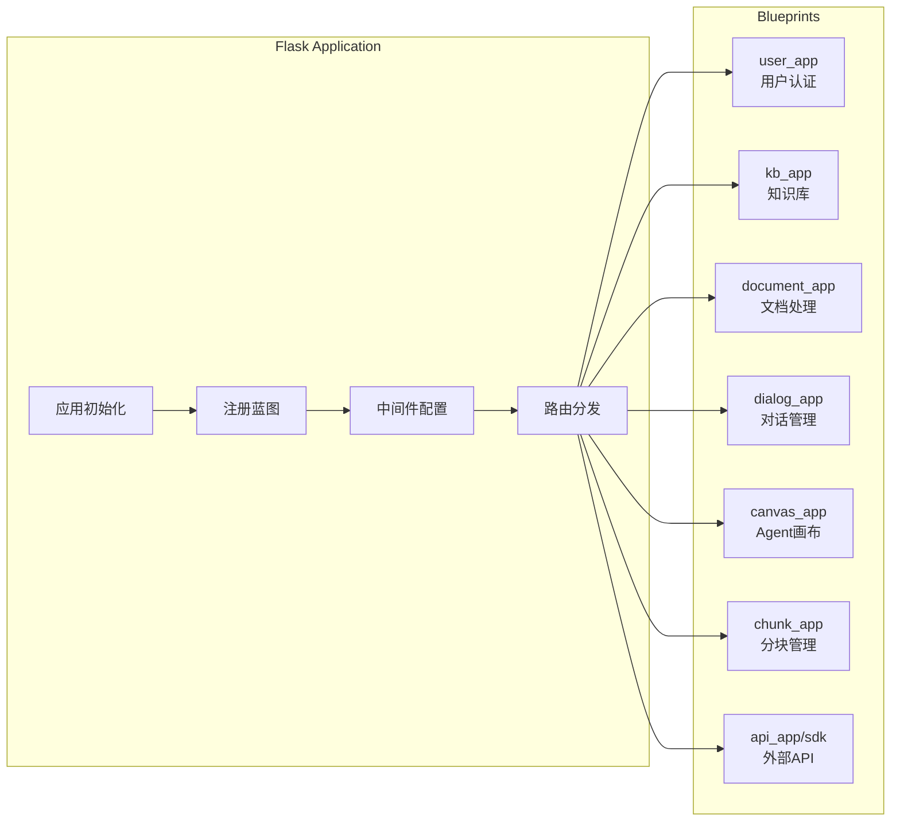

#### 3.1.2 API 模块功能

| 模块 | 文件 | 功能描述 |
|------|------|----------|
| 用户管理 | `user_app.py` | 认证、授权、OAuth |
| 知识库 | `kb_app.py` | 知识库 CRUD、配置 |
| 文档处理 | `document_app.py` | 文档上传、解析状态 |
| 对话管理 | `dialog_app.py` | 聊天会话、历史记录 |
| Agent 画布 | `canvas_app.py` | 工作流设计与执行 |
| 分块管理 | `chunk_app.py` | 分块查看、编辑 |
| 文件管理 | `file_app.py` | 文件上传下载 |
| LLM 配置 | `llm_app.py` | 模型配置管理 |
| 外部 API | `api_app.py` | SDK 和外部集成 |
| 搜索 | `search_app.py` | 跨知识库搜索 |

#### 3.1.3 服务层架构

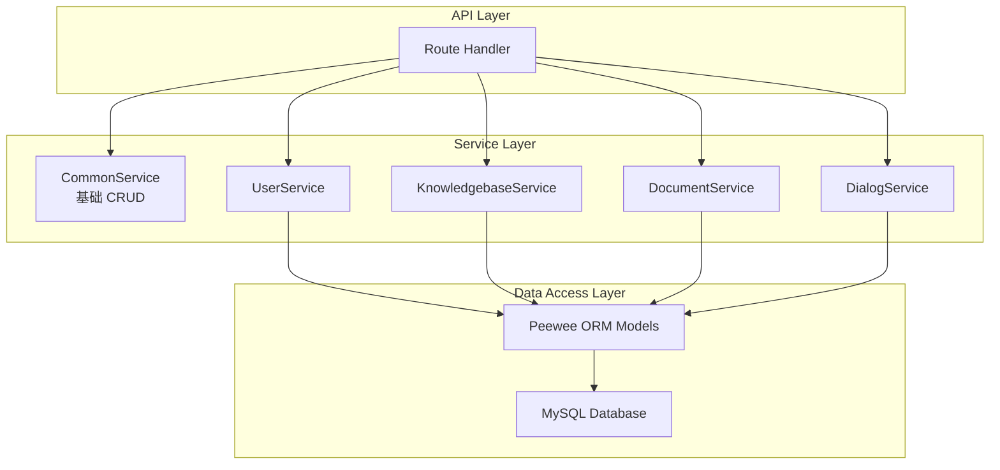

### 3.2 LLM 集成层

#### 3.2.1 支持的 LLM 提供商 (35+)

```python
class SupportedLiteLLMProvider(StrEnum):
    OpenAI = "OpenAI"
    Anthropic = "Anthropic"
    Tongyi_Qianwen = "Tongyi-Qianwen"
    DeepSeek = "DeepSeek"
    ZHIPU_AI = "ZHIPU-AI"
    Groq = "Groq"
    Cohere = "Cohere"
    Gemini = "Gemini"
    Ollama = "Ollama"
    # ... 更多提供商
```

#### 3.2.2 LLM 抽象层架构

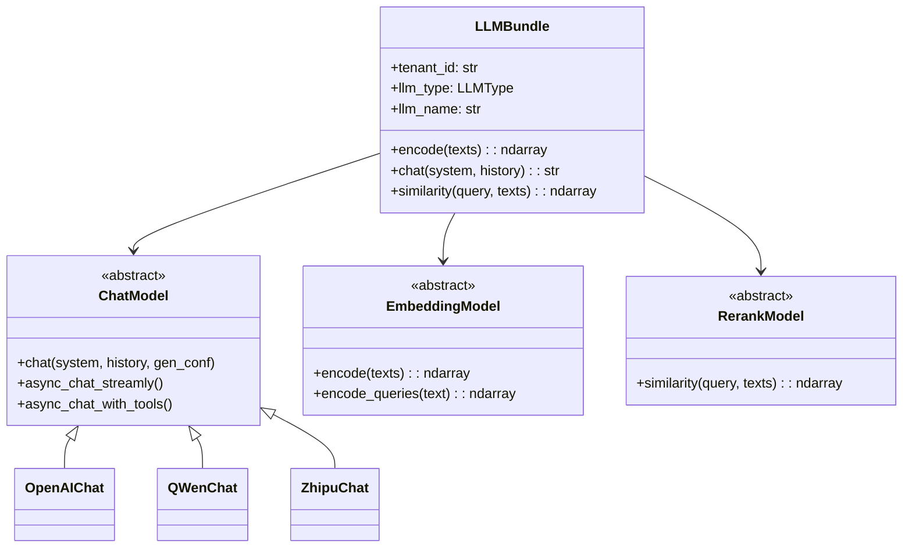

#### 3.2.3 模型类型

| 类型 | 文件 | 功能 |
|------|------|------|
| ChatModel | `chat_model.py` | 对话生成、工具调用 |
| EmbeddingModel | `embedding_model.py` | 文本向量化 |
| RerankModel | `rerank_model.py` | 结果重排序 |
| CVModel | `cv_model.py` | 图像理解 |
| OCRModel | `ocr_model.py` | 文字识别 |
| Seq2TxtModel | `sequence2txt_model.py` | 语音转文本 |
| TTSModel | `tts_model.py` | 文本转语音 |

### 3.3 文档存储抽象

#### 3.3.1 存储引擎支持

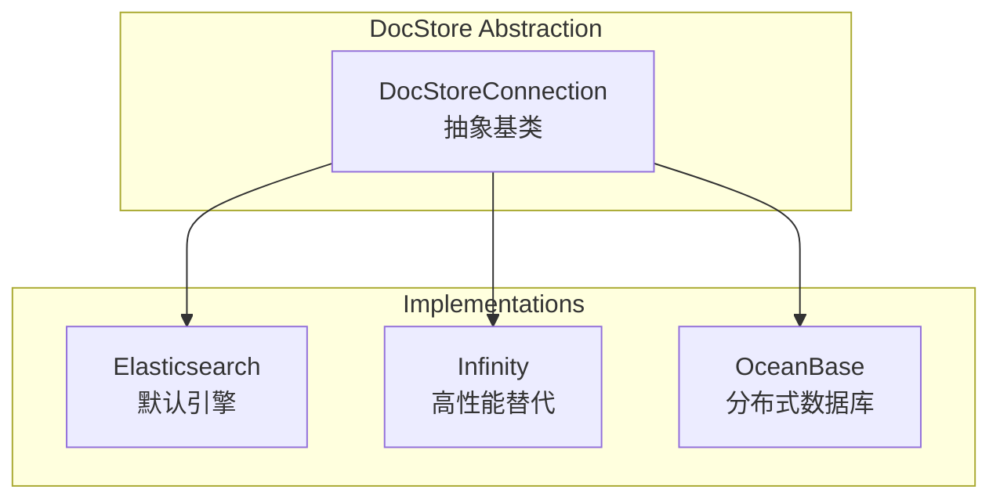

#### 3.3.2 核心接口

```python
class DocStoreConnection(ABC):
    # 数据库操作
    def db_type(self) -> str
    def health(self) -> dict

    # 索引操作
    def create_idx(index_name, dataset_id, vector_size)
    def delete_idx(index_name, dataset_id)
    def index_exist(index_name, dataset_id) -> bool

    # CRUD 操作
    def search(select_fields, highlight_fields, condition,
               match_expressions, order_by, offset, limit, ...)
    def get(data_id, index_name, dataset_ids) -> dict
    def insert(rows, index_name, dataset_id) -> list[str]
    def update(condition, new_value, index_name, dataset_id)
    def delete(condition, index_name, dataset_id) -> int
```

---

## 4. 数据流与处理流程

### 4.1 文档处理管道

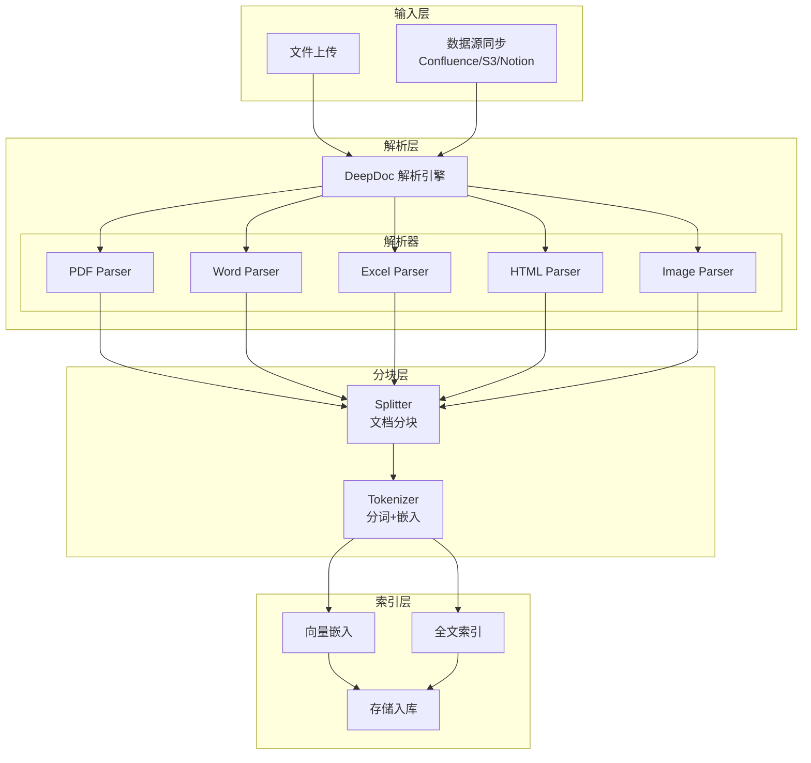

### 4.2 RAG 检索流程

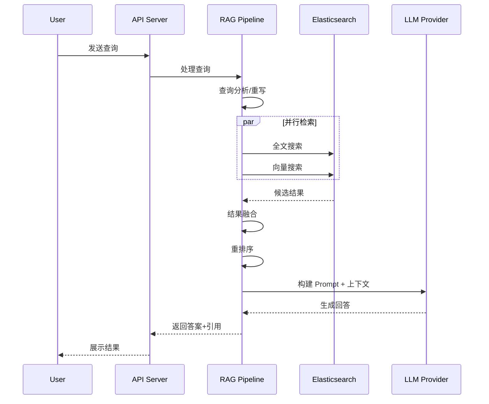

### 4.3 混合搜索机制

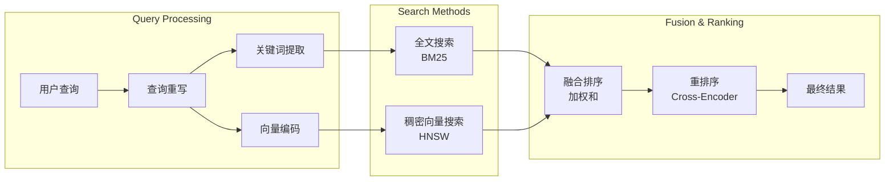

### 4.4 分块策略

| 策略 | 参数 | 描述 |
|------|------|------|
| Token Size | `chunk_token_size=512` | 最大分块大小 |
| 重叠 | `overlapped_percent=0.1` | 相邻块重叠比例 |
| 分隔符 | `delimiters=["\n"]` | 主要分隔符 |
| 表格上下文 | `table_context_size` | 表格周围文本 |
| 图像上下文 | `image_context_size` | 图像描述 |

---

## 5. Agent 系统架构

### 5.1 Canvas 执行引擎

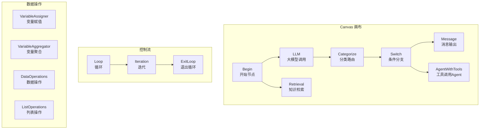

### 5.2 组件基类设计

```python
class ComponentBase(ABC):
    """所有组件的抽象基类"""

    @abstractmethod
    async def invoke(self, **kwargs) -> dict:
        """执行组件逻辑"""
        pass

    def get_input(self) -> dict:
        """获取上游输入"""
        pass

    def output(self) -> dict:
        """返回下游输出"""
        pass

    def get_downstream(self) -> list[str]:
        """获取下游组件ID"""
        pass
```

### 5.3 组件类型详解

| 组件 | 类型 | 功能 |
|------|------|------|
| Begin | 入口 | 工作流起点，定义输入变量 |
| LLM | 处理 | 调用大语言模型 |
| Retrieval | 检索 | 从知识库检索相关内容 |
| Categorize | 路由 | LLM驱动的分类路由 |
| Switch | 条件 | 条件判断分支 |
| Message | 输出 | 消息格式化输出 |
| AgentWithTools | Agent | 带工具调用的智能体 |
| Loop/Iteration | 控制 | 循环控制 |
| VariableAssigner | 数据 | 变量赋值 |
| DataOperations | 数据 | JSON数据操作 |

### 5.4 工具集成

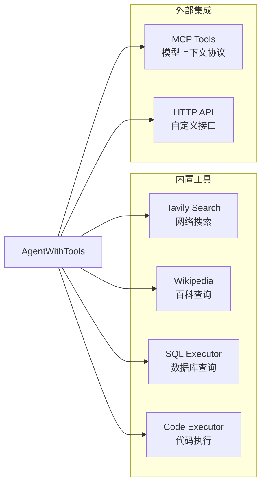

### 5.5 预置模板

| 模板 | 用途 |
|------|------|
| customer_service | 客户服务 |
| choose_your_knowledge_base | 多知识库选择 |
| chunk_summary | 分块摘要生成 |
| customer_review_analysis | 客户评论分析 |
| advanced_ingestion_pipeline | 高级数据入库 |

---

## 6. DeepDoc 文档理解引擎

### 6.1 架构概览

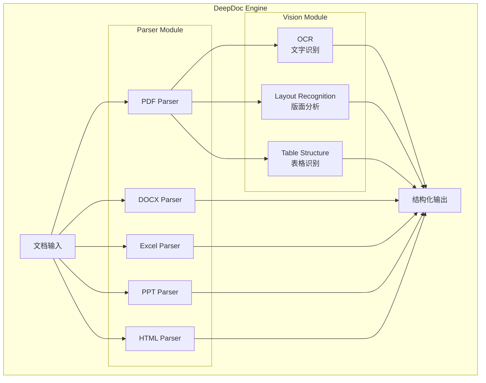

### 6.2 Vision 模块

#### 6.2.1 OCR 识别

- **双引擎设计**: TextDetector + TextRecognizer
- **算法**: DB边界检测 + CTC解码
- **批处理**: batch_size=16
- **多GPU支持**: 可配置GPU内存限制

#### 6.2.2 版面识别

**10种布局类型**:
- Text (正文)
- Title (标题)
- Figure (图片)
- Figure caption (图片标题)
- Table (表格)
- Table caption (表格标题)
- Header (页眉)
- Footer (页脚)
- Reference (参考文献)
- Equation (公式)

#### 6.2.3 表格结构识别

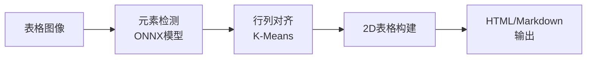

### 6.3 PDF 解析核心算法

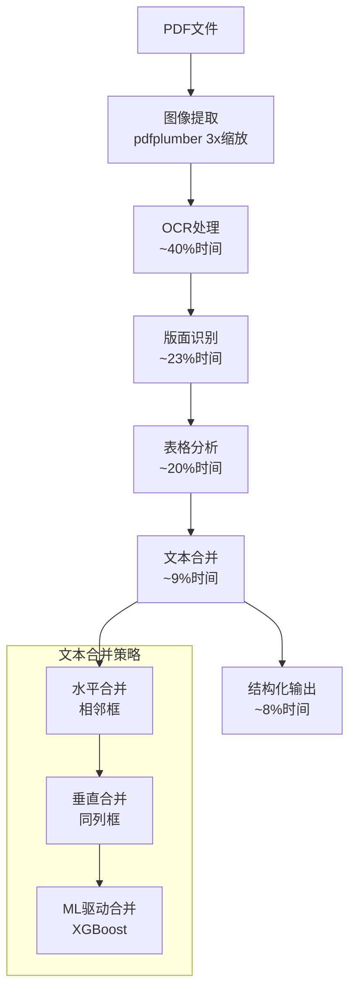

### 6.4 支持的文档格式

| 格式 | 解析器 | 特性 |
|------|--------|------|
| PDF | RAGFlowPdfParser | OCR+版面+表格完整解析 |
| DOCX | RAGFlowDocxParser | 原生提取，保留表格 |
| Excel | RAGFlowExcelParser | 多Sheet，ODS/CSV支持 |
| PPT | RAGFlowPptParser | 形状提取，表格识别 |
| HTML | RAGFlowHtmlParser | BeautifulSoup解析 |
| Markdown | RAGFlowMarkdownParser | 元素级提取 |
| 图像 | FigureParser | OCR识别 |

---

## 7. GraphRAG 知识图谱系统

### 7.1 整体架构

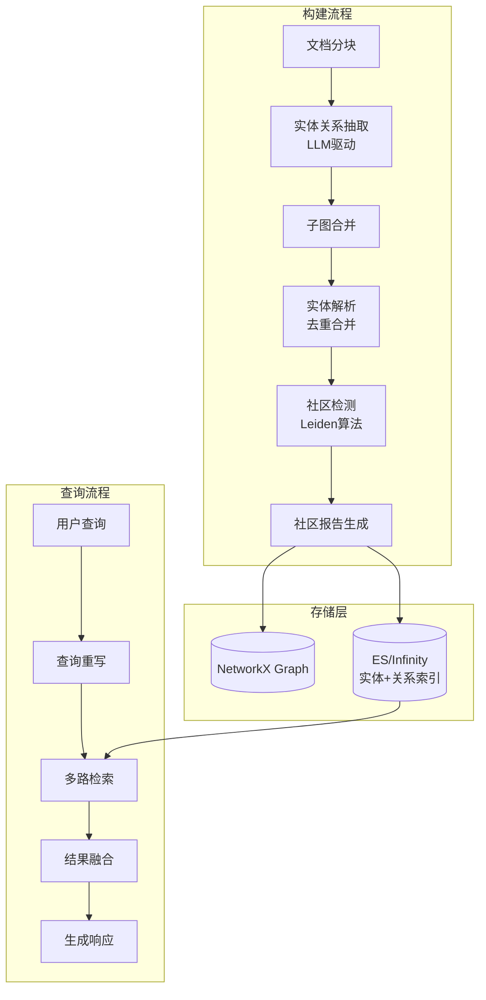

### 7.2 实体关系抽取

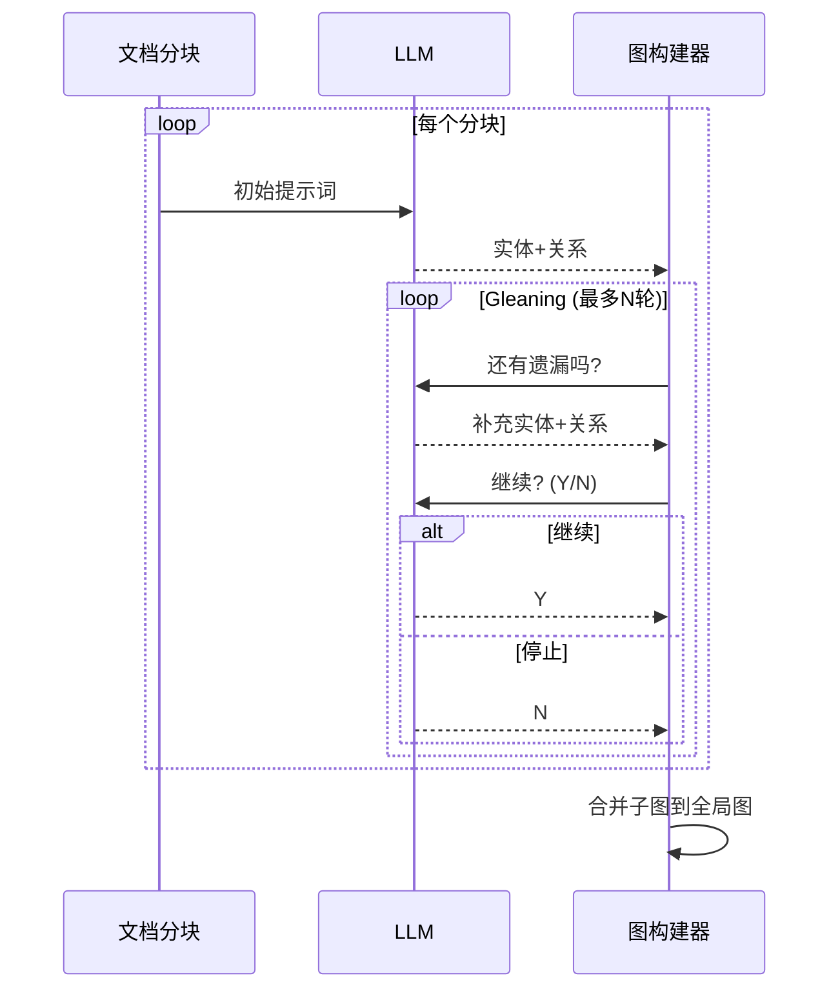

### 7.3 实体类型

- person (人物)
- organization (组织)
- geo (地理位置)
- event (事件)
- category (类别)

### 7.4 社区检测与报告

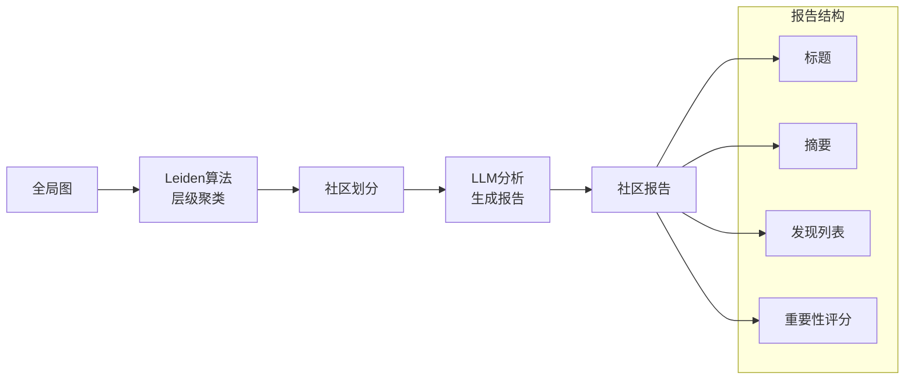

### 7.5 多路检索融合

| 检索路径 | 方法 | 描述 |
|---------|------|------|
| 关键词实体 | 向量相似度 | 查询关键词匹配实体 |
| 类型实体 | PageRank排序 | 按实体类型检索 |
| 关系检索 | 向量相似度 | 查询相关关系 |
| N-hop路径 | 图遍历 | 多步邻域扩展 |
| 社区报告 | 关联实体 | 相关社区摘要 |

---

## 8. 部署架构

### 8.1 Docker Compose 服务编排

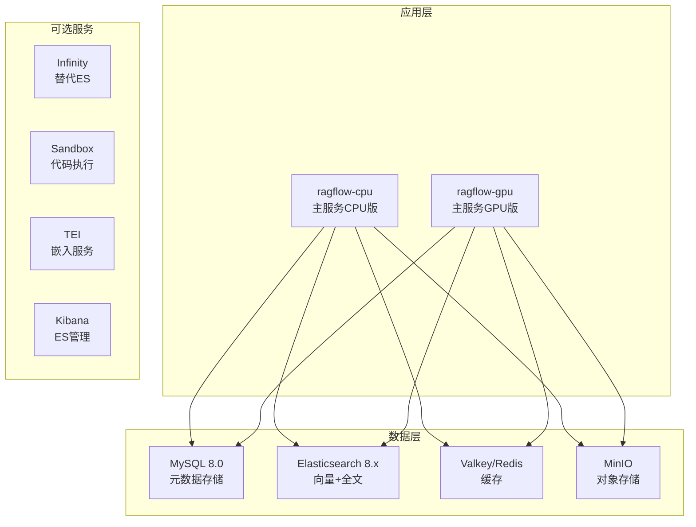

### 8.2 端口配置

| 服务 | 端口 | 用途 |
|------|------|------|
| Web UI | 80/443 | 前端界面 |
| API Server | 9380 | 后端API |
| Admin Server | 9381 | 管理接口 |
| MCP Server | 9382 | MCP协议 |
| MySQL | 3306 | 数据库 |
| Elasticsearch | 9200 | 搜索引擎 |
| MinIO | 9000/9001 | 对象存储 |
| Redis | 6379 | 缓存 |

### 8.3 配置文件

| 文件 | 用途 |
|------|------|
| `docker/.env` | 环境变量 |
| `docker/service_conf.yaml.template` | 服务配置 |
| `docker/docker-compose.yml` | 服务编排 |
| `docker/docker-compose-base.yml` | 基础服务 |

---

## 9. 技术栈总结

### 9.1 后端技术

| 类别 | 技术 |
|------|------|
| Web框架 | Flask + Quart (异步) |
| ORM | Peewee |
| 任务队列 | Redis + 自定义执行器 |
| 缓存 | Redis/Valkey |
| 对象存储 | MinIO / S3 / OSS |
| 向量数据库 | Elasticsearch / Infinity |

### 9.2 AI/ML技术

| 类别 | 技术 |
|------|------|
| LLM集成 | 35+ 提供商 (OpenAI, Anthropic, 通义千问等) |
| 嵌入模型 | OpenAI, BGE, Jina, QWen等 |
| 重排模型 | Cohere, Jina, 本地模型 |
| OCR | 自研ONNX模型 |
| 版面识别 | YOLOv10 |
| 图算法 | NetworkX, graspologic |

### 9.3 前端技术

| 类别 | 技术 |
|------|------|
| 框架 | React + TypeScript |
| 构建 | UmiJS |
| UI组件 | Ant Design + shadcn/ui |
| 状态管理 | Zustand |
| 样式 | Tailwind CSS + Less |

### 9.4 DevOps

| 类别 | 技术 |
|------|------|
| 容器化 | Docker + Docker Compose |
| 包管理 | uv (Python) |
| 测试 | pytest |
| 代码质量 | ruff, pre-commit |
| Kubernetes | Helm Charts |

---

## 10. 架构优势与设计亮点

### 10.1 核心优势

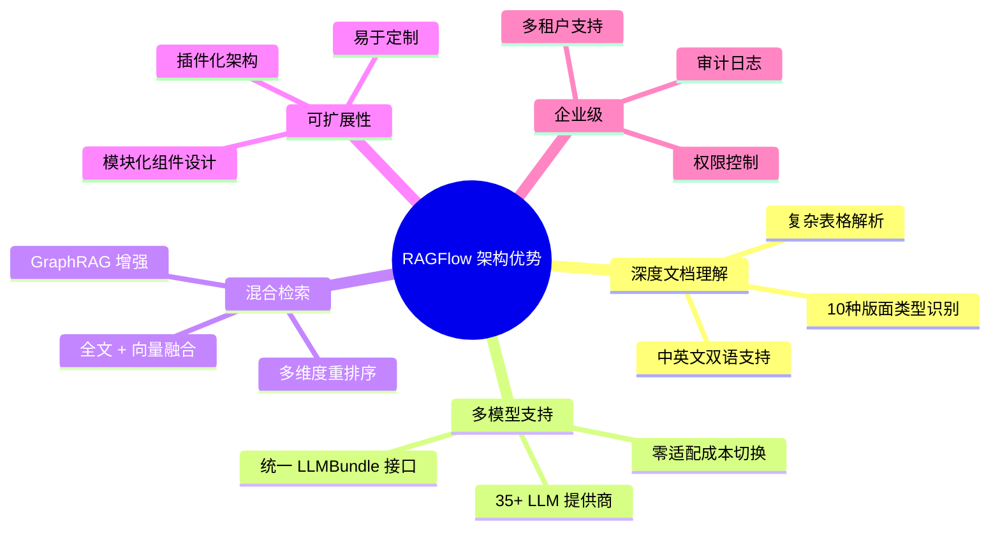

### 10.2 设计亮点

1. **深度文档理解**
   - 不仅仅是文本提取，而是理解文档结构
   - 表格、图像、公式的智能处理
   - 位置信息保留，支持精确引用

2. **工厂模式 LLM 抽象**
   - 统一的 `LLMBundle` 接口
   - 支持热切换模型提供商
   - 自动错误分类和重试

3. **混合检索架构**
   - 全文搜索 + 稠密向量 + 稀疏向量
   - 可配置的融合权重
   - 多层重排序机制

4. **低代码 Agent 系统**
   - 可视化工作流设计
   - 丰富的内置组件
   - MCP 协议支持

5. **GraphRAG 增强**
   - 知识图谱构建和查询
   - 社区检测和报告生成
   - 实体解析和去重

### 10.3 性能优化策略

| 策略 | 实现 | 效果 |
|------|------|------|
| 批处理 | EMBEDDING_BATCH_SIZE=16 | 减少API调用 |
| 异步执行 | asyncio + Semaphore | 并行处理 |
| 缓存 | Redis (LLM响应、向量) | 避免重复计算 |
| 连接池 | ES/MySQL连接复用 | 减少连接开销 |
| 分布式锁 | Redis分布式锁 | 并发控制 |

### 10.4 适用场景

- **知识库问答**: 企业文档智能问答
- **客户服务**: 智能客服机器人
- **数据分析**: 结构化数据智能查询
- **内容生成**: 基于知识的内容创作
- **合规审查**: 文档合规性检查

---

## 参考资料

- [RAGFlow 官方文档](https://ragflow.io/docs/dev/)
- [RAGFlow GitHub 仓库](https://github.com/infiniflow/ragflow)
- [RAGFlow Roadmap 2025](https://github.com/infiniflow/ragflow/issues/4214)
- [DeepDoc README](https://github.com/infiniflow/ragflow/blob/main/deepdoc/README.md)
