# Spin 框架架构分析文档

## 1. 项目概述

**Spin** 是 Fermyon 开发的开源 WebAssembly 微服务框架，基于 Rust 和 Wasmtime 构建。它提供了一个完整的运行时环境，用于构建和运行 WebAssembly 组件化应用程序。

### 1.1 核心特性

- **WebAssembly Component Model**: 完整支持 WASI 和 Component Model 规范
- **多种触发器**: 支持 HTTP、Redis 等多种事件触发方式
- **插件化架构**: 通过 Factor 系统实现高度可扩展性
- **丰富的运行时能力**: 内置 Key-Value 存储、SQLite、HTTP 客户端、LLM 等能力

### 1.2 技术栈

| 技术 | 版本/说明 |
|------|----------|
| Rust | 1.86+ |
| Wasmtime | 40.0.0 |
| 许可证 | Apache 2.0 WITH LLVM-exception |
| 项目版本 | 3.6.0-pre0 |
| Crate 数量 | 59 个 |

## 2. 高层架构设计

### 2.1 分层架构

```mermaid
flowchart TB
    subgraph CLI["CLI 层"]
        Commands["src/commands<br/>命令行接口"]
    end

    subgraph Triggers["触发器层"]
        HTTP["spin-trigger-http<br/>HTTP 服务器"]
        Redis["spin-trigger-redis<br/>Redis Pub/Sub"]
        Custom["自定义触发器"]
    end

    subgraph Executor["执行器层"]
        FactorsExecutor["spin-factors-executor<br/>核心编排"]
    end

    subgraph Runtime["运行时因子层"]
        RF["spin-runtime-factors"]
        WASI["WasiFactor"]
        Variables["VariablesFactor"]
        KV["KeyValueFactor"]
        HTTP_Out["OutboundHttpFactor"]
        SQLite["SqliteFactor"]
        LLM["LlmFactor"]
        Others["Redis/PG/MySQL/MQTT..."]
    end

    subgraph Factors["因子框架层"]
        FactorTrait["spin-factors<br/>Factor Trait"]
        Derive["spin-factors-derive<br/>RuntimeFactors 宏"]
    end

    subgraph Core["核心引擎层"]
        Engine["spin-core<br/>Wasmtime 包装"]
        Store["Store/Engine 管理"]
    end

    subgraph App["应用配置层"]
        Manifest["spin-manifest<br/>TOML 解析"]
        LockedApp["spin-locked-app<br/>锁定应用"]
        Loader["spin-loader<br/>组件加载"]
    end

    CLI --> Triggers
    Triggers --> Executor
    Executor --> Runtime
    Runtime --> Factors
    Factors --> Core
    Core --> App
```

### 2.2 核心组件关系

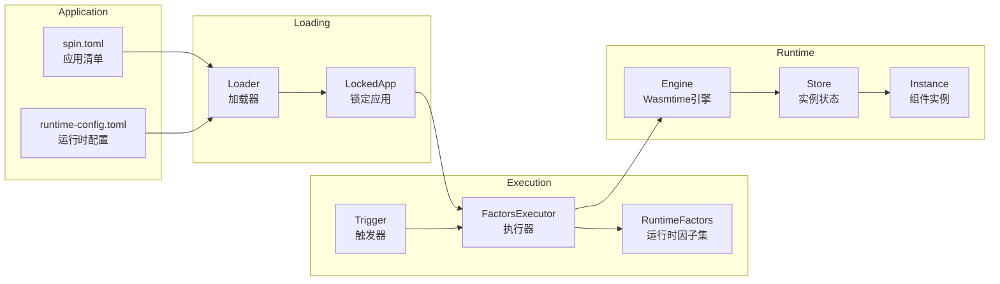

## 3. 核心抽象设计

### 3.1 Factor Trait (因子特性)

Factor 是 Spin 架构的核心抽象，代表一个独立的、可插拔的运行时能力单元。

```rust
pub trait Factor: Any + Sized {
    /// 运行时配置类型 - 每个应用的自定义配置
    type RuntimeConfig;

    /// 应用状态类型 - 可跨请求缓存的状态
    type AppState: Sync;

    /// 实例构建器类型 - 用于构建每实例状态
    type InstanceBuilder: FactorInstanceBuilder;

    /// 初始化 - 在运行时启动时调用一次
    fn init(&mut self, ctx: &mut impl InitContext<Self>) -> anyhow::Result<()>;

    /// 配置应用 - 验证并配置给定的应用
    fn configure_app<T: RuntimeFactors>(
        &self,
        ctx: ConfigureAppContext<T, Self>,
    ) -> anyhow::Result<Self::AppState>;

    /// 准备实例 - 为每个组件实例创建构建器
    fn prepare<T: RuntimeFactors>(
        &self,
        ctx: PrepareContext<T, Self>,
    ) -> anyhow::Result<Self::InstanceBuilder>;
}
```

### 3.2 Factor 生命周期

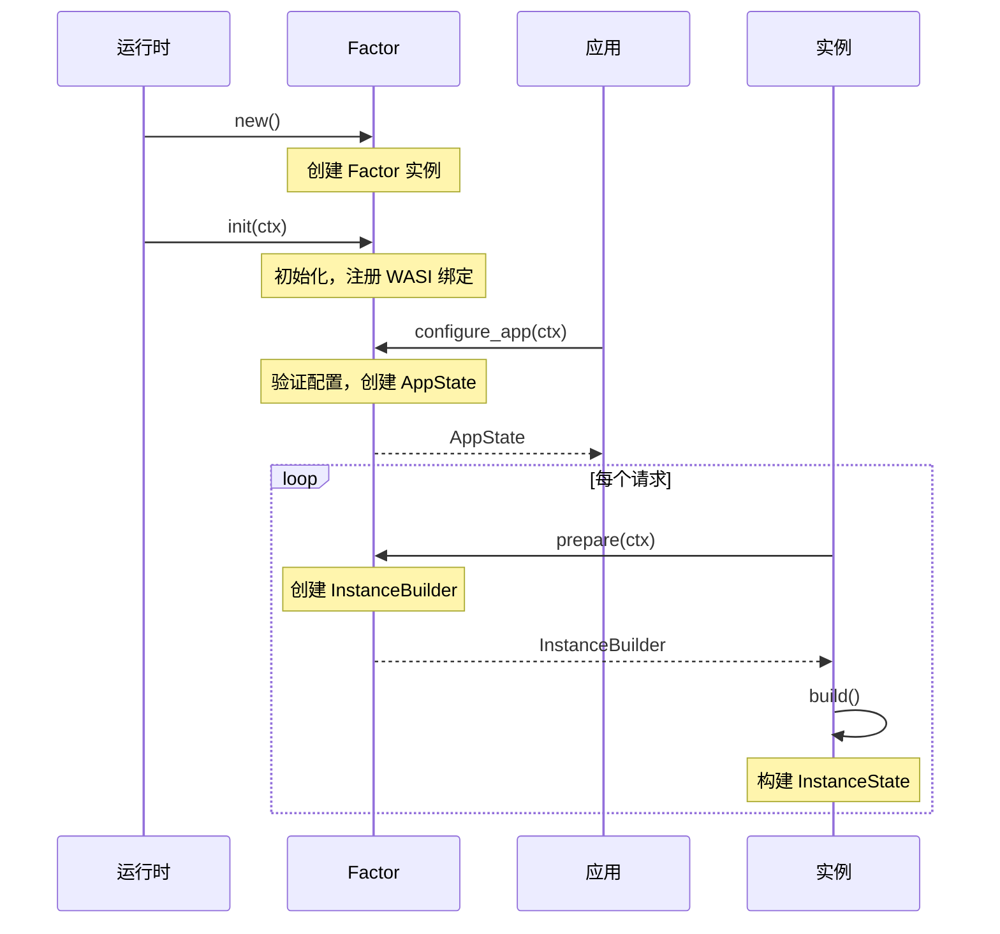

### 3.3 RuntimeFactors 组合

通过 `#[derive(RuntimeFactors)]` 宏自动组合多个 Factor：

```rust
#[derive(RuntimeFactors)]
pub struct TriggerFactors {
    pub wasi: WasiFactor,
    pub variables: VariablesFactor,
    pub key_value: KeyValueFactor,
    pub outbound_networking: OutboundNetworkingFactor,
    pub outbound_http: OutboundHttpFactor,
    pub sqlite: SqliteFactor,
    pub redis: OutboundRedisFactor,
    pub mqtt: OutboundMqttFactor,
    pub pg: OutboundPgFactor,
    pub mysql: OutboundMysqlFactor,
    pub llm: LlmFactor,
}
```

派生宏自动生成：
- `TriggerFactorsAppState` - 所有 Factor 的 AppState 组合
- `TriggerFactorsInstanceState` - 所有 Factor 的 InstanceState 组合
- `TriggerFactorsRuntimeConfig` - 所有 Factor 的运行时配置组合
- 相关 trait 实现用于编排初始化和配置

## 4. 执行器架构

### 4.1 FactorsExecutor

FactorsExecutor 是组件执行的核心协调器：

```rust
pub struct FactorsExecutor<T: RuntimeFactors, U: 'static> {
    /// Wasmtime 核心引擎
    core_engine: spin_core::Engine<InstanceState<T::InstanceState, U>>,
    /// 运行时因子集
    factors: T,
    /// 执行钩子
    hooks: Vec<Box<dyn ExecutorHooks<T, U>>>,
}
```

### 4.2 执行流程

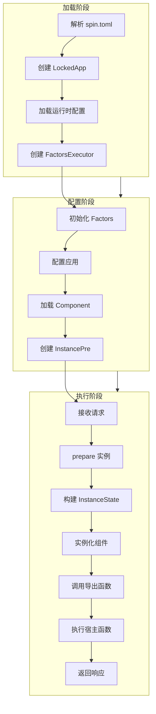

### 4.3 InstanceState 结构

```rust
pub struct InstanceState<T, U> {
    /// spin-core 核心状态
    core: spin_core::State,
    /// Factor 实例状态集合
    factors: T,
    /// 执行器自定义状态
    executor: U,
}
```

## 5. 触发器系统

### 5.1 Trigger Trait

```rust
pub trait Trigger<F: RuntimeFactors>: Sized + Send {
    /// 触发器类型标识
    const TYPE: &'static str;

    /// CLI 参数类型
    type CliArgs: Args;

    /// 实例状态类型
    type InstanceState: Send + 'static;

    /// 创建触发器
    fn new(cli_args: Self::CliArgs, app: &App) -> anyhow::Result<Self>;

    /// 运行触发器
    fn run(self, trigger_app: TriggerApp<Self, F>)
        -> impl Future<Output = anyhow::Result<()>> + Send;
}
```

### 5.2 HTTP 触发器架构

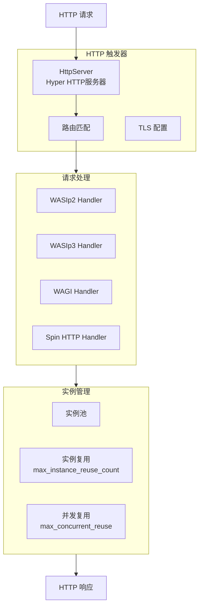

### 5.3 HTTP 触发器配置

```rust
pub struct HttpTrigger {
    listen_addr: SocketAddr,        // 监听地址
    tls_config: Option<TlsConfig>,  // TLS 配置
    find_free_port: bool,           // 自动寻找空闲端口
    http1_max_buf_size: Option<usize>, // HTTP/1 缓冲区大小
    reuse_config: InstanceReuseConfig, // 实例复用配置
}

pub struct InstanceReuseConfig {
    max_instance_reuse_count: Range<usize>,           // 最大复用次数
    max_instance_concurrent_reuse_count: Range<usize>, // 最大并发复用
    request_timeout: Option<Range<Duration>>,          // 请求超时
    idle_instance_timeout: Range<Duration>,            // 空闲超时
}
```

## 6. 核心引擎

### 6.1 Engine 配置

```rust
impl Default for Config {
    fn default() -> Self {
        let mut inner = wasmtime::Config::new();
        inner.async_support(true);           // 异步支持
        inner.epoch_interruption(true);      // 时间片中断
        inner.wasm_component_model(true);    // 组件模型
        inner.wasm_component_model_async(true); // 异步组件模型

        // 池化分配器配置
        if use_pooling_allocator_by_default() {
            let max_instances = env("SPIN_MAX_INSTANCE_COUNT", 1_000);
            // ... 配置池化参数
        }
        Self { inner }
    }
}
```

### 6.2 池化分配器

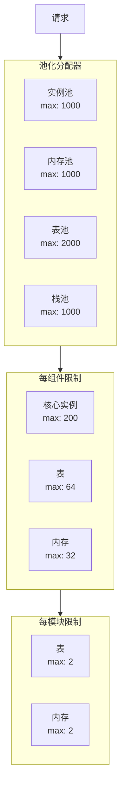

### 6.3 时间片中断

```rust
/// 默认时间片间隔: 10ms
pub const DEFAULT_EPOCH_TICK_INTERVAL: Duration = Duration::from_millis(10);

// 时间片线程 - 定期递增 epoch
std::thread::spawn(move || loop {
    std::thread::sleep(interval);
    if let Some(engine) = engine_weak.upgrade() {
        engine.increment_epoch();
    } else {
        break;
    }
});
```

## 7. Crate 组织结构

### 7.1 核心基础 Crate

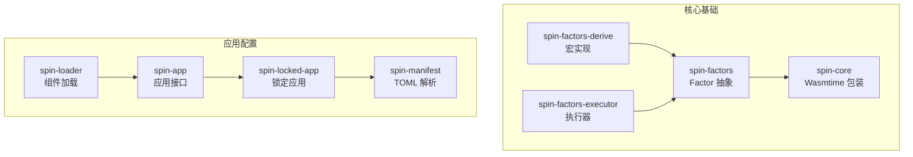

### 7.2 运行时因子 Crate (16个)

| 类别 | Crate | 功能 |
|------|-------|------|
| **系统** | spin-factor-wasi | WASI 实现 (文件系统、时钟、随机数、套接字) |
| | spin-factor-variables | 配置变量替换 |
| **存储** | spin-factor-key-value | 抽象 KV 存储 |
| | spin-factor-sqlite | SQLite 数据库 |
| | spin-factor-outbound-pg | PostgreSQL 客户端 |
| | spin-factor-outbound-mysql | MySQL 客户端 |
| | spin-factor-outbound-redis | Redis 客户端 |
| **网络** | spin-factor-outbound-http | HTTP 客户端 |
| | spin-factor-outbound-mqtt | MQTT 客户端 |
| | spin-factor-outbound-networking | 底层网络 (TLS, 主机验证) |
| **AI** | spin-factor-llm | LLM 推理 |

### 7.3 存储后端实现

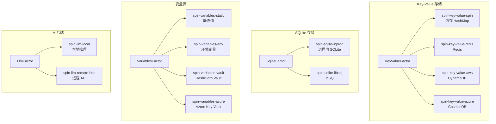

## 8. 数据流

### 8.1 请求处理流程

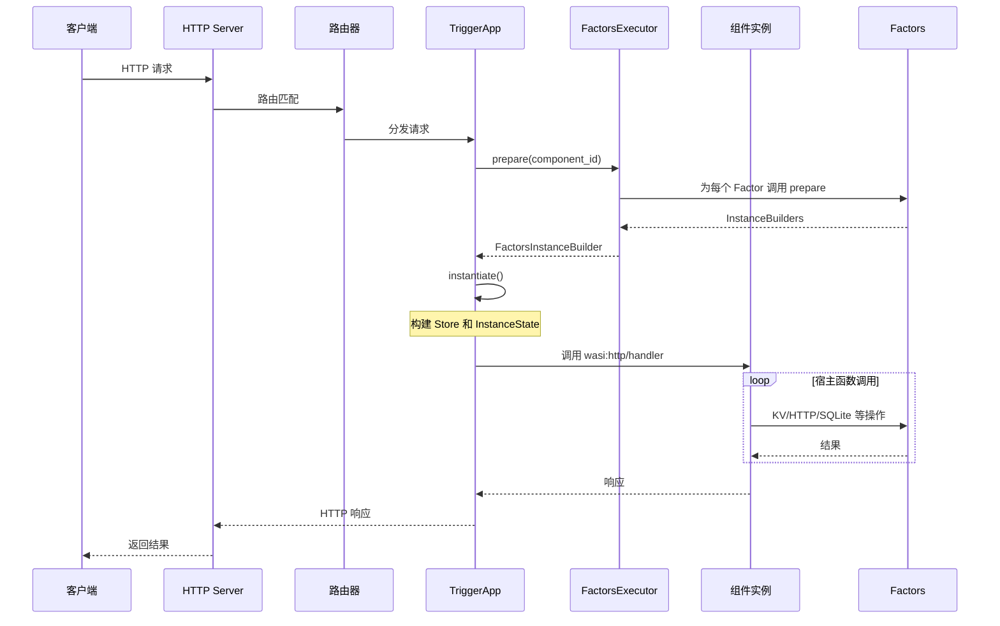

### 8.2 应用加载流程

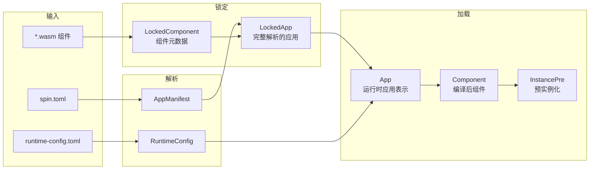

## 9. 配置管理

### 9.1 配置层次

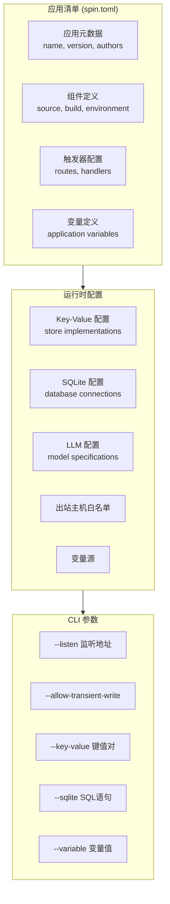

### 9.2 TriggerAppArgs

```rust
pub struct TriggerAppArgs {
    /// 允许临时写入
    pub allow_transient_write: bool,

    /// 键值对设置
    pub key_values: Vec<(String, String)>,

    /// SQLite 语句
    pub sqlite_statements: Vec<String>,

    /// 最大实例内存
    pub max_instance_memory: Option<usize>,

    /// 变量值
    pub variable: Vec<VariableSource>,
}
```

## 10. 扩展点

### 10.1 自定义 Factor

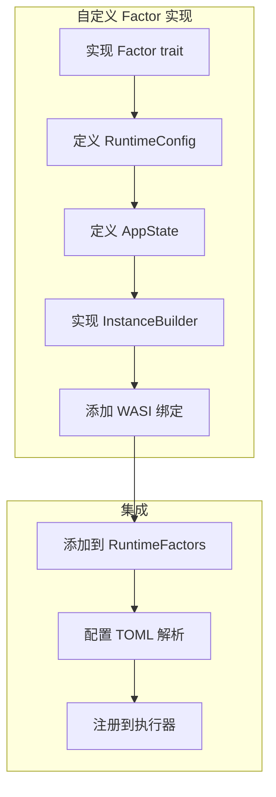

### 10.2 自定义触发器

```rust
// 实现 Trigger trait
impl<F: RuntimeFactors> Trigger<F> for MyTrigger {
    const TYPE: &'static str = "my-trigger";

    type CliArgs = MyCliArgs;
    type InstanceState = MyState;

    fn new(cli_args: Self::CliArgs, app: &App) -> anyhow::Result<Self> {
        // 初始化触发器
    }

    async fn run(self, trigger_app: TriggerApp<Self, F>) -> anyhow::Result<()> {
        // 运行触发器逻辑
    }
}
```

### 10.3 自定义存储后端

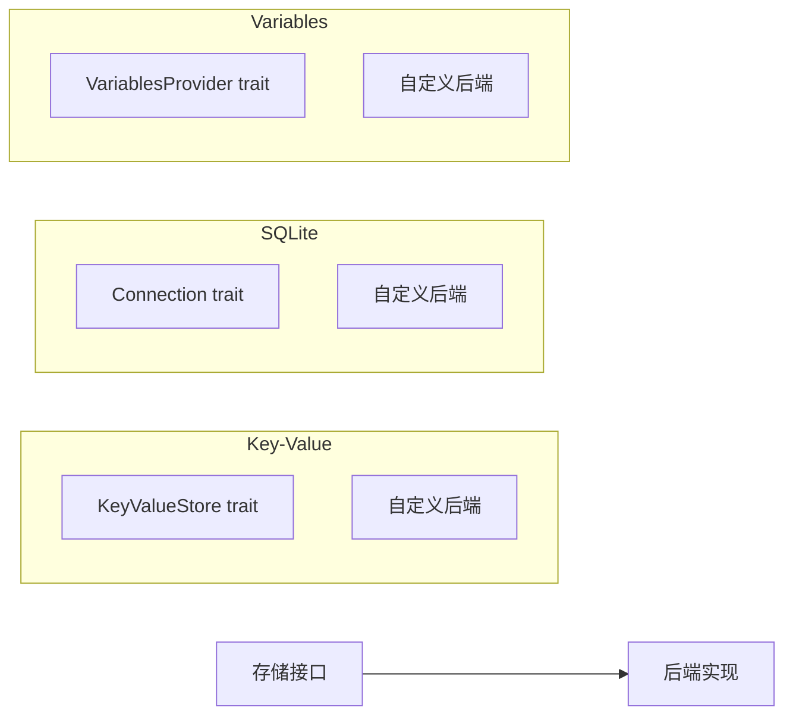

## 11. 错误处理

### 11.1 错误类型层次

```rust
pub enum Error {
    DuplicateFactorTypes(String),
    DependencyOrderingError(String),
    FactorBuildError { factor: &'static str, source: anyhow::Error },
    FactorConfigureAppError { factor: &'static str, source: anyhow::Error },
    FactorInitError { factor: &'static str, source: anyhow::Error },
    FactorPrepareError { factor: &'static str, source: anyhow::Error },
    NoSuchFactor(&'static str),
    RuntimeConfigReusedKey { factor: &'static str, key: String },
    RuntimeConfigSource(anyhow::Error),
    RuntimeConfigUnusedKeys { keys: Vec<String> },
    UnknownComponent(String),
}
```

### 11.2 错误传播

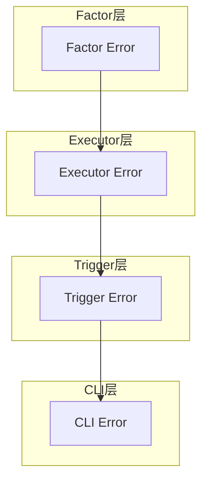

## 12. 性能优化

### 12.1 池化分配器优化

| 参数 | 默认值 | 环境变量 |
|------|--------|----------|
| 最大实例数 | 1,000 | SPIN_MAX_INSTANCE_COUNT |
| 内存池数量 | 1,000 | SPIN_WASMTIME_TOTAL_MEMORIES |
| 表池数量 | 2,000 | SPIN_WASMTIME_TOTAL_TABLES |
| 栈池数量 | 1,000 | SPIN_WASMTIME_TOTAL_STACKS |
| 核心实例数 | 4,000 | SPIN_WASMTIME_TOTAL_CORE_INSTANCES |
| 每实例表元素 | 100,000 | SPIN_WASMTIME_INSTANCE_TABLE_ELEMENTS |
| 实例大小上限 | 10MB | SPIN_WASMTIME_INSTANCE_SIZE |
| 每组件内存数 | 32 | SPIN_WASMTIME_INSTANCE_MEMORIES |

### 12.2 实例复用 (WASIp3)

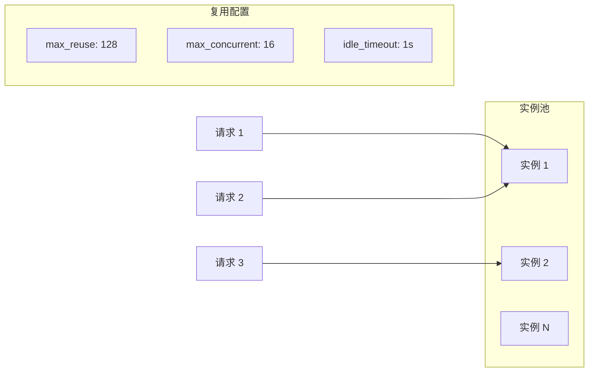

## 13. 安全考虑

### 13.1 沙箱隔离

- **内存隔离**: 每个组件在独立的线性内存中运行
- **资源限制**: 通过 StoreLimitsAsync 限制内存使用
- **时间片中断**: 通过 epoch interruption 防止无限循环

### 13.2 网络安全

```rust
fn outbound_networking_factor() -> OutboundNetworkingFactor {
    fn disallowed_host_handler(scheme: &str, authority: &str) {
        // 记录并警告未授权的出站请求
        tracing::error!("Outbound network destination not allowed: {scheme}://{authority}");
    }

    let mut factor = OutboundNetworkingFactor::new();
    factor.set_disallowed_host_handler(disallowed_host_handler);
    factor
}
```

### 13.3 主机白名单

```toml
# spin.toml
[component.my-component]
allowed_outbound_hosts = [
    "https://api.example.com",
    "redis://cache.internal:6379"
]
```

## 14. 与 WASI 标准的集成

### 14.1 支持的 WASI 版本

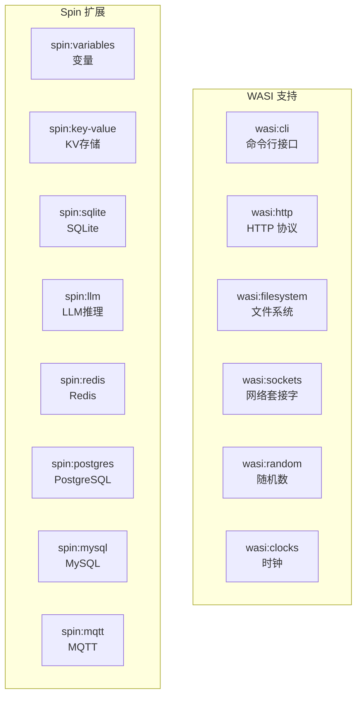

### 14.2 WIT 接口定义

```
// wit/world.wit
world spin-http {
    include wasi:http/proxy@0.2.0;

    import spin:variables/variables@2.0.0;
    import spin:key-value/store@2.0.0;
    import spin:sqlite/sqlite@2.0.0;
    import spin:llm/llm@2.0.0;
    // ...
}
```

## 15. 构建系统

### 15.1 Cargo Workspace 结构

```
spin/
├── Cargo.toml           # Workspace 根配置
├── src/                 # CLI 入口
│   └── bin/spin.rs
├── crates/              # 59 个 crate
│   ├── core/
│   ├── factors/
│   ├── factors-derive/
│   ├── factors-executor/
│   ├── runtime-factors/
│   ├── trigger-http/
│   ├── trigger-redis/
│   └── ...
├── wit/                 # WIT 接口定义
└── tests/               # 测试套件
```

### 15.2 构建脚本

```rust
// build.rs
fn main() {
    // 嵌入 Git 版本信息
    vergen_gitcl::Emitter::default()
        .emit()
        .expect("Unable to generate vergen instructions");

    // 编译测试 WASM 程序 (wasm32-wasip2 目标)
    // ...
}
```

## 16. 总结

Spin 框架采用了高度模块化的架构设计，通过 Factor 系统实现了运行时能力的可插拔性。其核心设计理念包括：

1. **关注点分离**: 每个 Factor 独立管理自己的配置、状态和生命周期
2. **类型安全**: 通过 Rust 类型系统和派生宏确保编译时安全
3. **异步优先**: 从底层到顶层全面支持异步操作
4. **性能优化**: 池化分配器、实例复用等优化减少运行时开销
5. **可扩展性**: 清晰的扩展点支持自定义 Factor、触发器和存储后端

这种架构使 Spin 成为构建 WebAssembly 微服务的强大平台，同时保持了良好的可维护性和可扩展性。
