# SurrealDB 架构分析

## 项目概述

**SurrealDB** 是一个用 Rust 编写的多模型云原生数据库，支持文档、图、关系、时间序列和地理空间等多种数据模型。

| 属性 | 值 |
|------|-----|
| **版本** | 3.0.0-beta |
| **语言** | Rust (Edition 2024) |
| **核心代码量** | ~169,000 行 |
| **许可证** | Business Source License 1.1 |

### 核心特性

- 多模型数据库（文档、图、关系、时序、向量）
- 实时订阅和 Live Queries
- 内置身份认证和授权系统
- 支持 SQL 风格查询语言（SurrealQL）
- 多存储后端（内存、RocksDB、TiKV、SurrealKV）
- WebAssembly 支持（浏览器端运行）
- GraphQL API 支持

---

## 整体架构

### 高层架构图

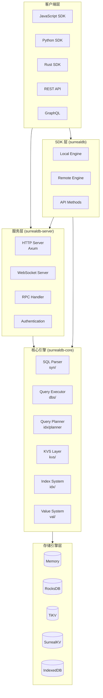

### Crates 依赖关系

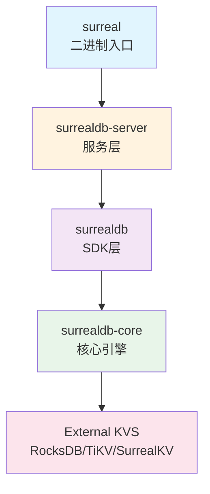

---

## 目录结构

```
surrealdb/
├── crates/
│   ├── core/              # 核心数据库引擎 (6.5 MB)
│   │   └── src/
│   │       ├── kvs/       # 键值存储层
│   │       ├── dbs/       # 查询执行层
│   │       ├── sql/       # SQL 解析和 AST
│   │       ├── idx/       # 索引系统
│   │       ├── val/       # 值类型系统
│   │       ├── ctx/       # 执行上下文
│   │       ├── iam/       # 身份认证授权
│   │       ├── api/       # API 请求处理
│   │       ├── syn/       # 语法分析器
│   │       └── ...
│   ├── sdk/               # Rust SDK (604 KB)
│   │   └── src/
│   │       ├── engine/    # 引擎抽象
│   │       ├── method/    # API 方法
│   │       └── conn/      # 连接管理
│   ├── server/            # HTTP/WS 服务器 (480 KB)
│   │   └── src/
│   │       ├── ntw/       # 网络层
│   │       ├── rpc/       # RPC 处理
│   │       ├── cli/       # 命令行
│   │       └── telemetry/ # 可观测性
│   ├── language-tests/    # 语言测试
│   └── fuzz/              # 模糊测试
├── src/                   # CLI 入口点
├── tests/                 # 集成测试
└── doc/                   # 文档
```

---

## 核心组件分析

### 1. 存储引擎层 (kvs/)

存储引擎层提供统一的键值存储抽象，支持多种后端实现。

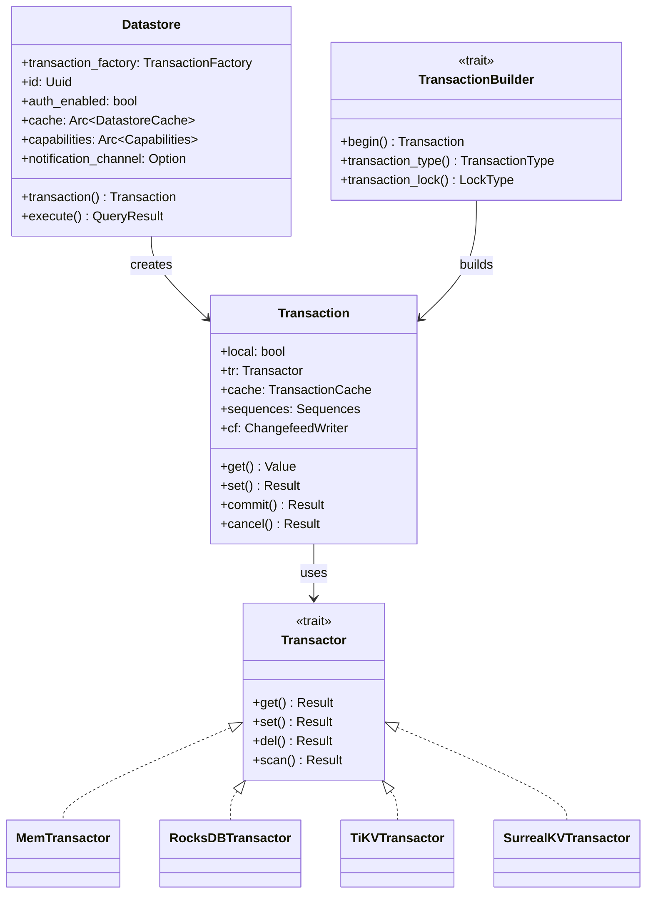

**关键模块：**

| 模块 | 职责 |
|------|------|
| `ds.rs` | Datastore 实例管理，核心聚合器 |
| `tx.rs` | Transaction 事务管理 |
| `tr.rs` | Transactor 底层事务处理接口 |
| `cache/` | 多层缓存系统 |
| `scanner.rs` | 键值范围扫描 |
| `clock.rs` | 混合逻辑时钟 (HLC) |

### 2. 查询执行层 (dbs/)

查询执行层负责解析、规划和执行 SurrealQL 查询。

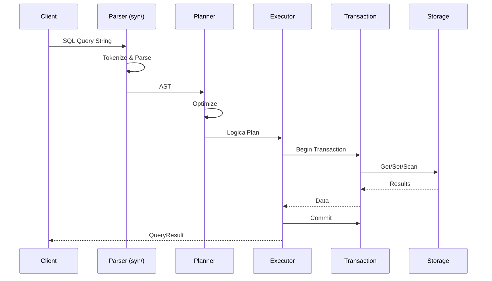

**执行器核心结构：**

```rust
pub struct Executor {
    stack: TreeStack,        // 递归深度控制
    results: Vec<QueryResult>,
    opt: Options,            // 执行选项
    ctx: FrozenContext,      // 冻结的执行上下文
}
```

### 3. SQL/查询语言层 (sql/)

SQL 层定义了 SurrealQL 的完整语法和语义。

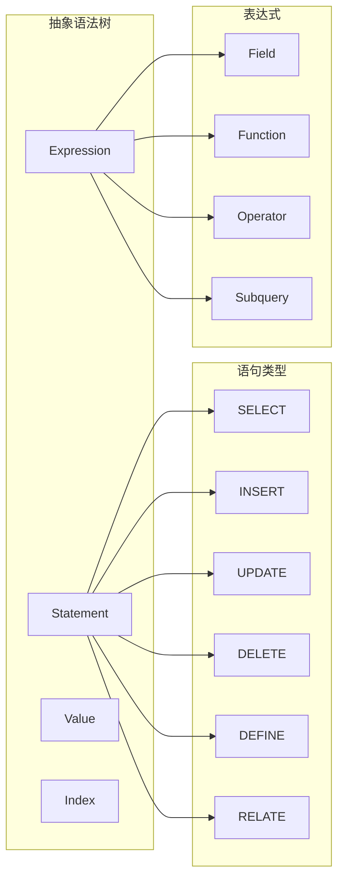

**支持的 47 个子模块包括：**
- `statements/` - 各类 SQL 语句定义
- `expression/` - 表达式处理
- `parser/` - 词法和语法分析
- `index/` - 索引定义
- `kind.rs` - 数据类型
- `function.rs` - 内置函数
- `permissions/` - 权限定义

### 4. 索引系统 (idx/)

索引系统支持多种索引类型，包括 B-Tree、全文索引和向量索引。

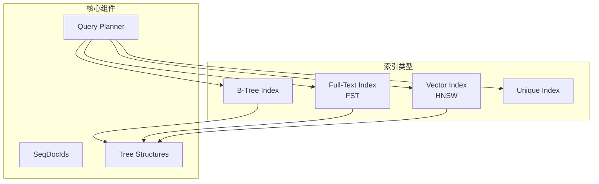

**向量索引 (HNSW) 特性：**
- 层次化可导航小世界图
- 支持余弦相似度、欧氏距离等度量
- 高效的近似最近邻搜索

### 5. 值类型系统 (val/)

SurrealDB 支持丰富的数据类型。

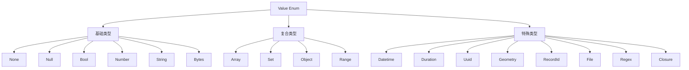

---

## 服务器架构

### HTTP/WebSocket 服务器

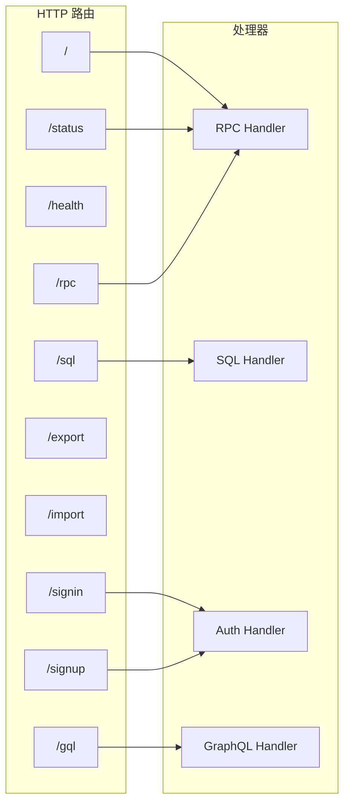

### RPC 状态管理

```rust
pub struct RpcState {
    pub web_sockets: RwLock<HashMap<Uuid, Arc<Websocket>>>,
    pub live_queries: RwLock<HashMap<Uuid, (Uuid, Option<Uuid>)>>,
    pub http: Arc<Http>,
}
```

---

## 数据流架构

### 完整查询执行流程

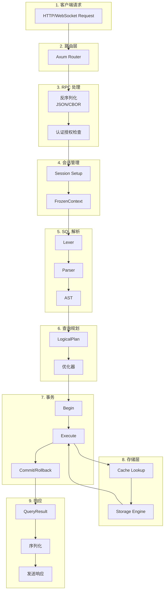

### 模块依赖关系

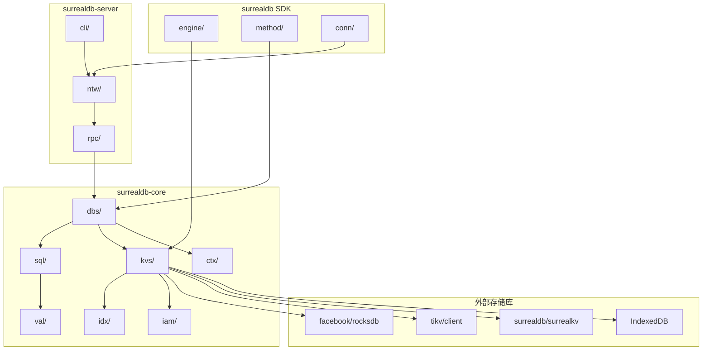

---

## 实时功能架构

### Live Query 系统

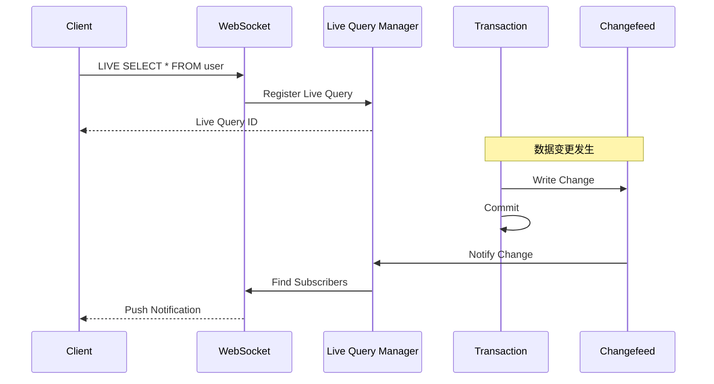

### 通知系统流程

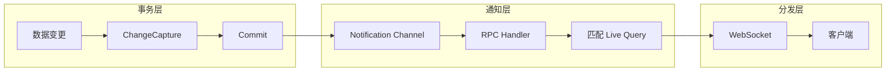

---

## 身份认证与授权

### IAM 架构

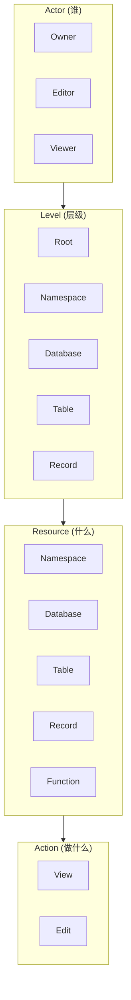

### 认证流程

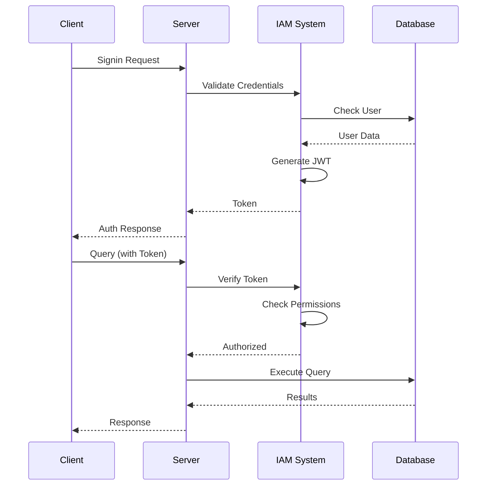

---

## 技术栈

### 核心依赖

| 类别 | 技术 | 版本 | 用途 |
|------|------|------|------|
| **Web 框架** | Axum | 0.8.5 | HTTP 路由和处理 |
| **WebSocket** | tokio-tungstenite | 0.28 | 实时连接 |
| **异步运行时** | Tokio | 1.44.2 | 异步执行 |
| **序列化** | serde, ciborium, flatbuffers | - | JSON/CBOR/FlatBuffers |
| **存储** | RocksDB, TiKV, SurrealKV | - | 持久化 |
| **向量索引** | HNSW | - | 向量搜索 |
| **全文索引** | FST | - | 全文搜索 |
| **脚本** | rquickjs | - | JavaScript 执行 |
| **密码学** | argon2, bcrypt, blake3 | - | 密码哈希 |
| **地理空间** | geo, geo-types | 0.28 | 地理计算 |
| **并发** | DashMap, parking_lot | - | 并发数据结构 |
| **可观测性** | tracing, OpenTelemetry | - | 日志和追踪 |

### Feature Flags

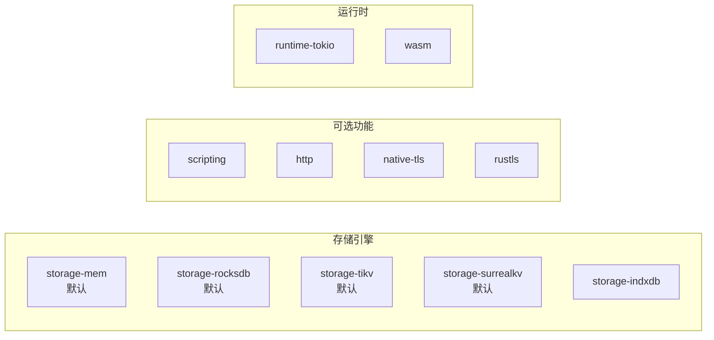

---

## 设计模式

### 1. Composer 模式 (依赖注入)

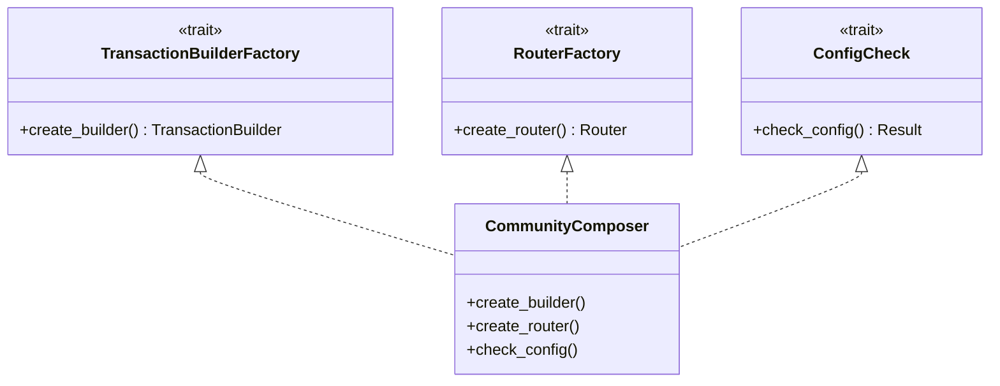

### 2. Builder 模式

```rust
pub struct Connect<C: Connection, Response> { ... }

impl<C, R> Connect<C, R> {
    pub const fn with_capacity(mut self, capacity: usize) -> Self { ... }
    pub fn with_auth(mut self, auth: Auth) -> Self { ... }
}
```

### 3. Provider 模式

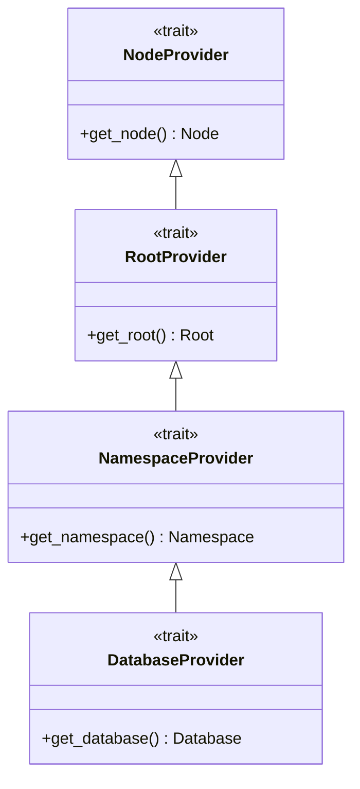

### 4. 多层缓存模式

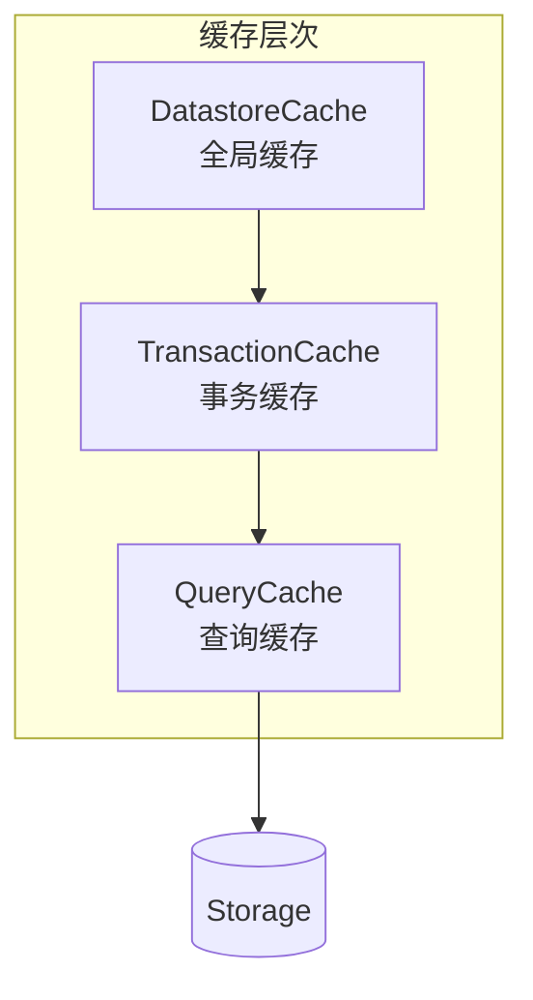

---

## 性能优化

### 配置参数

| 参数 | 默认值 | 说明 |
|------|--------|------|
| `MEMORY_THRESHOLD` | 0 | 内存限制 |
| `MAX_CONCURRENT_TASKS` | 64 | 最大并发任务数 |
| `MAX_COMPUTATION_DEPTH` | 120 | 最大计算深度 |
| `TRANSACTION_CACHE_SIZE` | 10,000 | 事务缓存大小 |
| `DATASTORE_CACHE_SIZE` | 1,000 | 全局缓存大小 |
| `NORMAL_FETCH_SIZE` | 500 | 普通查询批量大小 |
| `EXPORT_BATCH_SIZE` | 1,000 | 导出批量大小 |
| `SCRIPTING_MAX_TIME_LIMIT` | 5s | JavaScript 执行超时 |
| `REGEX_CACHE_SIZE` | 1,000 | 正则表达式缓存 |

### 优化技术

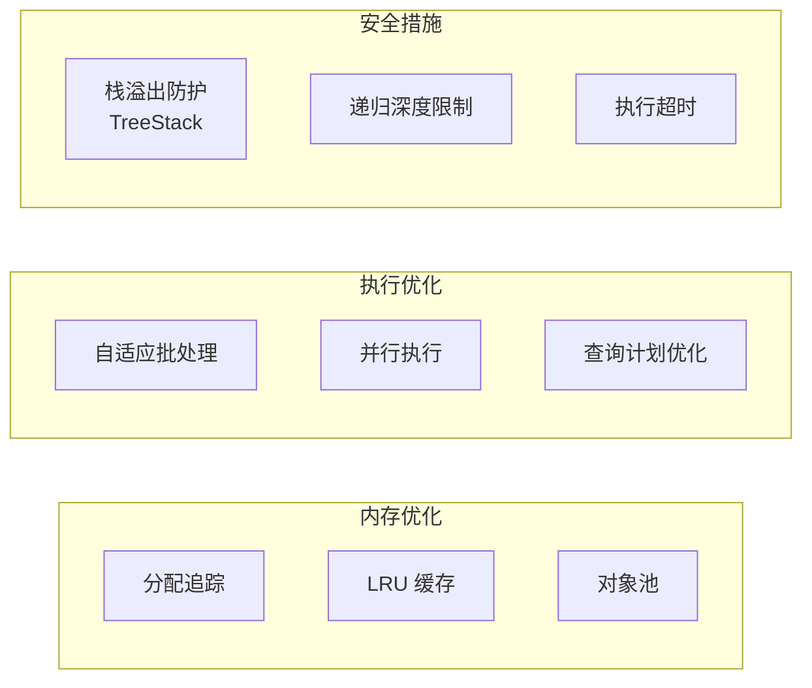

---

## 存储引擎对比

| 引擎 | 类型 | 分布式 | 持久化 | 适用场景 |
|------|------|--------|--------|----------|
| **Memory** | 内存 | 否 | 否 | 开发测试 |
| **RocksDB** | 嵌入式 | 否 | 是 | 单节点生产 |
| **TiKV** | 分布式 | 是 | 是 | 分布式生产 |
| **SurrealKV** | 嵌入式 | 否 | 是 | 优化的单节点 |
| **IndexedDB** | 浏览器 | 否 | 是 | WASM 环境 |

### 存储层抽象

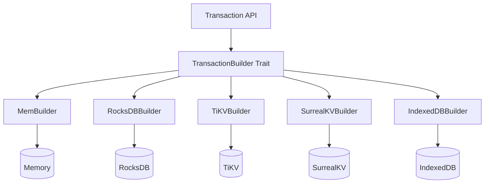

---

## SDK API 方法

### 可用方法

```mermaid
graph LR
    subgraph CRUD["CRUD 操作"]
        SELECT[select]
        CREATE[create]
        INSERT[insert]
        UPDATE[update]
        UPSERT[upsert]
        DELETE[delete]
        MERGE[merge]
        PATCH[patch]
    end

    subgraph Query["查询"]
        QUERY[query]
        RUN[run]
    end

    subgraph Auth["认证"]
        SIGNIN[signin]
        SIGNUP[signup]
        AUTH[authenticate]
    end

    subgraph TX["事务"]
        BEGIN[begin]
        COMMIT[commit]
        CANCEL[cancel]
    end

    subgraph Util["工具"]
        VERSION[version]
        HEALTH[health]
        IMPORT[import]
        EXPORT[export]
    end
```

### 连接生命周期

```mermaid
stateDiagram-v2
    [*] --> Disconnected
    Disconnected --> Connecting: connect()
    Connecting --> Connected: success
    Connecting --> Disconnected: failure
    Connected --> Querying: query()
    Querying --> Connected: result
    Connected --> Disconnected: disconnect()
    Disconnected --> [*]
```

---

## 总结

### 架构亮点

1. **分层清晰** - SDK → Server → Core → Storage 各层职责明确
2. **高度可扩展** - Composer 模式、Trait 对象、Feature Flags
3. **性能优化** - 多层缓存、自适应批处理、向量索引
4. **实时能力** - WebSocket、Live Queries、事件驱动
5. **多存储支持** - 可插拔存储后端架构
6. **企业特性** - ACID 事务、RBAC、审计日志
7. **开发友好** - 多语言 SDK、GraphQL API、WebAssembly 支持

### 核心设计决策

```mermaid
mindmap
    root((SurrealDB))
        多模型
            文档
            图
            关系
            时序
            向量
        存储抽象
            可插拔后端
            MVCC 事务
            多层缓存
        实时
            Live Queries
            WebSocket
            Change Feed
        安全
            RBAC
            行级权限
            JWT 认证
        可扩展
            分布式 TiKV
            水平扩展
            多区域
```

---

## 参考资源

- [SurrealDB 官方文档](https://surrealdb.com/docs)
- [GitHub 仓库](https://github.com/surrealdb/surrealdb)
- [SurrealQL 语言参考](https://surrealdb.com/docs/surrealql)
