# Zed 编辑器架构设计分析

> 版本: 0.219.0
> 分析日期: 2025-12-24
> 代码库: https://github.com/zed-industries/zed

## 目录

1. [项目概览](#1-项目概览)
2. [整体架构](#2-整体架构)
3. [GPUI 框架](#3-gpui-框架)
4. [编辑器核心](#4-编辑器核心)
5. [项目管理系统](#5-项目管理系统)
6. [语言服务支持](#6-语言服务支持)
7. [协作与远程编辑](#7-协作与远程编辑)
8. [扩展系统](#8-扩展系统)
9. [AI 与智能编辑](#9-ai-与智能编辑)
10. [关键设计模式](#10-关键设计模式)
11. [数据流与通信](#11-数据流与通信)
12. [性能优化策略](#12-性能优化策略)

---

## 1. 项目概览

### 1.1 项目定位

Zed 是一款高性能、多人协作的现代代码编辑器，主要特点：

- **GPU 加速渲染**：基于自研 GPUI 框架
- **实时协作**：内置多人协作编辑能力
- **AI 原生**：深度集成 AI 辅助编程
- **跨平台**：支持 macOS、Linux、Windows
- **高度可扩展**：基于 WebAssembly 的扩展系统

### 1.2 技术栈

| 层级 | 技术选型 |
|------|----------|
| 语言 | Rust (Edition 2024) |
| UI 框架 | GPUI (自研) |
| 图形后端 | Blade Graphics / Metal / Vulkan |
| 布局引擎 | Taffy (Flexbox) |
| 文本渲染 | cosmic-text |
| 语法解析 | Tree-sitter |
| 协议 | Protocol Buffers / WebSocket |
| 扩展运行时 | Wasmtime (WASM Component Model) |
| 数据库 | SQLite (via sqlez) |

### 1.3 代码规模

```
crates/          210+ Rust crates
extensions/      官方扩展（5个示例）
assets/          UI 资源（图标、主题、字体）
tooling/         构建和性能工具
```

---

## 2. 整体架构

### 2.1 高层架构图


### 2.2 Crate 依赖关系


### 2.3 主要 Crate 职责

| Crate | 职责 | 代码量 |
|-------|------|--------|
| `gpui` | GPU 加速 UI 框架 | ~50K 行 |
| `editor` | 编辑器核心实现 | ~80K 行 |
| `project` | 项目管理和 LSP 集成 | ~60K 行 |
| `language` | 语言服务和 Tree-sitter | ~40K 行 |
| `collab` | 协作服务器 | ~30K 行 |
| `extension_host` | 扩展运行时 | ~15K 行 |
| `agent` | AI Agent 系统 | ~20K 行 |

---

## 3. GPUI 框架

### 3.1 核心概念

GPUI 是 Zed 自研的 GPU 加速 UI 框架，采用**实体-组件**架构。


### 3.2 实体系统

```rust
// 实体创建和管理
pub trait AppContext {
    // 创建新实体
    fn new<T: 'static>(
        &mut self,
        build_entity: impl FnOnce(&mut Context<T>) -> T,
    ) -> Self::Result<Entity<T>>;

    // 更新实体状态
    fn update_entity<T, R>(
        &mut self,
        handle: &Entity<T>,
        update: impl FnOnce(&mut T, &mut Context<T>) -> R,
    ) -> Self::Result<R>;

    // 读取实体状态
    fn read_entity<T, R>(
        &self,
        handle: &Entity<T>,
        read: impl FnOnce(&T, &App) -> R,
    ) -> Self::Result<R>;
}
```

### 3.3 元素渲染生命周期


### 3.4 事件系统

```rust
// 事件发射器
pub trait EventEmitter<E: Any>: 'static {}

// 上下文服务
impl<T: EventEmitter<E>> Context<T> {
    // 通知视图重绘
    fn notify(&mut self);

    // 发射事件
    fn emit(&mut self, event: E);

    // 订阅其他实体的事件
    fn subscribe<E2: EventEmitter<Event>, Event>(
        &mut self,
        entity: &Entity<E2>,
        on_event: impl Fn(&mut T, Entity<E2>, &Event, &mut Context<T>),
    ) -> Subscription;
}
```

---

## 4. 编辑器核心

### 4.1 Editor 结构


### 4.2 文本存储

Zed 使用 **Rope** 数据结构高效存储和操作大型文本：


**特点：**
- O(log n) 时间复杂度的插入/删除
- 高效的随机访问
- 支持增量更新
- 基于 SumTree 实现

### 4.3 DisplayMap 层级


### 4.4 多光标支持

```rust
pub struct SelectionsCollection {
    // 所有选区（支持多光标）
    disjoint: Arc<[Selection<Anchor>]>,
    // 待处理的选区
    pending: Option<PendingSelection>,
    // 下一个选区ID
    next_selection_id: usize,
}

pub struct Selection<T> {
    pub id: usize,
    pub start: T,
    pub end: T,
    pub reversed: bool,
    pub goal: SelectionGoal,
}
```

---

## 5. 项目管理系统

### 5.1 Project 结构


### 5.2 状态模型

```rust
enum ProjectClientState {
    // 本地单人模式
    Local,

    // 共享项目（我是主机）
    Shared { remote_id: u64 },

    // 远程项目（我是访客）
    Remote {
        sharing_has_stopped: bool,
        capability: Capability,
        remote_id: u64,
        replica_id: ReplicaId,
    },
}
```

### 5.3 工作树管理


---

## 6. 语言服务支持

### 6.1 语言架构


### 6.2 LSP 集成


### 6.3 LanguageServer 接口

```rust
pub struct LanguageServer {
    server_id: LanguageServerId,
    next_id: AtomicI32,                    // 请求ID
    outbound_tx: channel::Sender<String>,  // 发送通道
    name: LanguageServerName,
    capabilities: RwLock<ServerCapabilities>,
}

impl LanguageServer {
    // 发送请求并等待响应
    pub async fn request<T>(&self, params: T::Params)
        -> ConnectionResult<T::Result>;

    // 接收通知
    pub async fn receive_notification<T>(&mut self) -> T::Params;
}
```

---

## 7. 协作与远程编辑

### 7.1 协作架构


### 7.2 消息协议


### 7.3 向量时钟同步

```protobuf
message VectorClockEntry {
    uint32 replica_id = 1;      // 副本编号
    uint32 timestamp = 2;       // Lamport 时间戳
}

message Operation {
    oneof variant {
        Edit edit = 1;                      // 文本编辑
        Undo undo = 2;                      // 撤销操作
        UpdateSelections selections = 3;    // 光标更新
        UpdateDiagnostics diagnostics = 4;  // 诊断信息
    }
}
```

### 7.4 远程编辑


---

## 8. 扩展系统

### 8.1 扩展架构


### 8.2 扩展生命周期


### 8.3 扩展清单

```toml
# extension.toml
[extension]
id = "my-extension"
name = "My Extension"
version = "0.1.0"
schema_version = 1

[capabilities]
process_exec = { commands = ["npm", "node"] }
download_file = { allowed = true }

[language_servers.my-lsp]
language = "my-lang"

[grammars.my-lang]
repository = "https://github.com/..."
commit = "abc123"

[[themes]]
path = "themes/my-theme.json"

[[languages]]
path = "languages/my-lang"
```

### 8.4 WIT 接口

```wit
// extension.wit - 扩展主接口
world extension {
    // 导入编辑器提供的能力
    import worktree
    import project
    import http-client
    import process
    import key-value-store

    // 导出扩展实现的接口
    export language-server-command
    export complete-slash-command-argument
    export run-slash-command
    export context-server-command
}

resource worktree {
    id: func() -> u64
    root-path: func() -> string
    read-text-file: func(path: string) -> result<string, string>
    which: func(binary-name: string) -> option<string>
    shell-env: func() -> env-vars
}
```

---

## 9. AI 与智能编辑

### 9.1 AI 系统架构


### 9.2 Agent 工具系统

```rust
pub trait AgentTool: Send + Sync {
    type Input: Send + Serialize + DeserializeOwned + JsonSchema;
    type Output: Send + Serialize;

    fn name() -> &'static str;
    fn description() -> &'static str;
    fn input_schema() -> serde_json::Value;

    async fn execute(
        input: Self::Input,
        cx: &mut AsyncApp,
    ) -> Result<Self::Output>;
}
```

**内置工具：**

| 工具 | 功能 |
|------|------|
| `ReadFileTool` | 读取文件内容 |
| `EditFileTool` | 编辑文件 |
| `GrepTool` | 内容搜索 |
| `ListDirectoryTool` | 列出目录 |
| `TerminalTool` | 执行命令 |
| `WebSearchTool` | Web 搜索 |
| `DiagnosticsTool` | 获取诊断信息 |

### 9.3 消息处理流程


### 9.4 编辑预测

```mermaid
flowchart TB
    Input[用户输入]
    Context[上下文收集]
    Request[预测请求]
    Parse[解析 Diff]
    Display[显示预测]
    Accept[接受/拒绝]

    Input --> Context
    Context --> Request
    Request --> Parse
    Parse --> Display
    Display --> Accept

    subgraph 上下文
        Cursor[光标位置]
        Code[周围代码]
        Related[相关文件]
        Diag[诊断信息]
    end

    Context --> Cursor
    Context --> Code
    Context --> Related
    Context --> Diag
```



---

## 10. 关键设计模式

### 10.1 实体-组件模式


### 10.2 事件驱动

```rust
// 事件定义
pub enum Event {
    BufferChanged,
    SelectionsChanged,
    ScrollPositionChanged,
}

impl EventEmitter<Event> for Editor {}

// 事件订阅
cx.subscribe(&editor, |this, editor, event, cx| {
    match event {
        Event::BufferChanged => this.on_buffer_changed(cx),
        _ => {}
    }
});
```

### 10.3 异步任务模型

```rust
// 前台任务（UI 线程）
let task = cx.spawn(async move {
    // 可以更新 UI
    let result = fetch_data().await;
    this.update(|this, cx| {
        this.data = result;
        cx.notify();
    });
});

// 后台任务（线程池）
let task = cx.background_spawn(async move {
    // 不能直接更新 UI
    heavy_computation()
});
```

### 10.4 资源管理

```mermaid
graph TB
    subgraph 引用计数
        Strong[Entity 强引用]
        Weak[WeakEntity 弱引用]
    end

    subgraph 生命周期
        Create[创建]
        Update[更新]
        Drop[销毁]
    end

    Strong --> Create
    Strong --> Update
    Strong --> Drop
    Weak -.->|upgrade| Strong
    Drop -.->|invalidate| Weak
```

---

## 11. 数据流与通信

### 11.1 本地数据流

```mermaid
flowchart TB
    subgraph 输入
        Keyboard[键盘事件]
        Mouse[鼠标事件]
        LSPMsg[LSP 消息]
        FSEvent[文件系统事件]
    end

    subgraph 处理
        Editor[Editor 编辑器]
        Project[Project 项目]
        Language[Language 语言]
    end

    subgraph 输出
        Buffer[Buffer 更新]
        Display[Display 渲染]
        Network[Network 同步]
    end

    Keyboard --> Editor
    Mouse --> Editor
    LSPMsg --> Language --> Project --> Editor
    FSEvent --> Project
    Editor --> Buffer
    Buffer --> Display
    Buffer --> Network
```

### 11.2 协作数据流

```mermaid
sequenceDiagram
    participant E as Editor
    participant B as Buffer
    participant P as Project
    participant C as Client
    participant S as Server
    participant O as Other Clients

    E->>B: 编辑操作
    B->>B: 生成 Operation
    B->>P: 通知变更
    P->>C: 发送更新
    C->>S: UpdateBuffer
    S->>O: 广播更新
    O->>O: 应用操作
```

### 11.3 RPC 通信

```rust
// 消息信封
pub struct Envelope {
    pub id: u32,                              // 消息ID
    pub responding_to: Option<u32>,           // 响应的请求
    pub original_sender_id: Option<PeerId>,   // 原始发送者
    pub payload: MessagePayload,              // 消息内容
}

// 连接管理
pub struct ConnectionState {
    outgoing_tx: Sender<Message>,             // 发送队列
    next_message_id: AtomicU32,               // 消息计数
    response_channels: ResponseChannels,       // 响应匹配
}
```

---

## 12. 性能优化策略

### 12.1 内存优化

| 策略 | 实现 |
|------|------|
| 内存分配器 | mimalloc（可选） |
| 文本存储 | Rope 数据结构 |
| 增量解析 | Tree-sitter 增量更新 |
| 惰性加载 | 按需加载缓冲区 |

### 12.2 渲染优化

```mermaid
graph LR
    Frame[帧开始]
    Layout[布局计算]
    Diff[差异检测]
    Batch[批量绘制]
    GPU[GPU 提交]

    Frame --> Layout
    Layout --> Diff
    Diff --> Batch
    Batch --> GPU

    style Diff fill:#f9f,stroke:#333
```

| 策略 | 说明 |
|------|------|
| GPU 加速 | 所有渲染通过 GPU |
| 增量渲染 | 只重绘变化区域 |
| 双缓冲 | 避免撕裂 |
| 批量绘制 | 合并绘制调用 |

### 12.3 编译优化

```toml
# Cargo.toml 配置
[profile.release]
opt-level = 3
lto = "thin"

# 宏 crate 优化
[profile.dev.package.gpui_macros]
opt-level = 3
[profile.dev.package.settings_macros]
opt-level = 3
```

### 12.4 并发策略

```mermaid
graph TB
    subgraph 主线程
        UI[UI 渲染]
        Event[事件处理]
        Entity[实体更新]
    end

    subgraph 后台线程池
        LSP[LSP 通信]
        FS[文件系统]
        Parse[语法解析]
        Git[Git 操作]
    end

    subgraph 协作线程
        RPC[RPC 收发]
        Sync[状态同步]
    end

    UI --> LSP
    UI --> FS
    UI --> Parse
    Event --> RPC
    Entity --> Sync
```

---

## 附录 A: 目录结构

```
zed/
├── crates/                    # 210+ Rust crates
│   ├── zed/                   # 主应用入口
│   ├── gpui/                  # UI 框架
│   ├── editor/                # 编辑器核心
│   ├── project/               # 项目管理
│   ├── language/              # 语言服务
│   ├── collab/                # 协作服务器
│   ├── extension_host/        # 扩展运行时
│   ├── agent/                 # AI Agent
│   ├── edit_prediction/       # 编辑预测
│   ├── remote/                # 远程编辑
│   ├── rpc/                   # RPC 通信
│   ├── proto/                 # Protocol Buffers
│   └── ...
├── extensions/                # 官方扩展
├── assets/                    # 资源文件
│   ├── icons/                 # 图标
│   ├── themes/                # 主题
│   ├── fonts/                 # 字体
│   └── keymaps/               # 快捷键
├── tooling/                   # 构建工具
├── docs/                      # 文档
└── Cargo.toml                 # Workspace 配置
```

## 附录 B: 关键文件索引

| 功能 | 文件路径 |
|------|----------|
| 应用入口 | `crates/zed/src/main.rs` |
| GPUI 核心 | `crates/gpui/src/gpui.rs` |
| 元素系统 | `crates/gpui/src/element.rs` |
| 编辑器核心 | `crates/editor/src/editor.rs` |
| DisplayMap | `crates/editor/src/display_map.rs` |
| 项目管理 | `crates/project/src/project.rs` |
| LSP 存储 | `crates/project/src/lsp_store.rs` |
| 语言服务 | `crates/language/src/language.rs` |
| 语法映射 | `crates/language/src/syntax_map.rs` |
| 协作服务 | `crates/collab/src/rpc.rs` |
| RPC 核心 | `crates/rpc/src/peer.rs` |
| 扩展宿主 | `crates/extension_host/src/extension_host.rs` |
| WASM 运行时 | `crates/extension_host/src/wasm_host.rs` |
| Agent 核心 | `crates/agent/src/agent.rs` |
| 工具系统 | `crates/agent/src/tools.rs` |
| 编辑预测 | `crates/edit_prediction/src/edit_prediction.rs` |

## 附录 C: 扩展开发

### 最小扩展示例

```rust
// src/lib.rs
use zed_extension_api::{self as zed, Extension, Result};

struct MyExtension;

impl Extension for MyExtension {
    fn new() -> Self {
        MyExtension
    }
}

zed::register_extension!(MyExtension);
```

### 扩展配置

```toml
# extension.toml
[extension]
id = "my-extension"
name = "My Extension"
version = "0.1.0"
schema_version = 1

[lib]
kind = "rust"
version = "0.1.0"
```

---

> 本文档基于 Zed 编辑器 v0.219.0 代码库分析生成。
